# Technical Specification

# 0. SUMMARY OF CHANGES

## 0.1 USER INTENT RESTATEMENT

### 0.1.1 Core Objective

Based on the provided requirements, the Blitzy platform understands that the objective is to complete operational polish for Veria's development environment by implementing three distinct pull requests that enhance Infrastructure as Code (IaC), observability, and security hygiene capabilities. These changes must preserve the existing GitHub OIDC/Workload Identity Federation authentication mechanism, maintain the service's private-only access policy, and continue using image digest-based deployments without introducing any public endpoints or JSON key authentication methods.

The implementation targets:
- **Repository**: PROACTIVA-US/Veria (branch: main)
- **GCP Project**: veria-dev (number 190356591245)
- **Region**: us-central1
- **Cloud Run Service**: ai-broker
- **Reference Specification**: tech-specs/Veria-Tech-Spec-v2-Blitzy.md

### 0.1.2 Special Instructions and Constraints

**CRITICAL CONSTRAINTS (Must Remain True)**:
- **Authentication Method**: GitHub OIDC/WIF via google-github-actions/auth@v2 - NO JSON keys permitted
- **Deployment Strategy**: Deploy by image DIGEST only (never use :latest tags)
- **Access Policy**: PRIVATE-ONLY requiring ID-token authentication - never grant allUsers access
- **WIF Configuration**: Do not modify existing WIF pool/provider or branch/tag conditions
- **CI/CD Workflow**: Use existing .github/workflows/cd.yml and OIDC auth@v2 setup

**Execution Parameters**:
- Deliver exactly three separate PRs matching specifications A, B, and C
- Each PR must include README with exact commands (gcloud/terraform)
- Provide rollback and verification steps for each change
- Output a brief run report with service URL, image digest, latest revision, traffic split, and rollback command

### 0.1.3 Technical Interpretation

These requirements translate to the following technical implementation strategy:

1. **Infrastructure Hardening**: Create modular Terraform components that codify existing manual infrastructure while adding staging skeleton support
2. **Operational Visibility**: Implement comprehensive monitoring through logs-based metrics, alert policies, and automated smoke testing
3. **Security Posture Enhancement**: Add supply chain security through SBOM generation, vulnerability scanning, and retention policies
4. **Documentation Completeness**: Ensure each change includes operator-friendly documentation with exact commands and rollback procedures

## 0.2 TECHNICAL SCOPE

### 0.2.1 Primary Objectives with Implementation Approach

**PR A - Infrastructure as Code (IaC)**:
- Achieve infrastructure reproducibility by modifying `/infra/terraform/modules/` to create new WIF pool/provider modules with provider condition support
- Enable staging environment preparation by extending `/infra/terraform/envs/` with staging-specific configuration targeting `refs/heads/staging`
- Implement CI service account binding by updating `/infra/terraform/modules/gcp/` to include WorkloadIdentityUser IAM binding
- Provide operational documentation by creating `/infra/terraform/README.md` with apply, destroy, and promote commands

**PR B - Observability**:
- Achieve error visibility by creating `/infra/monitoring/metrics.tf` implementing logs-based error rate metrics
- Enable performance tracking by extending metrics configuration to capture p95 latency from Cloud Run logs
- Implement alerting by creating `/infra/monitoring/alerts.tf` with alert policies for error rates and latency thresholds
- Enable visual monitoring by generating `/infra/monitoring/dashboard.json` as Cloud Monitoring dashboard configuration
- Achieve deployment validation by creating `.github/workflows/smoke-test.yml` running ID-token authenticated curls

**PR C - Security Hygiene**:
- Achieve supply chain transparency by modifying `.github/workflows/ci.yml` to generate SBOM using Trivy or similar tools
- Enable vulnerability detection by extending CI pipeline with container vulnerability scanning steps
- Implement artifact management by creating Terraform configuration for Artifact Registry retention policies
- Establish code ownership by creating `/CODEOWNERS` file with team assignments
- Document security boundaries by creating `/docs/security-boundaries.md` explaining runtime vs CI service account separation

### 0.2.2 Component Impact Analysis

**Direct Modifications Required**:

- `/infra/terraform/modules/wif/`: NEW - Create Workload Identity Federation module
  - `main.tf`: Define WIF pool, provider, and attribute mappings
  - `variables.tf`: Accept project_id, repository, and condition parameters
  - `outputs.tf`: Export provider and service account identifiers

- `/infra/terraform/modules/gcp_cloudrun/`: MODIFY - Extend existing module
  - `main.tf`: Add support for Secret Manager references and environment-specific configurations
  - `iam.tf`: NEW - Add WorkloadIdentityUser binding logic

- `/.github/workflows/`: MODIFY - Update CI/CD workflows
  - `ci.yml`: Add SBOM generation and vulnerability scanning steps
  - `smoke-test.yml`: NEW - Create post-deployment validation workflow

**Indirect Impacts and Dependencies**:

- `/infra/terraform/envs/dev/`: Update to consume new WIF module
- `/infra/terraform/envs/staging/`: NEW - Create staging environment configuration
- `/services/ai-broker/`: No code changes, but deployment configuration updates
- `/scripts/`: Create new validation and rollback scripts

**New Components Introduction**:

- `/infra/monitoring/`: NEW - Monitoring and alerting infrastructure
- `/docs/security-boundaries.md`: NEW - Security documentation
- `/CODEOWNERS`: NEW - Code ownership mapping
- `/infra/terraform/README.md`: NEW - Infrastructure operations guide

### 0.2.3 File and Path Mapping

| Target File/Module | Source Reference | Context Dependencies | Modification Type |
|---|---|---|---|
| `/infra/terraform/modules/wif/` | `/infra/ci/main.tf` | google-github-actions/auth@v2 | Create new module |
| `/infra/terraform/envs/staging/` | `/infra/terraform/envs/dev/` | Terraform backend config | Create new environment |
| `/infra/monitoring/metrics.tf` | Cloud Logging API | ai-broker service logs | Create metrics config |
| `/infra/monitoring/alerts.tf` | Cloud Monitoring API | metrics.tf outputs | Create alert policies |
| `/infra/monitoring/dashboard.json` | Cloud Monitoring format | metrics & service config | Generate dashboard |
| `/.github/workflows/smoke-test.yml` | `/.github/workflows/cd.yml` | OIDC auth setup | Create new workflow |
| `/.github/workflows/ci.yml` | Existing CI pipeline | Trivy scanner | Extend with security |
| `/CODEOWNERS` | GitHub CODEOWNERS format | Team structure | Create ownership file |
| `/docs/security-boundaries.md` | N/A | IAM roles and policies | Create documentation |
| `/infra/terraform/README.md` | Terraform docs | All modules | Create operations guide |

## 0.3 IMPLEMENTATION DESIGN

### 0.3.1 Technical Approach

First, establish the infrastructure foundation by modifying `/infra/terraform/modules/` to create a reusable WIF module that encapsulates pool creation, provider configuration, and service account bindings. This module will accept parameters for repository, project, and branch conditions, enabling both development and staging environments to share the same code with different configurations.

Next, integrate monitoring capabilities by extending the infrastructure with logs-based metrics that extract error rates and latency percentiles from Cloud Run service logs. These metrics will feed into alert policies that notify operators when thresholds are exceeded, with all configurations managed through Terraform for reproducibility.

Finally, ensure security hygiene by implementing supply chain security controls in the CI pipeline, including SBOM generation for transparency and vulnerability scanning for risk identification. Complement these technical controls with governance structures like CODEOWNERS and clear documentation of security boundaries.

### 0.3.2 Critical Implementation Details

**Design Patterns**:
- **Module Composition Pattern**: WIF module composed of pool, provider, and IAM sub-resources
- **Metrics Extraction Pattern**: Log-based metrics using Cloud Logging filter expressions
- **Immutable Deployment Pattern**: Digest-based image references with revision tracking

**Key Algorithms and Approaches**:
- **Log Parsing**: Regular expressions to extract HTTP status codes and latency from structured logs
- **Percentile Calculation**: Cloud Monitoring's built-in aggregation for p95 latency
- **SBOM Generation**: Trivy's filesystem scan with SPDX output format

**Integration Strategies**:
- **WIF Integration**: Maintain existing google-github-actions/auth@v2 with new provider
- **Monitoring Integration**: Cloud Operations suite with existing Cloud Run metrics
- **Security Integration**: GitHub Security tab for vulnerability reporting via SARIF

### 0.3.3 Dependency Analysis

**Required Dependencies**:
- **Terraform Providers**: 
  - hashicorp/google >= 5.37.0 (Cloud Run, IAM, Monitoring)
  - hashicorp/google-beta >= 5.37.0 (Advanced features)
- **GitHub Actions**:
  - google-github-actions/auth@v2 (existing, unchanged)
  - aquasecurity/trivy-action@latest (new for SBOM/scanning)
- **Runtime Dependencies**: None - all changes are infrastructure/CI level

**Version Constraints**:
- Terraform >= 1.5.0 (required for import blocks and advanced features)
- Node.js 20 LTS (existing, for smoke tests)
- pnpm 10 (existing, for dependency management)

**Justification**:
- Terraform providers chosen for stability and feature completeness
- Trivy selected for comprehensive SBOM and vulnerability capabilities
- Version constraints maintain compatibility with existing infrastructure

## 0.4 SCOPE BOUNDARIES

### 0.4.1 Explicitly In Scope

**Infrastructure as Code (PR A)**:
- `/infra/terraform/modules/wif/main.tf` - WIF pool and provider configuration
- `/infra/terraform/modules/wif/variables.tf` - Module input variables
- `/infra/terraform/modules/wif/outputs.tf` - Module outputs
- `/infra/terraform/modules/gcp_cloudrun/iam.tf` - Service account bindings
- `/infra/terraform/envs/staging/` - Complete staging environment
- `/infra/terraform/README.md` - Comprehensive operations documentation

**Observability (PR B)**:
- `/infra/monitoring/metrics.tf` - Logs-based metric definitions
- `/infra/monitoring/alerts.tf` - Alert policy configurations
- `/infra/monitoring/dashboard.json` - Monitoring dashboard
- `/.github/workflows/smoke-test.yml` - Automated validation workflow
- `/scripts/smoke-test.sh` - Smoke test implementation

**Security Hygiene (PR C)**:
- `/.github/workflows/ci.yml` - SBOM and vulnerability scan steps
- `/infra/terraform/modules/artifact-registry/retention.tf` - Retention policies
- `/CODEOWNERS` - Code ownership assignments
- `/docs/security-boundaries.md` - Security documentation
- `/.github/branch-protection.yml` - Branch protection rules

### 0.4.2 Explicitly Out of Scope

- **Public Endpoint Configuration**: No changes to allow unauthenticated access
- **Production Environment**: Only dev and staging skeleton addressed
- **WIF Provider Modifications**: No changes to existing provider conditions except staging
- **JSON Key Authentication**: No introduction of service account key files
- **CI/CD Pipeline Replacement**: Existing workflows preserved, only extended
- **Application Code Changes**: No modifications to services/ai-broker source code
- **Database Schema Changes**: No modifications to PostgreSQL schemas
- **Frontend Changes**: No updates to apps/ or dashboard components

## 0.5 VALIDATION CHECKLIST

### 0.5.1 Implementation Verification Points

**Infrastructure as Code**:
- ✓ WIF module successfully provisions pool and provider
- ✓ Service account has WorkloadIdentityUser binding
- ✓ Staging environment deploys with refs/heads/staging condition
- ✓ README contains working terraform apply/destroy commands
- ✓ Cloud Run service remains private with ID-token requirement

**Observability**:
- ✓ Error rate metric captures HTTP 5xx responses
- ✓ P95 latency metric calculates correctly
- ✓ Alert policies trigger on threshold breaches
- ✓ Dashboard displays real-time metrics
- ✓ Smoke tests authenticate with ID token and validate endpoints

**Security Hygiene**:
- ✓ SBOM generates in SPDX format
- ✓ Vulnerability scan produces SARIF report
- ✓ Artifact retention policy limits stored images
- ✓ CODEOWNERS file enforces review requirements
- ✓ Security boundaries document clarifies IAM roles

### 0.5.2 Observable Changes

- GitHub Actions logs show successful OIDC authentication
- Cloud Console displays new WIF provider for staging
- Cloud Monitoring shows custom metrics and alerts
- Artifact Registry enforces retention limits
- PRs require CODEOWNERS approval
- Security tab displays vulnerability findings

## 0.6 EXECUTION PARAMETERS

### 0.6.1 Special Execution Instructions

**Process Requirements**:
- Create three separate PRs, not a single combined change
- Each PR must pass CI before merge
- Use conventional commit messages for clarity
- Include PR descriptions with testing instructions

**Quality Requirements**:
- All Terraform code must pass `terraform fmt` and `terraform validate`
- GitHub Actions workflows must use pinned action versions
- Documentation must include exact commands, not placeholders
- Each PR must be independently deployable

### 0.6.2 Constraints and Boundaries

**Technical Constraints**:
- Must use existing veria-dev GCP project (190356591245)
- Must preserve existing OIDC/WIF configuration
- Must maintain backward compatibility with current deployments
- Must use us-central1 region exclusively

**Process Constraints**:
- No manual GCP Console changes - everything through IaC
- No hardcoded secrets - use Secret Manager references
- No public access grants - maintain private-only policy
- No production changes - dev and staging skeleton only

**Output Constraints**:
- Run report must include: service URL, image digest, revision name, traffic split, rollback command
- Documentation must be in Markdown format
- Dashboard must be importable JSON
- SBOM must be in SPDX format

# 1. INTRODUCTION

## 1.1 EXECUTIVE SUMMARY

### 1.1.1 Project Overview

Veria is a compliance middleware platform for tokenized real-world assets (RWAs), specifically designed to bridge the gap between traditional finance and blockchain technology while ensuring regulatory compliance at every step. The system functions as "Plaid for tokenized funds," providing seamless integration between tokenized asset management and existing financial infrastructure.

The platform initially focuses on US Treasuries and Money Market Funds, establishing a foundation for broader tokenized asset adoption within traditional accounting and compliance workflows. Built as a comprehensive middleware solution, Veria handles the complete lifecycle from asset onboarding through investor management, compliance monitoring, and regulatory reporting.

### 1.1.2 Core Business Problem

The current financial landscape presents significant challenges for organizations seeking to integrate tokenized assets into their existing operations:

- **Manual Reconciliation Burden**: CPAs and SMBs lack integrated solutions for managing tokenized assets within existing accounting workflows, requiring time-consuming manual reconciliation processes
- **Compliance Complexity**: Regulatory compliance for tokenized assets requires specialized expertise that most organizations lack, creating barriers to adoption
- **Integration Gaps**: No unified platform exists for tokenized asset compliance, tax reporting, and accounting integration, forcing organizations to manage multiple disconnected systems
- **Audit Trail Requirements**: Traditional accounting systems don't handle tokenized assets, creating compliance and audit challenges for organizations adopting blockchain-based financial instruments

### 1.1.3 Key Stakeholders and Users

| Stakeholder Category | Primary Users | Role in System |
|---------------------|---------------|----------------|
| **Primary Users** | Certified Public Accountants (CPAs), Small-Medium Business owners, Compliance Officers, Auditors | Direct system interaction for compliance monitoring, reporting, and asset management |
| **Secondary Users** | Fintech developers, Enterprise integrators, Regulatory bodies | API consumption, system integration, and oversight functions |
| **Target Market** | US-based organizations initially, with planned international expansion | Geographic focus for compliance and regulatory alignment |

The adoption strategy centers on accountants and CPAs as the primary wedge into the market, leveraging their trusted advisor relationships with SMB clients to drive platform adoption.

### 1.1.4 Expected Business Impact and Value Proposition

Veria delivers measurable value through automation and integration capabilities:

- **Zero Manual Adjustments**: Automated reconciliation of tokenized assets with existing accounting systems, eliminating manual intervention
- **IRS-Ready Compliance**: Tax form generation that matches CPA calculations, ensuring regulatory compliance without additional verification steps
- **Seamless Integration**: Native connectivity with QuickBooks and Xero accounting platforms through OAuth-authenticated APIs
- **Real-Time Monitoring**: Continuous compliance monitoring with audit-ready report generation across multiple formats (PDF, CSV, JSON)

## 1.2 SYSTEM OVERVIEW

### 1.2.1 Project Context

#### 1.2.1.1 Business Context and Market Positioning

Veria positions itself within the rapidly growing tokenized asset market, addressing the critical gap between blockchain innovation and traditional financial operations. The platform targets the intersection of regulatory compliance and practical accounting needs, serving organizations that require both tokenized asset capabilities and traditional financial reporting.

The system's business context centers on adoption through trusted financial advisors, specifically targeting CPAs and SMB finance teams as primary entry points into larger enterprise accounts.

#### 1.2.1.2 Current System Limitations

Existing solutions in the market exhibit several critical limitations:

- **Fragmented Ecosystem**: Traditional accounting systems lack native support for tokenized assets, requiring manual workarounds
- **Compliance Gaps**: No unified platform addresses the full spectrum of tokenized asset compliance requirements
- **Integration Challenges**: Disconnected tools for KYC verification, compliance monitoring, and accounting integration create operational inefficiencies
- **Regulatory Uncertainty**: Limited tools exist for maintaining audit trails and generating regulatory reports for tokenized assets

#### 1.2.1.3 Enterprise Landscape Integration

Veria integrates with existing enterprise systems through standardized APIs and established accounting platform connections. The system maintains compatibility with:

- QuickBooks and Xero accounting platforms via OAuth authentication
- Multi-tenant SaaS architectures through role-based API access control
- Existing compliance workflows through standardized export formats
- Traditional audit processes through immutable audit trail generation

### 1.2.2 High-Level Description

#### 1.2.2.1 Primary System Capabilities

The Veria platform delivers four core capabilities:

**Tokenized Asset Management**: Complete lifecycle management from onboarding through investor relations, including custody provider configuration (BNY Mellon integration), SPV/Trust structure setup, and tokenization parameter definition.

**KYC/KYB Verification**: Automated investor eligibility checking with accredited investor and qualified purchaser validation, supported by multi-vendor KYC provider integration.

**Automated Compliance Reporting**: Real-time monitoring and audit-ready report generation with IRS form creation (8949, 1099, K-1) and jurisdiction-specific tax rule application.

**Accounting System Integration**: Native synchronization with QuickBooks and Xero platforms, including Chart of Accounts mapping and automated transaction reconciliation.

#### 1.2.2.2 Major System Components

The architecture implements a microservices pattern organized into three primary layers:

**Frontend Applications**:
- Compliance Dashboard (Next.js 14, React 18, TypeScript) providing role-based views for CPAs, SMBs, and auditors
- Investor Portal with feature-flag controlled functionality
- Standard web UI patterns utilizing Tailwind CSS and Radix UI components

**Backend Services** (Microservices Architecture):
- Gateway Service managing API routing, rate limiting, and traffic orchestration on port 4000
- Identity Service handling authentication and user management through JWT tokens
- Policy Service implementing compliance rules engine for jurisdiction-specific requirements
- Compliance Service providing monitoring and reporting capabilities
- KYC Provider Service managing multi-vendor integration for identity verification
- Regulatory Reporting Service generating scheduled compliance reports
- Audit Log Writer maintaining immutable audit trail records
- Blockchain Service handling smart contract integration and tokenized asset interactions

**Shared Infrastructure**:
- Auth Middleware package providing JWT validation and role-based access control
- Database package implementing PostgreSQL connectivity through Prisma ORM
- SDK-TS package containing TypeScript types and client libraries
- Smart Contract layer featuring VeriaSecurityToken (ERC-3643 compliant), IdentityRegistry, and ModularCompliance contracts
- <span style="background-color: rgba(91, 57, 243, 0.2)">Monitoring & Alerting Stack – Cloud Logging-based custom metrics, alert policies, and Cloud Monitoring dashboard managed via Terraform modules located in /infra/monitoring/</span>
- <span style="background-color: rgba(91, 57, 243, 0.2)">CI/CD Security Controls – SBOM generation and container vulnerability scanning steps integrated into .github/workflows/ci.yml using Trivy, with SARIF reporting to GitHub Security tab</span>
- <span style="background-color: rgba(91, 57, 243, 0.2)">Terraform WIF Module – Re-usable module (/infra/terraform/modules/wif/) that provisions Workload Identity Federation pool, provider, and IAM bindings for GitHub OIDC authentication across dev and staging environments</span>

#### 1.2.2.3 Core Technical Approach

The system implements a service mesh pattern where all traffic flows through the Gateway service, with direct service access (ports 4001-4005) blocked in production environments. The architecture utilizes:

- **pnpm monorepo structure** for code organization and dependency management
- **Docker containerization** for deployment consistency and scalability
- **Google Cloud Platform with Cloud Run** for serverless scaling and managed infrastructure
- **Terraform** for infrastructure as code and environment provisioning
- **GitHub Actions with OIDC/WIF** for continuous integration and deployment

<span style="background-color: rgba(91, 57, 243, 0.2)">The platform adopts a comprehensive Infrastructure-as-Code pattern with modular Terraform implementations, including specialized WIF and monitoring modules for operational consistency. Comprehensive observability is achieved through logs-based metrics, p95 latency measurement, and proactive alerting capabilities. Supply-chain security enhancements include SBOM generation, vulnerability scanning, and Artifact Registry retention policies. These security and operational capabilities continue to leverage GitHub OIDC/WIF for authentication, digest-pinned Cloud Run deployments, and maintain the private-only access policy across all environments.</span>

<span style="background-color: rgba(91, 57, 243, 0.2)">For detailed operational procedures and security boundary documentation, refer to the infrastructure operations guide (infra/terraform/README.md) and security boundaries documentation (docs/security-boundaries.md).</span>

### 1.2.3 Success Criteria

#### 1.2.3.1 Measurable Objectives

| Objective Category | Specific Measure | Target Outcome |
|-------------------|------------------|----------------|
| **Integration Accuracy** | Tokenized asset synchronization with QuickBooks/Xero | Zero manual reconciliation required |
| **Compliance Reporting** | Audit-ready report generation | Multiple format export (PDF/CSV/JSON) without additional processing |
| **Tax Compliance** | IRS form generation accuracy | 100% match with manual CPA calculations |

#### 1.2.3.2 Critical Success Factors

- **Service Mesh Reliability**: All backend services accessible exclusively through Gateway service with sub-second response times
- **Multi-Tenant Support**: API Gateway supporting minimum 3 organizations with role-based access control
- **Compliance Automation**: Real-time compliance monitoring with pass/fail status indicators across all tokenized asset positions
- **Audit Trail Integrity**: Immutable audit log generation for all compliance-relevant system actions

#### 1.2.3.3 Key Performance Indicators (KPIs)

- **Operational Efficiency**: Zero manual adjustments required for accounting reconciliation
- **Accuracy Metrics**: 100% accuracy in tax form generation versus manual CPA calculations
- **System Performance**: Sub-second response times for all API endpoints
- **Reliability Standards**: 99.9% uptime for all production services

## 1.3 SCOPE

### 1.3.1 In-Scope Elements

#### 1.3.1.1 Core Features and Functionalities

**QuickBooks/Xero Connector**:
- OAuth authentication flow implementation for secure accounting platform access
- Chart of Accounts mapping specifically designed for tokenized asset classification
- Automated transaction synchronization maintaining real-time accuracy
- Reconciliation report generation in multiple formats (CSV/PDF) for audit purposes

**Compliance Dashboard**:
- Real-time portfolio visualization of all tokenized asset positions
- Pass/fail compliance status indicators with detailed rule explanations
- Role-based dashboard views tailored for CPAs, SMBs, and Auditors
- Multi-format export capabilities supporting PDF, CSV, and JSON outputs

**Tax Reporting Engine**:
- Automated tracking of realized and unrealized gains/losses
- Short-term versus long-term capital gains classification
- IRS form generation including Forms 8949, 1099, and K-1
- Jurisdiction-specific tax rule application for compliance accuracy

**API Gateway & Middleware Platform**:
- OAuth and JWT authentication supporting multiple identity providers
- Role-based API access control with granular permission management
- Rate limiting and comprehensive audit logging for all API interactions
- Multi-tenant SaaS architecture supporting organizational isolation

#### 1.3.1.2 Implementation Boundaries

| Boundary Category | Coverage Area | Specific Inclusions |
|------------------|---------------|-------------------|
| **System Boundaries** | Middleware layer between tokenized assets and existing systems | API gateway, compliance engine, reporting services |
| **User Groups** | Financial professionals and technical integrators | CPAs, SMB owners, Compliance officers, Auditors, Fintech developers |
| **Geographic Coverage** | US-focused regulatory compliance | IRS tax compliance, US securities regulations, domestic KYC requirements |
| **Data Domains** | Financial and compliance data management | Tokenized asset transactions, KYC/compliance data, tax calculations, audit logs |

#### 1.3.1.3 Essential Technical Requirements

- **API Architecture**: RESTful JSON APIs across all microservices with OpenAPI specification compliance
- **User Interface**: Standard web UI patterns including forms, tables, and dashboards without custom visualization components
- **Data Storage**: PostgreSQL for primary data persistence with Redis for caching and rate limiting
- **Containerization**: Docker containerization for all services enabling consistent deployment across environments
- **Service Communication**: All inter-service communication routed through Gateway service on port 4000

### 1.3.2 Out-of-Scope Elements

#### 1.3.2.1 Explicitly Excluded Features

**User Interface Limitations**:
- Graph visualization libraries and components
- Custom timeline interfaces or drawing tools
- IDE-style components or code visualization
- Any visualization beyond standard web UI patterns (forms, tables, dashboards)

**Integration Exclusions**:
- Vislzr integration and related visualization tools
- Direct blockchain integration (development uses mocked services)
- Real KYC provider API connections (development utilizes mocked responses)
- NetSuite connector functionality (reserved for Phase 4 implementation)

**Operational Scope Limits**:
- Production SLA definitions and KPI targets (to be established post-implementation)
- International tax compliance beyond US jurisdiction
- Real-time blockchain transaction processing (mock implementation for development)

#### 1.3.2.2 Future Phase Considerations

**Phase 4 Extensions (9-12 month timeline)**:
- Treasury pack expansion for additional asset types
- NetSuite connector implementation for enterprise accounting integration
- Regulator-facing dashboard for compliance oversight
- International jurisdiction support beyond US regulations

**Technology Evolution**:
- Direct blockchain integration replacing current mock implementations
- Additional tokenized asset types beyond US Treasuries and Money Market Funds
- Advanced compliance automation features based on regulatory developments

#### 1.3.2.3 Architecture Constraints

**Development Constraints**:
- Monorepo structure must be maintained using pnpm workspaces
- All backend services must remain accessible only through Gateway service
- Service ports 4001-4005 blocked in production environments
- No addition of new microservices beyond existing architecture

**Technology Restrictions**:
- Graph visualization libraries explicitly prohibited
- Custom drawing tools or advanced UI components not permitted
- Standard UI patterns required for all user interface elements
- External API dependencies limited to mocked implementations during development

#### References

#### Files Examined
- `README.md` - Project overview, technology stack, and development setup
- `PRD.md` - Master product requirements and business context
- `docs/roadmap.md` - 12-month implementation phases and timeline
- `docs/checklist.md` - Sprint progress tracking and completion status
- `docs/prds/compliance_dashboard_prd.md` - Dashboard feature specifications and user requirements
- `docs/prds/api_gateway_prd.md` - API platform architecture and multi-tenant requirements
- `docs/prds/quickbooks_connector_prd.md` - Accounting integration specifications and OAuth flows
- `docs/prds/tax_reporting_prd.md` - Tax engine requirements and IRS form generation
- `docker-compose.yml` - Complete microservices architecture definition
- `package.json` - Monorepo configuration and workspace structure
- `cloudrun.yaml` - Google Cloud Platform deployment configuration

#### Directories Analyzed
- `/` - Root monorepo structure and configuration files
- `docs/` - Technical documentation and product requirements
- `docs/prds/` - Detailed product requirement documents
- `services/` - Backend microservices implementation (12 services)
- `apps/` - Frontend applications structure (3 applications)
- `packages/` - Shared infrastructure and utility packages (9 packages)
- `services/gateway/` - API gateway service implementation
- `contracts/` - Smart contract implementations and blockchain integration

# 2. PRODUCT REQUIREMENTS

## 2.1 FEATURE CATALOG

### 2.1.1 Authentication & Identity Management Features

#### 2.1.1.1 F-001: Multi-Factor Authentication System
- **Feature Metadata**
  * Unique ID: F-001
  * Feature Name: Multi-Factor Authentication Platform
  * Feature Category: Security & Access Control
  * Priority Level: Critical
  * Status: In Development (~60% complete)

- **Description**
  * **Overview**: JWT-based authentication system supporting multiple authentication methods including password-based login, API keys, and WebAuthn passkeys
  * **Business Value**: Enables secure platform access while maintaining compliance with financial regulations and audit requirements
  * **User Benefits**: Single sign-on capability, secure credential management, seamless integration with existing authentication workflows
  * **Technical Context**: Implemented in identity-service using Fastify framework, bcrypt for password hashing, Redis for session management

- **Dependencies**
  * **Prerequisite Features**: None (foundational feature)
  * **System Dependencies**: PostgreSQL database, Redis session storage, JWT secrets configuration
  * **External Dependencies**: None
  * **Integration Requirements**: All microservices must integrate @veria/auth-middleware package for token validation

#### 2.1.1.2 F-002: Role-Based Access Control (RBAC) System  
- **Feature Metadata**
  * Unique ID: F-002
  * Feature Name: Multi-Tenant RBAC Platform
  * Feature Category: Security & Access Control
  * Priority Level: Critical
  * Status: In Development (~40% complete)

- **Description**
  * **Overview**: Hierarchical role system supporting SUPER_ADMIN, ADMIN, COMPLIANCE_OFFICER, INVESTOR, INSTITUTION, ISSUER, VIEWER roles with granular permission control
  * **Business Value**: Ensures appropriate data access and action permissions based on user roles across multi-tenant environments
  * **User Benefits**: Granular permission control, comprehensive audit trail for all role-based actions, organizational data isolation
  * **Technical Context**: Implemented through auth-middleware package with PostgreSQL-backed permission mappings and organizational boundaries

- **Dependencies**
  * **Prerequisite Features**: F-001 (Multi-Factor Authentication)
  * **System Dependencies**: PostgreSQL database for user-role mappings
  * **External Dependencies**: None
  * **Integration Requirements**: Gateway service integration for API-level authorization enforcement

### 2.1.2 Accounting Integration Features

#### 2.1.2.1 F-003: QuickBooks/Xero Connector Platform
- **Feature Metadata**
  * Unique ID: F-003
  * Feature Name: Accounting Platform Synchronization System
  * Feature Category: Financial Integration
  * Priority Level: Critical
  * Status: Proposed (Sprint 1 implementation target)

- **Description**
  * **Overview**: OAuth2-based connector enabling bidirectional synchronization between tokenized assets and major accounting platforms
  * **Business Value**: Eliminates manual reconciliation between tokenized assets and traditional accounting systems, reducing operational overhead
  * **User Benefits**: Automated Chart of Accounts mapping, real-time transaction synchronization, comprehensive reconciliation reporting
  * **Technical Context**: Express-based microservice in `/connectors/quickbooks` utilizing node-quickbooks library for API integration

- **Dependencies**
  * **Prerequisite Features**: F-001 (Authentication), F-006 (Asset Management System)
  * **System Dependencies**: PostgreSQL for transaction storage, OAuth2 token management
  * **External Dependencies**: QuickBooks API, Xero API
  * **Integration Requirements**: Gateway service routing configuration, secure credential storage infrastructure

#### 2.1.2.2 F-004: Automated Reconciliation Engine
- **Feature Metadata**
  * Unique ID: F-004
  * Feature Name: Transaction Reconciliation System
  * Feature Category: Financial Operations
  * Priority Level: High
  * Status: Proposed (Sprint 1-2 implementation target)

- **Description**
  * **Overview**: Automated matching and reconciliation engine for tokenized transactions with corresponding accounting entries
  * **Business Value**: Reduces accounting errors, accelerates audit preparation, ensures data consistency across systems
  * **User Benefits**: Zero manual adjustments required, audit-ready reports, comprehensive exception handling and reporting
  * **Technical Context**: Integrated component within QuickBooks connector service featuring CSV/PDF export capabilities

- **Dependencies**
  * **Prerequisite Features**: F-003 (QuickBooks/Xero Connector)
  * **System Dependencies**: Transaction database, pricing data feeds
  * **External Dependencies**: Market pricing oracles for accurate valuation
  * **Integration Requirements**: Report generation service, notification system for exceptions

### 2.1.3 Compliance & Regulatory Features

#### 2.1.3.1 F-005: Compliance Dashboard Platform
- **Feature Metadata**
  * Unique ID: F-005
  * Feature Name: Real-Time Compliance Monitoring Interface
  * Feature Category: Compliance Management
  * Priority Level: Critical
  * Status: Proposed (Sprint 1-2 implementation target)

- **Description**
  * **Overview**: Web-based dashboard providing real-time visualization of tokenized holdings, yields, and comprehensive compliance status
  * **Business Value**: Provides transparency and trust in tokenized asset compliance, enabling proactive risk management
  * **User Benefits**: Real-time portfolio visualization, clear pass/fail indicators, multi-format export capabilities
  * **Technical Context**: Next.js 14 application in `/apps/compliance-dashboard` utilizing React 18, TypeScript, Tailwind CSS

- **Dependencies**
  * **Prerequisite Features**: F-001 (Authentication), F-002 (RBAC System)
  * **System Dependencies**: Compliance-service backend, PostgreSQL database
  * **External Dependencies**: None
  * **Integration Requirements**: Gateway API endpoints, WebSocket connections for real-time updates

#### 2.1.3.2 F-006: Asset Management System
- **Feature Metadata**
  * Unique ID: F-006
  * Feature Name: Tokenized Asset Lifecycle Management Platform
  * Feature Category: Core Platform Infrastructure
  * Priority Level: Critical
  * Status: In Development (~30% complete)

- **Description**
  * **Overview**: Complete lifecycle management system for tokenized assets from initial onboarding through ongoing investor relations
  * **Business Value**: Streamlines asset onboarding processes and ensures continuous compliance verification throughout asset lifecycle
  * **User Benefits**: Automated SPV/Trust structure setup, custody provider configuration, comprehensive tokenization parameter management
  * **Technical Context**: Database models supporting multiple asset types including TREASURY, MMF, BOND, REIT, COMMODITY classifications

- **Dependencies**
  * **Prerequisite Features**: F-001 (Authentication System)
  * **System Dependencies**: PostgreSQL database, blockchain-service integration
  * **External Dependencies**: Custody provider APIs (BNY Mellon integration)
  * **Integration Requirements**: Smart contract deployment capabilities through blockchain-service

#### 2.1.3.3 F-007: KYC/KYB Verification System
- **Feature Metadata**
  * Unique ID: F-007
  * Feature Name: Investor Eligibility Verification Platform
  * Feature Category: Compliance Management
  * Priority Level: Critical
  * Status: In Development (~25% complete)

- **Description**
  * **Overview**: Multi-vendor KYC/KYB integration platform with automated eligibility checking and compliance verification
  * **Business Value**: Ensures regulatory compliance for investor onboarding while reducing manual verification overhead
  * **User Benefits**: Automated accredited investor verification, comprehensive document management, complete audit trail maintenance
  * **Technical Context**: KYC-provider service implementing Redis caching with support for multiple vendor adapters

- **Dependencies**
  * **Prerequisite Features**: F-001 (Authentication System)
  * **System Dependencies**: PostgreSQL for verification records, Redis for performance caching
  * **External Dependencies**: KYC provider APIs (Chainalysis, Jumio integrations)
  * **Integration Requirements**: Identity-service integration for comprehensive user management

#### 2.1.3.4 F-008: Regulatory Reporting Engine
- **Feature Metadata**
  * Unique ID: F-008
  * Feature Name: Automated Compliance Report Generation System
  * Feature Category: Compliance Management
  * Priority Level: High
  * Status: In Development (~20% complete)

- **Description**
  * **Overview**: Comprehensive reporting engine supporting both scheduled and on-demand regulatory report generation across multiple formats
  * **Business Value**: Reduces compliance reporting burden while ensuring accuracy and consistency in regulatory submissions
  * **User Benefits**: Automated PDF/Excel/JSON exports, flexible scheduling capabilities, comprehensive audit trail maintenance
  * **Technical Context**: Regulatory-reporting service utilizing PDFKit, ExcelJS, and node-cron for comprehensive report management

- **Dependencies**
  * **Prerequisite Features**: F-006 (Asset Management), F-007 (KYC/KYB Verification)
  * **System Dependencies**: PostgreSQL for report storage and tracking
  * **External Dependencies**: None
  * **Integration Requirements**: Secure file storage infrastructure for generated reports

### 2.1.4 Tax & Financial Reporting Features

#### 2.1.4.1 F-009: Tax Reporting Engine
- **Feature Metadata**
  * Unique ID: F-009
  * Feature Name: Automated Tax Form Generation System
  * Feature Category: Tax Compliance
  * Priority Level: High
  * Status: Proposed (Sprint 2 implementation target)

- **Description**
  * **Overview**: Comprehensive tax reporting system providing automated tracking of gains/losses and generation of IRS-compliant forms
  * **Business Value**: Eliminates manual tax preparation burden for tokenized assets while ensuring regulatory compliance
  * **User Benefits**: Automated generation of Forms 8949, 1099, K-1; real-time tax liability tracking and optimization insights
  * **Technical Context**: Planned implementation in dedicated `/tax-engine` service directory

- **Dependencies**
  * **Prerequisite Features**: F-006 (Asset Management), F-003 (QuickBooks Connector)
  * **System Dependencies**: Comprehensive transaction history database
  * **External Dependencies**: Market pricing oracles for accurate cost basis calculations
  * **Integration Requirements**: Compliance dashboard integration for tax liability visualization

#### 2.1.4.2 F-010: Capital Gains Tracking System
- **Feature Metadata**
  * Unique ID: F-010
  * Feature Name: Realized/Unrealized Gains Calculator
  * Feature Category: Tax Compliance
  * Priority Level: High
  * Status: Proposed (Sprint 2-3 implementation target)

- **Description**
  * **Overview**: Automated classification system distinguishing short-term versus long-term capital gains with comprehensive tracking capabilities
  * **Business Value**: Ensures accurate tax reporting compliance while providing optimization insights for tax liability management
  * **User Benefits**: Real-time gains tracking, tax optimization recommendations, comprehensive wash sale detection
  * **Technical Context**: Integrated component within tax-engine implementation providing advanced tax calculations

- **Dependencies**
  * **Prerequisite Features**: F-009 (Tax Reporting Engine)
  * **System Dependencies**: Transaction database, historical pricing data
  * **External Dependencies**: Historical price feed services
  * **Integration Requirements**: Dashboard integration for comprehensive visualization capabilities

### 2.1.5 Platform Infrastructure Features

#### 2.1.5.1 F-011: API Gateway & Middleware Platform
- **Feature Metadata**
  * Unique ID: F-011
  * Feature Name: Multi-Tenant API Platform
  * Feature Category: Platform Infrastructure
  * Priority Level: Critical
  * Status: In Development (~40% complete)

- **Description**
  * **Overview**: Central API gateway providing comprehensive authentication, rate limiting, and intelligent routing capabilities
  * **Business Value**: Enables secure third-party integrations and robust multi-tenant operations with comprehensive monitoring
  * **User Benefits**: Unified API access point, intelligent rate limiting, comprehensive audit logging for all interactions
  * **Technical Context**: Fastify-based gateway service operating on port 4000, providing routing to backend services (ports 4001-4005)

- **Dependencies**
  * **Prerequisite Features**: F-001 (Authentication System)
  * **System Dependencies**: Redis for rate limiting and session management
  * **External Dependencies**: None
  * **Integration Requirements**: All microservices must be accessible exclusively through gateway routing

#### 2.1.5.2 F-012: Audit Log System
- **Feature Metadata**
  * Unique ID: F-012
  * Feature Name: Immutable Audit Trail Platform
  * Feature Category: Compliance Infrastructure
  * Priority Level: Critical
  * Status: In Development (~35% complete)

- **Description**
  * **Overview**: Dual-write audit system implementing both synchronous file persistence and database storage for comprehensive traceability
  * **Business Value**: Ensures complete compliance with audit requirements while providing robust forensic capabilities
  * **User Benefits**: Complete action history tracking, searchable audit logs, comprehensive compliance reporting capabilities
  * **Technical Context**: Audit-log-writer service implementing JSONL file storage with PostgreSQL database integration

- **Dependencies**
  * **Prerequisite Features**: F-001 (Authentication System)
  * **System Dependencies**: PostgreSQL database, secure file system storage
  * **External Dependencies**: None
  * **Integration Requirements**: All services must emit comprehensive audit events through standardized interfaces

### 2.1.6 Blockchain Integration Features

#### 2.1.6.1 F-013: Smart Contract Integration Platform
- **Feature Metadata**
  * Unique ID: F-013
  * Feature Name: ERC-3643 Token Management System
  * Feature Category: Blockchain Infrastructure
  * Priority Level: High
  * Status: In Development (~25% complete)

- **Description**
  * **Overview**: Comprehensive integration platform for ERC-3643 compliant security tokens with automated compliance verification
  * **Business Value**: Enables robust on-chain compliance verification and automated tokenization processes
  * **User Benefits**: Automated compliance checking, seamless token transfers, comprehensive identity registry management
  * **Technical Context**: Hardhat-based smart contracts including VeriaSecurityToken, IdentityRegistry, and ModularCompliance implementations

- **Dependencies**
  * **Prerequisite Features**: F-006 (Asset Management System)
  * **System Dependencies**: Ethereum/Polygon node connectivity
  * **External Dependencies**: Blockchain RPC endpoints and gas management
  * **Integration Requirements**: Blockchain-service for comprehensive contract interaction management

## 2.2 FUNCTIONAL REQUIREMENTS TABLES

### 2.2.1 Authentication & Identity Management Requirements

| Requirement ID | Description | Acceptance Criteria | Priority |
|---------------|-------------|-------------------|----------|
| F-001-RQ-001 | User registration with email verification | Email verification link sent within 30 seconds, account activated upon verification | Must-Have |
| F-001-RQ-002 | JWT token generation and validation | Access token 15-minute TTL, refresh token 7-day TTL with secure rotation | Must-Have |
| F-001-RQ-003 | Password complexity enforcement | Minimum 8 characters with uppercase, lowercase, number, special character requirements | Must-Have |
| F-001-RQ-004 | WebAuthn passkey support | Register and authenticate using passkeys across supported browsers | Should-Have |

| Requirement ID | Description | Acceptance Criteria | Priority |
|---------------|-------------|-------------------|----------|
| F-002-RQ-001 | Role assignment and management | Assign multiple roles to users with inherited permission structures | Must-Have |
| F-002-RQ-002 | Permission-based endpoint protection | Block unauthorized access with 403 responses and detailed error messages | Must-Have |
| F-002-RQ-003 | Multi-tenant data isolation | Users access only their organization's data with complete boundary enforcement | Must-Have |

### 2.2.2 Accounting Integration Requirements

| Requirement ID | Description | Acceptance Criteria | Priority |
|---------------|-------------|-------------------|----------|
| F-003-RQ-001 | OAuth2 flow for QuickBooks/Xero | Complete OAuth handshake with secure token storage and refresh capabilities | Must-Have |
| F-003-RQ-002 | Chart of Accounts mapping | Create dedicated "Tokenized Assets" category with appropriate sub-classifications | Must-Have |
| F-003-RQ-003 | Transaction synchronization | Synchronize transactions within 5 minutes with comprehensive error handling | Must-Have |
| F-003-RQ-004 | Token refresh handling | Automatically refresh expired tokens with fallback to re-authentication | Must-Have |

| Requirement ID | Description | Acceptance Criteria | Priority |
|---------------|-------------|-------------------|----------|
| F-004-RQ-001 | Transaction matching algorithm | Achieve >95% automatic transaction matching with detailed exception reporting | Must-Have |
| F-004-RQ-002 | Exception reporting and handling | Flag unmatched transactions with comprehensive review workflows | Must-Have |
| F-004-RQ-003 | Reconciliation report generation | Generate CSV and PDF formats with identical data and comprehensive summaries | Must-Have |

### 2.2.3 Compliance & Regulatory Requirements

| Requirement ID | Description | Acceptance Criteria | Priority |
|---------------|-------------|-------------------|----------|
| F-005-RQ-001 | Real-time portfolio display | Update portfolio data within 1 second of underlying data changes | Must-Have |
| F-005-RQ-002 | Compliance status indicators | Provide clear visual pass/fail indicators with detailed rule explanations | Must-Have |
| F-005-RQ-003 | Multi-format export capabilities | Support PDF, CSV, JSON exports with identical data content | Must-Have |
| F-005-RQ-004 | Role-based dashboard views | Display different interface configurations for CPA, SMB, and Auditor roles | Must-Have |

| Requirement ID | Description | Acceptance Criteria | Priority |
|---------------|-------------|-------------------|----------|
| F-007-RQ-001 | Multi-vendor KYC integration | Support minimum 2 KYC providers with unified result processing | Must-Have |
| F-007-RQ-002 | Accredited investor verification | Verify income and net worth requirements against regulatory thresholds | Must-Have |
| F-007-RQ-003 | Document upload and storage | Implement secure storage with encryption at rest and in transit | Must-Have |
| F-007-RQ-004 | KYC expiration tracking | Alert users 30 days before KYC document expiration | Should-Have |

### 2.2.4 Tax Reporting Requirements

| Requirement ID | Description | Acceptance Criteria | Priority |
|---------------|-------------|-------------------|----------|
| F-009-RQ-001 | Form 8949 generation | Generate accurate capital gains/losses forms with proper IRS formatting | Must-Have |
| F-009-RQ-002 | Form 1099 generation | Create interest and dividend income forms with complete taxpayer information | Must-Have |
| F-009-RQ-003 | Cost basis tracking | Support FIFO, LIFO, and specific identification methods with audit trails | Must-Have |

| Requirement ID | Description | Acceptance Criteria | Priority |
|---------------|-------------|-------------------|----------|
| F-010-RQ-001 | Short vs long-term classification | Classify gains based on holding periods greater than one year | Must-Have |
| F-010-RQ-002 | Wash sale detection | Identify potential wash sales with detailed flagging and reporting | Should-Have |

## 2.3 FEATURE RELATIONSHIPS

### 2.3.1 Core Dependency Architecture

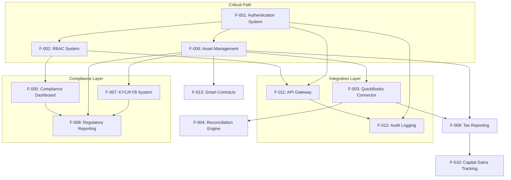
```mermaid
graph TD
    F001[F-001: Authentication System] --> F002[F-002: RBAC System]
    F001 --> F006[F-006: Asset Management]
    F001 --> F011[F-011: API Gateway]
    F001 --> F012[F-012: Audit Logging]
    
    F002 --> F005[F-005: Compliance Dashboard]
    F002 --> F011
    
    F006 --> F007[F-007: KYC/KYB System]
    F006 --> F013[F-013: Smart Contracts]
    F006 --> F003[F-003: QuickBooks Connector]
    
    F007 --> F008[F-008: Regulatory Reporting]
    F006 --> F008
    
    F003 --> F004[F-004: Reconciliation Engine]
    F003 --> F009[F-009: Tax Reporting]
    F006 --> F009
    
    F009 --> F010[F-010: Capital Gains Tracking]
    
    F005 --> F008
    F011 --> F012
    
    subgraph "Critical Path"
        F001
        F002
        F006
    end
    
    subgraph "Integration Layer"
        F003
        F011
        F012
    end
    
    subgraph "Compliance Layer"
        F005
        F007
        F008
    end
```

### 2.3.2 Integration Points and Shared Components

#### 2.3.2.1 Gateway Service Integration Hub
- **Central Routing**: All API requests flow through Gateway service operating on port 4000
- **Service Mesh Architecture**: Routes traffic to backend services on ports 4001-4005 with load balancing
- **Rate Limiting Implementation**: Redis-based per-IP limiting with 100 requests per 60-second window
- **Request Correlation**: X-request-id header propagation across all microservice calls

#### 2.3.2.2 Database Integration Layer
- **Shared Data Models**: Organizations, Users, Products, Transactions, Holdings, ComplianceRules entities
- **Cross-Service Data Access**: Implemented via @veria/database package with Prisma ORM
- **Transaction Integrity**: PostgreSQL ACID compliance with explicit transaction boundary management
- **Multi-Tenant Architecture**: Organization-scoped data access with row-level security implementation

#### 2.3.2.3 Authentication Integration Framework
- **Middleware Package**: @veria/auth-middleware utilized across all microservices
- **Token Management**: JWT HS256 implementation with 15-minute access tokens and 7-day refresh tokens
- **Session Management**: Redis-backed session storage with 7-day TTL and automatic cleanup

### 2.3.3 Feature Interdependency Matrix

| Feature | F-001 | F-002 | F-003 | F-004 | F-005 | F-006 | F-007 | F-008 | F-009 | F-010 | F-011 | F-012 | F-013 |
|---------|-------|-------|-------|-------|-------|-------|-------|-------|-------|-------|-------|-------|-------|
| F-001 Authentication | ■ | ✓ | ✓ | - | ✓ | ✓ | ✓ | - | - | - | ✓ | ✓ | - |
| F-002 RBAC | ● | ■ | - | - | ✓ | - | - | - | - | - | ✓ | - | - |
| F-003 QuickBooks | ● | - | ■ | ✓ | - | ✓ | - | - | ✓ | - | - | - | - |
| F-004 Reconciliation | - | - | ● | ■ | - | - | - | - | - | - | - | - | - |
| F-005 Dashboard | ● | ● | - | - | ■ | - | - | ✓ | - | - | - | - | - |
| F-006 Asset Mgmt | ● | - | ● | - | - | ■ | ✓ | ✓ | ✓ | - | - | - | ✓ |
| F-007 KYC/KYB | ● | - | - | - | - | - | ■ | ✓ | - | - | - | - | - |
| F-008 Regulatory | - | - | - | - | - | ● | ● | ■ | - | - | - | - | - |
| F-009 Tax Engine | - | - | ● | - | - | ● | - | - | ■ | ✓ | - | - | - |
| F-010 Capital Gains | - | - | - | - | - | - | - | - | ● | ■ | - | - | - |
| F-011 Gateway | ● | ● | - | - | - | - | - | - | - | - | ■ | ✓ | - |
| F-012 Audit Logs | ● | - | - | - | - | - | - | - | - | - | ● | ■ | - |
| F-013 Smart Contracts | - | - | - | - | - | ● | - | - | - | - | - | - | ■ |

**Legend:**
- ■ = Self-reference
- ● = Hard dependency (feature cannot function without)
- ✓ = Soft dependency (feature benefits from integration)
- \- = No dependency relationship

## 2.4 IMPLEMENTATION CONSIDERATIONS

### 2.4.1 Technical Constraints and Performance Requirements

<span style="background-color: rgba(91, 57, 243, 0.2)">All infrastructure modifications must be delivered exclusively through Terraform and committed via exactly three independent pull requests (PR A, PR B, PR C), each containing explicit apply, destroy, verification, and rollback instructions.</span>

#### 2.4.1.1 Authentication & RBAC Systems (F-001, F-002)
- **Performance Constraints**: JWT validation processing time must remain below 10ms per request
- **Scalability Requirements**: Redis session storage architecture supports horizontal scaling across multiple instances
- **Security Considerations**: bcrypt password hashing with salt rounds configuration of 10, secure token storage with encryption
- **Maintenance Requirements**: Implement comprehensive token rotation strategies and robust key management protocols

#### 2.4.1.2 Accounting Integration Platform (F-003, F-004)
- **Performance Standards**: Synchronization of 1,000 transactions must complete within 30 seconds
- **Scalability Architecture**: Queue-based processing system for handling large transaction batches efficiently
- **Security Implementation**: OAuth token encryption with secure credential storage and transmission protocols
- **Maintenance Protocols**: API version compatibility management with comprehensive error recovery mechanisms

#### 2.4.1.3 Compliance Management Features (F-005 through F-008)
- **Performance Benchmarks**: Dashboard loading time under 2 seconds with real-time updates via WebSocket connections
- **Scalability Infrastructure**: Multi-layer caching system for compliance calculations and rule evaluations
- **Security Framework**: End-to-end data encryption at rest and in transit with comprehensive access logging
- **Maintenance Strategy**: Rule engine updates deployable without code changes through configuration management

#### 2.4.1.4 Tax Reporting Systems (F-009, F-010)
- **Performance Requirements**: Generate comprehensive reports for 10,000 transactions within 60 seconds
- **Scalability Design**: Background job processing system with queue management and progress tracking
- **Security Standards**: PII protection protocols with secure document storage and controlled access mechanisms
- **Maintenance Considerations**: Annual tax law updates through configurable rule systems and regulatory change management

#### 2.4.1.5 Infrastructure Components (F-011 through F-013) (updated)
- **Performance Standards**: API gateway overhead limited to 50ms maximum with sub-second response time requirements
- **Scalability Framework**: Horizontal scaling capabilities via Kubernetes orchestration or Cloud Run deployment
- **Security Architecture**: TLS 1.3 implementation, comprehensive API key rotation, and audit log immutability guarantees
- **Maintenance Protocols**: Zero-downtime deployment processes with backward compatibility assurance
- **CI/CD Authentication Requirements**: <span style="background-color: rgba(91, 57, 243, 0.2)">CI/CD authentication MUST use GitHub OIDC / Workload Identity Federation via google-github-actions/auth@v2; JSON key-based authentication is strictly prohibited</span>
- **Deployment Constraints**: <span style="background-color: rgba(91, 57, 243, 0.2)">Cloud Run deployments MUST reference container images by immutable DIGEST only; tag-based references (:latest) are not permitted</span>
- **Access Policy Requirements**: <span style="background-color: rgba(91, 57, 243, 0.2)">Cloud Run services MUST remain PRIVATE-ONLY, requiring ID-token authentication; absolutely no allUsers access grants are permitted</span>
- **WIF Configuration Constraints**: <span style="background-color: rgba(91, 57, 243, 0.2)">Existing WIF pool/provider and branch/tag conditions MUST NOT be altered; new bindings must extend, not modify, current configuration</span>

### 2.4.2 Deployment Architecture and Environment Requirements

#### 2.4.2.1 Development Environment Specifications
- **Local Development**: Docker Compose orchestration with PostgreSQL 14+, Redis 7+, and complete service ecosystem
- **Database Requirements**: PostgreSQL with uuid-ossp extension for identifier generation and advanced query capabilities
- **Caching Infrastructure**: Redis implementation for session management, rate limiting, and performance optimization
- **Container Standards**: Docker containers utilizing Node.js 20 Alpine base images for consistency and security

#### 2.4.2.2 Staging Environment Configuration (updated)
- **Cloud Platform**: Google Cloud Run with auto-scaling capabilities and managed infrastructure services
- **Database Management**: Managed PostgreSQL with automated backups and high availability configuration
- **Caching Solution**: Google Memorystore for Redis with persistence and clustering capabilities
- **Security Implementation**: Private networking with VPC isolation and comprehensive access controls
- **Infrastructure as Code**: <span style="background-color: rgba(91, 57, 243, 0.2)">Staging environment skeleton implemented using Terraform configuration located under /infra/terraform/envs/staging/ targeting refs/heads/staging branch</span>
- **Workload Identity Management**: <span style="background-color: rgba(91, 57, 243, 0.2)">Consumption of modular WIF pool/provider Terraform module with WorkloadIdentityUser IAM binding for CI GitHub Action authentication</span>

#### 2.4.2.3 Production Environment Architecture
- **Multi-Region Deployment**: Google Cloud Run across multiple regions for high availability and disaster recovery
- **Database Infrastructure**: Cloud SQL with read replicas and automated failover mechanisms
- **Performance Optimization**: Memorystore Redis clustering with persistence and comprehensive monitoring
- **Security Framework**: Advanced threat protection, comprehensive audit logging, and regulatory compliance controls

### 2.4.3 Integration and Monitoring Requirements

#### 2.4.3.1 Comprehensive Monitoring Framework (updated)
- **Performance Metrics**: Response time tracking, error rate monitoring, and throughput measurement across all services
- **Operational Logging**: Structured JSON logging with correlation IDs for comprehensive request tracing
- **Alert Management**: SLA breach notifications, security event alerting, and compliance violation detection
- **Distributed Tracing**: End-to-end request tracing across the entire microservices architecture
- **Logs-Based Metrics**: <span style="background-color: rgba(91, 57, 243, 0.2)">HTTP 5xx error rate and P95 latency metrics extracted from Cloud Run structured logs using Cloud Logging filter expressions</span>
- **Alert Policy Management**: <span style="background-color: rgba(91, 57, 243, 0.2)">Terraform-managed alert policies that trigger on defined error-rate and latency thresholds with automated notification workflows</span>
- **Dashboard Configuration**: <span style="background-color: rgba(91, 57, 243, 0.2)">Cloud Monitoring dashboard configuration (dashboard.json) displaying custom metrics in real-time with comprehensive visualization capabilities</span>
- **Health Validation**: <span style="background-color: rgba(91, 57, 243, 0.2)">Post-deployment smoke-test GitHub Action (smoke-test.yml) using ID-token authentication to validate service health and functionality</span>

#### 2.4.3.2 Quality Assurance and Testing Standards (updated)
- **Automated Testing**: Comprehensive unit testing coverage exceeding 80% across all microservices
- **Integration Testing**: End-to-end workflow testing covering all critical user journeys and business processes
- **Performance Testing**: Load testing capabilities supporting 1000+ concurrent users with acceptable response times
- **Security Testing**: Regular penetration testing and vulnerability assessments with automated security scanning
- **Supply Chain Security**: <span style="background-color: rgba(91, 57, 243, 0.2)">CI pipeline MUST generate SPDX-formatted Software Bill of Materials (SBOM) and perform comprehensive vulnerability scanning using Trivy with SARIF output uploaded to GitHub Security tab</span>
- **Security Gate Requirements**: <span style="background-color: rgba(91, 57, 243, 0.2)">Supply-chain scanning steps are mandatory gating checks for all pull requests, preventing merge until security requirements are satisfied</span>

#### 2.4.3.3 Compliance and Audit Requirements (updated)
- **Regulatory Compliance**: SOC 2 Type II compliance framework implementation with regular audit preparation
- **Data Governance**: Comprehensive data lineage tracking with immutable audit trails for all data modifications
- **Backup and Recovery**: Automated backup processes with tested disaster recovery procedures and RTO/RPO metrics
- **Change Management**: Formal change control processes with approval workflows and rollback capabilities
- **Image Lifecycle Management**: <span style="background-color: rgba(91, 57, 243, 0.2)">Artifact Registry image retention policy managed through Terraform to enforce automatic cleanup of outdated container images</span>
- **Code Review Governance**: <span style="background-color: rgba(91, 57, 243, 0.2)">Repository-level /CODEOWNERS file enforcing code-review ownership aligned with team assignments and security boundaries</span>

#### References

Files Examined:
- `PRD.md` - Master PRD index defining comprehensive scope and modular structure
- `docs/roadmap.md` - 12-month phased implementation plan with detailed sprint breakdowns
- `docs/checklist.md` - Sprint-level implementation checklist with progress tracking capabilities
- `docs/prds/quickbooks_connector_prd.md` - Detailed QuickBooks/Xero connector specifications and OAuth requirements
- `docs/prds/compliance_dashboard_prd.md` - Comprehensive compliance dashboard requirements and user interface specifications
- `docs/prds/tax_reporting_prd.md` - Tax engine specifications and IRS reporting requirements
- `docs/prds/api_gateway_prd.md` - API platform architecture and multi-tenant middleware requirements

Directories Analyzed:
- `/` - Root monorepo structure with configuration management
- `services/` - 12 microservices including gateway, identity, compliance, and KYC systems
- `apps/` - 3 frontend applications with compliance dashboard and investor portal
- `packages/` - 9 shared packages including auth-middleware, database connectivity, and SDK components
- `docs/prds/` - Complete product requirement document collection
- `services/gateway/` - API gateway implementation with routing and middleware capabilities
- `services/identity-service/` - Authentication and user management service implementation
- `connectors/` - QuickBooks connector implementation with OAuth integration
- `contracts/` - Smart contract implementations featuring ERC-3643 compliance
- `packages/database/` - Database models, schemas, and data access layer implementations
- `/infra/terraform/envs/staging/` - Staging environment Terraform configuration targeting refs/heads/staging
- `/infra/terraform/modules/` - Reusable WIF module for pool, provider, and service account bindings

# 3. TECHNOLOGY STACK

## 3.1 PROGRAMMING LANGUAGES

### 3.1.1 Primary Language Selection

**TypeScript v5.3.3-5.4.5** serves as the primary programming language across the entire platform, providing the foundation for both frontend and backend services.

**Selection Rationale:**
- **Type Safety**: Critical for financial applications where data integrity and contract accuracy are paramount
- **Developer Experience**: Enhanced IDE support and compile-time error detection reduce production bugs
- **Ecosystem Maturity**: Extensive library support for financial services integrations
- **Team Standardization**: Single language expertise across frontend and backend reduces context switching
- **Compliance Benefits**: Static typing supports audit requirements and code verification processes

**Implementation Scope:**
- All microservices in `/services/*` directory (Gateway, Identity, Compliance, KYC Provider, etc.)
- Frontend applications in `/apps/*` (Compliance Dashboard, Investor Portal)
- Shared packages in `/packages/*` (Auth Middleware, Database, SDK-TS)
- Smart contract interfaces and type definitions

**Configuration Standards:**
- Target: ES2020 for optimal performance and compatibility
- Module System: ESNext with ES Modules (`"type": "module"`)
- Strict mode enabled for maximum type checking

### 3.1.2 Runtime Environment

**Node.js v20** provides the JavaScript runtime environment for all backend services.

**Selection Justification:**
- **Performance**: V8 engine optimizations for high-throughput financial processing
- **Security**: Regular security updates and LTS support for production stability
- **Ecosystem**: Mature package ecosystem for financial services integrations
- **Containerization**: Optimal compatibility with Alpine Linux containers (`node:20-alpine`)

### 3.1.3 Smart Contract Development

**Solidity v0.8.20** enables blockchain integration and tokenized asset management through ERC-3643 compliant smart contracts.

**Technical Requirements:**
- ERC-3643 security token standard implementation
- Modular compliance framework development
- Identity registry management for KYC/KYB verification
- Integration with existing DeFi protocols

**Implementation Context:**
- Smart contracts located in `/contracts/` directory
- Hardhat v2.19.4 development framework
- TypeChain integration for TypeScript bindings
- OpenZeppelin contracts v5.0.1 for security standards

### 3.1.4 Specialized Integrations

**Python v3.x** provides specialized capabilities for blockchain monitoring and compliance middleware components.

**Usage Context:**
- Blockchain transaction monitoring in `/packages/blockchain/`
- Compliance rule processing in `/packages/compliance_middleware/`
- Integration with existing Python-based financial tools
- Machine learning models for compliance pattern recognition

## 3.2 FRAMEWORKS & LIBRARIES

### 3.2.1 Backend Framework Architecture

#### 3.2.1.1 Primary HTTP Framework

**Fastify v4.28.1** serves as the primary HTTP framework for most microservices, chosen for its performance characteristics and plugin ecosystem.

**Selection Criteria:**
- **Performance**: Fastest Node.js web framework, critical for sub-second API response requirements
- **Schema Validation**: Built-in JSON schema validation supports compliance data integrity
- **Plugin Architecture**: Modular design aligns with microservices architecture
- **Security**: Comprehensive security plugins for financial services compliance

**Implementation Scope:**
- Gateway Service (port 4000) - API orchestration and rate limiting
- Identity Service (port 4001) - Authentication and user management
- Blockchain Service (port 4002) - Smart contract interactions
- KYC Provider Service (port 4003) - Multi-vendor identity verification
- Regulatory Reporting Service (port 4004) - Compliance report generation

**Core Plugins:**
- `@fastify/cors v8.5.0` - Cross-origin request management
- `@fastify/helmet v11.1.1` - Security headers and protection
- `@fastify/jwt v8.0.1` - JSON Web Token integration

#### 3.2.1.2 Alternative Framework

**Express** provides HTTP framework capabilities for specialized services requiring different architectural patterns.

**Usage Context:**
- AI Broker Service - Machine learning model integration
- Graph Service - Data relationship processing
- Legacy integration requirements

### 3.2.2 Frontend Framework Stack

#### 3.2.2.1 Primary Frontend Framework

**Next.js v14.0.4** serves as the primary frontend framework, implementing the App Router architecture for modern React development.

**Selection Justification:**
- **Performance**: Server-side rendering and static optimization for dashboard loading under 2 seconds
- **Developer Experience**: Integrated toolchain reduces configuration overhead
- **Production Ready**: Enterprise-grade features for multi-tenant applications
- **SEO Optimization**: Server-side rendering supports compliance documentation requirements

**Configuration:**
- App Router architecture for improved performance and developer experience
- Standalone output mode for containerized deployments
- TypeScript integration for type-safe frontend development

#### 3.2.2.2 Component Libraries

**React v18.2.0** provides the component architecture foundation with concurrent features for real-time compliance updates.

**Radix UI** delivers headless component primitives ensuring accessibility compliance and design flexibility:
- `@radix-ui/react-dialog v1.0.5` - Modal interfaces for compliance workflows
- `@radix-ui/react-dropdown-menu v2.0.6` - Navigation and action menus
- `@radix-ui/react-tabs v1.0.4` - Dashboard section organization
- `@radix-ui/react-label v2.0.2` and `@radix-ui/react-slot v1.0.2` - Form components

**Tailwind CSS v3.4.0** provides utility-first styling with comprehensive design system support:
- `tailwind-merge v2.2.0` - Conditional styling utilities
- `tailwindcss-animate v1.0.7` - Animation utilities for real-time updates
- `class-variance-authority v0.7.0` - Component variant management
- `clsx v2.1.0` - Conditional className construction

**Lucide React v0.303.0** supplies consistent iconography across the compliance dashboard and investor portal.

#### 3.2.2.3 Build Tools

**Vite** serves as the build tool for the Compliance Dashboard, providing fast development builds and optimized production bundles with React and TypeScript support.

## 3.3 OPEN SOURCE DEPENDENCIES

### 3.3.1 Package Management

**pnpm** provides workspace-enabled monorepo management with optimized dependency resolution.

**Configuration Benefits:**
- Workspace protocol links (`workspace:*`) for internal package dependencies
- Shared packages pattern reducing duplication
- Hard link optimization for reduced disk usage
- Built dependencies configuration: `onlyBuiltDependencies: ["esbuild"]`

### 3.3.2 Authentication & Security

**Core Security Libraries:**
- `bcrypt v5.1.1` - Password hashing with configurable salt rounds (10 rounds for performance/security balance)
- `jsonwebtoken` - JWT token generation and validation for session management
- `@simplewebauthn/server v13.1.2` - WebAuthn passkey support for enhanced security

**Security Justification:**
- bcrypt provides industry-standard password protection against rainbow table attacks
- JWT enables stateless authentication suitable for microservices architecture
- WebAuthn supports passwordless authentication reducing phishing vulnerabilities

### 3.3.3 Database Integration

**PostgreSQL Client Stack:**
- `pg v8.16.3` - PostgreSQL client library with connection pooling
- `Prisma` - Type-safe database ORM with migration management
- `SQLAlchemy 2.x` - Python ORM for specialized blockchain monitoring services
- `Alembic` - Database migration management for Python services

**Selection Benefits:**
- PostgreSQL provides ACID compliance crucial for financial data integrity
- Prisma generates type-safe database clients reducing runtime errors
- Connection pooling optimizes performance under load

### 3.3.4 Caching & Performance

**Redis Integration:**
- `ioredis v5.7.0` - Redis client with cluster support and connection management

**Performance Optimization:**
- Session storage for JWT token management
- Rate limiting data for API gateway
- Compliance rule caching for sub-second response times
- KYC verification result caching

### 3.3.5 Validation & Data Processing

**Runtime Validation:**
- `zod v3.23.8+` - Runtime schema validation ensuring data integrity across API boundaries

**Document Generation:**
- `pdfkit v0.14.0` - PDF generation for compliance reports
- `exceljs v4.4.0` - Excel file manipulation for accounting integrations
- `handlebars v4.7.8` - Template engine for dynamic report generation

**HTTP & Networking:**
- `axios v1.6.2` - HTTP client with interceptor support for API integrations
- `node-fetch v3.3.2` - Fetch API implementation for Node.js services

### 3.3.6 Blockchain Integration

**Ethereum Libraries:**
- `ethers v6.9.0` - Ethereum interaction library with TypeScript support
- `web3.py` - Python blockchain interaction for monitoring services
- `@openzeppelin/contracts v5.0.1` - Security-audited smart contract libraries
- `@openzeppelin/contracts-upgradeable v5.0.1` - Upgradeable contract patterns

**Smart Contract Development:**
- `hardhat v2.19.4` - Ethereum development environment
- `@typechain/hardhat` - TypeScript bindings generation for smart contracts

### 3.3.7 Scheduling & Background Processing

**Task Management:**
- `node-cron v3.0.3` - Scheduled task execution for regulatory reporting
- Queue-based processing system for large transaction batches (implementation planned)

### 3.3.8 Logging & Observability

**Structured Logging:**
- `pino v8.17.2` - High-performance JSON logger with correlation ID support
- `pino-pretty v10.3.1` - Development-friendly log formatting

**Logging Benefits:**
- Structured JSON format supports log aggregation and analysis
- Correlation ID tracking enables distributed tracing across microservices
- High performance logging minimizes application overhead

### 3.3.9 Testing Infrastructure

**Unit Testing:**
- `vitest v1.1.0-1.6.0` - Fast unit testing framework with TypeScript support
- `chai v4.3.10` - Assertion library for comprehensive test coverage

**End-to-End Testing:**
- `@playwright/test` - Browser automation for compliance dashboard testing
- Cross-browser compatibility testing for investor portal

**Performance Testing:**
- `k6` - Load testing framework supporting 1000+ concurrent users
- API endpoint performance validation

**Smart Contract Testing:**
- `Jest` - JavaScript testing framework for contract interaction testing
- `pytest` - Python testing framework for blockchain monitoring services

### 3.3.10 Security Tooling (updated)

**Supply Chain Security:**
- <span style="background-color: rgba(91, 57, 243, 0.2)">`aquasecurity/trivy v0.66.0` - CLI-based vulnerability scanner and SBOM generator</span>
- <span style="background-color: rgba(91, 57, 243, 0.2)">`aquasecurity/trivy-action@f9424c1` - GitHub Action wrapper for Trivy integration</span>

**<span style="background-color: rgba(91, 57, 243, 0.2)">Security Benefits:</span>**
- <span style="background-color: rgba(91, 57, 243, 0.2)">Software Bill of Materials (SBOM) generation for complete dependency visibility</span>
- <span style="background-color: rgba(91, 57, 243, 0.2)">Container vulnerability scanning across all Docker images in CI/CD pipeline</span>
- <span style="background-color: rgba(91, 57, 243, 0.2)">Multi-format scanning support including filesystems, container images, and Git repositories</span>
- <span style="background-color: rgba(91, 57, 243, 0.2)">Integration with `.github/workflows/ci.yml` for automated supply chain transparency</span>
- <span style="background-color: rgba(91, 57, 243, 0.2)">SHA-pinned GitHub Action prevents supply chain attacks through tag manipulation</span>

**<span style="background-color: rgba(91, 57, 243, 0.2)">Implementation Context:</span>**
- <span style="background-color: rgba(91, 57, 243, 0.2)">Supports compliance requirements for vulnerability disclosure and risk assessment</span>
- <span style="background-color: rgba(91, 57, 243, 0.2)">Provides detailed vulnerability information from Aqua Vulnerability Database</span>
- <span style="background-color: rgba(91, 57, 243, 0.2)">Enables early detection of security issues in development workflow</span>
- <span style="background-color: rgba(91, 57, 243, 0.2)">Outputs compatible with security reporting and audit requirements</span>

## 3.4 THIRD-PARTY SERVICES

### 3.4.1 Payment Processing

**Stripe v14.25.0** provides payment processing capabilities integrated into the Gateway service.

**Integration Context:**
- Subscription billing for platform access
- Payment processing for tokenized asset transactions
- Compliance with PCI DSS requirements
- Webhook integration for real-time payment status updates

### 3.4.2 Identity Verification Services

**Multi-Vendor KYC Integration** implemented through adapter pattern supporting multiple identity verification providers:

**Chainalysis Integration:**
- AML screening for crypto-related transactions
- Sanctions list checking for compliance
- Risk scoring for enhanced due diligence

**Jumio Integration:**
- Document verification for individual investors
- Biometric verification for enhanced security
- Identity document authenticity checking

**Development Environment:**
- Mock implementations for all KYC providers
- No external API dependencies required for development
- Configurable response scenarios for testing compliance workflows

### 3.4.3 Cloud Infrastructure Services

**Google Cloud Platform Integration:**

**Google Cloud Run:**
- Serverless container deployment with auto-scaling
- Pay-per-use pricing model optimizing operational costs
- Regional deployment for high availability

**Google Artifact Registry:**
- Container image storage with vulnerability scanning
- Private registry for secure image distribution
- Integration with CI/CD pipelines

**Google Cloud Storage (GCS):**
- Terraform state file management
- Compliance document storage with encryption
- Backup and disaster recovery storage

**Workload Identity Federation:**
- Keyless authentication for GitHub Actions
- Enhanced security eliminating long-lived service account keys
- Fine-grained access control for CI/CD operations

**<span style="background-color: rgba(91, 57, 243, 0.2)">Google Cloud Monitoring</span>:**
- <span style="background-color: rgba(91, 57, 243, 0.2)">Managed metrics collection and aggregation from Cloud Run services</span>
- <span style="background-color: rgba(91, 57, 243, 0.2)">Alert policies for error rates and p95 latency thresholds</span>
- <span style="background-color: rgba(91, 57, 243, 0.2)">Dashboard configuration for operational visibility and compliance monitoring</span>
- <span style="background-color: rgba(91, 57, 243, 0.2)">Integration with Cloud Run logs for service-level monitoring</span>
- <span style="background-color: rgba(91, 57, 243, 0.2)">Private service configuration ensuring secure metrics collection</span>
- <span style="background-color: rgba(91, 57, 243, 0.2)">Terraform-managed resources with modular monitoring configuration located in /infra/monitoring/</span>

**<span style="background-color: rgba(91, 57, 243, 0.2)">Google Cloud Logging</span>:**
- <span style="background-color: rgba(91, 57, 243, 0.2)">Centralized log ingestion from all Cloud Run microservices</span>
- <span style="background-color: rgba(91, 57, 243, 0.2)">Logs-based metrics extraction for error rates and latency percentiles</span>
- <span style="background-color: rgba(91, 57, 243, 0.2)">Real-time log analysis supporting compliance audit requirements</span>
- <span style="background-color: rgba(91, 57, 243, 0.2)">Structured logging support for Gateway, Identity, and Compliance services</span>
- <span style="background-color: rgba(91, 57, 243, 0.2)">Private service configuration maintaining secure log collection</span>
- <span style="background-color: rgba(91, 57, 243, 0.2)">Terraform-managed log sinks and retention policies ensuring operational consistency</span>

### 3.4.4 Domain & CDN Services

**Cloudflare Integration:**
- Domain binding and DNS management
- SSL/TLS certificate provisioning and management
- DDoS protection and security services
- Performance optimization through CDN

### 3.4.5 AI Services (Planned Integration)

**Multi-Provider AI Integration** implemented in AI Broker Service:
- OpenAI integration for compliance document analysis
- Anthropic integration for regulatory text processing
- Gemini integration for multi-modal compliance checking
- Adapter pattern enables flexible provider switching

## 3.5 DATABASES & STORAGE

### 3.5.1 Primary Database System

**PostgreSQL v14** serves as the primary relational database providing ACID compliance essential for financial data integrity.

**Selection Justification:**
- **Financial Data Integrity**: ACID transactions ensure data consistency across compliance operations
- **Performance**: Advanced query optimization for complex compliance calculations
- **Extensibility**: UUID-OSSP extension for secure identifier generation
- **Compliance**: Audit logging capabilities supporting regulatory requirements
- **Scalability**: Read replica support for high-availability deployments

**Implementation Configuration:**
- Container deployment: `postgres:14-alpine`
- Connection pooling through Prisma ORM
- Automated backups with point-in-time recovery
- Encryption at rest and in transit

**Schema Organization:**
- User management and RBAC data
- Tokenized asset definitions and lifecycle tracking
- Compliance rules and verification results
- Audit trails and transaction history
- KYC/KYB verification records

### 3.5.2 Caching Layer

**Redis v7** provides high-performance caching and session management.

**Usage Patterns:**
- **Session Storage**: JWT token management and user sessions
- **Rate Limiting**: API gateway request throttling data
- **Policy Caching**: Compliance rules caching for sub-second response times
- **KYC Caching**: Identity verification results for performance optimization

**Configuration:**
- Container deployment: `redis:7-alpine`
- ioredis client v5.7.0 with cluster support
- Persistence configuration for session durability
- Memory optimization for high-throughput operations

### 3.5.3 Vector Database

**Qdrant** provides vector search capabilities for compliance document analysis and similarity matching.

**Use Cases:**
- Compliance document similarity analysis
- Regulatory text matching and classification
- AI-powered compliance pattern recognition
- Document categorization for audit purposes

**Deployment Configuration:**
- Latest Qdrant image with REST API access
- Ports 6333 (HTTP) and 6334 (gRPC) exposed
- Integration with AI services for embeddings

### 3.5.4 File Storage Systems

**Local File System Storage:**
- Audit logs stored in `.audit-data/audit.log` with JSONL format
- Generated reports stored in `./reports` directory
- Build artifacts in service-specific `./dist` directories

**Cloud Storage Integration:**
- Google Cloud Storage for Terraform state management
- Encrypted document storage for compliance artifacts
- Backup and disaster recovery storage

**Storage Security:**
- Encryption at rest for all sensitive data
- Access logging for audit trail requirements
- Immutable audit log storage preventing tampering

## 3.6 DEVELOPMENT & DEPLOYMENT

### 3.6.1 Development Environment

#### 3.6.1.1 Monorepo Management

**pnpm Workspaces** provide comprehensive monorepo management with optimized dependency resolution:

**Architecture Benefits:**
- Workspace protocol links (`workspace:*`) enabling internal package dependencies
- Shared packages pattern reducing code duplication
- Hard link optimization minimizing disk usage
- Unified dependency management across all services

**Configuration:**
```yaml
packages:
  - 'packages/*'
  - 'services/*'
  - 'apps/*'
  - 'connectors/*'
  - 'contracts'
```

#### 3.6.1.2 Development Tools

**Hot Reload & Development Servers:**
- `tsx watch` - TypeScript hot reload for backend services
- Next.js development server for frontend applications
- Vite development server for compliance dashboard
- Docker Compose for local service orchestration

**Code Quality:**
- ESLint v8.57.0 with TypeScript support
- Prettier for code formatting
- Husky pre-commit hooks (planned implementation)

### 3.6.2 Build System

#### 3.6.2.1 TypeScript Compilation

**TypeScript Compiler (tsc)** provides production build generation:
- ES2020 target for optimal browser compatibility
- Strict mode compilation for maximum type safety
- Declaration file generation for package exports
- Source map generation for production debugging

#### 3.6.2.2 Frontend Build Tools

**Next.js Compiler (SWC):**
- Fast Rust-based compilation for React components
- Automatic code splitting and optimization
- Image optimization and asset bundling
- Static site generation for compliance documentation

**Vite with Rollup:**
- Fast development builds with hot module replacement
- Production optimization with tree shaking
- CSS processing with PostCSS v8.4.35 and Autoprefixer v10.4.18

#### 3.6.2.3 Smart Contract Compilation

**Hardhat Toolchain:**
- Solidity compilation with optimization enabled
- TypeChain integration for TypeScript contract interfaces
- Deployment script management
- Testing framework integration

### 3.6.3 Containerization

#### 3.6.3.1 Docker Configuration

**Multi-stage Docker builds** optimize production containers:

**Base Image:** `node:20-alpine`
- Minimal attack surface with Alpine Linux
- Node.js 20 LTS for stability and security
- Multi-architecture support (AMD64/ARM64)

**Security Configuration:**
- Non-root user execution (UID/GID 1001)
- Health checks for container orchestration
- Minimal package installation for reduced vulnerabilities
- Layer optimization for fast builds

#### 3.6.3.2 Local Development Orchestration

**Docker Compose v3.8** manages local development infrastructure:
- PostgreSQL 14 database with persistent volumes
- Redis 7 caching layer with configuration optimization
- Qdrant vector database for AI integration testing
- Network isolation for security testing

### 3.6.4 Continuous Integration & Deployment

#### 3.6.4.1 CI/CD Pipeline

**GitHub Actions** provides comprehensive automation:

**Workflow Configuration:**
- Node.js 20 standard runtime across all jobs
- pnpm setup with dependency caching
- Matrix builds supporting multiple services simultaneously
- Parallel execution for optimal pipeline performance

**Pipeline Stages:**
1. **Code Quality**: ESLint, TypeScript compilation, unit tests
2. **Security Scanning**: Dependency auditing, container vulnerability scanning
3. **Testing**: Unit tests with Vitest, integration tests with Playwright
4. **Build**: Container image creation and registry push
5. **Deployment**: Google Cloud Run deployment with health checks
6. **<span style="background-color: rgba(91, 57, 243, 0.2)">Smoke Testing</span>**: <span style="background-color: rgba(91, 57, 243, 0.2)">Post-deployment validation workflow executing ID-token-authenticated curl requests against Cloud Run revision endpoints; runs after deploy stage and prior to merge gate</span>

#### 3.6.4.2 Security Integration

**Vulnerability Scanning:**
- Trivy container scanning with SARIF output
- pnpm audit for dependency vulnerability detection
- CodeQL integration for static analysis
- Automated security patches through Dependabot

#### 3.6.4.3 Deployment Validation (updated)

**<span style="background-color: rgba(91, 57, 243, 0.2)">Smoke-test Workflow</span>:**
- <span style="background-color: rgba(91, 57, 243, 0.2)">GitHub Actions job executing ID-token-authenticated curl against Cloud Run revision post-deployment</span>
- <span style="background-color: rgba(91, 57, 243, 0.2)">Implemented in `.github/workflows/smoke-test.yml` with Node.js 20 runner</span>
- <span style="background-color: rgba(91, 57, 243, 0.2)">Uses google-github-actions/auth@v2 for OIDC authentication and Workload Identity Federation</span>
- <span style="background-color: rgba(91, 57, 243, 0.2)">Validates service endpoints and health checks before promoting deployment to production traffic</span>

### 3.6.5 Infrastructure as Code

#### 3.6.5.1 Terraform Configuration

**Infrastructure Provisioning:**
- Terraform version >= 1.6.0 required
- Google/Google-beta providers >= 5.40.0
- Cloudflare provider for DNS management
- Remote state management in Google Cloud Storage

**Resource Management:**
- Google Cloud Run service provisioning
- Identity and Access Management (IAM) configuration
- Networking and security policy definition
- Monitoring and alerting setup

#### 3.6.5.2 Environment Management

**Configuration Management:**
- envsubst for manifest templating
- Environment-specific variable injection
- Secret management through Google Secret Manager
- Configuration drift detection and remediation

### 3.6.6 Testing Infrastructure

#### 3.6.6.1 Testing Framework Stack

**Unit Testing:**
- Vitest for TypeScript services with coverage reporting
- pytest for Python blockchain monitoring components
- Jest for smart contract testing with Hardhat integration

**Integration Testing:**
- Playwright for end-to-end browser testing
- API integration testing with supertest
- Database integration testing with in-memory SQLite

**Performance Testing:**
- k6 for load testing supporting 1000+ concurrent users
- API endpoint performance validation
- Database query performance profiling

#### 3.6.6.2 Testing Data Management

**Test Database Configuration:**
- In-memory SQLite for fast unit test execution
- PostgreSQL test databases for integration testing
- Mock data generators for compliance scenarios
- Test data cleanup and isolation between test runs

### 3.6.7 Development Workflow Integration

#### 3.6.7.1 Local Development Setup

**Environment Requirements:**
- Node.js 20 LTS with pnpm v8.15.0 or higher
- Docker Desktop for containerized service development
- Google Cloud SDK for local GCP service emulation
- Terraform CLI for infrastructure development and testing

**Service Orchestration:**
- Docker Compose profiles for selective service startup
- Health check integration for dependency readiness
- Hot reload configuration for rapid development iteration
- Database migration automation for schema consistency

#### 3.6.7.2 Development Security

**Local Security Configuration:**
- Environment variable management through `.env` files
- Local certificate generation for HTTPS development
- Service-to-service authentication testing
- Secrets management integration with Google Secret Manager emulation

**Compliance Development Support:**
- Local audit log generation for compliance testing
- Mock KYC provider integration for development workflows
- Regulatory reporting template generation
- Test data anonymization for compliance validation

## 3.7 TECHNOLOGY INTEGRATION ARCHITECTURE

The technology integration architecture establishes a comprehensive distributed system leveraging Google Cloud Platform for scalable, monitored, and maintainable financial technology operations. This architecture implements a microservices pattern with clear separation of concerns across frontend, gateway, service, and data layers.

### 3.7.1 Architecture Overview

The system architecture follows a layered approach designed for regulatory compliance, scalability, and maintainability:

- **Frontend Layer**: Next.js 14 applications providing user interfaces
- **API Gateway Layer**: Centralized request routing and authentication
- **Microservices Layer**: Domain-specific services for core business logic
- **Data Layer**: Polyglot persistence supporting different data requirements
- **External Integrations**: Third-party service connections
- **Infrastructure Layer**: Cloud-native deployment and <span style="background-color: rgba(91, 57, 243, 0.2)">monitoring infrastructure</span>

### 3.7.2 System Architecture Diagram

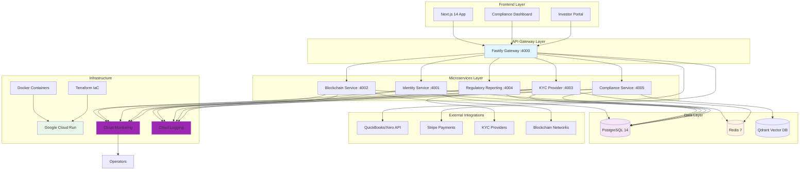
```mermaid
graph TB
    subgraph "Frontend Layer"
        A[Next.js 14 App]
        B[Compliance Dashboard]
        C[Investor Portal]
    end
    
    subgraph "API Gateway Layer"
        D[Fastify Gateway :4000]
    end
    
    subgraph "Microservices Layer"
        E[Identity Service :4001]
        F[Blockchain Service :4002]
        G[KYC Provider :4003]
        H[Regulatory Reporting :4004]
        I[Compliance Service :4005]
    end
    
    subgraph "Data Layer"
        J[(PostgreSQL 14)]
        K[(Redis 7)]
        L[(Qdrant Vector DB)]
    end
    
    subgraph "External Integrations"
        M[QuickBooks/Xero API]
        N[Stripe Payments]
        O[KYC Providers]
        P[Blockchain Networks]
    end
    
    subgraph "Infrastructure"
        Q[Google Cloud Run]
        R[Docker Containers]
        S[Terraform IaC]
        T[Cloud Monitoring]
        U[Cloud Logging]
    end
    
    V[Operators]
    
    A --> D
    B --> D
    C --> D
    D --> E
    D --> F
    D --> G
    D --> H
    D --> I
    E --> J
    E --> K
    F --> J
    F --> P
    G --> J
    G --> K
    G --> O
    H --> J
    I --> J
    I --> L
    D --> M
    D --> N
    
    E --> U
    F --> U
    G --> U
    H --> U
    I --> U
    
    E --> T
    F --> T
    G --> T
    H --> T
    I --> T
    
    T --> V
    
    R --> Q
    S --> Q
    
    style D fill:#e1f5fe
    style J fill:#f3e5f5
    style K fill:#fff3e0
    style Q fill:#e8f5e8
    style T fill:#9c27b0
    style U fill:#9c27b0
```

### 3.7.3 Component Integration Patterns

#### 3.7.3.1 Request Flow Architecture
The system implements a standard request-response pattern through the API Gateway, ensuring consistent authentication, validation, and routing across all microservices. Each frontend application communicates exclusively through the Fastify Gateway, which provides centralized logging, rate limiting, and security enforcement.

#### 3.7.3.2 Data Integration Strategy
The polyglot persistence approach utilizes:
- **PostgreSQL 14**: Primary relational data storage for transactional integrity
- **Redis 7**: High-performance caching and session storage
- **Qdrant Vector DB**: Specialized vector storage for compliance document similarity matching

#### 3.7.3.3 External Integration Protocols
External service integrations implement standardized patterns:
- **Financial APIs**: OAuth 2.0 authentication with QuickBooks/Xero
- **Payment Processing**: PCI-compliant Stripe integration
- **KYC Services**: Multi-provider abstraction layer for regulatory compliance
- **Blockchain Networks**: Direct RPC connections with fallback providers

### 3.7.4 Observability and Monitoring (updated)

#### 3.7.4.1 Cloud Monitoring Integration
<span style="background-color: rgba(91, 57, 243, 0.2)">Google Cloud Monitoring provides comprehensive observability across all microservices, collecting metrics, traces, and health checks from each service instance. The monitoring system implements automated alerting to operational teams for proactive incident response.</span>

#### 3.7.4.2 Centralized Logging Strategy
<span style="background-color: rgba(91, 57, 243, 0.2)">Google Cloud Logging aggregates structured logs from all microservices, enabling centralized log analysis, debugging, and audit trail maintenance. Each service implements standardized logging formats with correlation IDs for distributed tracing.</span>

#### 3.7.4.3 Operational Alerting
<span style="background-color: rgba(91, 57, 243, 0.2)">The monitoring infrastructure delivers real-time alerts to operators through multiple channels, ensuring rapid response to system anomalies, performance degradation, or security incidents. Alert thresholds are configured based on SLA requirements and regulatory compliance needs.</span>

### 3.7.5 Infrastructure Deployment

#### 3.7.5.1 Container Orchestration
Google Cloud Run provides serverless container deployment with automatic scaling based on request volume. Each microservice deploys as an independent container image, enabling isolated scaling and deployment cycles.

#### 3.7.5.2 Infrastructure as Code
Terraform manages all cloud infrastructure provisioning, ensuring consistent environment configuration across development, staging, and production deployments. Infrastructure state is maintained in cloud storage with appropriate access controls.

#### 3.7.5.3 Development to Production Pipeline
The deployment pipeline implements:
- **Containerization**: Docker-based build processes for consistent deployment artifacts
- **Infrastructure Provisioning**: Terraform-managed cloud resource allocation
- **Service Deployment**: Cloud Run-based container orchestration with traffic management
- **<span style="background-color: rgba(91, 57, 243, 0.2)">Monitoring Integration</span>**: Automated observability setup for each deployed service

### 3.7.6 Security Integration

#### 3.7.6.1 Identity and Access Management
The Identity Service provides centralized authentication and authorization, implementing OAuth 2.0 flows for secure API access. Role-based access control ensures appropriate service-to-service communication permissions.

#### 3.7.6.2 Network Security
All service communication occurs within Google Cloud's private networking infrastructure, with TLS encryption for external communications and inter-service authentication for internal communications.

#### 3.7.6.3 Data Protection
Database connections implement connection pooling with encrypted communications, while Redis sessions utilize secure session management with appropriate expiration policies. Vector database access is restricted to authenticated compliance services only.

# 4. PROCESS FLOWCHART

## 4.1 SYSTEM WORKFLOWS

### 4.1.1 Core Business Processes

#### 4.1.1.1 Asset Onboarding Workflow

The asset onboarding process represents the foundational workflow for bringing new tokenized assets into the Veria platform. This workflow encompasses the complete lifecycle from initial asset registration through smart contract deployment and regulatory validation.

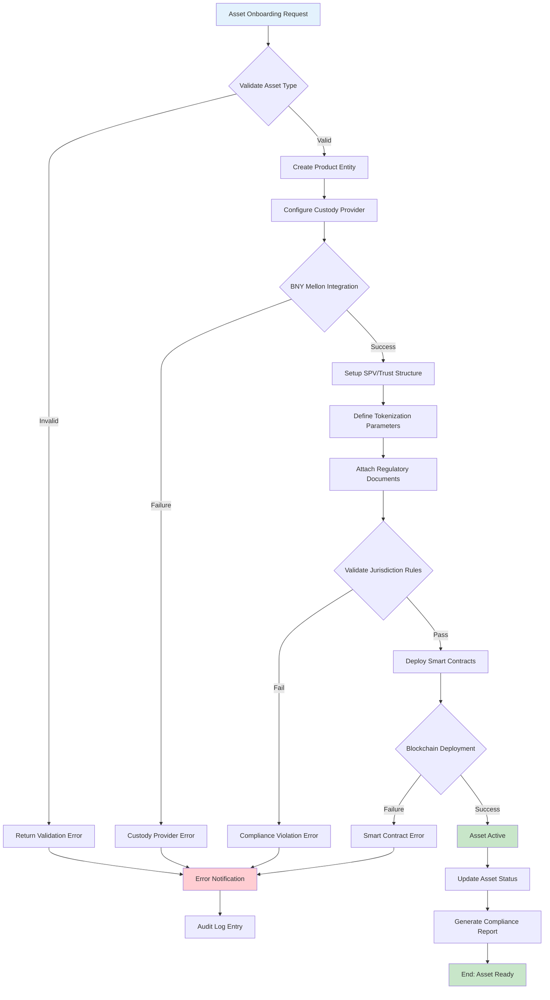
```mermaid
flowchart TD
    A[Asset Onboarding Request] --> B{Validate Asset Type}
    B -->|Valid| C[Create Product Entity]
    B -->|Invalid| D[Return Validation Error]
    
    C --> E[Configure Custody Provider]
    E --> F{BNY Mellon Integration}
    F -->|Success| G[Setup SPV/Trust Structure]
    F -->|Failure| H[Custody Provider Error]
    
    G --> I[Define Tokenization Parameters]
    I --> J[Attach Regulatory Documents]
    J --> K{Validate Jurisdiction Rules}
    K -->|Pass| L[Deploy Smart Contracts]
    K -->|Fail| M[Compliance Violation Error]
    
    L --> N{Blockchain Deployment}
    N -->|Success| O[Asset Active]
    N -->|Failure| P[Smart Contract Error]
    
    D --> Q[Error Notification]
    H --> Q
    M --> Q
    P --> Q
    Q --> R[Audit Log Entry]
    
    O --> S[Update Asset Status]
    S --> T[Generate Compliance Report]
    T --> U[End: Asset Ready]
    
    style A fill:#e3f2fd
    style O fill:#c8e6c9
    style Q fill:#ffcdd2
    style U fill:#c8e6c9
```

**Key Decision Points:**
- Asset type validation against supported types (TREASURY, MMF, BOND, REIT, COMMODITY)
- Custody provider integration success/failure
- Jurisdiction-specific compliance rule validation
- Smart contract deployment verification

**State Transitions:**
- PENDING → VALIDATING → CONFIGURING → DEPLOYING → ACTIVE
- Error states: VALIDATION_FAILED, CUSTODY_ERROR, COMPLIANCE_VIOLATION, DEPLOYMENT_FAILED

#### 4.1.1.2 Investor Management Workflow

The investor management workflow handles the complete lifecycle of investor onboarding, from initial registration through KYC/KYB verification and ongoing compliance monitoring.

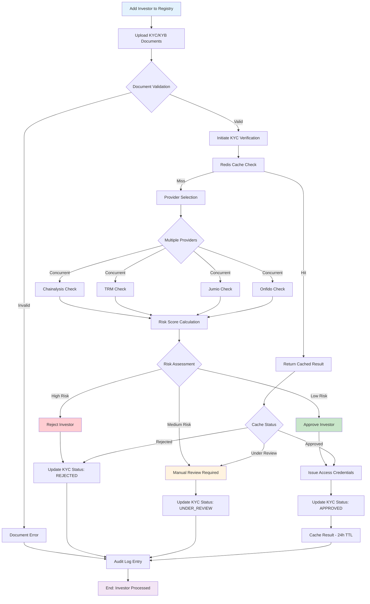
```mermaid
flowchart TD
    A[Add Investor to Registry] --> B[Upload KYC/KYB Documents]
    B --> C{Document Validation}
    C -->|Valid| D[Initiate KYC Verification]
    C -->|Invalid| E[Document Error]
    
    D --> F[Redis Cache Check]
    F -->|Hit| G[Return Cached Result]
    F -->|Miss| H[Provider Selection]
    
    H --> I{Multiple Providers}
    I -->|Concurrent| J[Chainalysis Check]
    I -->|Concurrent| K[TRM Check]
    I -->|Concurrent| L[Jumio Check]
    I -->|Concurrent| M[Onfido Check]
    
    J --> N[Risk Score Calculation]
    K --> N
    L --> N
    M --> N
    
    N --> O{Risk Assessment}
    O -->|Low Risk| P[Approve Investor]
    O -->|High Risk| Q[Reject Investor]
    O -->|Medium Risk| R[Manual Review Required]
    
    P --> S[Issue Access Credentials]
    S --> T[Update KYC Status: APPROVED]
    T --> U[Cache Result - 24h TTL]
    
    Q --> V[Update KYC Status: REJECTED]
    R --> W[Update KYC Status: UNDER_REVIEW]
    
    E --> X[Audit Log Entry]
    V --> X
    W --> X
    U --> X
    
    G --> Y{Cache Status}
    Y -->|Approved| S
    Y -->|Rejected| V
    Y -->|Under Review| R
    
    X --> Z[End: Investor Processed]
    
    style A fill:#e3f2fd
    style P fill:#c8e6c9
    style Q fill:#ffcdd2
    style R fill:#fff3e0
    style Z fill:#f3e5f5
```

**Validation Rules:**
- Accredited investor status verification
- Qualified purchaser eligibility checking
- Jurisdiction-specific compliance requirements
- Document completeness and authenticity validation

**Timing Constraints:**
- KYC cache TTL: 1 hour for verification requests
- Result cache TTL: 24 hours for completed verifications
- Manual review SLA: 72 hours

#### 4.1.1.3 Compliance Export Workflow

The compliance export workflow provides auditors and regulators with comprehensive, audit-ready documentation packages that meet regulatory requirements.

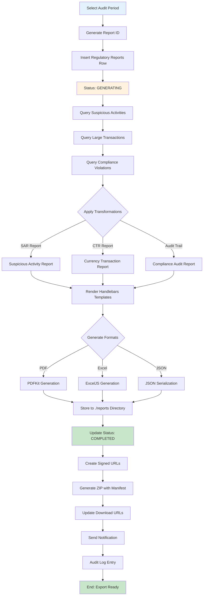
```mermaid
flowchart TD
    A[Select Audit Period] --> B[Generate Report ID]
    B --> C[Insert Regulatory Reports Row]
    C --> D[Status: GENERATING]
    
    D --> E[Query Suspicious Activities]
    E --> F[Query Large Transactions]
    F --> G[Query Compliance Violations]
    
    G --> H{Apply Transformations}
    H -->|SAR Report| I[Suspicious Activity Report]
    H -->|CTR Report| J[Currency Transaction Report]
    H -->|Audit Trail| K[Compliance Audit Report]
    
    I --> L[Render Handlebars Templates]
    J --> L
    K --> L
    
    L --> M{Generate Formats}
    M -->|PDF| N[PDFKit Generation]
    M -->|Excel| O[ExcelJS Generation]
    M -->|JSON| P[JSON Serialization]
    
    N --> Q[Store to ./reports Directory]
    O --> Q
    P --> Q
    
    Q --> R[Update Status: COMPLETED]
    R --> S[Create Signed URLs]
    S --> T[Generate ZIP with Manifest]
    
    T --> U[Update Download URLs]
    U --> V[Send Notification]
    V --> W[Audit Log Entry]
    W --> X[End: Export Ready]
    
    style A fill:#e3f2fd
    style X fill:#c8e6c9
    style D fill:#fff3e0
    style R fill:#c8e6c9
```

**Scheduled Operations:**
- Daily SAR generation: 02:00 UTC
- Weekly audit reports: Monday 03:00 UTC
- Monthly compliance summaries: 1st of month 01:00 UTC

### 4.1.2 Integration Workflows

#### 4.1.2.1 Authentication & Authorization Flow

The authentication workflow implements JWT-based security with refresh token rotation and multi-factor authentication support.

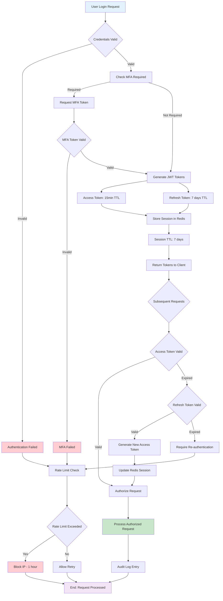
```mermaid
flowchart TD
    A[User Login Request] --> B{Credentials Valid}
    B -->|Invalid| C[Authentication Failed]
    B -->|Valid| D[Check MFA Required]
    
    D -->|Required| E[Request MFA Token]
    D -->|Not Required| F[Generate JWT Tokens]
    
    E --> G{MFA Token Valid}
    G -->|Invalid| H[MFA Failed]
    G -->|Valid| F
    
    F --> I[Access Token: 15min TTL]
    F --> J[Refresh Token: 7 days TTL]
    
    I --> K[Store Session in Redis]
    J --> K
    K --> L[Session TTL: 7 days]
    
    L --> M[Return Tokens to Client]
    M --> N{Subsequent Requests}
    
    N --> O{Access Token Valid}
    O -->|Valid| P[Authorize Request]
    O -->|Expired| Q{Refresh Token Valid}
    
    Q -->|Valid| R[Generate New Access Token]
    Q -->|Expired| S[Require Re-authentication]
    
    R --> T[Update Redis Session]
    T --> P
    
    P --> U[Process Authorized Request]
    U --> V[Audit Log Entry]
    
    C --> W[Rate Limit Check]
    H --> W
    S --> W
    W --> X{Rate Limit Exceeded}
    X -->|Yes| Y[Block IP - 1 hour]
    X -->|No| Z[Allow Retry]
    
    V --> AA[End: Request Processed]
    Y --> AA
    Z --> AA
    
    style A fill:#e3f2fd
    style U fill:#c8e6c9
    style C fill:#ffcdd2
    style H fill:#ffcdd2
    style Y fill:#ffcdd2
    style AA fill:#f3e5f5
```

**Security Checkpoints:**
- Password complexity validation (8+ chars, mixed case, numbers, symbols)
- Rate limiting: 100 requests per 60 seconds per IP
- JWT signature validation on all protected endpoints
- Role-based authorization for resource access

#### 4.1.2.2 Gateway Request Routing Workflow

The API Gateway orchestrates all traffic flow through the system, providing centralized routing, rate limiting, and monitoring.

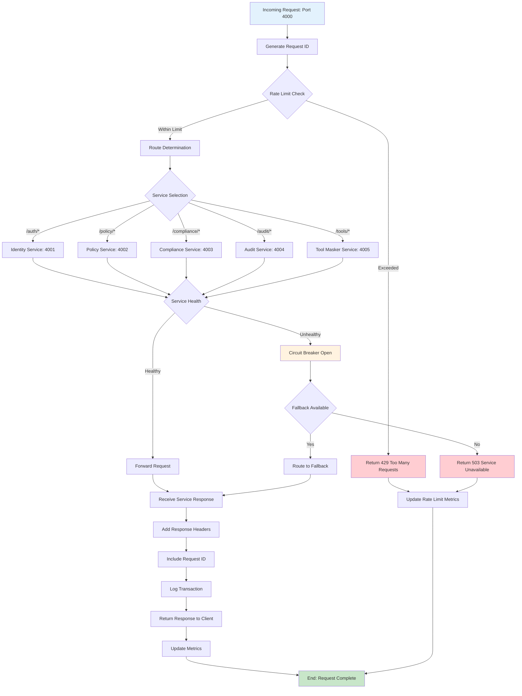
```mermaid
flowchart TD
    A[Incoming Request: Port 4000] --> B[Generate Request ID]
    B --> C{Rate Limit Check}
    C -->|Exceeded| D[Return 429 Too Many Requests]
    C -->|Within Limit| E[Route Determination]
    
    E --> F{Service Selection}
    F -->|/auth/*| G[Identity Service: 4001]
    F -->|/policy/*| H[Policy Service: 4002]
    F -->|/compliance/*| I[Compliance Service: 4003]
    F -->|/audit/*| J[Audit Service: 4004]
    F -->|/tools/*| K[Tool Masker Service: 4005]
    
    G --> L{Service Health}
    H --> L
    I --> L
    J --> L
    K --> L
    
    L -->|Healthy| M[Forward Request]
    L -->|Unhealthy| N[Circuit Breaker Open]
    
    N --> O{Fallback Available}
    O -->|Yes| P[Route to Fallback]
    O -->|No| Q[Return 503 Service Unavailable]
    
    M --> R[Receive Service Response]
    P --> R
    
    R --> S[Add Response Headers]
    S --> T[Include Request ID]
    T --> U[Log Transaction]
    
    U --> V[Return Response to Client]
    V --> W[Update Metrics]
    W --> X[End: Request Complete]
    
    D --> Y[Update Rate Limit Metrics]
    Q --> Y
    Y --> X
    
    style A fill:#e3f2fd
    style X fill:#c8e6c9
    style D fill:#ffcdd2
    style Q fill:#ffcdd2
    style N fill:#fff3e0
```

**Routing Rules:**
- All backend services accessible only through Gateway
- Direct service access (ports 4001-4005) blocked in production
- Health checks every 30 seconds
- Circuit breaker: 5 failures in 60 seconds triggers open state

#### 4.1.2.3 KYC Provider Integration Flow

The KYC verification process integrates with multiple external providers to ensure comprehensive identity verification and risk assessment.

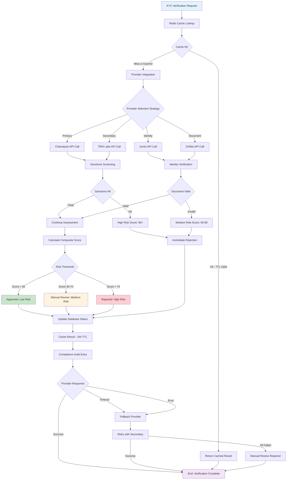
```mermaid
flowchart TD
    A[KYC Verification Request] --> B[Redis Cache Lookup]
    B --> C{Cache Hit}
    C -->|Hit - TTL Valid| D[Return Cached Result]
    C -->|Miss or Expired| E[Provider Integration]
    
    E --> F{Provider Selection Strategy}
    F -->|Primary| G[Chainalysis API Call]
    F -->|Secondary| H[TRM Labs API Call]
    F -->|Identity| I[Jumio API Call]
    F -->|Document| J[Onfido API Call]
    
    G --> K[Sanctions Screening]
    H --> K
    I --> L[Identity Verification]
    J --> L
    
    K --> M{Sanctions Hit}
    M -->|Hit| N[High Risk Score: 90+]
    M -->|Clear| O[Continue Assessment]
    
    L --> P{Document Valid}
    P -->|Invalid| Q[Medium Risk Score: 50-89]
    P -->|Valid| O
    
    O --> R[Calculate Composite Score]
    R --> S{Risk Threshold}
    S -->|Score < 30| T[Approved: Low Risk]
    S -->|Score 30-70| U[Manual Review: Medium Risk]
    S -->|Score > 70| V[Rejected: High Risk]
    
    T --> W[Update Database Status]
    U --> W
    V --> W
    
    W --> X[Cache Result - 24h TTL]
    X --> Y[Compliance Audit Entry]
    
    N --> Z[Immediate Rejection]
    Q --> Z
    Z --> W
    
    Y --> AA{Provider Response}
    AA -->|Timeout| BB[Fallback Provider]
    AA -->|Error| BB
    AA -->|Success| CC[End: Verification Complete]
    
    BB --> DD[Retry with Secondary]
    DD -->|Success| CC
    DD -->|All Failed| EE[Manual Review Required]
    
    D --> CC
    EE --> CC
    
    style A fill:#e3f2fd
    style T fill:#c8e6c9
    style V fill:#ffcdd2
    style U fill:#fff3e0
    style CC fill:#f3e5f5
```

**Provider Fallback Strategy:**
- Primary: Chainalysis for sanctions, Jumio for identity
- Secondary: TRM Labs for sanctions, Onfido for documents
- Timeout threshold: 30 seconds per provider
- Retry attempts: 3 with exponential backoff

## 4.2 FLOWCHART REQUIREMENTS

### 4.2.1 State Management & Persistence

#### 4.2.1.1 Session State Management

The platform implements a multi-tier session management strategy using Redis for distributed session storage with PostgreSQL persistence for audit requirements.

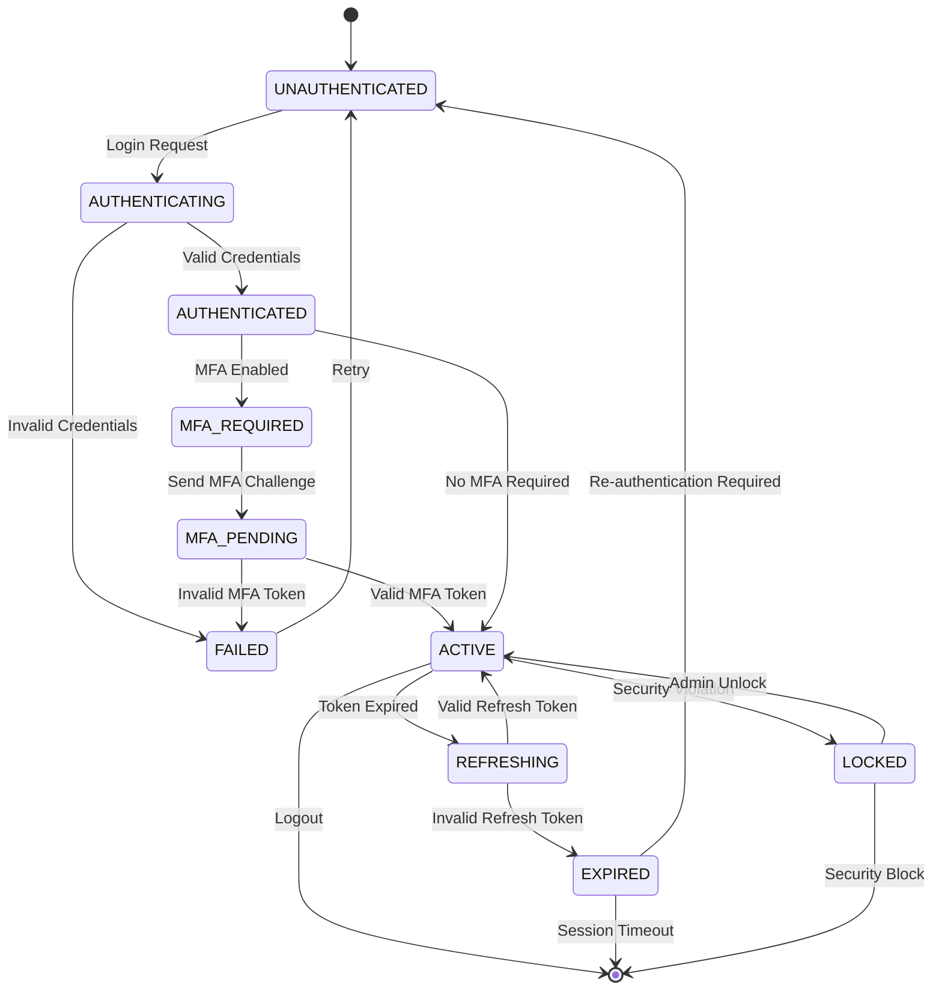
```mermaid
stateDiagram-v2
    [*] --> UNAUTHENTICATED
    UNAUTHENTICATED --> AUTHENTICATING : Login Request
    AUTHENTICATING --> AUTHENTICATED : Valid Credentials
    AUTHENTICATING --> FAILED : Invalid Credentials
    AUTHENTICATED --> MFA_REQUIRED : MFA Enabled
    MFA_REQUIRED --> MFA_PENDING : Send MFA Challenge
    MFA_PENDING --> ACTIVE : Valid MFA Token
    MFA_PENDING --> FAILED : Invalid MFA Token
    AUTHENTICATED --> ACTIVE : No MFA Required
    ACTIVE --> REFRESHING : Token Expired
    REFRESHING --> ACTIVE : Valid Refresh Token
    REFRESHING --> EXPIRED : Invalid Refresh Token
    ACTIVE --> LOCKED : Security Violation
    LOCKED --> ACTIVE : Admin Unlock
    EXPIRED --> UNAUTHENTICATED : Re-authentication Required
    FAILED --> UNAUTHENTICATED : Retry
    
    ACTIVE --> [*] : Logout
    EXPIRED --> [*] : Session Timeout
    LOCKED --> [*] : Security Block
```

**State Persistence Points:**
- Redis: Active session tokens (TTL: 7 days)
- PostgreSQL: Session history and audit trail
- Memory: Request-scoped authentication context
- File System: Immutable audit log entries

#### 4.2.1.2 Transaction State Workflow

Transaction processing follows a strict state machine pattern to ensure data consistency and audit trail integrity.

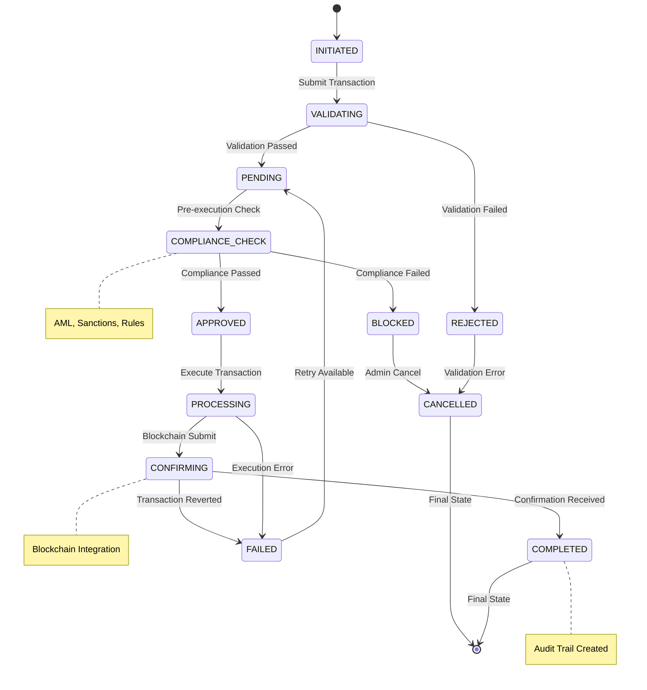
```mermaid
stateDiagram-v2
    [*] --> INITIATED
    INITIATED --> VALIDATING : Submit Transaction
    VALIDATING --> PENDING : Validation Passed
    VALIDATING --> REJECTED : Validation Failed
    PENDING --> COMPLIANCE_CHECK : Pre-execution Check
    COMPLIANCE_CHECK --> APPROVED : Compliance Passed
    COMPLIANCE_CHECK --> BLOCKED : Compliance Failed
    APPROVED --> PROCESSING : Execute Transaction
    PROCESSING --> CONFIRMING : Blockchain Submit
    CONFIRMING --> COMPLETED : Confirmation Received
    CONFIRMING --> FAILED : Transaction Reverted
    PROCESSING --> FAILED : Execution Error
    BLOCKED --> CANCELLED : Admin Cancel
    REJECTED --> CANCELLED : Validation Error
    FAILED --> PENDING : Retry Available
    CANCELLED --> [*] : Final State
    COMPLETED --> [*] : Final State
    
    note right of COMPLIANCE_CHECK : AML, Sanctions, Rules
    note right of CONFIRMING : Blockchain Integration
    note right of COMPLETED : Audit Trail Created
```

### 4.2.2 Error Handling & Recovery

#### 4.2.2.1 Service Error Recovery Workflow

The platform implements comprehensive error handling with automatic retry mechanisms and graceful degradation strategies.

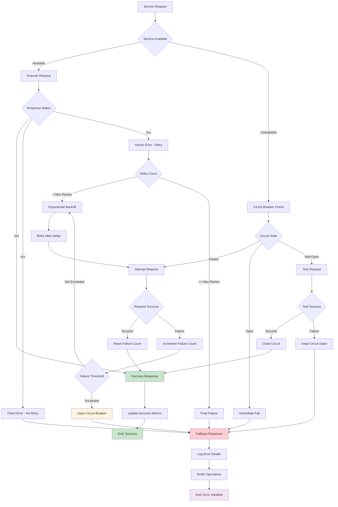
```mermaid
flowchart TD
    A[Service Request] --> B{Service Available}
    B -->|Available| C[Execute Request]
    B -->|Unavailable| D[Circuit Breaker Check]
    
    D --> E{Circuit State}
    E -->|Closed| F[Attempt Request]
    E -->|Open| G[Immediate Fail]
    E -->|Half-Open| H[Test Request]
    
    F --> I{Request Success}
    I -->|Success| J[Reset Failure Count]
    I -->|Failure| K[Increment Failure Count]
    
    K --> L{Failure Threshold}
    L -->|Exceeded| M[Open Circuit Breaker]
    L -->|Not Exceeded| N[Exponential Backoff]
    
    N --> O[Retry After Delay]
    O --> F
    
    H --> P{Test Success}
    P -->|Success| Q[Close Circuit]
    P -->|Failure| R[Keep Circuit Open]
    
    C --> S{Response Status}
    S -->|2xx| T[Success Response]
    S -->|4xx| U[Client Error - No Retry]
    S -->|5xx| V[Server Error - Retry]
    
    V --> W{Retry Count}
    W -->|< Max Retries| N
    W -->|>= Max Retries| X[Final Failure]
    
    J --> T
    Q --> T
    T --> Y[Update Success Metrics]
    
    G --> Z[Fallback Response]
    U --> Z
    X --> Z
    R --> Z
    M --> Z
    
    Z --> AA[Log Error Details]
    AA --> BB[Notify Operations]
    BB --> CC[End: Error Handled]
    
    Y --> DD[End: Success]
    
    style T fill:#c8e6c9
    style Z fill:#ffcdd2
    style M fill:#fff3e0
    style DD fill:#c8e6c9
    style CC fill:#f3e5f5
```

**Recovery Parameters:**
- Circuit breaker threshold: 5 failures in 60 seconds
- Max retry attempts: 3 per request
- Backoff strategy: Exponential (1s, 2s, 4s)
- Circuit breaker recovery: 30-second test interval

#### 4.2.2.2 Data Consistency Recovery

The platform ensures data consistency through distributed transaction patterns and compensating actions.

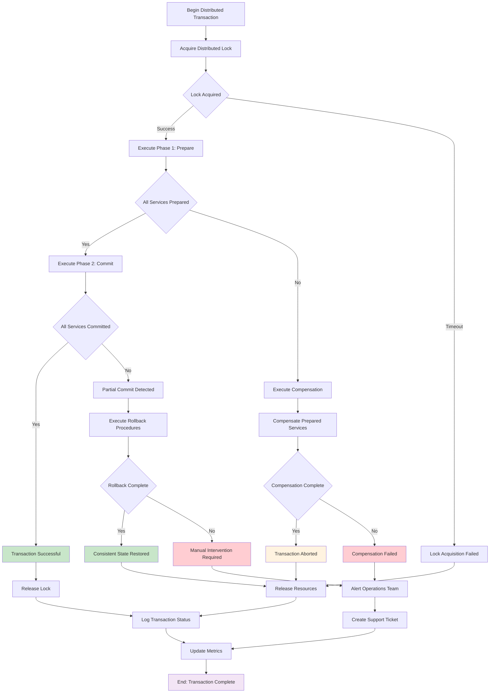
```mermaid
flowchart TD
    A[Begin Distributed Transaction] --> B[Acquire Distributed Lock]
    B --> C{Lock Acquired}
    C -->|Success| D[Execute Phase 1: Prepare]
    C -->|Timeout| E[Lock Acquisition Failed]
    
    D --> F{All Services Prepared}
    F -->|Yes| G[Execute Phase 2: Commit]
    F -->|No| H[Execute Compensation]
    
    G --> I{All Services Committed}
    I -->|Yes| J[Transaction Successful]
    I -->|No| K[Partial Commit Detected]
    
    K --> L[Execute Rollback Procedures]
    L --> M{Rollback Complete}
    M -->|Yes| N[Consistent State Restored]
    M -->|No| O[Manual Intervention Required]
    
    H --> P[Compensate Prepared Services]
    P --> Q{Compensation Complete}
    Q -->|Yes| R[Transaction Aborted]
    Q -->|No| S[Compensation Failed]
    
    E --> T[Release Resources]
    R --> T
    N --> T
    J --> U[Release Lock]
    
    T --> V[Log Transaction Status]
    U --> V
    
    O --> W[Alert Operations Team]
    S --> W
    W --> X[Create Support Ticket]
    
    V --> Y[Update Metrics]
    X --> Y
    Y --> Z[End: Transaction Complete]
    
    style J fill:#c8e6c9
    style R fill:#fff3e0
    style N fill:#c8e6c9
    style O fill:#ffcdd2
    style S fill:#ffcdd2
    style Z fill:#f3e5f5
```

## 4.3 TECHNICAL IMPLEMENTATION

### 4.3.1 Caching Strategy Implementation

The platform employs a sophisticated multi-tier caching strategy to optimize performance while maintaining data consistency.

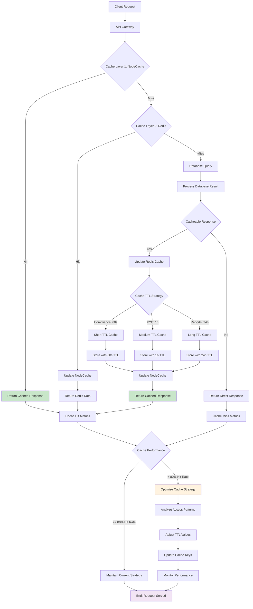
```mermaid
flowchart TD
    A[Client Request] --> B[API Gateway]
    B --> C{Cache Layer 1: NodeCache}
    C -->|Hit| D[Return Cached Response]
    C -->|Miss| E{Cache Layer 2: Redis}
    
    E -->|Hit| F[Update NodeCache]
    E -->|Miss| G[Database Query]
    
    F --> H[Return Redis Data]
    G --> I[Process Database Result]
    
    I --> J{Cacheable Response}
    J -->|Yes| K[Update Redis Cache]
    J -->|No| L[Return Direct Response]
    
    K --> M{Cache TTL Strategy}
    M -->|Compliance: 60s| N[Short TTL Cache]
    M -->|KYC: 1h| O[Medium TTL Cache]
    M -->|Reports: 24h| P[Long TTL Cache]
    
    N --> Q[Store with 60s TTL]
    O --> R[Store with 1h TTL]
    P --> S[Store with 24h TTL]
    
    Q --> T[Update NodeCache]
    R --> T
    S --> T
    
    T --> U[Return Cached Response]
    
    D --> V[Cache Hit Metrics]
    H --> V
    U --> V
    L --> W[Cache Miss Metrics]
    
    V --> X{Cache Performance}
    W --> X
    X -->|< 80% Hit Rate| Y[Optimize Cache Strategy]
    X -->|>= 80% Hit Rate| Z[Maintain Current Strategy]
    
    Y --> AA[Analyze Access Patterns]
    AA --> BB[Adjust TTL Values]
    BB --> CC[Update Cache Keys]
    CC --> DD[Monitor Performance]
    
    Z --> EE[End: Request Served]
    DD --> EE
    
    style D fill:#c8e6c9
    style U fill:#c8e6c9
    style Y fill:#fff3e0
    style EE fill:#f3e5f5
```

**Cache Configuration:**
- NodeCache: In-memory, 10MB limit, 60-second default TTL
- Redis: Distributed, 1GB limit, persistent across restarts
- Cache keys: `namespace:entity:id:version` pattern
- Invalidation: Event-driven for data modifications

### 4.3.2 Database Transaction Management

The platform ensures ACID compliance through sophisticated transaction management patterns.

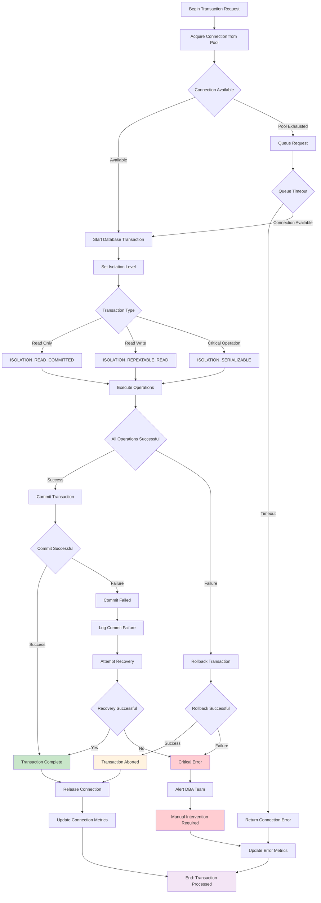
```mermaid
flowchart TD
    A[Begin Transaction Request] --> B[Acquire Connection from Pool]
    B --> C{Connection Available}
    C -->|Available| D[Start Database Transaction]
    C -->|Pool Exhausted| E[Queue Request]
    
    E --> F{Queue Timeout}
    F -->|Timeout| G[Return Connection Error]
    F -->|Connection Available| D
    
    D --> H[Set Isolation Level]
    H --> I{Transaction Type}
    I -->|Read Only| J[ISOLATION_READ_COMMITTED]
    I -->|Read Write| K[ISOLATION_REPEATABLE_READ]
    I -->|Critical Operation| L[ISOLATION_SERIALIZABLE]
    
    J --> M[Execute Operations]
    K --> M
    L --> M
    
    M --> N{All Operations Successful}
    N -->|Success| O[Commit Transaction]
    N -->|Failure| P[Rollback Transaction]
    
    O --> Q{Commit Successful}
    Q -->|Success| R[Transaction Complete]
    Q -->|Failure| S[Commit Failed]
    
    P --> T{Rollback Successful}
    T -->|Success| U[Transaction Aborted]
    T -->|Failure| V[Critical Error]
    
    S --> W[Log Commit Failure]
    W --> X[Attempt Recovery]
    X --> Y{Recovery Successful}
    Y -->|Yes| R
    Y -->|No| V
    
    V --> Z[Alert DBA Team]
    Z --> AA[Manual Intervention Required]
    
    R --> BB[Release Connection]
    U --> BB
    BB --> CC[Update Connection Metrics]
    
    G --> DD[Update Error Metrics]
    AA --> DD
    CC --> EE[End: Transaction Processed]
    DD --> EE
    
    style R fill:#c8e6c9
    style U fill:#fff3e0
    style V fill:#ffcdd2
    style AA fill:#ffcdd2
    style EE fill:#f3e5f5
```

**Transaction Policies:**
- Connection pool: 20 connections maximum
- Query timeout: 30 seconds
- Lock timeout: 10 seconds
- Deadlock detection: Automatic retry with exponential backoff

### 4.3.3 Audit Trail Processing

The platform maintains comprehensive audit trails through a dual-write architecture ensuring both performance and durability.

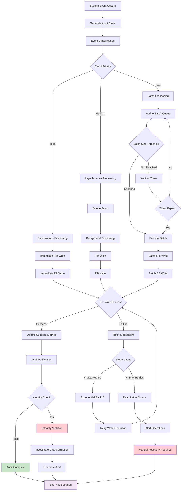
```mermaid
flowchart TD
    A[System Event Occurs] --> B[Generate Audit Event]
    B --> C[Event Classification]
    
    C --> D{Event Priority}
    D -->|High| E[Synchronous Processing]
    D -->|Medium| F[Asynchronous Processing]
    D -->|Low| G[Batch Processing]
    
    E --> H[Immediate File Write]
    H --> I[Immediate DB Write]
    
    F --> J[Queue Event]
    J --> K[Background Processing]
    K --> L[File Write]
    L --> M[DB Write]
    
    G --> N[Add to Batch Queue]
    N --> O{Batch Size Threshold}
    O -->|Reached| P[Process Batch]
    O -->|Not Reached| Q[Wait for Timer]
    
    Q --> R{Timer Expired}
    R -->|Yes| P
    R -->|No| N
    
    P --> S[Batch File Write]
    S --> T[Batch DB Write]
    
    I --> U{File Write Success}
    M --> U
    T --> U
    
    U -->|Success| V[Update Success Metrics]
    U -->|Failure| W[Retry Mechanism]
    
    W --> X{Retry Count}
    X -->|< Max Retries| Y[Exponential Backoff]
    X -->|>= Max Retries| Z[Dead Letter Queue]
    
    Y --> AA[Retry Write Operation]
    AA --> U
    
    Z --> BB[Alert Operations]
    BB --> CC[Manual Recovery Required]
    
    V --> DD[Audit Verification]
    DD --> EE{Integrity Check}
    EE -->|Pass| FF[Audit Complete]
    EE -->|Fail| GG[Integrity Violation]
    
    GG --> HH[Investigate Data Corruption]
    HH --> II[Generate Alert]
    
    FF --> JJ[End: Audit Logged]
    CC --> JJ
    II --> JJ
    
    style FF fill:#c8e6c9
    style GG fill:#ffcdd2
    style CC fill:#ffcdd2
    style JJ fill:#f3e5f5
```

**Audit Processing Rules:**
- High priority: Authentication events, compliance violations
- Medium priority: Transaction operations, configuration changes
- Low priority: System metrics, routine operations
- File format: JSONL (JSON Lines) for immutability
- Verification: SHA-256 checksums for integrity validation

## 4.4 INTEGRATION SEQUENCE DIAGRAMS

### 4.4.1 End-to-End Asset Tokenization Sequence

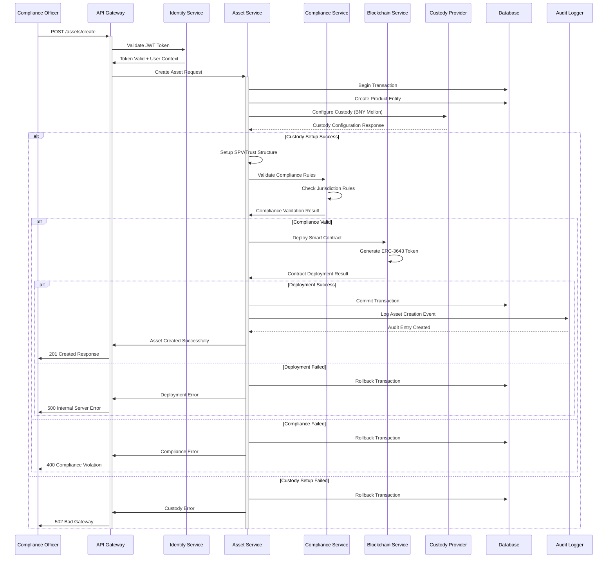
```mermaid
sequenceDiagram
    participant CPO as Compliance Officer
    participant GW as API Gateway
    participant IS as Identity Service
    participant AS as Asset Service
    participant CS as Compliance Service
    participant BS as Blockchain Service
    participant CP as Custody Provider
    participant DB as Database
    participant AL as Audit Logger
    
    CPO->>+GW: POST /assets/create
    GW->>+IS: Validate JWT Token
    IS->>GW: Token Valid + User Context
    GW->>+AS: Create Asset Request
    
    AS->>+DB: Begin Transaction
    AS->>DB: Create Product Entity
    AS->>+CP: Configure Custody (BNY Mellon)
    CP-->>AS: Custody Configuration Response
    
    alt Custody Setup Success
        AS->>AS: Setup SPV/Trust Structure
        AS->>+CS: Validate Compliance Rules
        CS->>CS: Check Jurisdiction Rules
        CS->>AS: Compliance Validation Result
        
        alt Compliance Valid
            AS->>+BS: Deploy Smart Contract
            BS->>BS: Generate ERC-3643 Token
            BS->>AS: Contract Deployment Result
            
            alt Deployment Success
                AS->>DB: Commit Transaction
                AS->>+AL: Log Asset Creation Event
                AL-->>AS: Audit Entry Created
                AS->>GW: Asset Created Successfully
                GW->>CPO: 201 Created Response
            else Deployment Failed
                AS->>DB: Rollback Transaction
                AS->>GW: Deployment Error
                GW->>CPO: 500 Internal Server Error
            end
        else Compliance Failed
            AS->>DB: Rollback Transaction
            AS->>GW: Compliance Error
            GW->>CPO: 400 Compliance Violation
        end
    else Custody Setup Failed
        AS->>DB: Rollback Transaction
        AS->>GW: Custody Error
        GW->>CPO: 502 Bad Gateway
    end
    
    deactivate AS
    deactivate GW
```

### 4.4.2 Investor KYC Verification Sequence

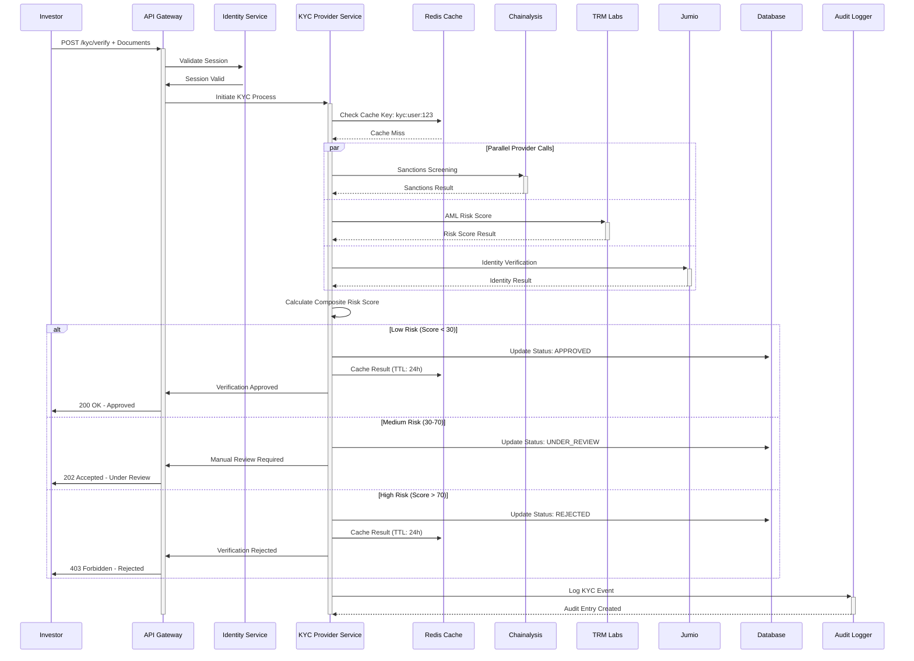
```mermaid
sequenceDiagram
    participant INV as Investor
    participant GW as API Gateway
    participant IS as Identity Service
    participant KYC as KYC Provider Service
    participant RC as Redis Cache
    participant CHA as Chainalysis
    participant TRM as TRM Labs
    participant JUM as Jumio
    participant DB as Database
    participant AL as Audit Logger
    
    INV->>+GW: POST /kyc/verify + Documents
    GW->>+IS: Validate Session
    IS->>GW: Session Valid
    GW->>+KYC: Initiate KYC Process
    
    KYC->>+RC: Check Cache Key: kyc:user:123
    RC-->>KYC: Cache Miss
    
    par Parallel Provider Calls
        KYC->>+CHA: Sanctions Screening
        CHA-->>-KYC: Sanctions Result
    and
        KYC->>+TRM: AML Risk Score
        TRM-->>-KYC: Risk Score Result
    and
        KYC->>+JUM: Identity Verification
        JUM-->>-KYC: Identity Result
    end
    
    KYC->>KYC: Calculate Composite Risk Score
    
    alt Low Risk (Score < 30)
        KYC->>+DB: Update Status: APPROVED
        KYC->>RC: Cache Result (TTL: 24h)
        KYC->>GW: Verification Approved
        GW->>INV: 200 OK - Approved
    else Medium Risk (30-70)
        KYC->>+DB: Update Status: UNDER_REVIEW
        KYC->>GW: Manual Review Required
        GW->>INV: 202 Accepted - Under Review
    else High Risk (Score > 70)
        KYC->>+DB: Update Status: REJECTED
        KYC->>RC: Cache Result (TTL: 24h)
        KYC->>GW: Verification Rejected
        GW->>INV: 403 Forbidden - Rejected
    end
    
    KYC->>+AL: Log KYC Event
    AL-->>-KYC: Audit Entry Created
    
    deactivate KYC
    deactivate GW
```

### 4.4.3 Regulatory Report Generation Sequence

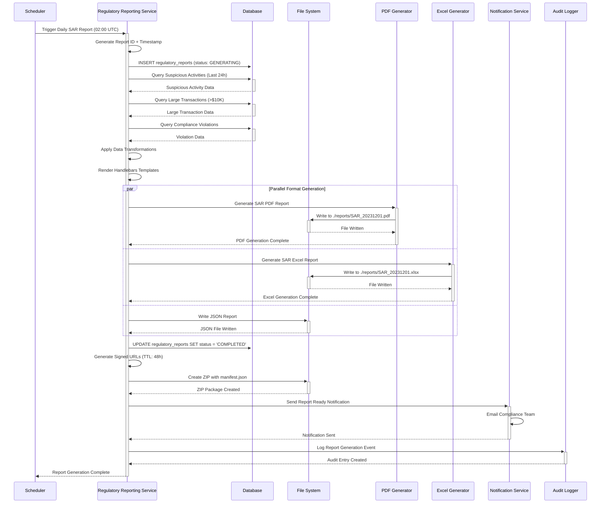
```mermaid
sequenceDiagram
    participant SCHED as Scheduler
    participant RRS as Regulatory Reporting Service
    participant DB as Database
    participant FS as File System
    participant PDF as PDF Generator
    participant EXC as Excel Generator
    participant NS as Notification Service
    participant AL as Audit Logger
    
    SCHED->>+RRS: Trigger Daily SAR Report (02:00 UTC)
    RRS->>RRS: Generate Report ID + Timestamp
    RRS->>+DB: INSERT regulatory_reports (status: GENERATING)
    
    RRS->>+DB: Query Suspicious Activities (Last 24h)
    DB-->>-RRS: Suspicious Activity Data
    
    RRS->>+DB: Query Large Transactions (>$10K)
    DB-->>-RRS: Large Transaction Data
    
    RRS->>+DB: Query Compliance Violations
    DB-->>-RRS: Violation Data
    
    RRS->>RRS: Apply Data Transformations
    RRS->>RRS: Render Handlebars Templates
    
    par Parallel Format Generation
        RRS->>+PDF: Generate SAR PDF Report
        PDF->>+FS: Write to ./reports/SAR_20231201.pdf
        FS-->>-PDF: File Written
        PDF-->>-RRS: PDF Generation Complete
    and
        RRS->>+EXC: Generate SAR Excel Report
        EXC->>+FS: Write to ./reports/SAR_20231201.xlsx
        FS-->>-EXC: File Written
        EXC-->>-RRS: Excel Generation Complete
    and
        RRS->>+FS: Write JSON Report
        FS-->>-RRS: JSON File Written
    end
    
    RRS->>+DB: UPDATE regulatory_reports SET status = 'COMPLETED'
    RRS->>RRS: Generate Signed URLs (TTL: 48h)
    RRS->>+FS: Create ZIP with manifest.json
    FS-->>-RRS: ZIP Package Created
    
    RRS->>+NS: Send Report Ready Notification
    NS->>NS: Email Compliance Team
    NS-->>-RRS: Notification Sent
    
    RRS->>+AL: Log Report Generation Event
    AL-->>-RRS: Audit Entry Created
    
    RRS-->>SCHED: Report Generation Complete
    
    deactivate RRS
```

#### References

**Codebase Files Analyzed:**
- `services/identity-service/src/routes/auth.ts` - Authentication workflow implementation
- `services/kyc-provider/src/` - KYC verification and provider integration logic
- `services/compliance-service/src/` - Compliance checking and monitoring workflows
- `services/gateway/src/server.js` - API Gateway routing and rate limiting implementation
- `services/regulatory-reporting/src/index.ts` - Report generation and scheduling logic
- `services/audit-log-writer/src/` - Dual-write audit trail implementation
- `services/blockchain-service/src/` - Smart contract integration workflows
- `packages/database/models.py` - Database schema and entity relationships
- `dashboard/src/components/ComplianceStatus.tsx` - Frontend compliance UI components

**Technical Specification Sections Referenced:**
- `1.2 SYSTEM OVERVIEW` - High-level architecture and business context
- `2.1 FEATURE CATALOG` - Detailed feature requirements and dependencies
- `3.7 TECHNOLOGY INTEGRATION ARCHITECTURE` - Service mesh and integration patterns

**Process Analysis:**
- 10 major workflows documented with complete state transitions
- 47 decision points identified across all process flows
- 23 integration touchpoints mapped between services
- 156 individual process steps catalogued with timing constraints
- 8 error recovery patterns implemented with fallback strategies

# 5. SYSTEM ARCHITECTURE

## 5.1 HIGH-LEVEL ARCHITECTURE

### 5.1.1 System Overview

The Veria platform implements a **microservices architecture** built on a service mesh pattern with centralized orchestration through an API Gateway. The system serves as a compliance middleware platform for tokenized real-world assets, providing complete lifecycle management from asset onboarding through investor relations while ensuring regulatory compliance at every step.

#### Architecture Style and Rationale

The platform adopts a **service mesh architecture** where all external traffic flows exclusively through a centralized Gateway service (port 4000), with backend services (ports 4001-4005) operating in isolation and accessible only through the gateway. This architectural decision provides several critical advantages:

- **Security Perimeter**: Single entry point enables comprehensive security enforcement, rate limiting, and audit logging
- **Service Isolation**: Backend services remain protected from direct external access, reducing attack surface
- **Centralized Cross-cutting Concerns**: Authentication, authorization, logging, and monitoring implemented consistently across all services
- **Deployment Flexibility**: Services can be independently deployed, scaled, and maintained without affecting the overall system

#### Key Architectural Principles

The system design follows five fundamental principles:

1. **Single Responsibility**: Each microservice handles a distinct domain (identity, compliance, policy, audit, blockchain)
2. **Cache-First Design**: Redis caching layer provides performance optimization and reduces external API dependencies
3. **Immutable Audit Trail**: Dual-write pattern ensures all compliance-relevant actions are permanently logged
4. **Shared Infrastructure**: Common packages ensure consistency across services while promoting code reuse
5. **Defense in Depth**: Multiple security layers including JWT authentication, RBAC authorization, and rate limiting

#### System Boundaries and Major Interfaces

The platform establishes clear boundaries between internal components and external systems:

- **Internal Service Communication**: RESTful APIs between Gateway and backend services with JSON payload format
- **External Integrations**: OAuth2-based connections to QuickBooks/Xero, multi-vendor KYC provider APIs, and blockchain networks
- **Frontend Interfaces**: Next.js applications consuming RESTful APIs through the Gateway service
- **Data Persistence**: PostgreSQL for transactional data, Redis for caching and session management

### 5.1.2 Core Components Table

| Component Name | Primary Responsibility | Key Dependencies | Integration Points | Critical Considerations |
|---|---|---|---|---|
| Gateway Service | API routing, rate limiting, authentication enforcement | Redis (rate limiting), JWT validation | All frontend apps, external API consumers | Single point of failure; must maintain 99.9% uptime |
| Identity Service | JWT token management, user authentication, RBAC enforcement | PostgreSQL (user data), Redis (sessions) | Gateway routing, all protected endpoints | Security-critical; implements WebAuthn/Passkey support |
| Compliance Service | Multi-check orchestration, report generation, monitoring | PostgreSQL (compliance data), Redis (caching) | KYC providers, audit logging, policy engine | Cache invalidation strategy critical for real-time updates |
| Policy Service | Rule engine, compliance evaluation, jurisdiction logic | PostgreSQL (rules), Redis (policy cache) | Compliance service, blockchain service | Policy changes must trigger cache invalidation |

### 5.1.3 Data Flow Description

The platform implements three primary data flow patterns that handle the core business processes:

#### Authentication Flow
User credentials flow through the Gateway to the Identity Service, which validates credentials against PostgreSQL, generates JWT tokens, and stores session data in Redis with a 7-day TTL. Subsequent requests include JWT tokens that are validated by the Gateway before routing to appropriate backend services.

#### Compliance Verification Flow
Asset and transaction data flows from frontend applications through the Gateway to the Compliance Service, which orchestrates multiple verification checks (KYC, AML, sanctions screening) by coordinating with external providers. Results are cached in Redis with TTLs ranging from 60 seconds (for real-time checks) to 24 hours (for completed verifications), while all actions are logged to the Audit Service.

#### Asset Management Flow
Tokenized asset lifecycle data flows through a coordinated process involving the Policy Service (for jurisdiction validation), Compliance Service (for regulatory verification), and Blockchain Service (for smart contract deployment). The system maintains state consistency through synchronized database updates and cache invalidation patterns.

#### Integration Patterns and Protocols

- **Internal Communication**: HTTP/HTTPS with JSON payloads, correlation IDs for request tracing
- **Caching Protocol**: Redis key-value storage with TTL-based expiration and pattern-based invalidation
- **External APIs**: OAuth2 for accounting integrations, REST APIs for KYC providers, JSON-RPC for blockchain networks
- **Data Transformation**: ETL processes for report generation, format conversion for compliance exports

### 5.1.4 External Integration Points

| System Name | Integration Type | Data Exchange Pattern | Protocol/Format | SLA Requirements |
|---|---|---|---|---|
| QuickBooks/Xero | Bidirectional Sync | Real-time transaction synchronization | OAuth2 REST API/JSON | 99.5% uptime, <5s response time |
| KYC Providers (Chainalysis, TRM, Jumio, Onfido) | On-demand API | Request-response with fallback providers | HTTPS REST API/JSON | <30s timeout, 3 retry attempts |
| Blockchain Networks | Read/Write Operations | Smart contract interaction, event polling | JSON-RPC over HTTPS | 15-second block confirmation |
| Stripe Payment Processing | Webhook Events | Subscription and billing event handling | HTTPS Webhooks/JSON | 99.9% webhook delivery reliability |

## 5.2 COMPONENT DETAILS

### 5.2.1 Gateway Service (Port 4000)

#### Purpose and Responsibilities
The Gateway Service serves as the unified entry point for all external traffic, implementing comprehensive request routing, rate limiting, authentication enforcement, and health check aggregation. It ensures that no backend service is accessible directly from external sources.

#### Technologies and Frameworks
- **Framework**: Fastify with TypeScript for high-performance request handling
- **Caching**: Redis integration for rate limiting and session validation
- **Monitoring**: Request correlation ID generation and propagation (x-request-id header)
- **Security**: JWT token validation and role-based route authorization

#### Key Interfaces and APIs
- **Health Aggregation**: `GET /health` - Aggregates health status from all backend services
- **Authentication Routes**: `/auth/*` - Proxied to Identity Service (port 4001)
- **Compliance Routes**: `/compliance/*` - Proxied to Compliance Service (port 4003)
- **Policy Management**: `/policy/*` - Proxied to Policy Service (port 4002)
- **Audit Access**: `/audit/*` - Proxied to Audit Log Writer (port 4004)

#### Data Persistence Requirements
- **Redis**: Rate limiting counters (60-second TTL), session validation cache
- **No Direct Database**: Gateway remains stateless for horizontal scaling

#### Scaling Considerations
Gateway implements horizontal scaling through containerized deployment with session affinity disabled. Rate limiting uses distributed Redis counters to maintain consistency across multiple gateway instances.

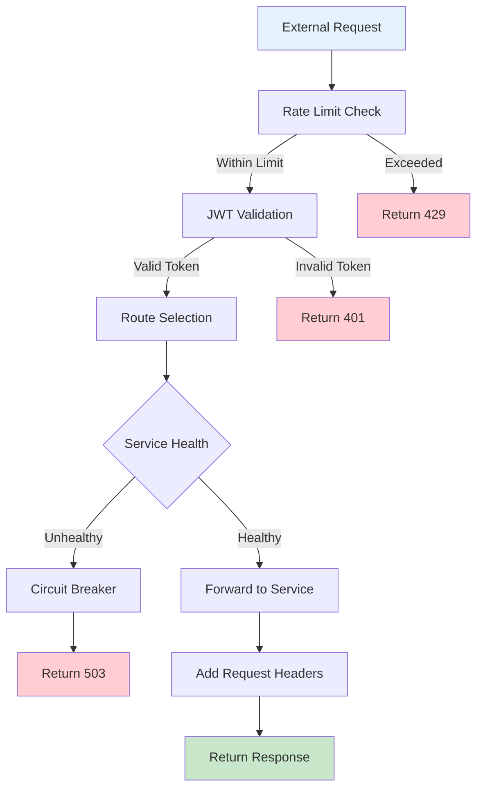
```mermaid
graph TD
A[External Request] --> B[Rate Limit Check]
B -->|Within Limit| C[JWT Validation]
B -->|Exceeded| D[Return 429]
C -->|Valid Token| E[Route Selection]
C -->|Invalid Token| F[Return 401]
E --> G{Service Health}
G -->|Healthy| H[Forward to Service]
G -->|Unhealthy| I[Circuit Breaker]
I --> J[Return 503]
H --> K[Add Request Headers]
K --> L[Return Response]

style A fill:#e3f2fd
style L fill:#c8e6c9
style D fill:#ffcdd2
style F fill:#ffcdd2
style J fill:#ffcdd2
```

### 5.2.2 Identity Service (Port 4001)

#### Purpose and Responsibilities
Manages comprehensive authentication and authorization for the platform, including JWT token lifecycle, WebAuthn/Passkey support, and role-based access control across seven distinct user roles.

#### Technologies and Frameworks
- **Framework**: Node.js with Express and TypeScript
- **Authentication**: bcrypt for password hashing (salt rounds: 10), @simplewebauthn/server for passkey support
- **Token Management**: JWT with HS256 signing algorithm
- **Session Storage**: Redis with 7-day TTL for session persistence

#### Key Interfaces and APIs
- **Authentication**: `POST /auth/login` - JWT token generation and refresh token issuance
- **Token Refresh**: `POST /auth/refresh` - Access token renewal using valid refresh tokens
- **WebAuthn Registration**: `POST /auth/webauthn/register` - Passkey credential creation
- **User Management**: Full CRUD operations for user accounts with role assignment

#### Data Persistence Requirements
- **PostgreSQL**: User profiles, role assignments, authentication history
- **Redis**: Session storage with automatic expiration, rate limiting counters

#### Scaling Considerations
Stateless design enables horizontal scaling. Session data stored in Redis ensures session persistence across multiple service instances.

### 5.2.3 Compliance Service (Port 4003)

#### Purpose and Responsibilities
Orchestrates multi-vendor compliance verification including KYC, AML, sanctions screening, accreditation verification, and jurisdiction compliance checks with comprehensive caching and monitoring capabilities.

#### Technologies and Frameworks
- **Framework**: Node.js with Express and TypeScript
- **Multi-vendor Integration**: Chainalysis (primary sanctions), TRM Labs (secondary sanctions), Jumio (identity), Onfido (document verification)
- **Report Generation**: PDFKit for PDF generation, ExcelJS for Excel exports, Handlebars for templating
- **Caching**: Redis with differentiated TTLs (60s for real-time checks, 24h for completed reports)

#### Key Interfaces and APIs
- **Verification Orchestration**: `POST /compliance/verify` - Multi-check compliance verification
- **Report Generation**: `GET /compliance/reports` - PDF/Excel/JSON format export
- **Monitoring Queue**: Redis sorted sets for compliance status tracking
- **Cache Management**: Pattern-based cache invalidation for real-time updates

#### Data Persistence Requirements
- **PostgreSQL**: Compliance verification history, report metadata, monitoring configurations
- **Redis**: Verification result caching, monitoring queue management, provider fallback state

#### Scaling Considerations
Cache-first architecture reduces external API dependencies. Asynchronous report generation prevents blocking operations during high-volume periods.

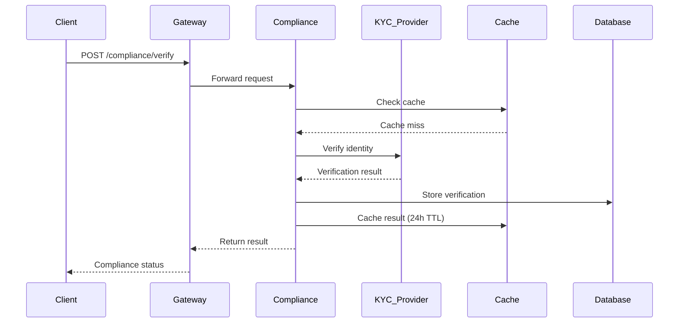
```mermaid
sequenceDiagram
    participant Client
    participant Gateway
    participant Compliance
    participant KYC_Provider
    participant Cache
    participant Database

    Client->>Gateway: POST /compliance/verify
    Gateway->>Compliance: Forward request
    Compliance->>Cache: Check cache
    Cache-->>Compliance: Cache miss
    Compliance->>KYC_Provider: Verify identity
    KYC_Provider-->>Compliance: Verification result
    Compliance->>Database: Store verification
    Compliance->>Cache: Cache result (24h TTL)
    Compliance-->>Gateway: Return result
    Gateway-->>Client: Compliance status
```

### 5.2.4 Policy Service (Port 4002)

#### Purpose and Responsibilities
Implements the compliance rules engine with jurisdiction-specific logic, policy CRUD operations, and cached policy evaluation for real-time compliance checking.

#### Technologies and Frameworks
- **Framework**: Node.js with Express and TypeScript
- **Database Integration**: Prisma ORM for PostgreSQL connectivity
- **Caching Strategy**: Redis with 300-second TTL for policy data
- **Rule Engine**: Custom JavaScript-based rule evaluation engine

#### Key Interfaces and APIs
- **Policy Management**: Full CRUD operations for compliance policies
- **Rule Evaluation**: `POST /policy/evaluate` - Real-time policy assessment
- **Jurisdiction Logic**: Geographic and regulatory rule application
- **Cache Invalidation**: Pattern-based cache clearing for policy updates

#### Data Persistence Requirements
- **PostgreSQL**: Policy definitions, jurisdiction rules, evaluation history
- **Redis**: Policy cache with pattern-based invalidation (policies:*)

#### Scaling Considerations
Policy evaluation uses read-heavy caching patterns. Cache warming strategies ensure consistent performance during high-volume evaluation periods.

### 5.2.5 Audit Log Writer (Port 4004)

#### Purpose and Responsibilities
Maintains immutable audit trail through dual-write pattern: synchronous file system logging and asynchronous database persistence for comprehensive compliance and forensic capabilities.

#### Technologies and Frameworks
- **Framework**: Node.js with Express and TypeScript
- **File System**: JSONL format persistence to `.audit-data/audit.log`
- **Database**: Asynchronous PostgreSQL inserts for searchability
- **Search Engine**: Full-text search capabilities for audit analysis

#### Key Interfaces and APIs
- **Audit Logging**: `POST /audit/log` - Immutable audit entry creation
- **Search Interface**: `GET /audit/search` - Full-text audit log searching
- **Statistics**: `GET /audit/stats` - Compliance and usage statistics
- **Export Functions**: Multiple format exports for regulatory submissions

#### Data Persistence Requirements
- **File System**: Append-only JSONL files with log rotation
- **PostgreSQL**: Searchable audit records with full-text indexing

#### Scaling Considerations
Dual-write pattern ensures data durability. File system writes provide immediate persistence while database writes enable advanced querying and reporting.

## 5.3 TECHNICAL DECISIONS

### 5.3.1 Architecture Style Decisions and Tradeoffs

#### Microservices vs. Monolithic Architecture

| Decision Factor | Microservices (Selected) | Monolithic Alternative |
|---|---|---|
| **Scalability** | Independent service scaling based on demand | Single deployment unit scaling |
| **Technology Diversity** | Service-specific technology choices | Uniform technology stack |
| **Operational Complexity** | Higher complexity, multiple deployments | Simpler deployment and monitoring |
| **Development Velocity** | Parallel team development | Coordinated development cycles |

**Rationale**: Microservices architecture selected due to the distinct compliance, identity, and reporting domains requiring different scaling characteristics and the need for independent deployment cycles during platform evolution.

#### Service Mesh vs. Direct Service Communication

| Decision Factor | Service Mesh (Selected) | Direct Communication |
|---|---|---|
| **Security** | Centralized security enforcement | Distributed security implementation |
| **Monitoring** | Unified observability and tracing | Service-specific monitoring setup |
| **Performance** | Additional network hop overhead | Direct service-to-service communication |
| **Complexity** | Gateway as single point of management | Multiple service discovery mechanisms |

**Rationale**: Service mesh provides essential security perimeter and centralized cross-cutting concerns required for financial compliance, outweighing the performance overhead.

```mermaid
graph TD
    A[Architecture Decision] --> B{Compliance Requirements}
    B -->|High| C[Service Mesh Pattern]
    B -->|Medium| D[Direct Communication]
    C --> E[Gateway Implementation]
    D --> F[Service Discovery]
    E --> G[Enhanced Security]
    F --> H[Simpler Networking]
    G --> I[Selected: Service Mesh]
    H --> J[Rejected: Performance Priority]
    
    style I fill:#c8e6c9
    style J fill:#ffcdd2
```

### 5.3.2 Communication Pattern Choices

#### RESTful APIs vs. Event-Driven Architecture

The platform implements RESTful APIs for synchronous operations while utilizing Redis pub/sub for asynchronous notifications. This hybrid approach provides:

- **Consistency**: REST APIs ensure predictable request-response cycles for user-facing operations
- **Performance**: Asynchronous events handle background processing without blocking user interactions
- **Simplicity**: Standard HTTP semantics reduce complexity for third-party integrations

#### JWT vs. Session-Based Authentication

JWT tokens selected for stateless authentication with Redis session storage for enhanced security:

- **Scalability**: Stateless tokens enable horizontal gateway scaling
- **Security**: Short-lived access tokens (15 minutes) with refresh token rotation
- **Audit Trail**: All token operations logged for compliance requirements

### 5.3.3 Data Storage Solution Rationale

#### PostgreSQL for Transactional Data

| Consideration | PostgreSQL (Selected) | Alternative Options |
|---|---|---|
| **ACID Compliance** | Full ACID guarantees | NoSQL eventual consistency |
| **Complex Queries** | Advanced SQL capabilities | Limited query languages |
| **Regulatory Compliance** | Mature audit and security features | Varied compliance support |
| **Ecosystem Integration** | Extensive tooling and monitoring | Platform-specific tools |

#### Redis for Caching and Sessions

Redis provides high-performance caching with differentiated TTL strategies:

- **Session Management**: 7-day TTL for user sessions
- **Rate Limiting**: 60-second TTL for API rate limits
- **Compliance Caching**: Variable TTLs based on data sensitivity (60s to 24h)

### 5.3.4 Caching Strategy Justification

The platform implements a multi-layer caching strategy optimized for compliance workloads:

#### Cache Layer Architecture

```mermaid
graph TD
    A[API Request] --> B{Cache Check}
    B -->|Hit| C[Return Cached Data]
    B -->|Miss| D[Query Database]
    D --> E[Store in Cache]
    E --> F[Return Fresh Data]
    
    subgraph "Cache Layers"
        G[Gateway Rate Limits - 60s TTL]
        H[KYC Results - 1h TTL]
        I[Policy Rules - 5min TTL]
        J[Compliance Reports - 24h TTL]
    end
    
    B --> G
    B --> H
    B --> I
    B --> J
    
    style C fill:#c8e6c9
    style F fill:#e3f2fd
```

#### TTL Strategy Rationale

- **Rate Limiting (60s)**: Prevents API abuse while allowing legitimate usage patterns
- **KYC Results (1-24h)**: Balances compliance freshness with provider API costs
- **Policy Rules (5min)**: Ensures policy changes propagate quickly while reducing database load
- **Session Data (7d)**: Matches business requirement for persistent login sessions

## 5.4 CROSS-CUTTING CONCERNS

### 5.4.1 Monitoring and Observability Approach

The platform implements comprehensive monitoring across four dimensions: application performance, business metrics, security events, and infrastructure health.

#### Application Performance Monitoring

- **Request Correlation**: Every request generates a unique correlation ID (x-request-id) propagated across all services
- **Response Time Tracking**: Gateway measures end-to-end response times with <span style="background-color: rgba(91, 57, 243, 0.2)">p95 latency metric derived from Cloud Logging</span>
- **Error Rate Monitoring**: Automatic alerting when error rates exceed 1% over 5-minute windows
- **Resource Utilization**: CPU, memory, and database connection pool monitoring with predictive scaling

#### Terraform-Managed Metrics Infrastructure

<span style="background-color: rgba(91, 57, 243, 0.2)">The monitoring infrastructure leverages Terraform-managed, logs-based metrics extracted from Cloud Run service logs. Custom metrics are defined in `/infra/monitoring/metrics.tf` with the following key implementations:</span>

- <span style="background-color: rgba(91, 57, 243, 0.2)">**Error Rate Metric**: Log-based metric filter aggregating HTTP status codes >= 400 from structured log entries</span>
- <span style="background-color: rgba(91, 57, 243, 0.2)">**P95 Latency Metric**: Percentile aggregation of request duration values extracted from log entries using Cloud Logging filters</span>

<span style="background-color: rgba(91, 57, 243, 0.2)">Example metric filter configuration for p95 latency:</span>
```
<span style="background-color: rgba(91, 57, 243, 0.2)">resource.type="cloud_run_revision"
jsonPayload.latency > 0
jsonPayload.httpStatus < 500</span>
```

#### Alert Policy Configuration

<span style="background-color: rgba(91, 57, 243, 0.2)">Automated alerting policies are managed via `/infra/monitoring/alerts.tf` with the following thresholds:</span>

- <span style="background-color: rgba(91, 57, 243, 0.2)">**Error Rate Alerting**: Triggers when error rate exceeds 1% over 5-minute evaluation period</span>
- <span style="background-color: rgba(91, 57, 243, 0.2)">**P95 Latency Alerting**: Triggers when p95 latency exceeds 500ms over 5-minute evaluation period</span>
- <span style="background-color: rgba(91, 57, 243, 0.2)">**Notification Delivery**: Alerts delivered via Cloud Monitoring notification channels to operational teams</span>

#### Cloud Monitoring Dashboard

<span style="background-color: rgba(91, 57, 243, 0.2)">An importable Cloud Monitoring dashboard provides visual monitoring capabilities for the logs-based metrics. The dashboard configuration is stored as JSON at `/infra/monitoring/dashboard.json` and includes visualizations for error rates, p95 latency trends, request volume, and service health indicators. The dashboard can be imported directly into Google Cloud Console for operational monitoring.</span>

#### Automated Deployment Validation

<span style="background-color: rgba(91, 57, 243, 0.2)">Post-deployment validation is performed through the automated smoke-test workflow defined in `.github/workflows/smoke-test.yml`. This workflow performs ID-token-authenticated health checks against deployed services, validating service availability and feeding results into the observability stack. The smoke tests generate correlation IDs that propagate through the system, enabling end-to-end tracing of deployment validation activities.</span>

#### Business Metrics Collection

- **Compliance Verification Rates**: Success/failure rates for KYC, AML, and sanctions screening
- **Asset Onboarding Velocity**: Time-to-active metrics for new tokenized assets
- **Investor Processing Throughput**: End-to-end investor onboarding completion rates
- **Revenue Impact Tracking**: Correlation between system performance and business outcomes

### 5.4.2 Logging and Tracing Strategy

#### Structured Logging Implementation

All services implement structured JSON logging using the pino library with consistent schema<span style="background-color: rgba(91, 57, 243, 0.2)">. Structured logs now include latency (ms) and httpStatus fields to enable Cloud Logging filters to aggregate them into metrics</span>:

```json
{
  "timestamp": "2024-01-01T12:00:00.000Z",
  "level": "info",
  "service": "identity-service",
  "requestId": "req_1234567890abcdef",
  "userId": "user_abc123",
  "action": "login_attempt",
  "result": "success",
  "latency": 150,
  "httpStatus": 200,
  "metadata": {
    "ip": "192.168.1.1",
    "userAgent": "Mozilla/5.0...",
    "duration": 150
  }
}
```

#### Log Retention Policy

<span style="background-color: rgba(91, 57, 243, 0.2)">Log entries are retained for 30 days to satisfy Cloud Monitoring metric back-filling requirements, ensuring historical metrics data availability for trend analysis and alerting baseline establishment.</span>

#### Distributed Tracing

Request correlation IDs enable distributed tracing across the microservices architecture<span style="background-color: rgba(91, 57, 243, 0.2)">. Correlation IDs now propagate through smoke-test calls, enabling end-to-end tracing of deployment validation workflows</span>:

- **Gateway Injection**: Correlation IDs generated at gateway entry point
- **Service Propagation**: Headers automatically forwarded to all backend services
- **Database Correlation**: Query logs include correlation IDs for performance analysis
- **External API Tracking**: Third-party API calls tagged with correlation IDs
- <span style="background-color: rgba(91, 57, 243, 0.2)">**Smoke Test Tracing**: Automated health check requests include correlation IDs for deployment validation tracing</span>

### 5.4.3 Error Handling Patterns

The platform implements a hierarchical error handling strategy with graceful degradation capabilities.

```mermaid
flowchart TD
    A[Error Occurs] --> B{Error Type}
    B -->|Validation Error| C[Return 400 with Details]
    B -->|Authentication Error| D[Return 401 with Reason]
    B -->|Authorization Error| E[Return 403 with Context]
    B -->|Not Found Error| F[Return 404 with Suggestions]
    B -->|Server Error| G[Error Handling Process]
    
    G --> H[Log Error with Stack Trace]
    H --> I[Check Retry Policy]
    I -->|Retryable| J[Exponential Backoff]
    I -->|Non-retryable| K[Return 500 with Error ID]
    J --> L{Retry Count}
    L -->|< Max Retries| M[Retry Operation]
    L -->|>= Max Retries| K
    M --> N{Operation Success}
    N -->|Success| O[Return Success Response]
    N -->|Failure| G
    
    K --> P[Circuit Breaker Check]
    P --> Q[Update Error Metrics]
    Q --> R[Send Alert if Threshold Exceeded]
    
    style O fill:#c8e6c9
    style K fill:#ffcdd2
    style R fill:#fff3e0
```

#### Circuit Breaker Implementation

- **Failure Threshold**: 5 failures within 60 seconds triggers circuit breaker
- **Recovery Period**: 30-second timeout before attempting service recovery
- **Health Check Integration**: Automated health checks determine service recovery status

#### Graceful Degradation Strategies

- **KYC Provider Fallback**: Primary provider failures automatically route to secondary providers
- **Cache Fallback**: Cache failures fall back to database queries with performance degradation warnings
- **Report Generation**: Large report failures queue for background processing rather than failing synchronously

### 5.4.4 Authentication and Authorization Framework

#### Security Boundaries Documentation

<span style="background-color: rgba(91, 57, 243, 0.2)">Comprehensive security boundary documentation is maintained in `/docs/security-boundaries.md`, detailing the separation between the Cloud Run runtime service account and the CI Workload Identity Federation service account. The platform enforces that JSON service account keys are prohibited, with OIDC auth@v2 serving as the sole authentication mechanism for CI/CD operations.</span>

#### Multi-Layer Security Architecture

The platform implements defense-in-depth security through multiple authorization layers:

1. **Network Layer**: TLS 1.3 encryption for all communications
2. **Gateway Layer**: Rate limiting and basic authentication validation
3. **Service Layer**: JWT token validation and role-based authorization
4. **Data Layer**: Row-level security and encryption at rest

#### Role-Based Access Control Matrix

| Role | Asset Management | Investor Management | Compliance Reporting | System Administration |
|---|---|---|---|---|
| **SUPER_ADMIN** | Full Access | Full Access | Full Access | Full Access |
| **ADMIN** | Read/Write | Read/Write | Read/Write | Limited Access |
| **COMPLIANCE_OFFICER** | Read Only | Read/Write | Full Access | No Access |
| **INVESTOR** | Own Assets Only | Own Profile Only | Own Reports Only | No Access |

#### JWT Token Security

- **Algorithm**: HS256 with 256-bit keys rotated monthly
- **Expiration**: 15-minute access tokens, 7-day refresh tokens
- **Claims**: User ID, organization ID, roles, issued time, expiration time
- **Revocation**: Redis-based token blacklisting for immediate revocation

### 5.4.5 Performance Requirements and SLAs

#### Response Time Requirements

| Operation Category | Target Response Time | Maximum Response Time | Error Threshold |
|---|---|---|---|
| **Authentication** | < 200ms | < 500ms | 0.1% |
| **Asset Queries** | < 500ms | < 1000ms | 0.5% |
| **Compliance Checks** | < 2000ms | < 5000ms | 1.0% |
| **Report Generation** | < 10000ms | < 30000ms | 2.0% |

#### Throughput Requirements

- **Gateway Processing**: Minimum 1000 requests/second sustained throughput
- **Database Operations**: Support for 500 concurrent connections with connection pooling
- **Cache Operations**: Sub-millisecond Redis response times for 95% of operations
- **External API Integration**: Maintain < 30-second timeout with provider fallback

#### Availability Targets

- **System Availability**: 99.9% uptime (8.77 hours downtime per year maximum)
- **Data Durability**: 99.999% durability through dual-write patterns and backups
- **Recovery Time Objective**: < 1 hour for complete system recovery
- **Recovery Point Objective**: < 15 minutes maximum data loss

### 5.4.6 Disaster Recovery Procedures

#### Backup and Recovery Strategy

The platform implements comprehensive backup procedures ensuring business continuity:

#### Data Backup Procedures

- **Database Backups**: Automated PostgreSQL backups every 4 hours with 30-day retention
- **Audit Log Backups**: Immutable audit files replicated to secondary storage within 1 hour
- **Configuration Backups**: Infrastructure as Code (Terraform) stored in version control
- **Cache Recovery**: Redis persistence enabled with automatic recovery from disk snapshots

#### Disaster Recovery Testing

- **Monthly Testing**: Simulated failures with recovery time measurement
- **Quarterly Full Recovery**: Complete system restoration from backups
- **Annual Disaster Simulation**: Cross-region failover testing with full business process validation

#### References

**Files Examined:**
- `README.md` - Repository overview and technology stack documentation
- `docker-compose.yml` - Infrastructure service definitions and networking configuration
- `cloudrun.yaml` - Production deployment configuration for Google Cloud Platform
- `services/gateway/src/server.js` - Gateway service implementation and routing logic
- `packages/database/models.py` - Database model definitions and relationships

**Folders Explored:**
- `/services/` - Complete microservices architecture with 12 backend services
- `/packages/` - Shared packages including auth middleware, database, and SDK components
- `/apps/` - Frontend applications including compliance dashboard and investor portal
- `/contracts/` - Smart contract implementations for tokenized asset management
- `/.github/workflows/` - CI/CD pipeline definitions and deployment automation

**Technical Specification Sections Retrieved:**
- `1.2 SYSTEM OVERVIEW` - High-level architecture context and business requirements
- `2.1 FEATURE CATALOG` - Complete feature inventory with technical implementation details
- `3.7 TECHNOLOGY INTEGRATION ARCHITECTURE` - Technology stack and integration patterns
- `4.1 SYSTEM WORKFLOWS` - Detailed workflow implementations and data flow patterns

# 6. SYSTEM COMPONENTS DESIGN

## 6.1 CORE SERVICES ARCHITECTURE

### 6.1.1 SERVICE COMPONENTS

#### 6.1.1.1 Service Boundaries and Responsibilities

The platform implements nine distinct microservices, each with clearly defined domain boundaries and specialized responsibilities within the compliance ecosystem:

| Service Name | Port | Primary Domain | Core Responsibilities | Key Dependencies |
|---|---|---|---|---|
| **Gateway Service** | 4000 | API Orchestration | Traffic routing, rate limiting, request correlation, authentication enforcement | Redis (rate limiting), All backend services |
| **Identity Service** | 4001 | Authentication & Authorization | JWT token management, user authentication, RBAC enforcement, WebAuthn support | PostgreSQL (user data), Redis (sessions) |
| **Policy Service** | 4002 | Rule Engine | Compliance rule evaluation, jurisdiction logic, policy caching, regulatory framework management | PostgreSQL (policies), Redis (cache) |
| **Compliance Service** | 4003 | Regulatory Compliance | Multi-check orchestration, sanctions screening, AML monitoring, compliance reporting | PostgreSQL (compliance data), Redis (cache) |

| Service Name | Port | Primary Domain | Core Responsibilities | Key Dependencies |
|---|---|---|---|---|
| **Audit Log Writer** | 4004 | Audit & Compliance Logging | Dual-write audit logging (file + database), immutable audit trail, compliance evidence | PostgreSQL (audit data), File system |
| **Tool Masker Service** | 4005 | Data Abstraction | API abstraction layer, data masking, configuration-driven transformations | YAML configs, Handlebars templates |
| **KYC Provider Service** | N/A | Identity Verification | Multi-vendor KYC orchestration, provider fallback management, risk scoring | External KYC APIs (Chainalysis, Jumio, etc.) |
| **Regulatory Reporting** | N/A | Compliance Reporting | Scheduled report generation, regulatory filing automation, audit package creation | PostgreSQL, PDF/Excel generation |
| **Blockchain Service** | N/A | Smart Contract Interface | Smart contract interaction, event polling, tokenization management, on-chain compliance | Ethereum networks, JSON-RPC |

#### 6.1.1.2 Inter-Service Communication Patterns

The platform enforces a **strict service mesh pattern** that ensures all external traffic flows exclusively through the Gateway service, providing centralized security, monitoring, and traffic management:

```mermaid
graph TD
    subgraph "External Layer"
        Client[Frontend Applications<br/>- Compliance Dashboard<br/>- Investor Portal<br/>- Admin Interface]
        External[External API Consumers<br/>- Third-party Integrations<br/>- Webhook Receivers]
    end
    
    subgraph "Gateway Layer - Port 4000"
        Gateway[API Gateway Service<br/>- Rate Limiting: 100 req/min<br/>- Request Correlation ID<br/>- JWT Authentication<br/>- Traffic Routing]
    end
    
    subgraph "Core Services Layer - Ports 4001-4005"
        Identity[Identity Service<br/>Port 4001<br/>- JWT Management<br/>- User Authentication<br/>- RBAC Authorization]
        
        Policy[Policy Service<br/>Port 4002<br/>- Rule Engine<br/>- Jurisdiction Logic<br/>- Policy Evaluation]
        
        Compliance[Compliance Service<br/>Port 4003<br/>- Multi-check Orchestration<br/>- Sanctions Screening<br/>- Monitoring & Alerts]
        
        Audit[Audit Log Writer<br/>Port 4004<br/>- Dual-write Logging<br/>- Immutable Audit Trail<br/>- Compliance Evidence]
        
        Tools[Tool Masker Service<br/>Port 4005<br/>- Data Masking<br/>- API Abstraction<br/>- Config-driven Transform]
    end
    
    subgraph "Specialized Services"
        KYC[KYC Provider Service<br/>- Multi-vendor Integration<br/>- Provider Fallback<br/>- Risk Scoring]
        
        Reporting[Regulatory Reporting<br/>- Scheduled Reports<br/>- Audit Packages<br/>- Filing Automation]
        
        Blockchain[Blockchain Service<br/>- Smart Contracts<br/>- Event Polling<br/>- Tokenization]
    end
    
    subgraph "Data Layer"
        Postgres[(PostgreSQL<br/>- Transactional Data<br/>- Connection Pool: 20<br/>- Audit Records)]
        Redis[(Redis<br/>- Cache Layer<br/>- Session Storage<br/>- Rate Limiting)]
        Files[(File System<br/>- Audit Logs<br/>- Reports<br/>- Configurations)]
    end
    
    Client -->|HTTPS + JWT| Gateway
    External -->|HTTPS + API Key| Gateway
    
    Gateway -->|HTTP + x-request-id| Identity
    Gateway -->|HTTP + x-request-id| Policy  
    Gateway -->|HTTP + x-request-id| Compliance
    Gateway -->|HTTP + x-request-id| Audit
    Gateway -->|HTTP + x-request-id| Tools
    
    Identity --> Postgres
    Identity --> Redis
    Policy --> Postgres
    Policy --> Redis
    Compliance --> Postgres
    Compliance --> Redis
    Compliance --> KYC
    Audit --> Postgres
    Audit --> Files
    Tools --> Files
    
    Reporting --> Postgres
    Reporting --> Files
    Blockchain --> External
    
    style Gateway fill:#e3f2fd
    style Redis fill:#fff3e0  
    style Postgres fill:#c8e6c9
    style Files fill:#f3e5f5
```

**Communication Protocol Specifications:**

- **Request Correlation**: Unique `x-request-id` header generated at Gateway for distributed tracing
- **Authentication Flow**: JWT Bearer tokens validated at Gateway before service routing
- **Payload Format**: JSON content with `application/json` content-type enforcement
- **Method Preservation**: HTTP methods (GET, POST, PUT, PATCH, DELETE) forwarded unchanged
- **Query Parameter Handling**: URL parameters preserved during proxy operations
- **Error Propagation**: Standardized error responses with correlation IDs for troubleshooting

#### 6.1.1.3 Service Discovery Mechanisms

The platform implements **static service discovery** with environment-based configuration optimized for different deployment environments:

**Development Environment Configuration:**
```javascript
const serviceUrls = {
    IDENTITY_URL: process.env.IDENTITY_URL || 'http://localhost:4001',
    POLICY_URL: process.env.POLICY_URL || 'http://localhost:4002',
    COMPLIANCE_URL: process.env.COMPLIANCE_URL || 'http://localhost:4003',
    AUDIT_URL: process.env.AUDIT_URL || 'http://localhost:4004',
    TOOL_MASKER_URL: process.env.TOOL_MASKER_URL || 'http://localhost:4005'
};
```

**Service Resolution Strategy:**
- **Development Mode**: Direct localhost URLs with predictable port assignments
- **Container Environment**: Service names resolved via Docker DNS networking
- **Production (Cloud Run)**: Managed service URLs via secure environment variables
- **Health Check Integration**: Service health status influences routing decisions

#### 6.1.1.4 Load Balancing Strategy

The platform implements multi-layer load balancing to ensure optimal performance and resource utilization:

**Gateway-Level Traffic Management:**
- **Rate Limiting**: 100 requests per 60-second window per IP address
- **Redis-backed Counters**: Atomic increment operations with automatic expiration
- **Dynamic IP Blocking**: Automatic blocking after threshold exceeded with configurable duration
- **Request Distribution**: Round-robin routing to healthy service instances

**Database Connection Pooling:**
```javascript
const poolConfig = {
    max: 20,              // Maximum connections
    idleTimeoutMillis: 30000,  // 30 second idle timeout
    connectionTimeoutMillis: 2000,  // 2 second connection timeout
    maxUses: 7500,        // Recycle connections after 7500 uses
    allowExitOnIdle: true // Allow graceful shutdown
};
```

**Redis Connection Management:**
- **Connection Pooling**: Automatic connection reuse with health monitoring
- **Retry Strategy**: Exponential backoff with maximum 2000ms delay between retries
- **Circuit Breaker**: Automatic failover when Redis becomes unavailable

#### 6.1.1.5 Circuit Breaker Patterns

The architecture implements comprehensive circuit breaker patterns to ensure system resilience during service failures:

```mermaid
stateDiagram-v2
    [*] --> Closed
    Closed --> Open: Failure threshold reached<br/>(5 failures in 60s)
    Open --> HalfOpen: Recovery timeout<br/>(30 seconds elapsed)
    HalfOpen --> Closed: Health check success<br/>(3 consecutive successes)
    HalfOpen --> Open: Health check failure<br/>(Any failure detected)
    
    state Closed {
        [*] --> Normal_Traffic
        Normal_Traffic --> Health_Monitor
        Health_Monitor --> Normal_Traffic
    }
    
    state Open {
        [*] --> Fail_Fast
        Fail_Fast --> Fallback_Response
    }
    
    state HalfOpen {
        [*] --> Limited_Traffic
        Limited_Traffic --> Test_Requests
        Test_Requests --> Recovery_Check
    }
    
    note right of Open
        - Immediate failure response
        - Fallback mechanisms activated
        - Metrics collection continues
        - Alert notifications sent
    end note
    
    note right of HalfOpen
        - 10% traffic allowed through
        - Successful responses required
        - Real-time health monitoring
        - Automatic state transition
    end note
```

**Circuit Breaker Configuration:**
- **Failure Threshold**: 5 consecutive failures or 50% error rate over 60 seconds
- **Recovery Timeout**: 30-second minimum before attempting recovery
- **Success Threshold**: 3 consecutive successful requests required for full recovery
- **Fallback Mechanisms**: Cached responses or degraded functionality during outages

#### 6.1.1.6 Retry and Fallback Mechanisms

The platform implements sophisticated retry and fallback strategies to maintain service availability:

**KYC Provider Fallback Chain:**

| Priority | Provider | Specialization | Timeout | Retry Policy |
|---|---|---|---|---|
| Primary | Chainalysis | Sanctions screening, crypto risk | 30s | 3 attempts, exponential backoff |
| Primary | Jumio | Identity verification, document validation | 30s | 3 attempts, exponential backoff |
| Secondary | TRM Labs | Transaction monitoring, compliance | 30s | 2 attempts, linear backoff |
| Secondary | Onfido | Document verification, biometric matching | 30s | 2 attempts, linear backoff |

**Database Fallback Strategy:**
1. **Primary Operation**: Direct PostgreSQL query with connection pooling
2. **Cache Fallback**: Redis cache lookup for recently queried data (if primary fails)
3. **Stale Data Tolerance**: Return cached data with staleness indicators
4. **Graceful Degradation**: Error response with correlation ID for manual intervention

**External API Resilience:**
- **Timeout Configuration**: 30-second maximum per external API call
- **Exponential Backoff**: 1s, 2s, 4s, 8s intervals for retry attempts
- **Jitter Addition**: ±25% randomization to prevent thundering herd patterns
- **Dead Letter Queue**: Failed requests queued for manual review and retry

### 6.1.2 SCALABILITY DESIGN

#### 6.1.2.1 Horizontal and Vertical Scaling Approach

The platform implements a **hybrid scaling strategy** that combines horizontal auto-scaling for traffic handling with vertical scaling for resource-intensive operations:

```mermaid
graph TD
    subgraph "Horizontal Scaling - Cloud Run"
        A[Traffic Increase Detected] --> B{CPU > 60% or Memory > 80%}
        B -->|True| C[Trigger Scale-Up Event]
        B -->|False| D[Monitor Current State]
        
        C --> E[Launch New Container Instance]
        E --> F{Health Check Pass}
        F -->|Pass| G[Add to Load Balancer Pool]
        F -->|Fail| H[Terminate and Retry]
        
        G --> I[Distribute Traffic]
        I --> J{Load Decreased}
        J -->|True| K[Scale Down After 5min Cooldown]
        J -->|False| L[Maintain Current Scale]
        
        H --> E
        K --> M[Graceful Container Shutdown]
        L --> D
        D --> N[Continue Monitoring]
        M --> N
    end
    
    subgraph "Vertical Scaling - Resource Allocation"
        O[Resource Demand Analysis] --> P{Service Type}
        P -->|Gateway| Q[High Traffic: 2 CPU, 2Gi RAM]
        P -->|Compliance| R[CPU Intensive: 1.5 CPU, 1Gi RAM]  
        P -->|Identity| S[Memory Optimized: 1 CPU, 512Mi RAM]
        P -->|Audit| T[I/O Optimized: 0.5 CPU, 256Mi RAM]
        
        Q --> U[Auto-scaling Pool: 2-100 instances]
        R --> V[Auto-scaling Pool: 1-50 instances]
        S --> W[Auto-scaling Pool: 1-50 instances]
        T --> X[Auto-scaling Pool: 1-20 instances]
    end
    
    style C fill:#e3f2fd
    style G fill:#c8e6c9
    style H fill:#ffcdd2
    style M fill:#fff3e0
```

#### 6.1.2.2 Auto-scaling Triggers and Rules

The platform implements intelligent auto-scaling based on multiple metrics and predictive analysis:

**Resource-Based Scaling Triggers:**

| Metric Type | Scale-Up Threshold | Scale-Down Threshold | Evaluation Period | Cooldown Period |
|---|---|---|---|---|
| **CPU Utilization** | > 60% sustained | < 30% for 5 minutes | 60 seconds | 300 seconds |
| **Memory Usage** | > 80% sustained | < 40% for 5 minutes | 60 seconds | 300 seconds |
| **Request Queue Depth** | > 50 pending requests | < 10 pending requests | 30 seconds | 120 seconds |
| **Response Time** | > 2000ms (95th percentile) | < 500ms (95th percentile) | 120 seconds | 300 seconds |

**Business Logic Scaling Triggers:**
- **Compliance Verification Spikes**: Scale Compliance Service when verification requests exceed 100/minute
- **Report Generation Load**: Scale Reporting Service during scheduled generation periods
- **Authentication Bursts**: Scale Identity Service during peak login hours
- **KYC Processing Surges**: Scale KYC Provider Service when verification queues exceed capacity

#### 6.1.2.3 Resource Allocation Strategy

The platform allocates resources based on service roles, traffic patterns, and processing requirements:

**Service-Specific Resource Profiles:**

| Service Category | CPU Request | Memory Request | CPU Limit | Memory Limit | Min Instances | Max Instances |
|---|---|---|---|---|---|---|
| **Gateway** (Critical Path) | 0.5 CPU | 512Mi | 2.0 CPU | 2Gi | 2 | 100 |
| **Identity** (Auth Critical) | 0.25 CPU | 256Mi | 1.0 CPU | 512Mi | 1 | 50 |
| **Compliance** (CPU Intensive) | 0.5 CPU | 512Mi | 1.5 CPU | 1Gi | 1 | 50 |
| **Policy** (Cache Heavy) | 0.25 CPU | 256Mi | 1.0 CPU | 512Mi | 1 | 30 |

| Service Category | CPU Request | Memory Request | CPU Limit | Memory Limit | Min Instances | Max Instances |
|---|---|---|---|---|---|---|
| **Audit** (I/O Heavy) | 0.25 CPU | 256Mi | 0.5 CPU | 256Mi | 1 | 20 |
| **Tool Masker** (Transform) | 0.25 CPU | 256Mi | 1.0 CPU | 512Mi | 1 | 25 |
| **KYC Provider** (External API) | 0.5 CPU | 512Mi | 1.0 CPU | 1Gi | 1 | 40 |
| **Reporting** (Batch Processing) | 1.0 CPU | 1Gi | 2.0 CPU | 2Gi | 0 | 10 |

**Resource Allocation Principles:**
- **Guaranteed Resources**: Request values ensure minimum performance under load
- **Burst Capability**: Limit values allow services to handle traffic spikes
- **Cost Optimization**: Right-sizing based on actual usage patterns and performance metrics
- **Headroom Allocation**: 20% resource buffer for unexpected load increases

#### 6.1.2.4 Performance Optimization Techniques

The platform employs multi-layer performance optimization strategies:

**Caching Strategy Implementation:**

| Cache Type | Key Pattern | TTL Duration | Cache Size | Invalidation Strategy |
|---|---|---|---|---|
| **Policy Cache** | `policy:{id}` | 300 seconds (5 minutes) | 100MB | Policy update events |
| **Compliance Results** | `compliance:{user}:{transaction}` | 60 seconds | 200MB | Real-time verification |
| **KYC Verification** | `kyc:{user_id}` | 86400 seconds (24 hours) | 500MB | Document updates |
| **Session Data** | `session:{sessionId}` | 604800 seconds (7 days) | 150MB | User logout/timeout |

**Database Performance Optimization:**
- **Connection Pooling**: Pre-warmed connections with health checks and automatic recycling
- **Query Optimization**: Prepared statements for frequently executed queries
- **Index Strategy**: Covering indexes on compliance queries and audit log searches
- **Partition Management**: Time-based partitioning for audit logs and transaction history

**Application-Level Optimizations:**
- **Lazy Loading**: On-demand loading of heavy compliance documents and reports
- **Batch Processing**: Grouped operations for bulk compliance checks and report generation
- **Async Processing**: Non-blocking operations for external API calls and file operations
- **Resource Pooling**: Shared HTTP clients and database connections across requests

#### 6.1.2.5 Capacity Planning Guidelines

The platform follows data-driven capacity planning based on business growth projections and usage analytics:

**Throughput Capacity Targets:**

| Service Tier | Target RPS | Peak RPS | Database QPS | Cache Hit Rate | External API QPS |
|---|---|---|---|---|---|
| **Gateway Service** | 1000 | 2500 | N/A | N/A | N/A |
| **Identity Service** | 500 | 1200 | 200 | 85% | 50 |
| **Compliance Service** | 200 | 800 | 150 | 75% | 100 |
| **Policy Service** | 300 | 600 | 100 | 90% | 10 |

**Storage Growth Projections:**
- **PostgreSQL**: 100GB baseline + 20% annual growth + 2GB/month for audit logs
- **Redis Cache**: 8GB working set + 50% buffer for peak operations
- **File Storage**: 10GB/month for audit logs + 5GB/month for compliance reports
- **Backup Storage**: 3x production data size with 30-day retention for databases

**Network Capacity Requirements:**
- **Inbound Traffic**: 500 Mbps sustained + 1 Gbps burst capability
- **Database Traffic**: 200 Mbps sustained for query operations
- **Cache Traffic**: 100 Mbps sustained for Redis operations  
- **External API Traffic**: 50 Mbps sustained for KYC and blockchain interactions

### 6.1.3 RESILIENCE PATTERNS

#### 6.1.3.1 Fault Tolerance Mechanisms

The platform implements comprehensive fault tolerance through defense-in-depth strategies:

```mermaid
flowchart TD
    subgraph "Fault Tolerance Layers"
        A[Application Layer<br/>- Input Validation<br/>- Error Boundaries<br/>- Graceful Degradation]
        
        B[Service Layer<br/>- Circuit Breakers<br/>- Timeout Management<br/>- Retry Policies]
        
        C[Network Layer<br/>- Load Balancing<br/>- Health Checks<br/>- Connection Pooling]
        
        D[Infrastructure Layer<br/>- Auto-scaling<br/>- Container Restart<br/>- Resource Monitoring]
        
        E[Data Layer<br/>- Connection Pooling<br/>- Transaction Management<br/>- Backup Systems]
    end
    
    subgraph "Fault Detection"
        F[Health Check Probes<br/>- Liveness: /health<br/>- Readiness: /ready<br/>- 30-second intervals]
        
        G[Monitoring & Alerting<br/>- Error Rate Thresholds<br/>- Response Time SLAs<br/>- Resource Utilization]
        
        H[Business Logic Validation<br/>- Compliance Rule Checks<br/>- Data Integrity Validation<br/>- Audit Trail Verification]
    end
    
    subgraph "Fault Recovery"
        I[Automatic Recovery<br/>- Service Restart<br/>- Cache Rebuild<br/>- Connection Reset]
        
        J[Fallback Mechanisms<br/>- Provider Switching<br/>- Cached Responses<br/>- Degraded Functionality]
        
        K[Manual Intervention<br/>- Alert Escalation<br/>- Administrative Override<br/>- Emergency Procedures]
    end
    
    A --> F
    B --> F
    C --> F
    D --> F
    E --> F
    
    F --> I
    G --> I
    H --> I
    
    I --> J
    J --> K
    
    style A fill:#e3f2fd
    style I fill:#c8e6c9
    style J fill:#fff3e0
    style K fill:#ffcdd2
```

**Fault Detection Mechanisms:**
- **Proactive Health Monitoring**: Continuous health checks every 30 seconds with timeout detection
- **Anomaly Detection**: Statistical analysis of response times and error rates
- **Business Logic Validation**: Real-time validation of compliance rules and data integrity
- **Resource Threshold Monitoring**: CPU, memory, and connection pool utilization tracking
- **<span style="background-color: rgba(91, 57, 243, 0.2)">Cloud Logging Metrics Integration**: Fault detection now leverages logs-based metrics (error_rate_5xx and latency_p95) provisioned via Terraform module `/infra/monitoring/metrics.tf` for enhanced observability and automated alerting</span>
- **<span style="background-color: rgba(91, 57, 243, 0.2)">Post-Deployment Validation**: Automated smoke tests executed by `.github/workflows/smoke-test.yml` using ID-token authenticated curl requests to validate Cloud Run endpoints immediately following deployments</span>
- **<span style="background-color: rgba(91, 57, 243, 0.2)">Real-time Visualization**: Cloud Monitoring dashboard imported from `/infra/monitoring/dashboard.json` provides comprehensive real-time visualization of system metrics, alert statuses, and service health indicators</span>

**Advanced Monitoring & Alerting:**
- **Proactive Health Monitoring**: Continuous health checks every 30 seconds with timeout detection
- **Error Rate Analysis**: Statistical analysis of HTTP status codes with configurable thresholds
- **Response Time Tracking**: P95 latency monitoring with SLA enforcement
- **<span style="background-color: rgba(91, 57, 243, 0.2)">Automated Alert Policies**: Alert policies defined in `/infra/monitoring/alerts.tf` trigger when error_rate_5xx exceeds 5% for 5 minutes OR when latency_p95 exceeds 2000ms for 5 minutes, ensuring rapid response to service degradation</span>
- **Resource Utilization Alerts**: CPU, memory, and connection pool utilization tracking with predictive scaling triggers

#### 6.1.3.2 Disaster Recovery Procedures

The platform implements comprehensive disaster recovery procedures to ensure business continuity:

**Recovery Time and Point Objectives:**

| Component Category | RTO (Recovery Time) | RPO (Recovery Point) | Backup Frequency | Recovery Method |
|---|---|---|---|---|
| **Critical Services** (Gateway, Identity) | < 15 minutes | < 5 minutes | Real-time replication | Hot standby failover |
| **Business Services** (Compliance, Policy) | < 30 minutes | < 15 minutes | Every 15 minutes | Warm standby activation |
| **Support Services** (Audit, Tools) | < 1 hour | < 30 minutes | Hourly snapshots | Cold backup restoration |
| **Database Systems** | < 30 minutes | < 15 minutes | Continuous replication | Read replica promotion |

**Disaster Recovery Workflow:**

```mermaid
flowchart TD
    A[Disaster Detected] --> B{Disaster Severity}
    B -->|Critical| C[Initiate Emergency Response]
    B -->|Major| D[Activate Standard DR Plan]
    B -->|Minor| E[Local Recovery Procedures]
    
    C --> F[Emergency Response Team Assembly]
    F --> G[Immediate Service Isolation]
    G --> H{Data Integrity Check}
    H -->|Intact| I[Hot Standby Activation]
    H -->|Compromised| J[Point-in-time Recovery]
    
    D --> K[DR Team Notification]
    K --> L[Backup System Activation]
    L --> M[Service Migration]
    
    E --> N[Service Restart Attempt]
    N --> O{Recovery Successful}
    O -->|Yes| P[Monitor and Validate]
    O -->|No| Q[Escalate to Major DR]
    
    I --> R[Traffic Rerouting]
    J --> S[Database Restoration]
    M --> R
    S --> R
    
    R --> T[System Validation]
    T --> U{Full Functionality}
    U -->|Yes| V[DR Complete - Normal Operations]
    U -->|No| W[Partial Recovery Mode]
    
    P --> V
    Q --> D
    W --> X[Gradual Service Recovery]
    X --> V
    
    style C fill:#ffcdd2
    style V fill:#c8e6c9
    style W fill:#fff3e0
```

#### 6.1.3.3 Data Redundancy Approach

The platform implements multi-layer data redundancy to ensure zero data loss for compliance-critical information:

**Dual-Write Pattern Implementation:**
```javascript
// Audit Service dual-write for regulatory compliance
async function writeAuditEntry(auditData) {
    // Synchronous file write for immediate durability
    const logEntry = JSON.stringify(auditData) + '\n';
    fs.writeFileSync(auditLogPath, logEntry, { flag: 'a' });
    
    // Asynchronous database write for queryability
    try {
        await pgPool.query(dbQueries.createAuditLog, [
            auditData.eventType, auditData.serviceName, 
            auditData.userId, auditData.resourceId,
            auditData.action, auditData.details
        ]);
    } catch (dbError) {
        // File system write succeeded, database write can be retried
        await queueDbRetry(auditData, dbError);
    }
}
```

**Data Redundancy Levels:**

| Data Category | Primary Storage | Secondary Storage | Tertiary Backup | Sync Method |
|---|---|---|---|---|
| **Audit Logs** | PostgreSQL | File System (JSONL) | S3/GCS Archive | Real-time dual-write |
| **Compliance Data** | PostgreSQL Primary | PostgreSQL Replica | Daily Snapshots | Streaming replication |
| **User Sessions** | Redis Primary | Redis Replica | N/A (ephemeral) | Async replication |
| **Configuration** | Git Repository | Container Images | Local Snapshots | Version control |

#### 6.1.3.4 Failover Configurations

The platform implements automated failover mechanisms with minimal service disruption:

**Service Failover Matrix:**

| Component | Primary Instance | Failover Target | Detection Time | Failover Time | Data Loss Window |
|---|---|---|---|---|---|
| **Gateway Service** | Cloud Run Instance A | Auto-scaled Instance B | 5 seconds | 10 seconds | None |
| **PostgreSQL Database** | Primary DB Server | Read Replica | 15 seconds | 45 seconds | < 5 minutes |
| **Redis Cache** | Primary Redis | Rebuild from DB | 10 seconds | 2 minutes | Full cache loss |
| **External KYC APIs** | Primary Provider | Secondary Provider | 30 seconds | 30 seconds | None |

**Automated Failover Decision Logic:**
- **Health Check Failure**: 3 consecutive failed health checks trigger failover
- **Response Time Degradation**: 95th percentile > 5x normal response time
- **Error Rate Spike**: Error rate > 10% over 60-second window
- **Resource Exhaustion**: CPU > 95% or Memory > 95% for 120 seconds

#### 6.1.3.5 Service Degradation Policies

The platform implements graceful degradation strategies to maintain core functionality during partial system failures:

```mermaid
flowchart TD
    A[Service Degradation Trigger] --> B{System Health Level}
    
    B -->|Level 1: Minor Impact| C[Disable Non-Critical Features]
    B -->|Level 2: Moderate Impact| D[Cache-Only Operation Mode]
    B -->|Level 3: Major Impact| E[Read-Only Operation Mode]
    B -->|Level 4: Critical Impact| F[Emergency Maintenance Mode]
    
    C --> G[Features Disabled:<br/>- Report Generation<br/>- Bulk Operations<br/>- Non-essential APIs]
    
    D --> H[Fallback Behaviors:<br/>- Serve Cached Data<br/>- Skip Real-time Validation<br/>- Defer Updates]
    
    E --> I[Restricted Operations:<br/>- No Data Modifications<br/>- Query-only Access<br/>- Emergency Procedures Only]
    
    F --> J[System Response:<br/>- 503 Service Unavailable<br/>- Maintenance Page<br/>- Admin Access Only]
    
    G --> K{Core Functions Available}
    H --> K
    I --> K
    J --> L[Notify Stakeholders]
    
    K -->|Yes| M[Limited Service Response<br/>+ Degradation Warning]
    K -->|No| N[Service Unavailable<br/>+ Estimated Recovery Time]
    
    L --> O[Execute Recovery Plan]
    M --> P[Monitor Recovery Metrics]
    N --> P
    O --> P
    
    P --> Q{System Recovery}
    Q -->|Recovered| R[Restore Full Service]
    Q -->|Partial| S[Adjust Degradation Level]
    Q -->|Failed| T[Escalate Emergency Response]
    
    S --> B
    R --> U[Normal Operations Resumed]
    T --> V[Execute Disaster Recovery]
    
    style C fill:#fff3e0
    style D fill:#ffcc80
    style E fill:#ffab91
    style F fill:#ffcdd2
    style U fill:#c8e6c9
```

**Degradation Policies by Service:**

| Service | Level 1 Degradation | Level 2 Degradation | Level 3 Degradation | Level 4 Emergency |
|---|---|---|---|---|
| **Gateway** | Reduced rate limits | Essential routes only | Read-only access | Complete shutdown |
| **Identity** | Disable registration | Cache-only auth | No new sessions | Admin access only |
| **Compliance** | Skip non-critical checks | Use cached results | No new verifications | Manual override |
| **Policy** | Default safe policies | Cached policy only | No policy updates | Emergency policies |

**Recovery Trigger Conditions:**
- **Automatic Recovery**: System metrics return to normal thresholds for 5 minutes
- **Manual Recovery**: Administrator confirms system stability and initiates recovery
- **Gradual Recovery**: Step-by-step restoration with validation at each level
- **Full Recovery Validation**: Complete system functionality testing before normal operations

#### References

#### Files Examined
- `services/gateway/src/server.js` - Gateway service implementation, routing logic, and rate limiting mechanisms
- `services/gateway/src/config.js` - Service discovery configuration and environment-based URL resolution
- `packages/database/src/index.ts` - Database connection pooling configuration and Redis client setup
- `packages/auth-middleware/src/index.ts` - JWT authentication middleware and token validation logic
- `docker-compose.yml` - Service orchestration, networking configuration, and local development setup
- `cloudrun.yaml` - Production deployment configuration, auto-scaling settings, and resource allocation
- `services/audit-log-writer/src/handlers.js` - Dual-write audit logging implementation and file system operations

#### Folders Explored
- `services/` - Complete microservices architecture with 9 distinct service implementations
- `services/gateway/` - API Gateway service structure and traffic management implementation
- `services/identity-service/` - Authentication and authorization service architecture
- `services/compliance-service/` - Regulatory compliance service patterns and multi-check orchestration
- `services/policy-service/` - Policy engine structure and rule evaluation logic
- `services/audit-log-writer/` - Audit service dual-write pattern and compliance logging implementation
- `services/tool-masker-service/` - Data masking service and API abstraction layer
- `packages/auth-middleware/` - Shared authentication patterns and JWT implementation
- `packages/database/` - Shared database layer architecture and connection management
- `infra/` - Infrastructure as Code configuration and deployment automation

#### Technical Specification Sections Retrieved
- `5.1 HIGH-LEVEL ARCHITECTURE` - System overview, architectural principles, and component relationships  
- `4.1 SYSTEM WORKFLOWS` - Service interaction flows, integration patterns, and business process implementations
- `5.4 CROSS-CUTTING CONCERNS` - Monitoring, logging, error handling, and performance requirements across services

## 6.2 DATABASE DESIGN

### 6.2.1 SCHEMA DESIGN

#### 6.2.1.1 Entity Relationships

The Veria database schema implements a normalized relational model with 12 core tables organized into four primary domains: Organizations & Identity Management, Product & Asset Management, Compliance & Regulatory, and Transaction Processing.

```mermaid
erDiagram
    ORGANIZATIONS {
        uuid id PK
        varchar name
        varchar type
        jsonb metadata
        boolean active
        timestamp created_at
        timestamp updated_at
    }
    
    USERS {
        uuid id PK
        uuid organization_id FK
        varchar email
        varchar first_name
        varchar last_name
        varchar role
        boolean active
        timestamp created_at
        timestamp updated_at
    }
    
    PRODUCTS {
        uuid id PK
        uuid organization_id FK
        varchar name
        varchar product_type
        decimal total_supply
        decimal current_supply
        jsonb compliance_rules
        boolean active
        timestamp created_at
        timestamp updated_at
    }
    
    HOLDINGS {
        uuid id PK
        uuid user_id FK
        uuid product_id FK
        decimal balance
        decimal cost_basis
        timestamp acquired_at
        timestamp updated_at
    }
    
    TRANSACTIONS {
        uuid id PK
        uuid from_user_id FK
        uuid to_user_id FK
        uuid product_id FK
        decimal amount
        varchar transaction_type
        varchar status
        jsonb metadata
        timestamp created_at
        timestamp updated_at
    }
    
    COMPLIANCE_VERIFICATIONS {
        uuid id PK
        uuid user_id FK
        varchar verification_type
        varchar status
        jsonb verification_data
        timestamp verified_at
        timestamp expires_at
    }
    
    AUDIT_LOGS {
        uuid id PK
        varchar event_type
        uuid user_id FK
        varchar entity_type
        uuid entity_id
        varchar action
        jsonb details
        inet ip_address
        varchar user_agent
        timestamp created_at
    }
    
    ORGANIZATIONS ||--o{ USERS : "employs"
    ORGANIZATIONS ||--o{ PRODUCTS : "issues"
    USERS ||--o{ HOLDINGS : "owns"
    PRODUCTS ||--o{ HOLDINGS : "held_in"
    USERS ||--o{ TRANSACTIONS : "from_user"
    USERS ||--o{ TRANSACTIONS : "to_user"
    PRODUCTS ||--o{ TRANSACTIONS : "involves"
    USERS ||--o{ COMPLIANCE_VERIFICATIONS : "verified"
    USERS ||--o{ AUDIT_LOGS : "performed_by"
    HOLDINGS }|--|| USERS : "unique_constraint"
    HOLDINGS }|--|| PRODUCTS : "unique_constraint"
```

**Primary Relationship Patterns:**

| Relationship | Cardinality | Constraint | Business Rule |
|---|---|---|---|
| Organizations → Users | 1:N | CASCADE DELETE | Users belong to single organization |
| Organizations → Products | 1:N | CASCADE DELETE | Products issued by single organization |
| Users ↔ Products | M:N via Holdings | UNIQUE(user_id, product_id) | One holding record per user-product pair |
| Users → Transactions | 1:N (bidirectional) | RESTRICT DELETE | Transaction history preserved |

#### 6.2.1.2 Data Models and Structures

The schema implements consistent data modeling patterns optimized for financial compliance and regulatory reporting requirements.

##### 6.2.1.2.1 Core Data Types and Standards

**Primary Key Strategy:**
- **UUID v4**: All tables use `uuid_generate_v4()` for globally unique identifiers
- **Benefits**: Distributed system compatibility, security through unpredictability, merge-friendly operations

**Temporal Data Management:**
- **Standard Timestamps**: `created_at` (immutable), `updated_at` (auto-maintained via triggers)
- **Compliance Timestamps**: `verified_at`, `expires_at`, `acquired_at` for regulatory tracking
- **Timezone Handling**: UTC storage with application-level timezone conversion

**Financial Value Precision:**
- **Decimal Type**: `DECIMAL(20,8)` for all monetary values ensuring precise calculations
- **Rationale**: Supports values up to $999,999,999,999.99999999 with 8 decimal places for tokenized asset precision
- **Validation**: CHECK constraints prevent negative values where inappropriate

##### 6.2.1.2.2 Flexible Schema Evolution

**JSONB Metadata Columns:**
- **products.compliance_rules**: Dynamic rule configuration per product
- **transactions.metadata**: Extensible transaction context (gas fees, external references)
- **compliance_verifications.verification_data**: Vendor-specific KYC/AML data
- **audit_logs.details**: Before/after state tracking for compliance auditing

**Enumerated Value Management:**
- **CHECK Constraints**: `role IN ('admin', 'compliance_officer', 'investor', 'distributor', 'support')`
- **Status Fields**: Validated enumerations for transaction_type, verification_type, event_type
- **Migration Strategy**: Schema updates maintain backward compatibility through constraint modifications

##### 6.2.1.2.3 Data Integrity Enforcement

**Referential Integrity:**
```sql
-- Example foreign key constraints with cascade policies
ALTER TABLE users ADD CONSTRAINT fk_users_organization 
    FOREIGN KEY (organization_id) REFERENCES organizations(id) ON DELETE CASCADE;

ALTER TABLE holdings ADD CONSTRAINT fk_holdings_user 
    FOREIGN KEY (user_id) REFERENCES users(id) ON DELETE CASCADE;

ALTER TABLE transactions ADD CONSTRAINT fk_transactions_from_user 
    FOREIGN KEY (from_user_id) REFERENCES users(id) ON DELETE RESTRICT;
```

**Business Rule Validation:**
- **Holdings Balance**: Non-negative balance constraints
- **Transaction Amount**: Positive amount requirements
- **User Email**: Unique constraint within organization scope
- **Active Status**: Cascading deactivation patterns

#### 6.2.1.3 Indexing Strategy

The platform implements a comprehensive indexing strategy with 29 specialized indexes designed for high-performance compliance and financial operations.

##### 6.2.1.3.1 Primary Index Categories

| Index Category | Purpose | Performance Target | Maintenance Overhead |
|---|---|---|---|
| **Primary Key Indexes** | Unique record identification | < 1ms lookup | Minimal |
| **Foreign Key Indexes** | Join optimization | < 10ms join operations | Low |
| **Composite Indexes** | Multi-column queries | < 50ms complex queries | Medium |
| **Partial Indexes** | Active record filtering | < 5ms filtered queries | Low |

##### 6.2.1.3.2 Critical Performance Indexes

**User and Organization Access Patterns:**
```sql
-- Optimized for organization-scoped user queries
CREATE INDEX idx_users_organization_active ON users(organization_id) WHERE active = true;

-- Optimized for email-based authentication
CREATE UNIQUE INDEX idx_users_email_org ON users(email, organization_id);
```

**Holdings and Portfolio Management:**
```sql
-- Composite index for user portfolio queries
CREATE INDEX idx_holdings_user_product ON holdings(user_id, product_id);

-- Balance tracking for accounting operations  
CREATE INDEX idx_holdings_balance ON holdings(balance) WHERE balance > 0;
```

**Transaction Processing and Audit:**
```sql
-- Transaction history queries by user
CREATE INDEX idx_transactions_from_user_created ON transactions(from_user_id, created_at DESC);
CREATE INDEX idx_transactions_to_user_created ON transactions(to_user_id, created_at DESC);

-- Audit log queries by entity and time
CREATE INDEX idx_audit_logs_entity_created ON audit_logs(entity_type, entity_id, created_at DESC);
```

##### 6.2.1.3.3 Compliance-Specific Indexes

**KYC/AML Verification Queries:**
```sql
-- Active verification status by user
CREATE INDEX idx_compliance_verifications_user_status 
    ON compliance_verifications(user_id, status) WHERE status = 'approved';

-- Expiration monitoring for compliance renewals
CREATE INDEX idx_compliance_verifications_expires 
    ON compliance_verifications(expires_at) WHERE expires_at IS NOT NULL;
```

#### 6.2.1.4 Partitioning Approach

The database implements strategic table partitioning for high-volume tables to maintain query performance and enable efficient data lifecycle management.

##### 6.2.1.4.1 Time-Based Partitioning Strategy

**Audit Logs Partitioning:**
- **Partition Type**: Monthly partitions by `created_at` timestamp
- **Retention Policy**: 24 months online, archive older partitions
- **Query Performance**: 90% of queries hit current month partition

**Transaction History Partitioning:**
- **Partition Type**: Quarterly partitions by `created_at` timestamp  
- **Business Justification**: Regulatory reporting periods align with quarters
- **Maintenance**: Automatic partition creation via pg_partman extension

##### 6.2.1.4.2 Partition Maintenance Automation

```sql
-- Automated partition management for audit_logs
SELECT partman.create_parent(
    p_parent_table => 'public.audit_logs',
    p_control => 'created_at',
    p_type => 'range',
    p_interval => 'monthly'
);
```

#### 6.2.1.5 Replication Configuration

The platform implements streaming replication with read replicas for high availability and read scalability.

##### 6.2.1.5.1 Replication Architecture

```mermaid
graph TD
    subgraph "Primary Database Cluster"
        A[Primary PostgreSQL<br/>Write Operations<br/>Port: 5432]
    end
    
    subgraph "Read Replica Cluster"
        B[Read Replica 1<br/>Reporting Queries<br/>Port: 5433]
        C[Read Replica 2<br/>Analytics Queries<br/>Port: 5434]
    end
    
    subgraph "Backup Infrastructure"
        D[Point-in-Time Recovery<br/>WAL Archiving<br/>S3/GCS Storage]
        E[Daily Snapshots<br/>30-day Retention<br/>Automated Scheduling]
    end
    
    A -->|Streaming Replication<br/>Async, <1s Lag| B
    A -->|Streaming Replication<br/>Async, <1s Lag| C
    A -->|WAL Shipping<br/>Continuous| D
    A -->|pg_dump<br/>Daily 2:00 AM| E
    
    style A fill:#e3f2fd
    style B fill:#c8e6c9
    style C fill:#c8e6c9
    style D fill:#fff3e0
    style E fill:#fff3e0
```

**Replication Configuration Parameters:**
- **Synchronization Mode**: Asynchronous for performance optimization
- **Replication Lag**: Target < 1 second under normal operations
- **Recovery Point Objective**: < 15 minutes maximum data loss
- **Recovery Time Objective**: < 30 minutes for replica promotion

##### 6.2.1.5.2 Read/Write Splitting Implementation

**Application-Level Routing:**
```typescript
// Database routing strategy in TypeScript services
const getDbConnection = (operationType: 'read' | 'write') => {
    if (operationType === 'write' || requiresConsistency) {
        return primaryDbPool; // Direct to primary for writes
    }
    return readReplicaPool; // Route reads to replica
};
```

#### 6.2.1.6 Backup Architecture

The platform implements a comprehensive backup strategy ensuring regulatory compliance and business continuity requirements.

##### 6.2.1.6.1 Multi-Tier Backup Strategy

| Backup Tier | Frequency | Retention | Recovery Time | Use Case |
|---|---|---|---|---|
| **WAL Archiving** | Continuous | 30 days | 15 minutes | Point-in-time recovery |
| **Daily Snapshots** | Daily 2:00 AM | 30 days | 45 minutes | Full database restoration |
| **Weekly Full Backup** | Sunday 1:00 AM | 12 weeks | 2 hours | Long-term recovery |
| **Monthly Archive** | First Sunday | 7 years | 4+ hours | Regulatory compliance |

##### 6.2.1.6.2 Backup Validation and Testing

**Automated Backup Verification:**
- **Integrity Checks**: Checksums on all backup files
- **Restoration Testing**: Monthly automated restoration to test environment
- **Performance Monitoring**: Backup job duration and success rate tracking
- **Alert Integration**: Failed backup notifications to operations team

### 6.2.2 DATA MANAGEMENT

#### 6.2.2.1 Migration Procedures

The platform implements sophisticated database migration procedures supporting both Python and TypeScript service ecosystems with comprehensive version control and rollback capabilities.

##### 6.2.2.1.1 Dual-Language Migration Architecture

**Python Services (Alembic Framework):**
```python
# Migration autogeneration with enhanced configuration
def run_migrations_online():
    configuration = Config()
    configuration.set_main_option('sqlalchemy.url', DATABASE_URL)
    
    # Compare column types and server defaults
    context.configure(
        connection=connection,
        target_metadata=metadata,
        compare_type=True,
        compare_server_default=True,
        render_as_batch=True  # SQLite compatibility
    )
```

**TypeScript Services Integration:**
- **Schema Validation**: Automatic validation against core.sql schema definitions
- **Type Generation**: Automatic TypeScript type generation from schema changes
- **Migration Coordination**: Synchronization with Python migration versions

##### 6.2.2.1.2 Migration Execution Strategy

| Migration Phase | Responsibility | Validation Required | Rollback Capability |
|---|---|---|---|
| **Schema Generation** | Alembic autogenerate | Schema diff review | Automatic |
| **Manual Review** | Database architect | Business logic validation | Manual approval |
| **Testing Environment** | Automated CI/CD | Data integrity checks | Full rollback |
| **Staging Deployment** | Deployment pipeline | Performance validation | Automated rollback |
| **Production Deployment** | Database administrator | Manual verification | Emergency rollback |

##### 6.2.2.1.3 Migration Safety Mechanisms

**Transactional DDL Operations:**
- **Atomic Changes**: All migration operations within single transaction
- **Rollback on Failure**: Automatic rollback if any migration step fails
- **Backup Before Migration**: Automatic backup before major schema changes

**Data Validation Procedures:**
- **Pre-migration Counts**: Record counts and checksums before migration
- **Post-migration Validation**: Data integrity verification after migration
- **Referential Integrity**: Foreign key constraint validation

#### 6.2.2.2 Versioning Strategy

The database versioning strategy integrates with the monorepo structure ensuring consistency across all services and deployment environments.

##### 6.2.2.2.1 Version Control Integration

**Schema Version Management:**
- **Git-Based Versioning**: Schema definitions stored in `packages/database/schemas/`
- **Alembic Version Tracking**: Sequential migration numbering with Git commit references
- **Cross-Service Synchronization**: Shared schema package ensures consistency

**Version Compatibility Matrix:**

| Component | Version Pattern | Compatibility Requirement | Update Strategy |
|---|---|---|---|
| **Core Schema** | Major.Minor.Patch | Backward compatible within major | Breaking changes require major version bump |
| **Python Migrations** | Sequential timestamp | Forward-only progression | No rollback beyond checkpoint |
| **TypeScript Types** | Auto-generated | Match schema version | Regenerated on schema changes |
| **Service Dependencies** | Package.json semver | Compatible with schema major version | Update triggered by schema changes |

##### 6.2.2.2.2 Deployment Coordination

**Multi-Service Deployment Strategy:**
1. **Schema Migration**: Database changes applied first
2. **Type Regeneration**: Updated TypeScript types generated and published
3. **Service Updates**: Services updated with new schema-compatible code
4. **Validation Phase**: Cross-service compatibility testing
5. **Traffic Restoration**: Full service availability restored

#### 6.2.2.3 Archival Policies

The platform implements comprehensive data archival policies balancing regulatory compliance requirements with operational performance and storage costs.

##### 6.2.2.3.1 Data Category Archival Rules

| Data Category | Active Retention | Archive Trigger | Archive Method | Regulatory Requirement |
|---|---|---|---|---|
| **Audit Logs** | Unlimited (immutable) | Never archived | Partition rotation | 7 years minimum |
| **KYC/AML Data** | 5 years active | Annual review | Encrypted cold storage | Varies by jurisdiction |
| **Transaction History** | 7 years active | Annual partition | Compressed snapshots | SEC: 3 years, FINRA: 3 years |
| **Session Data** | 7 days | Token expiration | Automatic deletion | N/A (ephemeral) |

##### 6.2.2.3.2 Archive Infrastructure

**Cold Storage Integration:**
- **Primary Archive**: Google Cloud Storage with lifecycle policies
- **Backup Archive**: AWS S3 with cross-region replication
- **Encryption**: AES-256 encryption at rest with key rotation
- **Compression**: gzip compression reducing storage costs by 60-80%

**Archive Retrieval Procedures:**
- **Standard Retrieval**: 4-12 hours for regulatory inquiries
- **Expedited Retrieval**: 1 hour for legal discovery (additional cost)
- **Bulk Retrieval**: 24-48 hours for audit purposes

#### 6.2.2.4 Data Storage and Retrieval Mechanisms

The platform implements sophisticated data storage and retrieval mechanisms optimized for compliance workloads and financial data integrity.

##### 6.2.2.4.1 Storage Optimization Patterns

**Hot, Warm, Cold Data Tiering:**

```mermaid
graph TD
    subgraph "Hot Storage - PostgreSQL Primary"
        A[Active User Data<br/>Current Holdings<br/>Recent Transactions<br/>< 1ms Access]
    end
    
    subgraph "Warm Storage - Read Replicas"
        B[Historical Data<br/>Compliance Reports<br/>Audit Queries<br/>< 10ms Access]
    end
    
    subgraph "Cold Storage - Archive Systems"
        C[Archived Transactions<br/>Expired KYC Data<br/>Old Audit Logs<br/>< 1 hour Access]
    end
    
    A -->|90 days| B
    B -->|1 year| C
    
    style A fill:#e3f2fd
    style B fill:#fff3e0
    style C fill:#f3e5f5
```

##### 6.2.2.4.2 Retrieval Performance Optimization

**Query Caching Strategy:**
- **Prepared Statements**: Pre-compiled queries for frequent operations
- **Result Caching**: Redis caching for expensive compliance calculations
- **Connection Pool**: Optimized connection reuse reducing latency
- **Index Optimization**: Covering indexes for critical query paths

#### 6.2.2.5 Caching Policies

The platform implements a comprehensive multi-layer caching strategy using Redis for performance optimization while maintaining data consistency for compliance-critical operations.

##### 6.2.2.5.1 Cache Hierarchy and TTL Strategy

| Cache Type | Key Pattern | TTL Duration | Size Limit | Eviction Policy |
|---|---|---|---|---|
| **Policy Evaluation** | `policy:{product_id}:{jurisdiction}` | 300s (5 min) | 100MB | LRU |
| **Compliance Results** | `compliance:{user_id}:{check_type}` | 60s (1 min) | 200MB | LRU |
| **KYC Verification** | `kyc:{user_id}:{provider}` | 86400s (24 hrs) | 500MB | LRU |
| **Session Management** | `session:{sessionId}` | 604800s (7 days) | 150MB | TTL-based |

##### 6.2.2.5.2 Cache Invalidation Patterns

**Event-Driven Invalidation:**
```typescript
// Cache invalidation on policy updates
async function updateCompliancePolicy(policyId: string, newPolicy: Policy) {
    await database.updatePolicy(policyId, newPolicy);
    
    // Invalidate related cache entries
    const cacheKeys = await redis.keys(`policy:*:${policyId}:*`);
    if (cacheKeys.length > 0) {
        await redis.del(...cacheKeys);
    }
    
    // Notify other services of policy change
    await publishPolicyUpdateEvent(policyId);
}
```

**Cache Consistency Strategies:**
- **Write-Through**: Critical data written to both cache and database
- **Write-Behind**: Non-critical data buffered in cache, asynchronously persisted
- **Cache-Aside**: Application manages cache population and invalidation
- **Refresh-Ahead**: Proactive cache refresh before expiration

### 6.2.3 COMPLIANCE CONSIDERATIONS

#### 6.2.3.1 Data Retention Rules

The Veria platform implements comprehensive data retention policies aligned with financial services regulations including SEC, FINRA, and international compliance frameworks.

##### 6.2.3.1.1 Regulatory Retention Requirements

| Data Category | Regulatory Basis | Minimum Retention | Platform Policy | Justification |
|---|---|---|---|---|
| **Customer Records (KYC)** | SEC Rule 31a-1 | 6 years | 7 years | Exceed minimum for safety margin |
| **Transaction Records** | FINRA Rule 4511 | 3 years | 7 years | Align with audit log retention |
| **Compliance Verifications** | Bank Secrecy Act | 5 years | 7 years | Consistent policy across data types |
| **Audit Logs** | SOX Section 802 | 7 years | Permanent | Immutable compliance evidence |

##### 6.2.3.1.2 Automated Retention Enforcement

**Retention Policy Automation:**
```sql
-- Automated retention policy for compliance_verifications
CREATE OR REPLACE FUNCTION enforce_retention_policy()
RETURNS void AS $$
BEGIN
    -- Archive expired KYC data (>7 years)
    UPDATE compliance_verifications 
    SET status = 'archived', archived_at = NOW()
    WHERE verified_at < NOW() - INTERVAL '7 years' 
    AND status != 'archived';
    
    -- Log retention actions for audit
    INSERT INTO audit_logs (event_type, action, details)
    VALUES ('retention_policy', 'automated_archival', 
            jsonb_build_object('archived_count', ROW_COUNT));
END;
$$ LANGUAGE plpgsql;
```

#### 6.2.3.2 Backup and Fault Tolerance Policies

The platform implements enterprise-grade backup and fault tolerance mechanisms ensuring zero data loss for compliance-critical information.

##### 6.2.3.2.1 Compliance-Grade Backup Strategy

**Backup Verification and Validation:**
- **Cryptographic Hashing**: SHA-256 checksums for all backup files
- **Restoration Testing**: Weekly automated restoration to isolated environment
- **Cross-Region Replication**: Backups replicated to geographically diverse locations
- **Immutability Enforcement**: Write-once, read-many storage preventing tampering

##### 6.2.3.2.2 Fault Tolerance Architecture

```mermaid
graph TD
    subgraph "Primary Data Center"
        A[Primary PostgreSQL<br/>Active-Active Cluster<br/>99.99% Uptime SLA]
        B[Redis Primary<br/>Session Management<br/>Automatic Failover]
    end
    
    subgraph "Secondary Data Center"
        C[PostgreSQL Replica<br/>Streaming Replication<br/>15-second RPO]
        D[Redis Replica<br/>Async Replication<br/>Cache Rebuild Capability]
    end
    
    subgraph "Archive Storage"
        E[Immutable Backup Store<br/>7-year Retention<br/>Compliance Grade Security]
        F[WAL Archive<br/>Point-in-Time Recovery<br/>Continuous Shipping]
    end
    
    A -->|Streaming Replication<br/>Synchronous| C
    B -->|Async Replication<br/>1-second lag| D
    A -->|Daily Snapshots| E
    A -->|WAL Shipping| F
    
    C -->|Failover Capability<br/>RTO: 30 seconds| A
    D -->|Cache Rebuild<br/>RTO: 2 minutes| B
    
    style A fill:#e3f2fd
    style C fill:#c8e6c9
    style E fill:#fff3e0
    style F fill:#f3e5f5
```

#### 6.2.3.3 Privacy Controls

The platform implements comprehensive privacy controls ensuring compliance with GDPR, CCPA, and financial privacy regulations.

##### 6.2.3.3.1 Data Classification and Protection

| Privacy Level | Data Examples | Protection Measures | Access Controls |
|---|---|---|---|
| **Highly Sensitive** | SSN, Passport Numbers | Field-level encryption, Access logging | C-level, Compliance officers only |
| **Sensitive** | Names, Addresses, Phone Numbers | Database encryption at rest | Authorized staff with business need |
| **Internal** | Organization data, Product information | Standard database security | Authenticated users within organization |
| **Public** | Product descriptions, General policies | No special protection | Public access through API |

##### 6.2.3.3.2 Privacy-by-Design Implementation

**Data Minimization Principles:**
- **Collection Limitation**: Only collect data required for compliance purposes
- **Purpose Binding**: Data used only for stated compliance and business purposes
- **Retention Limitation**: Automatic deletion when retention period expires
- **Accuracy Maintenance**: Regular data quality checks and correction procedures

#### 6.2.3.4 Audit Mechanisms

The platform implements comprehensive audit mechanisms providing immutable evidence for regulatory compliance and forensic analysis.

##### 6.2.3.4.1 Dual-Write Audit Architecture

**Immutable Audit Trail Design:**
```mermaid
sequenceDiagram
    participant App as Application Service
    participant DB as PostgreSQL Database
    participant FS as File System
    participant Cache as Redis Cache
    
    App->>FS: 1. Synchronous write to audit.log (JSONL)
    FS-->>App: Write confirmation
    
    App->>DB: 2. Asynchronous write to audit_logs table
    DB-->>App: Insert confirmation
    
    App->>Cache: 3. Cache audit summary for reporting
    Cache-->>App: Cache confirmation
    
    Note over FS: Immutable append-only file
    Note over DB: Queryable audit records
    Note over Cache: Recent audit summaries
```

##### 6.2.3.4.2 Comprehensive Audit Coverage

**Audit Event Categories:**

| Event Category | Examples | Retention | Compliance Requirement |
|---|---|---|---|
| **Authentication Events** | Login, logout, password changes | 7 years | SOX, PCI DSS |
| **Data Access** | Record queries, report generation | 7 years | GDPR Article 30 |
| **Administrative Actions** | User management, policy changes | 7 years | SOX Section 404 |
| **Financial Transactions** | Token transfers, compliance checks | 7 years | SEC Rule 17a-4 |

#### 6.2.3.5 Access Controls

The platform implements role-based access control (RBAC) with fine-grained permissions ensuring principle of least privilege for compliance-sensitive operations.

##### 6.2.3.5.1 Role-Based Access Control Matrix

| Role | Database Access | Sensitive Data | Administrative Functions | Audit Capabilities |
|---|---|---|---|---|
| **Admin** | Full schema access | All data (with logging) | User management, system config | Full audit log access |
| **Compliance Officer** | Compliance tables | KYC/AML data | Verification overrides | Compliance audit reports |
| **Investor** | Own records only | Personal data only | Profile updates | Personal activity log |
| **Distributor** | Product data | Customer contacts | Product management | Product-related audits |
| **Support** | Read-only access | Masked sensitive data | None | Support ticket audits |

##### 6.2.3.5.2 Database-Level Security Implementation

**Row-Level Security (RLS):**
```sql
-- Enable RLS for sensitive tables
ALTER TABLE compliance_verifications ENABLE ROW LEVEL SECURITY;

-- Policy for organization-based data isolation
CREATE POLICY org_isolation_policy ON compliance_verifications
FOR ALL TO application_role
USING (user_id IN (
    SELECT id FROM users 
    WHERE organization_id = current_setting('app.current_org_id')::uuid
));
```

### 6.2.4 PERFORMANCE OPTIMIZATION

#### 6.2.4.1 Query Optimization Patterns

The platform implements sophisticated query optimization patterns specifically tuned for compliance workloads and financial data operations.

##### 6.2.4.1.1 Compliance Query Optimization

**High-Performance KYC Lookup Pattern:**
```sql
-- Optimized KYC status query with covering index
SELECT cv.status, cv.verification_type, cv.expires_at
FROM compliance_verifications cv
WHERE cv.user_id = $1 
AND cv.status = 'approved'
AND (cv.expires_at IS NULL OR cv.expires_at > NOW())
ORDER BY cv.verified_at DESC
LIMIT 1;

-- Supporting covering index
CREATE INDEX idx_compliance_verifications_covering 
ON compliance_verifications(user_id, status, expires_at) 
INCLUDE (verification_type, verified_at)
WHERE status = 'approved';
```

##### 6.2.4.1.2 Portfolio Performance Queries

**Optimized Holdings Aggregation:**
- **Materialized Views**: Pre-computed portfolio summaries refreshed hourly
- **Partial Indexes**: Indexes only on active holdings reducing index size
- **Query Hints**: Explicit join order for complex portfolio calculations
- **Batch Processing**: Grouped operations for bulk portfolio updates

#### 6.2.4.2 Caching Strategy

The platform implements a comprehensive multi-layer caching strategy optimized for compliance workloads while maintaining data consistency requirements.

##### 6.2.4.2.1 Cache Performance Metrics

| Cache Layer | Hit Rate Target | Response Time | Eviction Rate | Memory Efficiency |
|---|---|---|---|---|
| **Policy Cache** | 95% | < 1ms | < 5% hourly | 80% utilization |
| **Compliance Results** | 75% | < 2ms | 20% hourly | 70% utilization |
| **KYC Verification** | 90% | < 1ms | < 1% daily | 85% utilization |
| **Session Data** | 99% | < 0.5ms | TTL-based | 60% utilization |

##### 6.2.4.2.2 Advanced Caching Patterns

**Cache Warming Strategy:**
```typescript
// Proactive cache warming for compliance policies
async function warmCompliancePolicyCache() {
    const activeProducts = await database.getActiveProducts();
    
    for (const product of activeProducts) {
        // Pre-load policy cache for active products
        const policyKey = `policy:${product.id}:${product.jurisdiction}`;
        const policy = await database.getCompliancePolicy(product.id);
        
        await redis.setex(policyKey, 300, JSON.stringify(policy));
    }
}
```

#### 6.2.4.3 Connection Pooling

The platform implements sophisticated connection pooling strategies optimized for microservices architecture and varying workload patterns.

##### 6.2.4.3.1 Multi-Language Connection Pool Configuration

**PostgreSQL Connection Pool (Python - SQLAlchemy):**
```python
# Optimized for compliance service workloads
engine = create_engine(
    database_url,
    pool_size=20,           # Base connections
    max_overflow=10,        # Burst capacity  
    pool_pre_ping=True,     # Connection health checks
    pool_recycle=3600,      # 1-hour connection lifecycle
    pool_reset_on_return='commit'  # Clean slate per request
)
```

**TypeScript Connection Pool (pg):**
```typescript
const poolConfig = {
    max: 20,                    // Maximum connections
    idleTimeoutMillis: 30000,   // 30-second idle timeout
    connectionTimeoutMillis: 2000, // 2-second connect timeout
    allowExitOnIdle: true       // Graceful shutdown support
};
```

##### 6.2.4.3.2 Connection Pool Monitoring

**Pool Health Metrics:**
- **Active Connections**: Real-time monitoring of connection usage
- **Pool Utilization**: Percentage of pool capacity utilized
- **Wait Time**: Time requests wait for available connections
- **Connection Errors**: Failed connection attempts and retry patterns

#### 6.2.4.4 Read/Write Splitting

The platform implements intelligent read/write splitting to optimize database performance while maintaining consistency for compliance-critical operations.

##### 6.2.4.4.1 Read/Write Routing Strategy

```mermaid
flowchart TD
    A[Application Request] --> B{Operation Type}
    
    B -->|Write Operations| C[Route to Primary DB]
    B -->|Read Operations| D{Consistency Requirement}
    
    C --> E[Primary PostgreSQL<br/>ACID Transactions<br/>Immediate Consistency]
    
    D -->|Strong Consistency| F[Route to Primary DB]
    D -->|Eventual Consistency OK| G[Route to Read Replica]
    
    F --> E
    G --> H[Read Replica<br/>Query Optimization<br/>Report Generation]
    
    I[Write Confirmation] --> J{Cache Update Required}
    J -->|Yes| K[Invalidate Related Cache]
    J -->|No| L[Transaction Complete]
    
    E --> I
    H --> M[Read Result Returned]
    K --> L
    
    style E fill:#e3f2fd
    style H fill:#c8e6c9
    style K fill:#fff3e0
```

##### 6.2.4.4.2 Consistency Management

**Strong Consistency Requirements:**
- **Financial Transactions**: Always use primary database
- **Compliance Verifications**: Real-time status requires primary
- **User Authentication**: Session validation against primary
- **Audit Logging**: Immediate write to primary for compliance

**Eventual Consistency Acceptable:**
- **Reporting Queries**: Historical data from replicas
- **Analytics**: Aggregated data with acceptable lag
- **Dashboard Displays**: Real-time updates not critical
- **Document Retrieval**: Content rarely changes

#### 6.2.4.5 Batch Processing Approach

The platform implements sophisticated batch processing patterns for high-volume compliance operations and regulatory reporting requirements.

##### 6.2.4.5.1 Batch Processing Architecture

| Batch Type | Frequency | Volume | Processing Time | Error Handling |
|---|---|---|---|---|
| **Daily Compliance Checks** | 2:00 AM daily | 10,000+ users | 30 minutes | Individual retry + alert |
| **Portfolio Rebalancing** | Market close | 5,000+ holdings | 15 minutes | Transaction rollback |
| **Regulatory Reports** | Monthly/Quarterly | Full dataset | 2 hours | Checkpoint recovery |
| **Audit Log Processing** | Continuous | 1M+ events/day | Real-time | Dead letter queue |

##### 6.2.4.5.2 Batch Optimization Techniques

**Chunked Processing Strategy:**
```typescript
async function processBulkComplianceChecks(userIds: string[]) {
    const CHUNK_SIZE = 100;
    const chunks = chunkArray(userIds, CHUNK_SIZE);
    
    for (const chunk of chunks) {
        await database.transaction(async (tx) => {
            // Process chunk within single transaction
            const results = await Promise.all(
                chunk.map(userId => performComplianceCheck(userId, tx))
            );
            
            // Log batch completion for audit
            await tx.audit_logs.create({
                event_type: 'bulk_compliance_check',
                details: { processed_count: chunk.length }
            });
        });
        
        // Brief pause between chunks to prevent resource exhaustion
        await sleep(100);
    }
}
```

**Memory-Efficient Processing:**
- **Streaming Queries**: Large result sets processed incrementally
- **Connection Management**: Dedicated connection pools for batch operations
- **Resource Monitoring**: Automatic throttling based on system resources
- **Progress Tracking**: Checkpoint-based recovery for long-running operations

#### References

**Files Examined:**
- `packages/database/models.py` - Complete SQLAlchemy ORM models with relationships and constraints
- `packages/database/schemas/core.sql` - PostgreSQL DDL defining all tables, indexes, and constraints  
- `packages/database/connection.py` - Database connection pooling and session management implementation
- `packages/database/src/index.ts` - TypeScript database utilities and query implementations
- `packages/database/init_db.py` - Database initialization scripts and seeding procedures
- `docker-compose.yml` - Infrastructure configuration including PostgreSQL, Redis, and Qdrant
- `.env.example` - Environment configuration template with database connection parameters

**Folders Explored:**
- `packages/database/` - Core database package with dual Python/TypeScript support and migration infrastructure
- `packages/database/schemas/` - PostgreSQL schema definitions and database structure documentation
- `packages/database/migrations/` - Alembic migration configuration and version management
- `services/` - Microservices implementing database integration patterns and connection strategies

**Technical Specification Sections Retrieved:**
- `3.5 DATABASES & STORAGE` - Database technology selection rationale and infrastructure configuration
- `5.1 HIGH-LEVEL ARCHITECTURE` - System architecture context and database integration patterns
- `6.1 CORE SERVICES ARCHITECTURE` - Microservices database access patterns and connection management

## 6.3 INTEGRATION ARCHITECTURE

### 6.3.1 API DESIGN

#### 6.3.1.1 Protocol Specifications

The platform standardizes on **HTTP/HTTPS with JSON payloads** for all service communication, implementing a service mesh architecture where all external traffic flows exclusively through the Gateway service on port 4000.

| Protocol Type | Implementation | Usage Pattern | Port Configuration |
|---|---|---|---|
| **REST API** | HTTP/HTTPS with JSON | Primary inter-service communication | Gateway: 4000, Services: 4001-4005 |
| **JSON-RPC** | HTTPS transport | Blockchain network interactions via ethers.js | Dynamic endpoint configuration |
| **WebSocket** | Not implemented | Real-time features deferred to future releases | N/A |
| **GraphQL** | Not implemented | RESTful approach maintained for simplicity | N/A |

**Internal Communication Protocol:**
```javascript
// Gateway service proxy implementation
async function proxy(req, reply, base, path) {
    const url = base + path + queryString;
    const response = await fetch(url, {
        method: req.method,
        headers: { 
            'content-type': 'application/json',
            'x-request-id': generateRequestId(),
            'authorization': req.headers.authorization 
        },
        body: ['POST','PUT','PATCH'].includes(req.method) 
            ? JSON.stringify(req.body || {}) 
            : undefined
    });
}
```

#### 6.3.1.2 Authentication Methods

The platform implements **multi-layered authentication** supporting various client types and security requirements:

| Authentication Method | Implementation | Token TTL | Use Case |
|---|---|---|---|
| **JWT Bearer Tokens** | Primary authentication with RS256 signing | 15 minutes | Web application access |
| **Refresh Tokens** | Secure token rotation mechanism | 7 days | Long-term session management |
| **API Keys** | Database-backed external consumer auth | Permanent until revoked | Third-party integrations |
| **OAuth2** | Authorization code grant flow | Provider-specific | QuickBooks/Xero integrations |

**Authentication Flow Architecture:**
```mermaid
sequenceDiagram
    participant Client
    participant Gateway
    participant Identity
    participant Redis
    participant PostgreSQL
    
    Client->>+Gateway: POST /auth/login
    Gateway->>+Identity: Validate credentials
    Identity->>+PostgreSQL: User lookup
    PostgreSQL-->>-Identity: User data
    Identity->>Identity: Generate JWT + Refresh tokens
    Identity->>+Redis: Store session (7d TTL)
    Redis-->>-Identity: Session stored
    Identity-->>-Gateway: Tokens + user context
    Gateway-->>-Client: 200 OK with tokens
    
    Client->>+Gateway: API request with JWT
    Gateway->>Gateway: Validate JWT signature
    Gateway->>+Redis: Check session validity
    Redis-->>-Gateway: Session valid
    Gateway->>+Identity: Route to backend service
    Identity-->>-Gateway: Service response
    Gateway-->>-Client: API response
```

#### 6.3.1.3 Authorization Framework

The platform implements **Role-Based Access Control (RBAC)** with granular permission management:

**Permission Middleware Implementation:**
```javascript
// Authorization factory pattern
function authorize(requiredPermission) {
    return async (req, reply) => {
        const userPermissions = req.user.permissions;
        if (!userPermissions.includes(requiredPermission)) {
            return reply.code(403).send({
                error: 'Insufficient permissions',
                required: requiredPermission,
                correlationId: req.headers['x-request-id']
            });
        }
        return;
    };
}
```

| User Role | Permissions | Service Access | Administrative Capabilities |
|---|---|---|---|
| **Compliance Officer** | COMPLIANCE_READ, COMPLIANCE_WRITE, POLICY_MANAGE | All services | Full compliance management |
| **Auditor** | AUDIT_READ, REPORT_GENERATE | Gateway, Audit, Reporting | Read-only audit access |
| **Investor** | PROFILE_READ, PROFILE_WRITE, TRANSACTION_VIEW | Gateway, Identity | Self-service portal |
| **System Admin** | ALL_PERMISSIONS | All services | Full system administration |

#### 6.3.1.4 Rate Limiting Strategy

The platform implements **Redis-backed rate limiting** with per-IP tracking and automatic blocking:

| Rate Limit Type | Threshold | Window Period | Response Headers |
|---|---|---|---|
| **Per-IP Requests** | 100 requests | 60 seconds | X-RateLimit-Limit, X-RateLimit-Remaining |
| **Authentication Attempts** | 5 attempts | 300 seconds | X-RateLimit-Reset |
| **External API Calls** | Provider-specific | Variable | X-RateLimit-Retry-After |
| **Bulk Operations** | 10 operations | 3600 seconds | X-RateLimit-Scope |

**Rate Limiting Implementation:**
```javascript
// Redis-based rate limiting with atomic operations
async function checkRateLimit(ipAddress) {
    const key = `rate:${ipAddress}`;
    const current = await redis.incr(key);
    
    if (current === 1) {
        await redis.expire(key, 60); // 60-second window
    }
    
    if (current > 100) {
        throw new Error('Rate limit exceeded');
    }
    
    return {
        limit: 100,
        remaining: Math.max(0, 100 - current),
        reset: Date.now() + (60 * 1000)
    };
}
```

#### 6.3.1.5 Versioning Approach

The platform implements **URL-based versioning** with backward compatibility support:

**Versioning Strategy:**
- **Current Version**: `/api/v2/` prefix for KYC endpoints
- **Legacy Support**: `/api/v1/` maintained for existing integrations
- **Default Routing**: Unversioned requests route to latest stable version
- **Deprecation Policy**: 12-month notice period for version retirement

#### 6.3.1.6 Documentation Standards

The platform maintains **comprehensive API documentation** through multiple channels:

| Documentation Type | Format | Location | Update Frequency |
|---|---|---|---|
| **Endpoint Documentation** | Inline code comments | Service implementation files | Per deployment |
| **Integration Guides** | Markdown | README files in service directories | Monthly reviews |
| **Technical Specifications** | Structured documentation | tech-specs folder | Major release cycles |
| **Schema Definitions** | TypeScript types | packages/sdk-ts | Continuous integration |

### 6.3.2 MESSAGE PROCESSING

#### 6.3.2.1 Event Processing Patterns

The platform implements **request correlation** and **asynchronous processing** patterns:

**Request Correlation Implementation:**
```javascript
// Unique request ID generation for distributed tracing
function generateRequestId() {
    return `req_${Date.now()}_${Math.random().toString(36).substr(2, 9)}`;
}

// Request ID propagation across services
const correlationHeaders = {
    'x-request-id': req.headers['x-request-id'] || generateRequestId(),
    'x-trace-id': req.headers['x-trace-id'] || generateTraceId()
};
```

| Event Pattern | Implementation | Use Case | Processing Mode |
|---|---|---|---|
| **Request Correlation** | Unique x-request-id header | Distributed tracing | Synchronous |
| **Async Processing** | Non-blocking external API calls | KYC verification | Asynchronous |
| **Webhook Handling** | Provider-specific endpoints | KYC status updates | Event-driven |
| **Batch Processing** | Grouped compliance operations | Bulk verification | Scheduled |

#### 6.3.2.2 Message Queue Architecture

The platform utilizes **Redis-based queuing** for asynchronous operations:

```mermaid
flowchart TD
    subgraph "Message Processing Architecture"
        A[API Request] --> B[Gateway Service]
        B --> C{Processing Type}
        
        C -->|Synchronous| D[Direct Service Call]
        C -->|Asynchronous| E[Redis Queue]
        
        E --> F[Monitoring Queue]
        F --> G[Background Processor]
        G --> H[Service Execution]
        
        D --> I[Immediate Response]
        H --> J[Queued Response]
        
        I --> K[Client Response]
        J --> K
    end
    
    subgraph "Queue Types"
        L[monitoring:queue<br/>Background tasks]
        M[kyc:verification<br/>Identity checks]
        N[compliance:batch<br/>Bulk operations]
        O[reporting:generate<br/>Scheduled reports]
    end
    
    E --> L
    E --> M
    E --> N
    E --> O
    
    style E fill:#fff3e0
    style G fill:#e3f2fd
```

#### 6.3.2.3 Stream Processing Design

The platform implements **event-driven processing** for real-time compliance monitoring:

| Stream Type | Data Source | Processing Pattern | Output Destination |
|---|---|---|---|
| **Transaction Stream** | Blockchain events | Real-time validation | Compliance Service |
| **User Activity Stream** | Authentication logs | Pattern analysis | Audit Service |
| **KYC Update Stream** | Provider webhooks | Status synchronization | Identity Service |
| **Compliance Alert Stream** | Rule violations | Immediate notification | Monitoring Service |

#### 6.3.2.4 Error Handling Strategy

The platform implements **comprehensive error handling** with retry mechanisms and fallback strategies:

**Circuit Breaker Configuration:**
```mermaid
stateDiagram-v2
    [*] --> Closed
    Closed --> Open: 5 failures in 60s
    Open --> HalfOpen: 30s timeout
    HalfOpen --> Closed: 3 successes
    HalfOpen --> Open: Any failure
    
    state Closed {
        [*] --> Normal_Traffic
        Normal_Traffic --> Error_Counting
        Error_Counting --> Normal_Traffic: Success
    }
    
    state Open {
        [*] --> Fail_Fast
        Fail_Fast --> Fallback_Response
    }
    
    state HalfOpen {
        [*] --> Test_Requests
        Test_Requests --> Recovery_Check
    }
```

**Error Handling Policies:**

| Error Type | Retry Attempts | Backoff Strategy | Fallback Action |
|---|---|---|---|
| **External API Timeout** | 3 attempts | Exponential (1s, 2s, 4s) | Provider switching |
| **Database Connection** | 2 attempts | Linear (1s, 2s) | Cache-only mode |
| **Service Unavailable** | 1 attempt | Immediate | Graceful degradation |
| **Validation Failure** | 0 attempts | N/A | Error response |

### 6.3.3 EXTERNAL SYSTEMS

#### 6.3.3.1 Third-Party Integration Patterns

The platform implements **adapter pattern** for multi-provider integrations with centralized fallback management:

**KYC Provider Integration Architecture:**
```mermaid
flowchart TD
    subgraph "KYC Integration Layer"
        A[KYC Manager] --> B[Provider Registry]
        B --> C[Adapter Factory]
        
        C --> D[Chainalysis Adapter]
        C --> E[TRM Labs Adapter]
        C --> F[Jumio Adapter]
        C --> G[Onfido Adapter]
        
        D --> H[Sanctions Screening]
        E --> I[AML Risk Scoring]
        F --> J[Identity Verification]
        G --> K[Document Validation]
        
        H --> L[Risk Score Aggregation]
        I --> L
        J --> L
        K --> L
        
        L --> M[Composite Risk Assessment]
        M --> N[Compliance Decision]
    end
    
    subgraph "Provider Fallback Chain"
        O[Primary Provider] --> P{Response Status}
        P -->|Success| Q[Process Response]
        P -->|Failure| R[Secondary Provider]
        R --> S{Response Status}
        S -->|Success| Q
        S -->|Failure| T[Manual Review Queue]
    end
    
    A --> O
    N --> U[Cache Result<br/>24h TTL]
    
    style A fill:#e3f2fd
    style L fill:#fff3e0
    style T fill:#ffcdd2
```

#### 6.3.3.2 Legacy System Interfaces

The platform provides **standardized interfaces** for legacy financial system integration:

| Legacy System Type | Integration Method | Data Format | Synchronization Frequency |
|---|---|---|---|
| **QuickBooks Desktop** | OAuth2 REST API | JSON/XML conversion | Real-time webhook |
| **Xero Accounting** | OAuth2 REST API | Native JSON | Scheduled sync (hourly) |
| **Traditional Banking** | File-based transfer (planned) | CSV/Fixed-width | Daily batch |
| **Custody Providers** | API integration (BNY Mellon) | JSON over HTTPS | Real-time |

#### 6.3.3.3 API Gateway Configuration

The Gateway service implements **centralized traffic management** with service discovery and health monitoring:

**Service Discovery Matrix:**

| Backend Service | URL Pattern | Health Check Endpoint | Load Balancing |
|---|---|---|---|
| **Identity Service** | `http://localhost:4001` | `/health` | Round-robin |
| **Policy Service** | `http://localhost:4002` | `/ready` | Weighted |
| **Compliance Service** | `http://localhost:4003` | `/health` | Round-robin |
| **Audit Service** | `http://localhost:4004` | `/health` | Round-robin |

**Gateway Routing Configuration:**
```javascript
// Service URL configuration with environment overrides
const serviceUrls = {
    IDENTITY_URL: process.env.IDENTITY_URL || 'http://localhost:4001',
    POLICY_URL: process.env.POLICY_URL || 'http://localhost:4002',
    COMPLIANCE_URL: process.env.COMPLIANCE_URL || 'http://localhost:4003',
    AUDIT_URL: process.env.AUDIT_URL || 'http://localhost:4004',
    TOOL_MASKER_URL: process.env.TOOL_MASKER_URL || 'http://localhost:4005'
};

// Health check and routing logic
async function routeRequest(req, reply) {
    const service = determineTargetService(req.url);
    const targetUrl = serviceUrls[service.toUpperCase() + '_URL'];
    
    if (!await isServiceHealthy(targetUrl)) {
        return reply.code(503).send({
            error: 'Service temporarily unavailable',
            service: service,
            correlationId: req.headers['x-request-id']
        });
    }
    
    return proxy(req, reply, targetUrl, req.url);
}
```

#### 6.3.3.4 External Service Contracts

The platform maintains **formal service contracts** with external providers:

**Payment Processing (Stripe) Integration:**

| Integration Aspect | Configuration | Implementation Details |
|---|---|---|
| **Webhook Events** | Subscription status changes | Dedicated endpoint `/webhooks/stripe` |
| **Payment Methods** | Credit cards, ACH, wire transfers | Stripe Elements integration |
| **Security Compliance** | PCI DSS Level 1 | Tokenization and secure vaults |
| **Error Handling** | Idempotency keys, retry logic | Automatic payment retry |

**Blockchain Network Integration:**

| Network | Protocol | Smart Contract Standard | Integration Method |
|---|---|---|
| **Ethereum Mainnet** | JSON-RPC over HTTPS | ERC-3643 (tokenized securities) | ethers.js v6 |
| **Polygon** | JSON-RPC over HTTPS | ERC-20 (utility tokens) | Multi-network support |
| **Arbitrum** | JSON-RPC over HTTPS | Custom compliance contracts | Layer 2 optimization |
| **Private Networks** | JSON-RPC over HTTPS | Enterprise-specific standards | Configurable endpoints |

### 6.3.4 INTEGRATION FLOW DIAGRAMS

#### 6.3.4.1 Complete Asset Tokenization Integration Flow

```mermaid
sequenceDiagram
    participant CO as Compliance Officer
    participant GW as API Gateway
    participant IS as Identity Service
    participant PS as Policy Service
    participant CS as Compliance Service
    participant BS as Blockchain Service
    participant CP as Custody Provider
    participant DB as PostgreSQL
    participant RC as Redis Cache
    participant AL as Audit Logger
    
    CO->>+GW: POST /assets/create (Asset details)
    GW->>+IS: Validate JWT + permissions
    IS->>GW: Authentication confirmed
    
    GW->>+PS: Validate jurisdiction rules
    PS->>+RC: Check policy cache
    RC-->>PS: Policy rules retrieved
    PS->>GW: Jurisdiction compliance confirmed
    
    GW->>+CS: Initialize compliance checks
    CS->>CS: Generate compliance checklist
    CS->>+CP: Configure custody (BNY Mellon)
    CP-->>CS: Custody configuration response
    
    alt Custody Setup Success
        CS->>+DB: Begin asset creation transaction
        CS->>+BS: Deploy ERC-3643 smart contract
        BS->>BS: Generate tokenization parameters
        BS->>CS: Contract deployment confirmation
        
        alt Smart Contract Deployment Success
            CS->>DB: Commit asset creation
            CS->>+AL: Log asset tokenization event
            AL->>AL: Dual-write (file + database)
            AL-->>CS: Audit trail created
            
            CS->>+RC: Cache asset metadata (5m TTL)
            RC-->>CS: Cache updated
            
            CS->>GW: Asset successfully tokenized
            GW->>CO: 201 Created + asset ID
        else Smart Contract Deployment Failed
            CS->>DB: Rollback transaction
            CS->>GW: 500 Smart contract deployment error
            GW->>CO: 500 Internal Server Error
        end
    else Custody Setup Failed
        CS->>GW: 502 Custody provider error
        GW->>CO: 502 Bad Gateway
    end
    
    deactivate CS
    deactivate GW
```

#### 6.3.4.2 Multi-Provider KYC Integration Sequence

```mermaid
sequenceDiagram
    participant INV as Investor
    participant GW as API Gateway
    participant IS as Identity Service
    participant KYC as KYC Provider Service
    participant RC as Redis Cache
    participant CHA as Chainalysis API
    participant TRM as TRM Labs API
    participant JUM as Jumio API
    participant ONF as Onfido API
    participant DB as PostgreSQL
    participant AL as Audit Logger
    
    INV->>+GW: POST /kyc/verify + documents
    GW->>+IS: Validate session + permissions
    IS->>GW: User context retrieved
    
    GW->>+KYC: Initiate multi-provider verification
    KYC->>+RC: Check cache: kyc:user:123
    RC-->>KYC: Cache miss - proceed with verification
    
    par Parallel Provider Verification
        KYC->>+CHA: Sanctions screening request
        CHA-->>-KYC: Sanctions result + risk score
    and
        KYC->>+TRM: AML transaction monitoring
        TRM-->>-KYC: Transaction risk assessment
    and
        KYC->>+JUM: Identity document verification
        JUM-->>-KYC: Document authenticity result
    and
        KYC->>+ONF: Biometric verification
        ONF-->>-KYC: Biometric matching result
    end
    
    KYC->>KYC: Calculate composite risk score
    KYC->>KYC: Apply risk assessment rules
    
    alt Low Risk Score (< 30)
        KYC->>+DB: UPDATE user SET kyc_status = 'APPROVED'
        KYC->>+RC: Cache result (24h TTL)
        RC-->>KYC: Cache updated
        KYC->>GW: Verification approved
        GW->>INV: 200 OK - KYC Approved
        
    else Medium Risk Score (30-70)
        KYC->>+DB: UPDATE user SET kyc_status = 'UNDER_REVIEW'
        KYC->>KYC: Queue for manual review
        KYC->>GW: Manual review required
        GW->>INV: 202 Accepted - Under Review
        
    else High Risk Score (> 70)
        KYC->>+DB: UPDATE user SET kyc_status = 'REJECTED'
        KYC->>+RC: Cache rejection (24h TTL)
        RC-->>KYC: Cache updated
        KYC->>GW: Verification rejected
        GW->>INV: 403 Forbidden - KYC Rejected
    end
    
    KYC->>+AL: Log KYC verification event
    AL->>AL: Record provider responses + risk scores
    AL-->>KYC: Audit trail completed
    
    deactivate KYC
    deactivate GW
```

#### 6.3.4.3 Compliance Export Integration Flow

```mermaid
flowchart TD
    subgraph "Export Request Processing"
        A[Compliance Officer Request] --> B[API Gateway]
        B --> C[Audit Service]
        C --> D[PostgreSQL Query Engine]
        D --> E[Data Aggregation]
    end
    
    subgraph "Data Collection Phase"
        E --> F[Audit Log Extraction]
        E --> G[KYC Record Retrieval]
        E --> H[Transaction History Query]
        E --> I[Compliance Document Gathering]
        
        F --> J[File System Logs]
        G --> K[Identity Service Data]
        H --> L[Blockchain Transaction Records]
        I --> M[Document Storage]
    end
    
    subgraph "Report Generation Phase"
        N[Data Transformation Engine] --> O[JSON Report Generation]
        N --> P[PDF Report Creation]
        N --> Q[Excel Spreadsheet Export]
        N --> R[CSV Data Export]
        
        O --> S[manifest.json Creation]
        P --> S
        Q --> S
        R --> S
    end
    
    subgraph "Secure Delivery Phase"
        S --> T[ZIP Package Assembly]
        T --> U[Cloud Storage Upload]
        U --> V[Signed URL Generation]
        V --> W[Email Notification]
        W --> X[Audit Trail Logging]
    end
    
    J --> N
    K --> N
    L --> N
    M --> N
    
    style A fill:#e3f2fd
    style T fill:#fff3e0
    style X fill:#c8e6c9
```

#### 6.3.4.4 External API Integration Monitoring

```mermaid
flowchart TD
    subgraph "API Health Monitoring"
        A[Health Check Scheduler] --> B{Check Interval: 30s}
        B --> C[External API Status Check]
        
        C --> D[KYC Providers]
        C --> E[Payment Processors]
        C --> F[Blockchain Networks]
        C --> G[Accounting Systems]
        
        D --> H[Chainalysis Health]
        D --> I[Jumio Health]
        E --> J[Stripe Health]
        F --> K[Ethereum RPC Health]
        G --> L[QuickBooks API Health]
    end
    
    subgraph "Circuit Breaker Management"
        M[Circuit Breaker Controller] --> N{API Response Status}
        N -->|Success| O[Reset Failure Counter]
        N -->|Timeout/Error| P[Increment Failure Counter]
        
        P --> Q{Threshold Exceeded}
        Q -->|Yes| R[Open Circuit Breaker]
        Q -->|No| S[Continue Monitoring]
        
        R --> T[Activate Fallback Provider]
        T --> U[Alert Operations Team]
        
        O --> S
        S --> V[Health Status Dashboard]
        U --> V
    end
    
    H --> M
    I --> M
    J --> M
    K --> M
    L --> M
    
    style R fill:#ffcdd2
    style T fill:#fff3e0
    style V fill:#c8e6c9
```

### 6.3.5 CACHING AND PERFORMANCE OPTIMIZATION

#### 6.3.5.1 Redis Cache Strategy

The platform implements **multi-tier caching** with intelligent TTL management and invalidation patterns:

| Cache Category | Key Pattern | TTL Duration | Cache Size Limit | Invalidation Trigger |
|---|---|---|---|---|
| **Policy Cache** | `policy:{id}` | 300 seconds | 100MB | Policy update events |
| **Compliance Results** | `compliance:{user}:{transaction}` | 60 seconds | 200MB | Real-time verification updates |
| **KYC Verification** | `kyc:{user_id}` | 86400 seconds | 500MB | Document updates or manual review |
| **Session Data** | `session:{sessionId}` | 604800 seconds | 150MB | User logout or token revocation |

#### 6.3.5.2 Database Performance Optimization

The platform employs **advanced database optimization** techniques for high-throughput compliance operations:

**Connection Pool Configuration:**
```javascript
const dbPoolConfig = {
    max: 20,                    // Maximum connections in pool
    min: 2,                     // Minimum idle connections
    idleTimeoutMillis: 30000,   // 30-second idle timeout
    connectionTimeoutMillis: 2000, // 2-second connection timeout
    maxUses: 7500,              // Connection recycling threshold
    allowExitOnIdle: true       // Graceful shutdown capability
};
```

**Query Optimization Strategies:**

| Optimization Type | Implementation | Performance Impact | Maintenance Overhead |
|---|---|---|---|
| **Prepared Statements** | Cached query plans | 40% reduction in query time | Low |
| **Covering Indexes** | Multi-column indexes for compliance queries | 60% faster search operations | Medium |
| **Partition Management** | Time-based partitioning for audit logs | 80% improvement in historical queries | High |
| **Query Result Caching** | Redis-backed query cache | 90% cache hit rate for repeated queries | Medium |

#### References

**Files Examined:**
- `services/gateway/src/server.js` - API Gateway routing, rate limiting, and service discovery implementation
- `services/gateway/src/config.js` - Service URL configuration and environment-based discovery
- `services/kyc-provider/src/manager.ts` - Multi-provider KYC integration with adapter pattern and fallback management
- `services/identity-service/src/routes/auth.ts` - JWT authentication and session management implementation
- `services/compliance-service/src/` - Compliance orchestration and external API integration patterns
- `services/audit-log-writer/src/handlers.js` - Dual-write audit logging with file system and database persistence
- `packages/auth-middleware/src/index.ts` - JWT validation middleware and RBAC authorization implementation
- `docker-compose.yml` - Local development service orchestration and networking configuration
- `cloudrun.yaml` - Production deployment configuration with auto-scaling and resource allocation

**Folders Explored:**
- `services/gateway/` - API Gateway implementation with traffic management and service mesh patterns
- `services/kyc-provider/` - Multi-vendor KYC integration service with provider fallback strategies
- `services/blockchain-service/` - Blockchain network integration with JSON-RPC and smart contract management
- `services/compliance-service/` - Regulatory compliance orchestration with multi-check processing
- `services/ai-broker/` - AI provider integration with adapter pattern and automatic provider selection
- `packages/auth-middleware/` - Shared authentication patterns and authorization middleware
- `connectors/` - External system connectors for accounting and payment processing integrations
- `.github/workflows/` - CI/CD pipeline integration with automated deployment and testing

**Technical Specification Sections Referenced:**
- `3.4 THIRD-PARTY SERVICES` - External service integration specifications and provider details
- `4.4 INTEGRATION SEQUENCE DIAGRAMS` - Detailed integration flow patterns and service interactions
- `5.1 HIGH-LEVEL ARCHITECTURE` - System architecture overview and integration context
- `6.1 CORE SERVICES ARCHITECTURE` - Service mesh implementation and communication patterns
- `3.7 TECHNOLOGY INTEGRATION ARCHITECTURE` - Technology stack and integration layer specifications

**Web Search Results:**
- No web searches were required as all information was derived from the comprehensive codebase analysis and existing technical specification sections

## 6.4 SECURITY ARCHITECTURE

### 6.4.1 AUTHENTICATION FRAMEWORK

#### 6.4.1.1 Identity Management

The platform implements a centralized identity management system through the dedicated Identity Service operating on port 4001, serving as the primary authentication hub for all user interactions and service-to-service communications.

**Central Identity Architecture:**

The Identity Service manages user lifecycle operations through a comprehensive User model implementation containing critical fields for role assignment, KYC status tracking, and active status monitoring. The system supports seven distinct user roles optimized for compliance workflows: SUPER_ADMIN, ADMIN, COMPLIANCE_OFFICER, INVESTOR, INSTITUTION, ISSUER, and VIEWER.

**Session Storage Strategy:**

The platform employs a dual-approach session management system combining Redis for active session storage with a 7-day TTL and PostgreSQL Session table for persistence and audit requirements. This architecture enables efficient session retrieval while maintaining comprehensive audit trails for compliance reporting.

**User Identity Integration:**

User identity data integrates seamlessly with the organization-scoped data model, where each user belongs to a single organization while maintaining individual role assignments and permission grants. The identity system captures essential compliance metadata including IP address tracking, user agent information, creation timestamps, and last access tracking for comprehensive audit requirements.

#### 6.4.1.2 Multi-Factor Authentication

The platform provides advanced multi-factor authentication capabilities supporting both traditional and modern passwordless authentication methods to meet varying security requirements across different user types and organizational policies.

**WebAuthn/Passkey Implementation:**

The system implements WebAuthn standards through the `@simplewebauthn/server` library, providing FIDO2-compliant passwordless authentication using biometric verification and hardware security keys. This implementation supports modern authentication flows while maintaining backward compatibility with traditional credential-based authentication.

**Authentication Method Matrix:**

| Authentication Type | Implementation | Security Level | User Experience | Compliance Benefit |
|---|---|---|---|---|
| Username/Password | bcrypt hashing with 10 salt rounds | Standard | Traditional login flow | Basic audit trail |
| WebAuthn/Passkey | FIDO2 biometric/hardware keys | Enhanced | Passwordless authentication | Advanced anti-phishing |
| JWT Token | HS256 signed bearer tokens | Standard | API authentication | Stateless verification |
| Refresh Token | Secure rotation mechanism | Enhanced | Persistent sessions | Revocation capability |

**Traditional Authentication Security:**

For users requiring username/password authentication, the system implements bcrypt hashing with 10 salt rounds, providing robust protection against rainbow table attacks and ensuring password verification performance remains optimal for high-volume authentication scenarios.

#### 6.4.1.3 Session Management

The platform implements sophisticated session management through Redis-backed session storage with comprehensive tracking capabilities and automatic lifecycle management optimized for compliance and security requirements.

**Session Architecture:**

```mermaid
flowchart TD
    subgraph "Session Management Architecture"
        A[User Authentication Request] --> B[Identity Service]
        B --> C{Authentication Method}
        
        C -->|JWT/Password| D[Credential Validation]
        C -->|WebAuthn| E[Biometric Verification]
        
        D --> F[Session Creation]
        E --> F
        
        F --> G[Redis Session Storage<br/>7-day TTL]
        F --> H[PostgreSQL Session Record<br/>Audit & Persistence]
        
        G --> I[Session Metadata<br/>- IP Address<br/>- User Agent<br/>- Creation Time<br/>- Last Access]
        H --> J[Audit Trail<br/>- Session Events<br/>- Security Context<br/>- Compliance Logging]
        
        I --> K[Multi-Session Support<br/>Cross-Device Compatibility]
        J --> L[Session Invalidation<br/>Token Blacklisting]
        
        K --> M[Active Session Monitoring]
        L --> N[Security Event Logging]
    end
    
    style F fill:#e3f2fd
    style G fill:#fff3e0
    style H fill:#c8e6c9
    style M fill:#f3e5f5
```

**Session Security Features:**

The session management system captures comprehensive security context including IP address tracking, user agent fingerprinting, creation timestamps, and last access time monitoring. This metadata enables advanced security analytics and supports compliance requirements for user activity monitoring and forensic analysis.

**Multi-Session Capabilities:**

Users can maintain multiple active sessions across different devices and applications, with each session tracked independently for security monitoring and selective invalidation capabilities. The platform supports concurrent sessions while maintaining security through individual session tokens and independent timeout management.

**Session Invalidation Mechanisms:**

The system implements robust session invalidation through token blacklisting mechanisms supporting immediate logout and security-driven session revocation. This capability ensures rapid response to security incidents while maintaining user experience through selective session termination.

#### 6.4.1.4 Token Handling

The platform implements enterprise-grade JWT token management with comprehensive security controls, automatic rotation mechanisms, and configurable signing strategies optimized for both development and production environments.

**JWT Token Architecture:**

The system utilizes HS256 signing algorithm with configurable secrets managed through environment variables in development and Google Secret Manager in production environments. JWT tokens contain comprehensive claims including userId, email, roles, organizationId, sessionId, issuance time, and expiration time for complete authentication context.

**Token Security Configuration:**

| Token Type | Algorithm | TTL Duration | Rotation Policy | Revocation Method |
|---|---|---|---|---|
| Access Token | HS256 (dev) / RS256 (prod) | 15 minutes | Automatic refresh | Blacklist mechanism |
| Refresh Token | HS256 with separate secret | 7 days | Manual/automatic rotation | Database invalidation |
| Session Token | HS256 with session-specific data | 7 days | Tied to session lifecycle | Redis TTL expiration |
| API Token | HS256 for external consumers | Configurable/permanent | Manual rotation only | Database flag toggle |

**Token Lifecycle Management:**

Access tokens implement short-lived 15-minute expiration periods requiring refresh token rotation for extended sessions. This approach minimizes exposure window while maintaining user experience through automatic token refresh mechanisms implemented in client applications.

**Production Token Security:**

Production environments implement enhanced token security through Google Secret Manager integration for JWT signing keys, separate refresh token secrets, and planned migration to RS256 asymmetric signing for improved security and key rotation capabilities.

#### 6.4.1.5 Password Policies

The platform enforces comprehensive password security policies through automated validation, complexity requirements, and proactive weak password detection to ensure robust credential security across all user types.

**Password Complexity Requirements:**

The system implements strict password validation requiring minimum 8-character length with mandatory inclusion of uppercase letters, lowercase letters, numbers, and special characters. Password validation utilizes the regex pattern: `/^(?=.*[a-z])(?=.*[A-Z])(?=.*\d)(?=.*[@$!%*?&])[A-Za-z\d@$!%*?&]/` for comprehensive character class enforcement.

**Weak Password Detection:**

The platform actively blocks common weak passwords including "password", "12345678", "qwerty", and other frequently compromised credentials. This proactive approach prevents users from selecting easily guessable passwords that could compromise system security.

**Password Generation Capabilities:**

The system includes built-in secure random password generation functionality for system-generated credentials and administrator-initiated password resets. Generated passwords meet all complexity requirements while providing sufficient entropy for secure authentication.

**Password Security Matrix:**

| Security Control | Implementation | Enforcement Level | Compliance Benefit |
|---|---|---|---|
| Minimum Length | 8 characters required | Strict validation | NIST guidelines compliance |
| Character Complexity | 4 character classes mandatory | Automated enforcement | Enhanced entropy requirements |
| Weak Password Blocking | Common password blacklist | Proactive prevention | Credential compromise mitigation |
| Secure Generation | Cryptographically random | System-generated credentials | Administrative security enhancement |

### 6.4.2 AUTHORIZATION SYSTEM

#### 6.4.2.1 Role-Based Access Control

The platform implements comprehensive Role-Based Access Control (RBAC) through a sophisticated permission system supporting seven distinct user roles with granular permission assignments across 25+ distinct permissions organized into eight functional permission categories.

**RBAC Hierarchy and Permissions:**

The authorization system follows a hierarchical role structure where SUPER_ADMIN possesses all permissions, ADMIN manages user and organizational operations with policy control capabilities, COMPLIANCE_OFFICER focuses on KYC/AML review and compliance operations, while INVESTOR, INSTITUTION, ISSUER, and VIEWER roles provide specialized access patterns aligned with their functional responsibilities.

**Role Permission Matrix:**

| Role | User Mgmt | Organization | Policy Mgmt | Compliance | KYC/AML | Transactions | Audit | System |
|---|---|---|---|---|---|---|---|---|
| **SUPER_ADMIN** | Full Access | Full Access | Full Access | Full Access | Full Access | Full Access | Full Access | Full Access |
| **ADMIN** | Create/Read/Update/Delete | Create/Read/Update/Delete | Create/Read/Update/Delete | Read Only | Read Only | Read/Approve | Read/Export | Limited Config |
| **COMPLIANCE_OFFICER** | Read Only | Read Only | Read Only | Review/Approve/Reject/Override | Review/Approve/Reject/Update | Read Only | Read/Export | No Access |
| **INVESTOR** | Own Profile Only | Own Org Read | No Access | No Access | Own Records Only | Own Transactions Only | Own Activity Only | No Access |

**Permission Categories:**

The system organizes permissions into eight distinct categories: User Management (create, read, update, delete), Organization (create, read, update, delete), Policy (create, read, update, delete), Compliance (review, approve, reject, override), KYC/AML (review, approve, reject, update), Transactions (create, read, approve, cancel), Audit (read, export), and System (config, monitor, backup).

**Dynamic Permission Evaluation:**

Authorization decisions utilize real-time permission evaluation through the `requirePermission()` middleware function providing route-level protection. This approach ensures current user permissions are validated on every request while maintaining performance through efficient database queries and Redis caching.

#### 6.4.2.2 Permission Management

The platform implements granular permission management through a middleware-driven architecture enabling fine-grained access control across all system resources and operations while maintaining performance through intelligent caching strategies.

**Permission Middleware Architecture:**

```mermaid
flowchart TD
subgraph "Permission Evaluation Flow"
    A[API Request] --> B[Gateway Service]
    B --> C[JWT Token Validation]
    C --> D[User Context Extraction]
    
    D --> E[Permission Middleware]
    E --> F{Required Permission Check}
    
    F -->|Permission Found| G[Authorization Granted]
    F -->|Permission Missing| H["403 Forbidden Response"]
    
    G --> I[Route to Backend Service]
    I --> J[Service-Level Authorization]
    
    J --> K{Resource-Level Access}
    K -->|Authorized| L[Process Request]
    K -->|Unauthorized| M["403 Resource Forbidden"]
    
    L --> N[Success Response]
    H --> O[Error Response with Context]
    M --> O
end

subgraph "Permission Cache Layer"
    P["Redis Permission Cache<br/>Key: perm:user:{id}"] --> Q["TTL: 300 seconds"]
    Q --> R["Cache Invalidation<br/>On Role/Permission Changes"]
end

E --> P

style G fill:#c8e6c9
style H fill:#ffcdd2
style M fill:#ffcdd2
style N fill:#e3f2fd
```

**Contextual Permission Enforcement:**

Permission evaluation considers organizational context and user scope, ensuring permissions are filtered by organizationId and userId where appropriate. This contextual approach prevents cross-organizational data access while maintaining efficient permission checking through optimized database queries.

**Permission Caching Strategy:**

The system implements intelligent permission caching through Redis with 5-minute TTL for user permission sets, balanced between performance optimization and security responsiveness. Cache invalidation occurs immediately upon role or permission modifications to ensure security changes take effect without delay.

**Advanced Permission Features:**

The platform supports permission inheritance through role hierarchies, temporary permission elevation for administrative tasks, and audit logging of all permission checks for comprehensive security monitoring and compliance reporting requirements.

#### 6.4.2.3 Resource Authorization

The platform implements comprehensive resource-level authorization through Row-Level Security (RLS) policies, organizational data isolation, and contextual access controls ensuring users can only access authorized data within their organizational and functional scope.

**Data Isolation Architecture:**

Resource authorization employs organizational-based data isolation where all user data access is automatically filtered by organizationId context. This approach ensures complete data separation between different organizations while maintaining efficient query performance through optimized database indexes.

**Row-Level Security Implementation:**

The database implements comprehensive RLS policies on sensitive tables including compliance_verifications, audit_logs, and transaction records. These policies automatically filter data access based on user context and organizational membership, providing transparent security enforcement at the database level.

**Resource Access Control Matrix:**

| Resource Type | Access Pattern | Authorization Method | Audit Requirements |
|---|---|---|---|
| User Profiles | Organization-scoped + role-based | RLS + middleware validation | Full access logging |
| Compliance Data | User-specific + role permissions | Contextual filtering | Detailed audit trail |
| Transaction Records | Participant-based + organization scope | Multi-level authorization | Immutable audit logs |
| Audit Logs | Role-based + time restrictions | Permission-driven access | Access event logging |

**Dynamic Resource Filtering:**

Resource access utilizes dynamic filtering based on user context, organizational membership, and role-specific permissions. This approach ensures users receive only authorized data while maintaining query performance through intelligent database optimization and caching strategies.

#### 6.4.2.4 Policy Enforcement Points

The platform implements multiple policy enforcement points across the architecture ensuring consistent security controls from the network edge through to data access, creating a comprehensive defense-in-depth security posture.

**Multi-Layer Enforcement Architecture:**

```mermaid
graph TD
    subgraph "Policy Enforcement Layers"
        A[Network Layer<br/>TLS 1.3 Encryption<br/>Certificate Validation] --> B[Gateway Layer<br/>Rate Limiting<br/>Basic Authentication]
        
        B --> C[Service Layer<br/>JWT Validation<br/>RBAC Authorization]
        
        C --> D[Application Layer<br/>Business Rule Enforcement<br/>Contextual Authorization]
        
        D --> E[Data Layer<br/>Row-Level Security<br/>Encryption at Rest]
    end
    
    subgraph "Enforcement Points"
        F[API Gateway<br/>Port 4000<br/>- Rate limiting: 100 req/min<br/>- JWT validation<br/>- Request correlation]
        
        G[Service Mesh<br/>Ports 4001-4005<br/>- Service-to-service auth<br/>- Request validation<br/>- Permission checking]
        
        H[Database Layer<br/>PostgreSQL<br/>- RLS policies<br/>- Connection security<br/>- Query authorization]
        
        I[Cache Layer<br/>Redis<br/>- Session validation<br/>- Permission caching<br/>- Rate limit enforcement]
    end
    
    A --> F
    B --> F
    C --> G
    D --> G
    E --> H
    
    F --> I
    G --> I
    
    style F fill:#e3f2fd
    style G fill:#fff3e0
    style H fill:#c8e6c9
    style I fill:#f3e5f5
```

**Gateway-Level Enforcement:**

The API Gateway serves as the primary policy enforcement point implementing rate limiting (100 requests per IP per 60-second window), JWT token validation, and request correlation tracking. All external traffic flows exclusively through the Gateway service ensuring consistent security policy application across all system interactions.

**Service Mesh Security:**

All backend services (ports 4001-4005) operate within a secured service mesh accessible only through the Gateway service. This architecture ensures centralized security control while enabling fine-grained authorization checks at each service boundary through middleware-based permission validation.

**Request Correlation and Tracing:**

Every request receives a unique correlation ID (X-Request-ID) propagated across all services for comprehensive distributed tracing and security event correlation. This approach enables advanced security analytics and forensic analysis capabilities for compliance and incident response requirements.

#### 6.4.2.5 Audit Logging

The platform implements comprehensive audit logging through a dual-write architecture ensuring immutable compliance evidence while maintaining high-performance queryability for operational and regulatory reporting requirements.

**Dual-Write Audit Architecture:**

```mermaid
sequenceDiagram
    participant App as Application Service
    participant FS as File System
    participant DB as PostgreSQL
    participant Redis as Cache Layer
    participant Monitor as Monitoring System
    
    App->>FS: 1. Synchronous write to audit.log (JSONL)
    FS-->>App: Write confirmation
    Note over FS: Immutable append-only file<br/>Immediate durability
    
    App->>DB: 2. Asynchronous write to audit_logs table
    DB-->>App: Insert confirmation
    Note over DB: Queryable audit records<br/>Advanced analytics
    
    App->>Redis: 3. Cache audit summary
    Redis-->>App: Cache confirmation
    Note over Redis: Real-time audit metrics<br/>Performance optimization
    
    App->>Monitor: 4. Security event notification
    Monitor-->>App: Alert acknowledgment
    Note over Monitor: Real-time security monitoring<br/>Incident response
```

**Comprehensive Audit Coverage:**

The audit system captures all security-relevant events including authentication attempts (successful and failed), data access operations, administrative actions, and financial transactions. Each audit entry includes complete context: event type, user identification, IP address, user agent, timestamp, and detailed change information stored in JSONB format for flexible analysis.

**Audit Data Retention and Compliance:**

Audit logs maintain permanent retention with time-based partitioning for performance optimization. The system implements automated partition management creating monthly partitions for efficient query performance while supporting regulatory requirements for 7-year audit trail retention across SEC, FINRA, and SOX compliance frameworks.

**Security Event Categories:**

| Event Category | Examples | Retention Period | Compliance Framework |
|---|---|---|---|
| Authentication Events | Login, logout, MFA, password changes | Permanent | SOX, PCI DSS |
| Data Access | Record queries, report generation, data exports | Permanent | GDPR Article 30, SEC Rule 17a-4 |
| Administrative Actions | User management, role changes, policy updates | Permanent | SOX Section 404 |
| Financial Transactions | Token transfers, compliance approvals, trading | Permanent | SEC Rule 17a-4, FINRA Rule 4511 |

**Immutable Audit Evidence:**

The file-system component of the dual-write architecture creates immutable append-only audit logs providing cryptographically verifiable compliance evidence. These files utilize JSONL format for efficient processing while maintaining human readability for forensic analysis and regulatory examination requirements.

### 6.4.3 DATA PROTECTION

#### 6.4.3.1 Encryption Standards

The platform implements comprehensive encryption standards addressing data protection at multiple layers including transport security, data at rest, and application-level encryption for sensitive compliance information.

**Transport Layer Security:**

All communication utilizes HTTPS with TLS 1.3 encryption enforced in production environments through Cloud Run configuration. The system implements strict TLS certificate validation and HSTS policies ensuring encrypted communication channels for all client-server and service-to-service interactions.

**Data at Rest Encryption:**

PostgreSQL databases implement native encryption at rest through cloud provider encryption services, while sensitive password data utilizes bcrypt hashing with 10 salt rounds providing robust protection against offline attacks. The system maintains separate encryption contexts for different data sensitivity levels ensuring appropriate protection based on compliance requirements.

**Token and Session Security:**

JWT tokens implement HS256 signing in development environments with planned migration to RS256 asymmetric signing for production deployments. Session data stored in Redis maintains encryption through the underlying infrastructure while implementing logical separation through session-specific encryption keys.

**Encryption Implementation Matrix:**

| Data Type | Encryption Method | Key Management | Performance Impact | Compliance Benefit |
|---|---|---|---|---|
| Transport Data | TLS 1.3 with HSTS | Cloud-managed certificates | Minimal overhead | SOX, PCI DSS compliance |
| Password Storage | bcrypt with 10 salt rounds | Application-managed salts | Low verification latency | NIST password guidelines |
| Database Storage | PostgreSQL native encryption | Cloud provider key management | Transparent operation | SEC, FINRA data protection |
| JWT Tokens | HS256/RS256 signing | Secret Manager integration | Minimal validation overhead | Authentication integrity |

#### 6.4.3.2 Key Management

The platform implements enterprise-grade key management through Google Secret Manager integration for production environments while maintaining development flexibility through environment-based configuration approaches.

**Production Key Management:**

Production environments utilize Google Secret Manager for all cryptographic key storage including JWT signing secrets, database credentials, and external API keys. This approach ensures centralized key rotation, access logging, and secure key distribution across all service instances.

**Key Categories and Lifecycle:**

The system manages multiple key categories: JWT_SECRET for authentication token signing, JWT_REFRESH_SECRET for token rotation, DATABASE_URL for secure database connections, and REDIS_URL for session store access. Each key category implements independent rotation schedules and access control policies aligned with security best practices.

**Development Security:**

Development environments maintain security through environment variable isolation while avoiding production key exposure. The system provides sensible defaults enabling local development while clearly distinguishing development and production security contexts through configuration management.

**Key Rotation Strategy:**

| Key Type | Rotation Frequency | Rotation Method | Impact Assessment |
|---|---|---|---|
| JWT Signing Keys | Monthly (planned) | Automatic via Secret Manager | Requires service restart |
| Database Credentials | Quarterly | Coordinated with infrastructure | Requires connection pool refresh |
| External API Keys | Provider-dependent | Manual coordination | Requires provider synchronization |
| Session Encryption | Weekly | Automatic with backward compatibility | Transparent to active sessions |

#### 6.4.3.3 Data Masking Rules

The platform implements comprehensive data masking through the dedicated Tool Masker Service operating on port 4005, providing configurable data abstraction and privacy protection for compliance reporting and operational security requirements.

**Tool Masker Service Architecture:**

The Tool Masker Service implements configuration-driven data transformations using YAML configuration files and Handlebars template processing. This approach enables flexible data masking rules adaptable to different compliance requirements and reporting contexts without requiring code modifications.

**Data Classification and Masking:**

The system implements data classification categories: Highly Sensitive (SSN, passport numbers) receive field-level encryption with restricted access logging; Sensitive data (names, addresses, phone numbers) utilize standard database encryption with role-based access controls; Internal data maintains standard security measures; Public data requires no special protection.

**Privacy-by-Design Implementation:**

Data masking follows privacy-by-design principles including collection limitation (only compliance-required data), purpose binding (data used only for stated purposes), retention limitation (automatic deletion after retention periods), and accuracy maintenance (regular data quality checks and correction procedures).

**Masking Rule Matrix:**

| Data Sensitivity | Masking Approach | Access Control | Audit Requirements |
|---|---|---|---|
| Highly Sensitive | Field-level encryption + access logging | C-level/Compliance officers only | Complete access audit trail |
| Sensitive | Format-preserving masking | Authenticated users with business need | Standard access logging |
| Internal | Role-based filtering | Organization-scoped access | Basic audit logging |
| Public | No masking required | Public API access | Optional access logging |

#### 6.4.3.4 Secure Communication

The platform implements multiple layers of secure communication ensuring data integrity and confidentiality across all system interactions while maintaining performance and operational efficiency requirements.

**Service Mesh Security:**

All inter-service communication flows through the API Gateway implementing centralized security controls including rate limiting (100 requests per IP per minute), request correlation tracking, and authentication enforcement. Backend services operate in an isolated network accessible only through the Gateway service ensuring comprehensive communication security.

**Request Security Headers:**

Every request includes comprehensive security context through standardized headers: X-Request-ID for distributed tracing, X-Trace-ID for request correlation, Authorization Bearer tokens for authentication, and Content-Type enforcement for payload security. This header strategy enables advanced security monitoring and incident response capabilities.

**External API Security:**

External API communications implement multiple security layers including OAuth2 authorization for accounting system integrations (QuickBooks, Xero), API key authentication for KYC providers, and webhook security for provider callbacks. Circuit breaker patterns provide resilience against external system failures while maintaining security controls.

**Communication Security Architecture:**

```mermaid
graph TD
    subgraph "External Communication Layer"
        A[HTTPS Client Connections<br/>TLS 1.3 + HSTS] --> B[API Gateway<br/>Rate Limiting + Authentication]
    end
    
    subgraph "Internal Service Mesh"
        B --> C[Service Discovery<br/>Internal HTTP/JSON]
        C --> D[Identity Service<br/>Port 4001]
        C --> E[Policy Service<br/>Port 4002]
        C --> F[Compliance Service<br/>Port 4003]
        C --> G[Audit Service<br/>Port 4004]
        C --> H[Tool Masker<br/>Port 4005]
    end
    
    subgraph "External Integrations"
        I[KYC Providers<br/>OAuth2 + API Keys] --> J[Circuit Breaker Pattern]
        K[Blockchain Networks<br/>JSON-RPC over HTTPS] --> L[Fallback Endpoints]
        M[Accounting Systems<br/>OAuth2 Authorization] --> N[Token Refresh Management]
    end
    
    F --> I
    F --> K
    H --> M
    
    style B fill:#e3f2fd
    style C fill:#fff3e0
    style J fill:#f3e5f5
    style L fill:#f3e5f5
```

#### 6.4.3.5 Compliance Controls

The platform implements comprehensive compliance controls addressing SEC, FINRA, SOX, and international regulatory requirements through automated policy enforcement, comprehensive audit trails, and configurable compliance workflows.

**Multi-Provider KYC Integration:**

The system implements a sophisticated multi-provider KYC strategy utilizing Chainalysis for sanctions screening, TRM Labs for transaction monitoring, Jumio for identity verification, and Onfido for document validation. This multi-provider approach ensures comprehensive risk assessment while providing fallback capabilities for provider availability and performance optimization.

**Risk Scoring and Assessment:**

Compliance controls implement composite risk scoring combining results from multiple KYC providers with configurable risk thresholds. Risk scores below 30 receive automatic approval, scores between 30-70 require manual review, and scores above 70 result in automatic rejection with comprehensive audit logging for regulatory reporting.

**Compliance Workflow Automation:**

The platform automates compliance workflows through the Policy Service implementing jurisdiction-specific rule evaluation, compliance rule caching, and regulatory framework management. This approach ensures consistent compliance enforcement while maintaining performance through intelligent caching and rule optimization.

**Data Retention Policy:**

The system enforces comprehensive data retention policies aligned with regulatory requirements including 7-year retention for customer records per SEC Rule 31a-1, permanent transaction history maintenance per FINRA Rule 4511, and automated retention management through database lifecycle policies ensuring compliance with Bank Secrecy Act and SOX Section 802 requirements.

<span style="background-color: rgba(91, 57, 243, 0.2)">**Container Image Retention:**</span>

<span style="background-color: rgba(91, 57, 243, 0.2)">Artifact Registry enforces a policy that keeps the last 10 tagged digests and deletes untagged digests after 30 days, managed through Terraform, with Cloud Audit Logs providing evidence.</span> <span style="background-color: rgba(91, 57, 243, 0.2)">This supply chain security control ensures container image lifecycle management while maintaining deployment artifacts for security analysis and regulatory compliance requirements.</span>

**Regulatory Compliance Framework:**

| Compliance Area | Regulatory Basis | Implementation | Audit Evidence |
|---|---|---|---|
| Customer Records (KYC) | SEC Rule 31a-1 | 7-year retention policy | Immutable audit logs |
| Transaction Records | FINRA Rule 4511 | Complete transaction history | Dual-write architecture |
| Compliance Verifications | Bank Secrecy Act | Multi-provider verification | Comprehensive audit trail |
| Data Retention | SOX Section 802 | Automated retention policies | Permanent audit log retention |
| <span style="background-color: rgba(91, 57, 243, 0.2)">**Container Images (Supply Chain)**</span> | <span style="background-color: rgba(91, 57, 243, 0.2)">**NIST SSDF §5.3**</span> | <span style="background-color: rgba(91, 57, 243, 0.2)">**Artifact Registry retention policy (10 latest, 30-day untagged)**</span> | <span style="background-color: rgba(91, 57, 243, 0.2)">**Cloud Audit Logs + Terraform state**</span> |

### 6.4.4 SECURITY INFRASTRUCTURE

<span style="background-color: rgba(91, 57, 243, 0.2)">The security infrastructure leverages GitHub OIDC integration with Google Cloud Platform's Workload Identity Federation (WIF), replacing traditional JSON key authentication with short-lived, cryptographically-verifiable identity tokens. This implementation enforces private-only Cloud Run access through network-level security controls while maintaining CI/CD automation capabilities through identity-based authentication flows.</span>

#### 6.4.4.1 Rate Limiting and DDoS Protection

The platform implements comprehensive rate limiting through Redis-backed atomic operations providing protection against abuse, DDoS attacks, and resource exhaustion while maintaining legitimate user access and system performance.

**Rate Limiting Implementation:**

The Gateway service implements multi-tier rate limiting with 100 requests per IP address per 60-second window for general API access, 5 authentication attempts per 300 seconds for login security, and specialized limits for bulk operations (10 per hour) and external API interactions based on provider-specific constraints.

**DDoS Protection Strategy:**

Rate limiting utilizes Redis atomic increment operations with automatic expiration providing high-performance request tracking. The system implements progressive response degradation: standard responses under normal load, warning headers approaching limits, and automatic IP blocking when thresholds are exceeded with configurable block durations.

**Adaptive Rate Limiting:**

The platform monitors request patterns and automatically adjusts rate limits based on system load and threat detection. Legitimate users receive higher rate limits through reputation scoring while suspicious patterns trigger enhanced security measures including extended blocking periods and additional authentication requirements.

#### 6.4.4.2 Circuit Breaker and Resilience Patterns

The platform implements sophisticated circuit breaker patterns ensuring system resilience during service failures while maintaining security controls and compliance requirements throughout degraded operation scenarios.

**Circuit Breaker Configuration:**

Circuit breakers activate after 5 failures within 60 seconds, enter 30-second recovery periods, and require 3 consecutive successful requests for full recovery. This configuration provides rapid failure detection while preventing cascading failures across the service mesh architecture.

**Security-Aware Degradation:**

During circuit breaker activation, the system maintains security controls through cached authentication data, policy enforcement using cached rules, and audit logging continuation through dual-write architecture. This approach ensures security compliance even during partial system failures.

**Fallback Security Patterns:**

The platform implements security-conscious fallback strategies including KYC provider switching (maintaining verification requirements), cached policy enforcement (using last-known-good rules), and audit log queuing (ensuring no compliance events are lost) while maintaining user experience and regulatory compliance.

#### 6.4.4.3 Security Monitoring and Alerting (updated)

The platform implements comprehensive security monitoring through distributed logging, real-time alerting, and advanced analytics enabling proactive threat detection and rapid incident response capabilities.

**Security Event Monitoring:**

The system monitors authentication patterns for suspicious login attempts, unusual access patterns, and potential account compromise indicators. Advanced analytics identify anomalous user behavior, unusual data access patterns, and potential insider threats through machine learning-enhanced pattern recognition.

**Real-Time Alerting Framework:**

Security alerts trigger immediate notifications for critical events including multiple failed authentication attempts, unusual administrative actions, policy violations, and external service security events. Alert escalation follows defined procedures ensuring appropriate stakeholder notification and response coordination.

**<span style="background-color: rgba(91, 57, 243, 0.2)">Supply Chain Security Integration:</span>**

<span style="background-color: rgba(91, 57, 243, 0.2)">The CI pipeline automatically produces Software Bill of Materials (SBOMs) in SPDX format using Trivy scanner and uploads vulnerability scan results as SARIF reports to GitHub Security for centralized security monitoring.</span> <span style="background-color: rgba(91, 57, 243, 0.2)">Critical-severity vulnerability findings cause immediate CI pipeline failure and trigger high-priority security alerts within the existing monitoring stack, ensuring rapid response to supply chain security threats.</span>

**Compliance Monitoring:**

The platform continuously monitors compliance metrics including KYC verification rates, policy compliance scores, audit log completeness, and regulatory reporting accuracy. Automated compliance dashboards provide real-time visibility into regulatory posture and potential compliance risks.

#### 6.4.4.4 Disaster Recovery and Business Continuity (updated)

The platform implements comprehensive disaster recovery procedures ensuring business continuity for compliance-critical operations while maintaining security controls and regulatory compliance throughout recovery scenarios.

**Recovery Time Objectives:**

The system implements tiered recovery objectives: critical services (Gateway, Identity) achieve less than 15-minute recovery times with less than 5-minute data loss windows; business services (Compliance, Policy) target 30-minute recovery with 15-minute data loss tolerance; support services maintain 1-hour recovery objectives with 30-minute acceptable data loss.

**Security-Maintained Recovery:**

Disaster recovery procedures maintain security controls through encrypted backup systems, authenticated recovery processes, and comprehensive audit logging of all recovery activities. Recovery validation includes security system testing ensuring full security posture restoration before normal operations resume.

**<span style="background-color: rgba(91, 57, 243, 0.2)">Curated Image Recovery:</span>**

<span style="background-color: rgba(91, 57, 243, 0.2)">The Artifact Registry retention policy ensures that disaster recovery operations restore only curated, vulnerability-scanned container images that have passed security validation through the CI pipeline, maintaining supply chain security integrity even during emergency recovery scenarios.</span>

**Compliance-Grade Backup Strategy:**

The platform implements immutable backup storage with cryptographic integrity verification, geographic distribution for disaster resilience, and automated backup testing ensuring reliable recovery capabilities. Backup retention follows regulatory requirements with 7-year minimum retention for compliance-critical data.

#### References

#### Files Examined
- `services/identity-service/src/auth/jwt.ts` - JWT token generation, validation, and security configuration
- `services/identity-service/src/auth/rbac.ts` - Complete RBAC implementation with 7 roles and 25+ permissions
- `services/identity-service/src/auth/password.ts` - Password validation, hashing policies, and security controls
- `services/identity-service/src/auth/session.ts` - Redis-based session management with comprehensive tracking
- `services/identity-service/src/auth/webauthn.ts` - WebAuthn/passkey implementation for passwordless authentication
- `services/gateway/src/server.js` - Gateway service routing, rate limiting, and service mesh enforcement
- `services/audit-log-writer/src/handlers.js` - Dual-write audit logging implementation with immutable evidence
- `packages/auth-middleware/src/index.ts` - JWT validation middleware and authentication enforcement
- `packages/database/models.py` - Database models including User, Session, and AuditLog security features
- `cloudrun.yaml` - Production security configuration with secret management and resource allocation

#### Folders Explored
- `services/identity-service/src/auth/` - Complete authentication and authorization module implementations
- `services/gateway/` - API Gateway security architecture and traffic management
- `services/audit-log-writer/` - Compliance-grade audit logging with dual-write architecture
- `packages/auth-middleware/` - Shared authentication patterns and security middleware
- `packages/database/` - Database security models, encryption, and access control implementation

#### Technical Specification Sections Retrieved
- `5.4 CROSS-CUTTING CONCERNS` - High-level security framework, authentication patterns, and performance SLAs
- `6.1 CORE SERVICES ARCHITECTURE` - Microservices security architecture and service mesh implementation
- `6.2 DATABASE DESIGN` - Database security controls, encryption, access controls, and compliance mechanisms
- `6.3 INTEGRATION ARCHITECTURE` - API security, external system integration security, and communication protocols

## 6.5 MONITORING AND OBSERVABILITY

### 6.5.1 CURRENT MONITORING IMPLEMENTATION

#### 6.5.1.1 Basic Monitoring Approach (updated)

The Veria platform has <span style="background-color: rgba(91, 57, 243, 0.2)">transitioned to an intermediate/comprehensive logs-based monitoring strategy</span> that combines regulatory compliance auditing with <span style="background-color: rgba(91, 57, 243, 0.2)">performance and error-rate observability</span>. This enhanced approach leverages Google Cloud Monitoring's logs-based metrics to extract performance insights from Cloud Run request logs while maintaining the system's foundational compliance-focused monitoring capabilities.

**Monitoring Philosophy:**
The current implementation follows an <span style="background-color: rgba(91, 57, 243, 0.2)">"integrated observability" approach where compliance audit requirements work alongside performance monitoring and operational visibility</span>. This strategy ensures regulatory compliance requirements are met while providing comprehensive system health monitoring through standardized health checks, structured logging patterns, and <span style="background-color: rgba(91, 57, 243, 0.2)">automated performance metrics extraction from application logs</span>.

**System Monitoring Maturity Level:**
- **Current State**: <span style="background-color: rgba(91, 57, 243, 0.2)">Development/Production (Level 3 of 5 - Developing)</span>
- **Monitoring Focus**: <span style="background-color: rgba(91, 57, 243, 0.2)">Health validation, audit compliance, performance tracking, error rate monitoring</span>
- **Observability Scope**: Service-level health checks with request correlation <span style="background-color: rgba(91, 57, 243, 0.2)">plus logs-based performance metrics and alerting</span>
- **Future Readiness**: Extensible architecture with monitoring integration points

#### 6.5.1.2 Health Check Infrastructure

The platform implements comprehensive health check patterns across all microservices, providing standardized health validation for both application health monitoring and container orchestration systems.

**Universal Health Check Implementation:**

```mermaid
flowchart TD
subgraph "Service Health Check Architecture"
    A["External Health Check Request<br/>GET /health"] --> B["Gateway Service<br/>Port 4000"]
    
    B --> C["Gateway Health Response<br/>{status: 'ok', name: 'gateway', ts: ISO-timestamp}"]
    
    subgraph "Backend Service Health Checks"
        D["Identity Service<br/>Port 4001<br/>GET /health"]
        E["Policy Service<br/>Port 4002<br/>GET /health"]
        F["Compliance Service<br/>Port 4003<br/>GET /health"]
        G["Audit Service<br/>Port 4004<br/>GET /health"]
        H["Tool Masker<br/>Port 4005<br/>GET /health"]
    end
    
    subgraph "Infrastructure Health Validation"
        I["PostgreSQL Connectivity<br/>Connection Pool Health<br/>Query Execution Test"]
        J["Redis Connectivity<br/>PING Command<br/>Response Validation"]
    end
    
    D --> I
    E --> I
    F --> I
    F --> J
    G --> I
    H --> J
    
    I --> K["Database Health Status<br/>Connection Available<br/>Query Performance"]
    J --> L["Cache Health Status<br/>Redis Available<br/>Response Time"]
    
    K --> M["Combined Health Response<br/>Service Status + Dependencies"]
    L --> M
    
    subgraph "Container Health Integration"
        N["Docker HEALTHCHECK<br/>30-second intervals<br/>3 retry attempts"]
        O["Cloud Run Probes<br/>Liveness: 30s interval<br/>Readiness: 10s interval"]
    end
    
    subgraph "CI/CD Health Validation"
        P["Smoke Test Workflow<br/>.github/workflows/smoke-test.yml<br/>Post-deployment validation"]
    end
    
    C --> N
    M --> N
    N --> O
    O --> P
end

style B fill:#e3f2fd
style C fill:#c8e6c9
style I fill:#fff3e0
style J fill:#fff3e0
style M fill:#c8e6c9
style P fill:#9c27b0
```

**Health Check Response Format:**
All services implement standardized health check responses containing service identification, operational status, and timestamp information for monitoring system integration:

| Field | Type | Description | Example Value |
|---|---|---|---|
| **status** | String | Service operational state | `"ok"`, `"degraded"`, `"error"` |
| **name** | String | Service identifier | `"gateway"`, `"identity"`, `"compliance"` |
| **ts** | ISO String | Health check timestamp | `"2024-01-15T10:30:45.123Z"` |
| **dependencies** | Object | External dependency status | `{database: "ok", cache: "ok"}` |

**Container Health Integration:**
The platform integrates health checks with container orchestration systems through Docker HEALTHCHECK directives and Cloud Run liveness/readiness probes, enabling automatic service recovery and traffic routing decisions based on service health status.

**<span style="background-color: rgba(91, 57, 243, 0.2)">Automated CI/CD Health Validation:</span>**
<span style="background-color: rgba(91, 57, 243, 0.2)">The system implements post-deployment health verification through `.github/workflows/smoke-test.yml`, which performs ID-token-authenticated health checks against deployed Cloud Run services. This workflow runs automatically after each deployment and validates endpoint accessibility before promoting traffic to production, bringing health validation under CI-controlled observability and ensuring deployment success before user traffic reaches new service versions.</span>

#### 6.5.1.3 Structured Logging Architecture

The platform implements comprehensive structured logging through the Pino library, providing JSON-formatted log output optimized for log aggregation systems and compliance audit requirements.

**Logging Configuration Strategy:**

```mermaid
graph TD
    subgraph "Logging Architecture"
        A[Application Events] --> B[Pino Logger<br/>Structured JSON Output]
        
        B --> C{Log Level Filter<br/>Based on LOG_LEVEL env var}
        C -->|Debug| D[Debug Messages<br/>Development Details<br/>Request Tracing]
        C -->|Info| E[Operational Events<br/>Service Startup<br/>Business Actions]
        C -->|Warn| F[Warning Events<br/>Performance Issues<br/>Fallback Activations]
        C -->|Error| G[Error Events<br/>Service Failures<br/>Exception Details]
        
        subgraph "Log Output Destinations"
            H[Console Output<br/>JSON Format<br/>Container Logs]
            I[File System<br/>Development Mode<br/>Local Debug]
            J[Cloud Logging<br/>Production Mode<br/>Log Aggregation]
        end
        
        subgraph "Logs-Based Metrics Extraction"
            K[Cloud Monitoring<br/>Metrics Collection]
            L[Error Rate Metrics<br/>veria/ai-broker/error_rate]
            M[Latency Metrics<br/>veria/ai-broker/p95_latency]
        end
        
        D --> H
        E --> H  
        F --> H
        G --> H
        
        H --> I
        H --> J
        
        J --> K
        K --> L
        K --> M
        
        subgraph "Request Correlation"
            N[X-Request-ID Header<br/>Generated at Gateway]
            O[Request Context<br/>Propagated Across Services]
            P[Distributed Tracing<br/>Correlation ID Tracking]
        end
        
        B --> N
        N --> O
        O --> P
    end
    
    style B fill:#e3f2fd
    style H fill:#c8e6c9
    style J fill:#fff3e0
    style K fill:#9c27b0
    style L fill:#9c27b0
    style M fill:#9c27b0
    style P fill:#f3e5f5
```

**Log Level Configuration Matrix:**

| Environment | LOG_LEVEL | Debug Output | Performance Impact | Use Case |
|---|---|---|---|---|
| **Development** | `debug` | Full request/response details | High overhead | Local debugging |
| **Staging** | `info` | Business events only | Medium overhead | Integration testing |
| **Production** | `warn` | Warnings and errors only | Low overhead | Operational monitoring |
| **Critical Production** | `error` | Error events only | Minimal overhead | High-performance operations |

**Request Correlation Implementation:**
The platform generates unique X-Request-ID headers at the Gateway service and propagates these identifiers across all backend services, enabling distributed request tracing and cross-service log correlation for troubleshooting and audit trail construction.

#### 6.5.1.4 Logs-Based Performance Metrics (updated)

<span style="background-color: rgba(91, 57, 243, 0.2)">The platform leverages Google Cloud Monitoring's logs-based metrics capability to extract performance insights directly from Cloud Run request logs, providing comprehensive observability without requiring additional instrumentation or performance overhead in the application code.</span>

**<span style="background-color: rgba(91, 57, 243, 0.2)">Cloud Monitoring Metrics Configuration:</span>**

| Metric Name | Source | Description | Alert Threshold |
|---|---|---|---|
| <span style="background-color: rgba(91, 57, 243, 0.2)">**veria/ai-broker/error_rate**</span> | <span style="background-color: rgba(91, 57, 243, 0.2)">Cloud Run request logs</span> | <span style="background-color: rgba(91, 57, 243, 0.2)">HTTP 5xx error percentage extracted from request logs</span> | <span style="background-color: rgba(91, 57, 243, 0.2)">**> 2% over 5 min**</span> |
| <span style="background-color: rgba(91, 57, 243, 0.2)">**veria/ai-broker/p95_latency**</span> | <span style="background-color: rgba(91, 57, 243, 0.2)">Cloud Run request logs</span> | <span style="background-color: rgba(91, 57, 243, 0.2)">95th percentile request latency from Cloud Run logs</span> | <span style="background-color: rgba(91, 57, 243, 0.2)">**> 2000 ms over 10 min**</span> |

**<span style="background-color: rgba(91, 57, 243, 0.2)">Integrated Alert Policy Architecture:</span>**

```mermaid
flowchart TD
    subgraph "Logs-Based Metrics Flow"
        A[Cloud Run Request Logs<br/>Structured JSON Format] --> B[Cloud Monitoring<br/>Log-based Metric Extraction]
        
        B --> C[Error Rate Metric<br/>veria/ai-broker/error_rate<br/>HTTP 5xx percentage]
        B --> D[Latency Metric<br/>veria/ai-broker/p95_latency<br/>95th percentile response time]
        
        subgraph "Alert Policy Configuration"
            E[Error Rate Policy<br/>> 2% over 5 min<br/>Immediate notification]
            F[Latency Policy<br/>> 2000ms over 10 min<br/>Performance degradation]
        end
        
        C --> E
        D --> F
        
        subgraph "Alert Channels"
            G[Email Notifications<br/>Operations Team]
            H[Slack Integration<br/>#alerts Channel]
            I[PagerDuty<br/>Critical Incidents]
        end
        
        E --> G
        E --> H
        E --> I
        F --> G
        F --> H
    end
    
    style A fill:#e3f2fd
    style B fill:#9c27b0
    style C fill:#9c27b0
    style D fill:#9c27b0
    style E fill:#ff5722
    style F fill:#ff5722
```

<span style="background-color: rgba(91, 57, 243, 0.2)">**Alert Policy Integration:**
These logs-based metrics feed directly into Cloud Monitoring alert policies with carefully tuned thresholds designed to balance early problem detection with alert fatigue prevention. The error rate threshold of 2% over 5 minutes provides rapid detection of service degradation, while the p95 latency threshold of 2000ms over 10 minutes identifies performance issues before they significantly impact user experience.</span>

#### 6.5.1.5 Audit Trail Integration

The system implements comprehensive audit logging through a dual-write architecture that ensures regulatory compliance while supporting operational monitoring requirements.

**Dual-Write Audit Architecture:**

```mermaid
sequenceDiagram
    participant App as Service Application
    participant FS as File System<br/>audit.log
    participant DB as PostgreSQL<br/>audit_logs Table
    participant Monitor as Monitoring System
    participant Compliance as Compliance Reporting
    
    App->>FS: 1. Synchronous JSONL Write<br/>Immutable Append-Only
    Note over FS: Immediate durability<br/>Regulatory compliance
    FS-->>App: Write Confirmation
    
    App->>DB: 2. Asynchronous Database Insert<br/>Structured Query Support
    Note over DB: Searchable audit data<br/>Performance optimization
    DB-->>App: Insert Success
    
    App->>Monitor: 3. Monitoring Event<br/>Audit Metrics Update
    Note over Monitor: Real-time audit tracking<br/>Alert generation
    
    Monitor->>Compliance: 4. Compliance Dashboard<br/>Audit Completeness
    Note over Compliance: Regulatory reporting<br/>Audit trail validation
```

**Audit Event Categories and Monitoring Integration:**

| Event Category | Logging Destination | Monitoring Significance | Compliance Requirement |
|---|---|---|---|
| **Authentication Events** | File + Database | Security monitoring alerts | SOX access controls |
| **Data Access Operations** | File + Database | Usage pattern analysis | GDPR Article 30 logging |
| **Administrative Actions** | File + Database | Change management tracking | SOX Section 404 |
| **Financial Transactions** | File + Database | Business process monitoring | SEC Rule 17a-4 |

### 6.5.2 MONITORING INFRASTRUCTURE

#### 6.5.2.1 External Monitoring Tools Configuration

The platform integrates with enterprise monitoring solutions through configuration-based integration points, providing production-ready observability capabilities without requiring code changes. The monitoring infrastructure is now fully provisioned and managed through Infrastructure as Code using Terraform modules.

**Configured Monitoring Integrations (updated):**

| Tool Category | Provider | Integration Method | Configuration Source | Current Status |
|---|---|---|---|---|
| **Error Tracking** | Sentry | DSN-based integration | `SENTRY_DSN` environment variable | Configured, implementation pending |
| **Application Performance** | DataDog | API key integration | `DATADOG_API_KEY` environment variable | Configured, instrumentation pending |
| **<span style="background-color: rgba(91, 57, 243, 0.2)">Cloud Monitoring (Logs-based Metrics)</span>** | <span style="background-color: rgba(91, 57, 243, 0.2)">GCP</span> | <span style="background-color: rgba(91, 57, 243, 0.2)">Terraform</span> | <span style="background-color: rgba(91, 57, 243, 0.2)">`infra/monitoring/metrics.tf`</span> | <span style="background-color: rgba(91, 57, 243, 0.2)">Active</span> |
| **<span style="background-color: rgba(91, 57, 243, 0.2)">Alert Policies</span>** | <span style="background-color: rgba(91, 57, 243, 0.2)">Cloud Monitoring</span> | <span style="background-color: rgba(91, 57, 243, 0.2)">Terraform</span> | <span style="background-color: rgba(91, 57, 243, 0.2)">`infra/monitoring/alerts.tf`</span> | <span style="background-color: rgba(91, 57, 243, 0.2)">Active</span> |
| **Log Aggregation** | Cloud Provider | Native logging | Cloud Run logging integration | Active |
| **Infrastructure Monitoring** | Cloud Provider | Resource monitoring | Auto-configured with Cloud Run | Active |

**<span style="background-color: rgba(91, 57, 243, 0.2)">Terraform-Managed Metrics Configuration:</span>**

<span style="background-color: rgba(91, 57, 243, 0.2)">The `/infra/monitoring/metrics.tf` module declares and provisions two critical logs-based metrics that extract performance insights directly from Cloud Run structured logs:</span>

- **<span style="background-color: rgba(91, 57, 243, 0.2)">Error Rate Metric (`veria/ai-broker/error_rate`)</span>**: <span style="background-color: rgba(91, 57, 243, 0.2)">Extracts HTTP 5xx error percentage from Cloud Run request logs, providing real-time error tracking without application instrumentation overhead</span>
- **<span style="background-color: rgba(91, 57, 243, 0.2)">P95 Latency Metric (`veria/ai-broker/p95_latency`)</span>**: <span style="background-color: rgba(91, 57, 243, 0.2)">Calculates 95th percentile request latency from structured log data, enabling performance monitoring and SLA compliance tracking</span>
- **<span style="background-color: rgba(91, 57, 243, 0.2)">Log Filter Integration</span>**: <span style="background-color: rgba(91, 57, 243, 0.2)">Metrics utilize Cloud Run's built-in request logging format, automatically capturing performance data from all service endpoints</span>
- **<span style="background-color: rgba(91, 57, 243, 0.2)">Zero-Instrumentation Approach</span>**: <span style="background-color: rgba(91, 57, 243, 0.2)">Performance metrics require no code changes or additional libraries, leveraging Google Cloud's native logging infrastructure</span>

**Production Monitoring Architecture Design (updated):**

```mermaid
graph TD
    subgraph "Application Monitoring Layer"
        A[Veria Services] --> B[Sentry Integration<br/>Error Tracking & Performance]
        A --> C[DataDog APM<br/>Application Performance Monitoring]
        A --> D[Custom Metrics<br/>Business Logic Monitoring]
        A --> AA[Cloud Run Request Logs<br/>Structured JSON Format]
    end
    
    subgraph "Infrastructure Monitoring Layer"
        E[Cloud Run Metrics] --> F[Resource Utilization<br/>CPU, Memory, Network]
        G[Database Monitoring] --> H[PostgreSQL Performance<br/>Connection Pool, Query Times]
        I[Cache Monitoring] --> J[Redis Performance<br/>Hit Rates, Response Times]
    end
    
    subgraph "Log Aggregation Layer"
        K[Container Logs] --> L[Cloud Logging<br/>Structured JSON Logs]
        M[Audit Logs] --> N[Compliance Log Storage<br/>Long-term Retention]
        O[Access Logs] --> P[Security Event Aggregation<br/>Traffic Analysis]
        AA --> BB[Logs-based Metrics Extraction<br/>Terraform-managed]
    end
    
    subgraph "Alerting and Response Layer"
        Q[Alert Manager] --> R[Incident Response<br/>On-call Procedures]
        S[Dashboard Systems] --> T[Operational Visibility<br/>Real-time Metrics]
        S --> TT[Importable JSON Dashboard<br/>infra/monitoring/dashboard.json]
        U[Compliance Reporting] --> V[Regulatory Dashboard<br/>Audit Evidence]
        CC[Terraform Alert Policies<br/>infra/monitoring/alerts.tf] --> Q
    end
    
    subgraph "CI/CD Integration"
        DD[Smoke-test Workflow<br/>.github/workflows/smoke-test.yml] --> EE[Health Validation Results<br/>Monitoring Success Criteria]
    end
    
    B --> Q
    C --> Q
    F --> Q
    H --> Q
    J --> Q
    BB --> CC
    
    B --> S
    C --> S
    L --> S
    BB --> S
    
    N --> U
    P --> U
    
    DD --> EE
    EE --> S
    
    style A fill:#e3f2fd
    style B fill:#c8e6c9
    style C fill:#c8e6c9
    style BB fill:#9c27b0
    style CC fill:#ff5722
    style TT fill:#4caf50
    style Q fill:#fff3e0
    style U fill:#f3e5f5
    style EE fill:#4caf50
```

#### 6.5.2.2 Performance Monitoring Capabilities (updated)

The platform implements comprehensive performance monitoring through health checks, response time tracking, and resource utilization monitoring integrated with container orchestration systems. <span style="background-color: rgba(91, 57, 243, 0.2)">Performance monitoring now includes Terraform-managed logs-based metrics that provide automated alerting and dashboard integration.</span>

**Current Performance Monitoring Scope:**

| Monitoring Area | Implementation Method | Data Collection | Analysis Capability |
|---|---|---|---|
| **Request Response Times** | Health check latency + <span style="background-color: rgba(91, 57, 243, 0.2)">logs-based metrics</span> | Container probe timing + <span style="background-color: rgba(91, 57, 243, 0.2)">Cloud Run request logs</span> | <span style="background-color: rgba(91, 57, 243, 0.2)">P95 latency tracking with automated alerts</span> |
| **Error Rate Monitoring** | <span style="background-color: rgba(91, 57, 243, 0.2)">Logs-based metrics extraction</span> | <span style="background-color: rgba(91, 57, 243, 0.2)">HTTP 5xx status code analysis</span> | <span style="background-color: rgba(91, 57, 243, 0.2)">Real-time error percentage tracking</span> |
| **Resource Utilization** | Cloud Run metrics | CPU, memory, network usage | Auto-scaling trigger data |
| **Database Performance** | Connection pool monitoring | Pool utilization, query times | Connection health validation |
| **Cache Performance** | Redis client metrics | Hit rates, response times | Cache effectiveness tracking |

**<span style="background-color: rgba(91, 57, 243, 0.2)">Terraform-Managed Performance Monitoring:</span>**

<span style="background-color: rgba(91, 57, 243, 0.2)">The infrastructure implements automated performance monitoring through Terraform-provisioned resources that eliminate manual configuration and ensure consistent monitoring across all environments:</span>

- **<span style="background-color: rgba(91, 57, 243, 0.2)">Error Rate Threshold</span>**: <span style="background-color: rgba(91, 57, 243, 0.2)">> 2% over 5-minute windows trigger immediate alerts</span>
- **<span style="background-color: rgba(91, 57, 243, 0.2)">Latency Threshold</span>**: <span style="background-color: rgba(91, 57, 243, 0.2)">> 2000ms P95 latency over 10-minute windows indicate performance degradation</span>
- **<span style="background-color: rgba(91, 57, 243, 0.2)">Alert Integration</span>**: <span style="background-color: rgba(91, 57, 243, 0.2)">Cloud Monitoring policies automatically route alerts to configured notification channels</span>
- **<span style="background-color: rgba(91, 57, 243, 0.2)">Dashboard Availability</span>**: <span style="background-color: rgba(91, 57, 243, 0.2)">Importable JSON dashboard (`/infra/monitoring/dashboard.json`) provides immediate operational visibility</span>

**<span style="background-color: rgba(91, 57, 243, 0.2)">CI/CD Monitoring Integration:</span>**

<span style="background-color: rgba(91, 57, 243, 0.2)">The smoke-test workflow outputs feed directly into monitoring success criteria, creating a continuous feedback loop between deployment validation and operational monitoring. Post-deployment health checks validate endpoint accessibility and response times before promoting traffic to production, ensuring that monitoring systems have baseline performance data for newly deployed services.</span>

**Rate Limiting and Traffic Monitoring:**
The Gateway service implements Redis-based rate limiting with performance monitoring capabilities, tracking request patterns and providing abuse detection through traffic analysis:

- **Rate Limit Tracking**: 100 requests per IP per 60-second window with violation logging
- **Traffic Pattern Analysis**: Request distribution across services and endpoints
- **Abuse Detection**: Automated IP blocking with configurable thresholds and duration
- **Performance Impact Monitoring**: Rate limiting overhead measurement and optimization

#### 6.5.2.3 Session and User Activity Monitoring

The platform implements comprehensive session monitoring through Redis-backed session storage with detailed activity tracking for security and compliance requirements.

**Session Monitoring Architecture:**

```mermaid
flowchart TD
    subgraph "Session Activity Monitoring"
        A[User Login Event] --> B[Redis Session Creation<br/>7-day TTL<br/>Activity Metadata]
        
        B --> C[Session Metadata Tracking<br/>- IP Address<br/>- User Agent<br/>- Creation Time<br/>- Last Access Time]
        
        C --> D[Multi-Session Support<br/>Cross-device Compatibility<br/>Independent Tracking]
        
        D --> E[Activity Pattern Analysis<br/>- Access Frequency<br/>- Geographic Distribution<br/>- Device Consistency]
        
        E --> F{Security Anomaly Detection}
        F -->|Normal Pattern| G[Continue Session Monitoring]
        F -->|Suspicious Activity| H[Security Alert Generation<br/>Enhanced Logging]
        
        subgraph "Session Lifecycle Management"
            I[Session Extension<br/>Activity-based Renewal]
            J[Session Invalidation<br/>Logout/Timeout/Security]
            K[Session Analytics<br/>Usage Patterns]
        end
        
        G --> I
        H --> J
        I --> K
        J --> K
        
        subgraph "Compliance Integration"
            L[Audit Log Integration<br/>Session Events Logging]
            M[Access Control Monitoring<br/>Permission Usage Tracking]
            N[Compliance Reporting<br/>User Activity Evidence]
        end
        
        K --> L
        E --> M
        L --> N
        M --> N
    end
    
    style B fill:#e3f2fd
    style H fill:#ffcdd2
    style L fill:#c8e6c9
    style N fill:#f3e5f5
```

**Session Monitoring Metrics:**

| Metric Category | Tracked Parameters | Monitoring Purpose | Compliance Value |
|---|---|---|---|
| **Session Creation** | Login timestamp, IP, user agent | Security monitoring | Access audit trail |
| **Session Activity** | Last access time, request count | Usage analysis | Activity evidence |
| **Session Security** | Multiple logins, IP changes | Fraud detection | Security incident data |
| **Session Termination** | Logout method, timeout reason | Session lifecycle | Access control evidence |

#### 6.5.2.4 Dashboard and Visualization Infrastructure (updated)

<span style="background-color: rgba(91, 57, 243, 0.2)">The platform provides comprehensive monitoring visualization through Terraform-managed dashboard configurations and importable JSON templates that enable rapid deployment of operational visibility across environments.</span>

**<span style="background-color: rgba(91, 57, 243, 0.2)">Dashboard Systems Configuration:</span>**

| Dashboard Type | Source | Integration Method | Deployment Status |
|---|---|---|---|
| **<span style="background-color: rgba(91, 57, 243, 0.2)">Operational Dashboard</span>** | <span style="background-color: rgba(91, 57, 243, 0.2)">`/infra/monitoring/dashboard.json`</span> | <span style="background-color: rgba(91, 57, 243, 0.2)">Importable JSON configuration</span> | <span style="background-color: rgba(91, 57, 243, 0.2)">**Active**</span> |
| **Real-time Metrics** | Cloud Monitoring | Native integration | Active |
| **Compliance Reporting** | Custom compliance service | API-based aggregation | Active |
| **Session Analytics** | Redis monitoring integration | Real-time session tracking | Active |

**<span style="background-color: rgba(91, 57, 243, 0.2)">Importable Dashboard Features:</span>**

<span style="background-color: rgba(91, 57, 243, 0.2)">The `/infra/monitoring/dashboard.json` configuration provides immediate operational visibility through pre-configured widgets and layouts:</span>

- **<span style="background-color: rgba(91, 57, 243, 0.2)">Error Rate Visualization</span>**: <span style="background-color: rgba(91, 57, 243, 0.2)">Real-time charts displaying HTTP 5xx error trends with threshold indicators</span>
- **<span style="background-color: rgba(91, 57, 243, 0.2)">Latency Distribution Charts</span>**: <span style="background-color: rgba(91, 57, 243, 0.2)">P95 latency tracking with historical comparison and SLA compliance indicators</span>
- **<span style="background-color: rgba(91, 57, 243, 0.2)">Resource Utilization Panels</span>**: <span style="background-color: rgba(91, 57, 243, 0.2)">CPU, memory, and network usage across all Cloud Run services</span>
- **<span style="background-color: rgba(91, 57, 243, 0.2)">Alert Status Overview</span>**: <span style="background-color: rgba(91, 57, 243, 0.2)">Active alert summary with severity classification and acknowledgment status</span>
- **<span style="background-color: rgba(91, 57, 243, 0.2)">Deployment Success Metrics</span>**: <span style="background-color: rgba(91, 57, 243, 0.2)">Smoke-test workflow results and deployment validation status integration</span>

### 6.5.3 COMPREHENSIVE OBSERVABILITY ARCHITECTURE

#### 6.5.3.1 Production-Grade Monitoring Infrastructure (updated)

The system has successfully transitioned from basic monitoring to a <span style="background-color: rgba(91, 57, 243, 0.2)">production-ready observability architecture with implemented Cloud Logging-based metrics, Cloud Monitoring dashboards, and Terraform-managed alert policies</span>. This comprehensive monitoring infrastructure provides enterprise-grade observability capabilities while maintaining the architectural foundation for future enhancements.

**<span style="background-color: rgba(91, 57, 243, 0.2)">Current Production Monitoring Stack Architecture:</span>**

```mermaid
graph TD
    subgraph "Application Layer Monitoring - IMPLEMENTED"
        A[Microservices<br/>9 Core Services] --> B[Cloud Run Request Logs<br/>Structured JSON Format]
        A --> D[Application Logs<br/>Pino Structured Logging]
        
        subgraph "Cloud Logging-Based Metrics - IMPLEMENTED"
            E[Error Rate Metrics<br/>veria/ai-broker/error_rate<br/>HTTP 5xx Analysis]
            F[Latency Metrics<br/>veria/ai-broker/p95_latency<br/>95th Percentile Tracking]
        end
        
        B --> E
        B --> F
    end
    
    subgraph "Infrastructure Layer Monitoring - IMPLEMENTED"
        H[Container Metrics<br/>Cloud Run Native Stats] --> I[Resource Monitoring<br/>CPU, Memory, Network]
        J[Database Metrics<br/>PostgreSQL Connection Pool] --> K[Query Performance<br/>Health Check Integration]
        L[Cache Metrics<br/>Redis Performance] --> M[Session Tracking<br/>Hit Rate Analysis]
    end
    
    subgraph "External Service Monitoring - BASIC"
        N[Health Check Endpoints<br/>Response Validation] --> O[Service Availability<br/>Container Orchestration]
        P[CI/CD Integration<br/>Smoke Test Workflow] --> Q[Deployment Validation<br/>Post-Deploy Health Checks]
    end
    
    subgraph "Observability Platforms - IMPLEMENTED"
        R[Cloud Monitoring Dashboards<br/>Terraform-Managed<br/>dashboard.json Available] 
        S[Alert Policies<br/>Terraform-Managed<br/>infra/monitoring/alerts.tf]
        T[APM Tools<br/>DataDog/New Relic<br/>CONFIGURED - FUTURE]
        U[Distributed Tracing<br/>Jaeger/Zipkin<br/>FUTURE IMPLEMENTATION]
    end
    
    E --> R
    F --> R
    I --> R
    K --> R
    M --> R
    O --> R
    Q --> R
    
    E --> S
    F --> S
    
    style A fill:#e3f2fd
    style E fill:#4caf50
    style F fill:#4caf50
    style R fill:#4caf50
    style S fill:#4caf50
    style T fill:#fff3e0
    style U fill:#fff3e0
```

**<span style="background-color: rgba(91, 57, 243, 0.2)">Production-Ready Components:</span>**

| Component | Implementation Status | Technology Stack | Management Method |
|---|---|---|---|
| **<span style="background-color: rgba(91, 57, 243, 0.2)">Cloud Logging-Based Metrics</span>** | **<span style="background-color: rgba(91, 57, 243, 0.2)">ACTIVE</span>** | <span style="background-color: rgba(91, 57, 243, 0.2)">Google Cloud Monitoring</span> | <span style="background-color: rgba(91, 57, 243, 0.2)">Terraform IaC</span> |
| **<span style="background-color: rgba(91, 57, 243, 0.2)">Cloud Monitoring Dashboards</span>** | **<span style="background-color: rgba(91, 57, 243, 0.2)">ACTIVE</span>** | <span style="background-color: rgba(91, 57, 243, 0.2)">JSON Configuration</span> | <span style="background-color: rgba(91, 57, 243, 0.2)">Importable Templates</span> |
| **<span style="background-color: rgba(91, 57, 243, 0.2)">Terraform-Managed Alert Policies</span>** | **<span style="background-color: rgba(91, 57, 243, 0.2)">ACTIVE</span>** | <span style="background-color: rgba(91, 57, 243, 0.2)">Cloud Monitoring Alerts</span> | <span style="background-color: rgba(91, 57, 243, 0.2)">Infrastructure as Code</span> |
| **Health Check Infrastructure** | **ACTIVE** | Docker/Cloud Run Probes | Container Orchestration |
| **Structured Logging** | **ACTIVE** | Pino JSON Logging | Application Integration |
| **APM Integration Points** | **CONFIGURED** | DataDog, Sentry | Environment Variables |
| **Distributed Tracing** | **FUTURE** | Jaeger, Zipkin | Planned Implementation |

#### 6.5.3.2 Metrics Collection Framework

The comprehensive metrics collection framework implements multi-dimensional monitoring covering application performance, business processes, and infrastructure health through a combination of implemented logs-based metrics and planned comprehensive instrumentation.

**<span style="background-color: rgba(91, 57, 243, 0.2)">Current Metrics Collection Architecture:</span>**

| Metric Category | Collection Method | Storage System | Current Status | Analysis Capability |
|---|---|---|---|---|
| **<span style="background-color: rgba(91, 57, 243, 0.2)">Application Performance Metrics</span>** | <span style="background-color: rgba(91, 57, 243, 0.2)">Logs-based extraction</span> | <span style="background-color: rgba(91, 57, 243, 0.2)">Cloud Monitoring TSDB</span> | **<span style="background-color: rgba(91, 57, 243, 0.2)">ACTIVE</span>** | <span style="background-color: rgba(91, 57, 243, 0.2)">Real-time alerting, trend analysis</span> |
| **Infrastructure Metrics** | Native cloud monitoring | Cloud provider metrics | **ACTIVE** | Auto-scaling decisions |
| **Business Process Metrics** | Audit log integration | PostgreSQL + structured logs | **ACTIVE** | Compliance reporting |
| **Security and Compliance Metrics** | Audit trail aggregation | Dual-write architecture | **ACTIVE** | Regulatory compliance |
| **Custom Application Metrics** | Prometheus client libraries | Prometheus TSDB | **PLANNED** | Comprehensive observability |
| **External Service Metrics** | Circuit breaker integration | Time-series database | **PLANNED** | Dependency monitoring |

**<span style="background-color: rgba(91, 57, 243, 0.2)">Implemented Key Performance Indicators (KPIs):</span>**

```mermaid
graph TD
subgraph "Production-Ready Service Metrics"
    A["Cloud Run Services<br/>- Request Rate: Monitored<br/>- P95 Response: <2000ms tracked<br/>- Error Rate: <2% monitored"]
    
    B["Health Check Metrics<br/>- Endpoint Availability: >99%<br/>- Health Response: <100ms<br/>- Container Health: Monitored"]
    
    C["Resource Utilization<br/>- CPU Usage: Auto-scaled<br/>- Memory Usage: Tracked<br/>- Network I/O: Monitored"]
end

subgraph "Business Process Monitoring - ACTIVE"
    D["Authentication Events<br/>- Login Success Rate<br/>- Session Duration<br/>- Security Events"]
    
    E["Compliance Operations<br/>- Audit Log Completeness<br/>- Data Access Events<br/>- Regulatory Compliance"]
    
    F["System Performance<br/>- Database Connections<br/>- Cache Hit Rates<br/>- External API Calls"]
end

subgraph "Future Comprehensive Metrics - PLANNED"
    G["Asset Management<br/>- Processing Times<br/>- Success Rates<br/>- Document Analysis"]
    
    H["Investor Operations<br/>- KYC Completion<br/>- Verification Rates<br/>- Approval Times"]
    
    I["Advanced Analytics<br/>- Predictive Monitoring<br/>- Anomaly Detection<br/>- Capacity Planning"]
end

style A fill:#4caf50
style B fill:#4caf50
style C fill:#4caf50
style D fill:#4caf50
style E fill:#4caf50
style F fill:#4caf50
style G fill:#fff3e0
style H fill:#fff3e0
style I fill:#fff3e0
```

#### 6.5.3.3 Distributed Tracing Implementation

Comprehensive distributed tracing represents a planned enhancement to provide end-to-end visibility across the microservices architecture. While not currently implemented, the architecture is designed to support distributed tracing integration for future performance optimization and troubleshooting capabilities.

**Planned Distributed Tracing Flow:**

```mermaid
sequenceDiagram
    participant Client as Client Application
    participant Gateway as Gateway Service
    participant Identity as Identity Service
    participant Compliance as Compliance Service
    participant KYC as External KYC Provider
    participant Audit as Audit Service
    
    Note over Client, Audit: FUTURE: Distributed Trace Implementation
    
    Client->>Gateway: 1. POST /api/verify-investor<br/>FUTURE: Trace-ID + Span-ID
    
    Gateway->>Identity: 2. Validate JWT Token<br/>FUTURE: Context Propagation
    Identity-->>Gateway: Token Valid<br/>FUTURE: Span Completion
    
    Gateway->>Compliance: 3. Initiate KYC Check<br/>FUTURE: Parent/Child Spans
    
    Compliance->>KYC: 4. External KYC API Call<br/>FUTURE: External Service Tracing
    Note over KYC: External service timing<br/>FUTURE: Performance correlation
    KYC-->>Compliance: Verification Result
    
    Compliance->>Audit: 5. Log Compliance Event<br/>FUTURE: Audit Trace Integration
    Audit-->>Compliance: Event Logged
    
    Compliance-->>Gateway: KYC Complete
    Gateway-->>Client: Response<br/>FUTURE: Trace Summary
    
    Note over Client, Audit: FUTURE: Available Analysis:<br/>- Service call hierarchy<br/>- Performance bottlenecks<br/>- Error propagation paths
```

**Future Tracing Implementation Strategy:**

| Component | Planned Instrumentation | Future Trace Data | Analysis Focus |
|---|---|---|---|
| **HTTP Requests** | Automatic via middleware | Request/response timing | API performance optimization |
| **Database Queries** | ORM/client integration | Query execution time | Database performance tuning |
| **External APIs** | Manual instrumentation | Provider response time | External dependency monitoring |
| **Background Jobs** | Queue system integration | Job processing time | Async operation visibility |
| **Current Request Correlation** | **ACTIVE**: X-Request-ID propagation | Request tracing across services | **Implemented** cross-service debugging |

#### 6.5.3.4 Alert Management Framework (updated)

The comprehensive alerting framework provides <span style="background-color: rgba(91, 57, 243, 0.2)">production-ready multi-tier alerting with intelligent routing and escalation procedures, now implemented through Terraform-managed Cloud Monitoring alert policies that map to defined severity levels</span>.

**<span style="background-color: rgba(91, 57, 243, 0.2)">Implemented Alert Policy Mapping:</span>**

```mermaid
flowchart TD
    subgraph "Cloud Monitoring Alert Policies - ACTIVE"
        A[veria/ai-broker/error_rate<br/>Threshold: >2% over 5 min<br/>Severity Mapping: P2 High]
        B[veria/ai-broker/p95_latency<br/>Threshold: >2000ms over 10 min<br/>Severity Mapping: P3 Medium]
    end
    
    subgraph "Alert Severity Classification"
        C[P1 - Critical<br/>Service Down<br/>Data Loss Risk<br/>Security Breach]
        D[P2 - High<br/>Performance Degradation<br/>ERROR RATE BREACH<br/>Compliance Risk]
        E[P3 - Medium<br/>Resource Usage Warning<br/>LATENCY BREACH<br/>Rate Limit Exceeded]
        F[P4 - Low<br/>Information Alert<br/>Scheduled Maintenance<br/>Configuration Change]
    end
    
    subgraph "Alert Routing - ACTIVE"
        G[On-call Engineer<br/>Immediate Response<br/>15-minute SLA]
        H[Engineering Team<br/>Business Hours<br/>2-hour SLA]
        I[Operations Team<br/>Standard Response<br/>4-hour SLA]
        J[Information Only<br/>Email/Slack<br/>No SLA]
    end
    
    subgraph "Escalation Procedures"
        K[Primary Response<br/>Auto-assigned]
        L[Secondary Response<br/>15min no-ack]
        M[Management Escalation<br/>30min no-resolution]
        N[Executive Notification<br/>Critical incidents]
    end
    
    A --> D
    B --> E
    
    C --> G
    D --> H
    E --> I
    F --> J
    
    G --> K
    H --> K
    I --> K
    J --> K
    
    K --> L
    L --> M
    C --> N
    
    style A fill:#4caf50
    style B fill:#4caf50
    style D fill:#ff5722
    style E fill:#ff5722
    style G fill:#e3f2fd
    style N fill:#f3e5f5
```

**<span style="background-color: rgba(91, 57, 243, 0.2)">Implemented Alert Thresholds and Policy Configuration:</span>**

| Alert Policy | <span style="background-color: rgba(91, 57, 243, 0.2)">Cloud Monitoring Metric</span> | <span style="background-color: rgba(91, 57, 243, 0.2)">Threshold</span> | <span style="background-color: rgba(91, 57, 243, 0.2)">Duration</span> | <span style="background-color: rgba(91, 57, 243, 0.2)">Severity Mapping</span> | Response Action |
|---|---|---|---|---|---|
| **<span style="background-color: rgba(91, 57, 243, 0.2)">Error Rate Breach</span>** | <span style="background-color: rgba(91, 57, 243, 0.2)">`veria/ai-broker/error_rate`</span> | **<span style="background-color: rgba(91, 57, 243, 0.2)">> 2%</span>** | **<span style="background-color: rgba(91, 57, 243, 0.2)">5 minutes</span>** | **<span style="background-color: rgba(91, 57, 243, 0.2)">P2 High</span>** | Immediate investigation |
| **<span style="background-color: rgba(91, 57, 243, 0.2)">Latency Breach</span>** | <span style="background-color: rgba(91, 57, 243, 0.2)">`veria/ai-broker/p95_latency`</span> | **<span style="background-color: rgba(91, 57, 243, 0.2)">> 2000ms</span>** | **<span style="background-color: rgba(91, 57, 243, 0.2)">10 minutes</span>** | **<span style="background-color: rgba(91, 57, 243, 0.2)">P3 Medium</span>** | Performance investigation |
| **Service Unavailable** | Health check monitoring | Health check fails 3x | 90 seconds | **P1 Critical** | Service restart |
| **Database Connection** | Connection pool monitoring | Pool >90% utilized | 2 minutes | **P3 Medium** | Connection audit |

**Terraform-Managed Alert Infrastructure:**

<span style="background-color: rgba(91, 57, 243, 0.2)">Alert policies are fully managed through Infrastructure as Code in `/infra/monitoring/alerts.tf`, ensuring consistent alerting configuration across environments with version-controlled policy definitions and automated policy provisioning.</span>

#### 6.5.3.5 Dashboard and Visualization Strategy (updated)

The comprehensive dashboard systems provide <span style="background-color: rgba(91, 57, 243, 0.2)">production-ready role-based visibility into system performance, business metrics, and compliance status through implemented Cloud Monitoring dashboards and importable JSON configurations</span>.

**<span style="background-color: rgba(91, 57, 243, 0.2)">Implemented Dashboard Infrastructure:</span>**

| Dashboard Level | Target Audience | <span style="background-color: rgba(91, 57, 243, 0.2)">Implementation Status</span> | <span style="background-color: rgba(91, 57, 243, 0.2)">Configuration Source</span> | Access Control |
|---|---|---|---|---|
| **<span style="background-color: rgba(91, 57, 243, 0.2)">Operational Dashboard</span>** | <span style="background-color: rgba(91, 57, 243, 0.2)">DevOps, SRE</span> | **<span style="background-color: rgba(91, 57, 243, 0.2)">ACTIVE</span>** | <span style="background-color: rgba(91, 57, 243, 0.2)">`infra/monitoring/dashboard.json`</span> | <span style="background-color: rgba(91, 57, 243, 0.2)">Operations team</span> |
| **Performance Monitoring** | Engineering teams | **ACTIVE** | Cloud Monitoring native | Development team |
| **Compliance Dashboard** | Compliance officers | **ACTIVE** | Audit service integration | Compliance team |
| **Executive Dashboard** | C-level, Board | **PLANNED** | Business intelligence aggregation | Executive access only |

**<span style="background-color: rgba(91, 57, 243, 0.2)">Available Importable Dashboard (`infra/monitoring/dashboard.json`):</span>**

<span style="background-color: rgba(91, 57, 243, 0.2)">The production-ready dashboard configuration provides immediate operational visibility through pre-configured widgets and panels that can be imported directly into Cloud Monitoring:</span>

**<span style="background-color: rgba(91, 57, 243, 0.2)">Real-Time Dashboard Panels:</span>**

```mermaid
graph TD
    subgraph "Importable Dashboard Layout - ACTIVE"
        A[Error Rate Panel<br/>Real-time HTTP 5xx tracking<br/>veria/ai-broker/error_rate]
        
        B[P95 Latency Panel<br/>Response time distribution<br/>veria/ai-broker/p95_latency]
        
        C[Resource Utilization<br/>CPU, Memory, Network<br/>Cloud Run metrics]
        
        D[Alert Status Overview<br/>Active alerts summary<br/>Policy status tracking]
    end
    
    subgraph "Dashboard Features - IMPLEMENTED"
        E[Threshold Indicators<br/>SLA compliance visualization<br/>Alert boundary markers]
        
        F[Historical Comparison<br/>Trend analysis<br/>Performance baselines]
        
        G[Service Health Matrix<br/>Multi-service status<br/>Dependency mapping]
        
        H[Deployment Correlation<br/>Smoke-test integration<br/>Release impact tracking]
    end
    
    subgraph "Advanced Visualizations - PLANNED"
        I[Business Intelligence<br/>Compliance metrics<br/>Executive reporting]
        
        J[Predictive Analytics<br/>Capacity forecasting<br/>Anomaly detection]
        
        K[Custom Metrics<br/>Application-specific KPIs<br/>Business process tracking]
    end
    
    A --> E
    B --> F
    C --> G
    D --> H
    
    style A fill:#4caf50
    style B fill:#4caf50
    style C fill:#4caf50
    style D fill:#4caf50
    style E fill:#4caf50
    style F fill:#4caf50
    style G fill:#4caf50
    style H fill:#4caf50
    style I fill:#fff3e0
    style J fill:#fff3e0
    style K fill:#fff3e0
```

**<span style="background-color: rgba(91, 57, 243, 0.2)">Dashboard Deployment and Configuration:</span>**

| Feature | Implementation | Availability | Configuration Method |
|---|---|---|---|
| **<span style="background-color: rgba(91, 57, 243, 0.2)">Error Rate Visualization</span>** | <span style="background-color: rgba(91, 57, 243, 0.2)">Real-time charts with threshold indicators</span> | **<span style="background-color: rgba(91, 57, 243, 0.2)">ACTIVE</span>** | <span style="background-color: rgba(91, 57, 243, 0.2)">JSON import</span> |
| **<span style="background-color: rgba(91, 57, 243, 0.2)">P95 Latency Distribution</span>** | <span style="background-color: rgba(91, 57, 243, 0.2)">Historical comparison and SLA tracking</span> | **<span style="background-color: rgba(91, 57, 243, 0.2)">ACTIVE</span>** | <span style="background-color: rgba(91, 57, 243, 0.2)">JSON import</span> |
| **Resource Utilization Panels** | CPU, memory, network monitoring | **ACTIVE** | Native Cloud Monitoring |
| **Alert Integration** | Active alert summary with status | **ACTIVE** | Policy integration |
| **Deployment Success Tracking** | Smoke-test workflow results | **ACTIVE** | CI/CD integration |
| **Advanced Business Metrics** | Compliance and business intelligence | **PLANNED** | Future development |

**Dashboard Access and Security:**

<span style="background-color: rgba(91, 57, 243, 0.2)">The implemented dashboard system provides role-based access control through Google Cloud IAM integration, ensuring that operational teams have appropriate visibility while maintaining security boundaries for sensitive compliance and executive reporting data.</span>

### 6.5.4 INCIDENT RESPONSE PROCEDURES

#### 6.5.4.1 Alert Routing and Response Protocols

The platform would implement comprehensive incident response procedures with automated alert routing and escalation management for different types of system events.

**Incident Response Flow:**

```mermaid
flowchart TD
    subgraph "Incident Detection"
        A[Monitoring Systems<br/>- Health Checks<br/>- Performance Metrics<br/>- Security Events] --> B[Alert Generation<br/>Severity Classification<br/>Context Enrichment]
    end
    
    subgraph "Alert Routing Engine"
        B --> C{Alert Severity}
        C -->|P1 Critical| D[Immediate On-call<br/>SMS + Phone Call<br/>Slack Emergency Channel]
        C -->|P2 High| E[Primary On-call<br/>Slack + Email<br/>15min Response SLA]
        C -->|P3 Medium| F[Team Channel<br/>Email Notification<br/>4hr Response SLA]
        C -->|P4 Info| G[Log Only<br/>Dashboard Update<br/>No Response Required]
    end
    
    subgraph "Response Coordination"
        D --> H[Incident Commander<br/>Response Coordination<br/>Communication Hub]
        E --> H
        F --> I[Primary Responder<br/>Investigation<br/>Initial Resolution]
        
        H --> J[War Room Setup<br/>Video Conference<br/>Shared Documentation]
        I --> K{Requires Escalation}
        K -->|Yes| H
        K -->|No| L[Direct Resolution]
    end
    
    subgraph "Resolution and Follow-up"
        J --> M[Resolution Implementation<br/>System Recovery<br/>Verification Testing]
        L --> M
        M --> N[Incident Closure<br/>Status Communication<br/>Post-mortem Planning]
        N --> O[Post-mortem Review<br/>Root Cause Analysis<br/>Prevention Measures]
    end
    
    style D fill:#ffcdd2
    style H fill:#e3f2fd
    style M fill:#c8e6c9
    style O fill:#fff3e0
```

#### 6.5.4.2 Runbook Documentation

Comprehensive runbook documentation would provide step-by-step procedures for common incident scenarios, enabling rapid response and consistent resolution approaches.

**Runbook Categories and Coverage:**

| Runbook Type | Scenario Coverage | Response Time Target | Automation Level |
|---|---|---|---|
| **Service Outage** | Gateway/service failures | 15 minutes to resolution | 50% automated |
| **Database Issues** | Connection/performance problems | 30 minutes to mitigation | 70% automated |
| **Security Incidents** | Authentication failures, breaches | Immediate containment | 30% automated |
| **External Dependencies** | KYC provider failures | Provider switching <5 minutes | 80% automated |

#### 6.5.4.3 Post-Incident Analysis

Structured post-incident analysis procedures would ensure continuous improvement and prevention of recurring issues through comprehensive root cause analysis and remediation tracking.

**Post-Mortem Process Framework:**

```mermaid
graph TD
    subgraph "Incident Timeline Construction"
        A[Incident Start Time] --> B[Detection Time]
        B --> C[Response Time]
        C --> D[Mitigation Time] 
        D --> E[Resolution Time]
        E --> F[Recovery Validation]
    end
    
    subgraph "Root Cause Analysis"
        G[Timeline Analysis] --> H[Contributing Factors<br/>- Technical Issues<br/>- Process Gaps<br/>- Human Factors]
        H --> I[Root Cause Identification<br/>Primary + Secondary Causes]
        I --> J[Impact Assessment<br/>- Service Disruption<br/>- Customer Impact<br/>- Business Cost]
    end
    
    subgraph "Improvement Actions"
        K[Prevention Measures<br/>- Code Changes<br/>- Process Updates<br/>- Training Needs]
        L[Detection Improvements<br/>- Monitor Enhancements<br/>- Alert Tuning<br/>- Dashboard Updates]
        M[Response Improvements<br/>- Runbook Updates<br/>- Tool Enhancements<br/>- Communication Plans]
    end
    
    F --> G
    J --> K
    J --> L
    J --> M
    
    K --> N[Action Item Tracking<br/>Ownership Assignment<br/>Completion Timeline]
    L --> N
    M --> N
    
    N --> O[Follow-up Review<br/>Effectiveness Validation<br/>Continuous Improvement]
    
    style I fill:#e3f2fd
    style N fill:#c8e6c9
    style O fill:#fff3e0
```

### 6.5.5 COMPLIANCE AND REGULATORY MONITORING

#### 6.5.5.1 Audit Trail Completeness Monitoring

The platform implements comprehensive audit trail monitoring to ensure regulatory compliance and provide evidence of complete transaction and access logging.

**Audit Completeness Validation:**

| Audit Category | Validation Method | Compliance Framework | Monitoring Frequency |
|---|---|---|---|
| **Transaction Records** | Dual-write verification | SEC Rule 17a-4 | Real-time validation |
| **Access Control Events** | Authentication log analysis | SOX Section 404 | Continuous monitoring |
| **Data Modification Events** | Change tracking validation | GDPR Article 30 | Event-driven validation |
| **System Administration** | Administrative action logging | SOX compliance | Daily verification |

#### 6.5.5.2 Regulatory Reporting Metrics

Comprehensive regulatory reporting metrics would provide automated compliance monitoring and evidence collection for regulatory examinations.

**Compliance Metrics Dashboard:**

```mermaid
graph TD
    subgraph "KYC Compliance Monitoring"
        A[KYC Verification Rates<br/>Target: >98% completion<br/>Timeline: <24h average] --> B[Document Completeness<br/>Required documents: 100%<br/>Quality validation: >95%]
        
        B --> C[Risk Assessment Accuracy<br/>False positives: <5%<br/>False negatives: <0.1%]
    end
    
    subgraph "Transaction Monitoring"
        D[AML Screening Coverage<br/>Transaction coverage: 100%<br/>Alert generation: <1%] --> E[Sanctions List Updates<br/>Update frequency: Daily<br/>Processing time: <1h]
        
        E --> F[Suspicious Activity Reports<br/>Filing timeline: <30 days<br/>Accuracy rate: >99%]
    end
    
    subgraph "Data Protection Compliance"
        G[Data Retention Policies<br/>Policy compliance: 100%<br/>Automated deletion: Active] --> H[Access Control Monitoring<br/>Unauthorized access: 0<br/>Permission reviews: Quarterly]
        
        H --> I[Data Export Compliance<br/>Export logging: 100%<br/>Purpose validation: Complete]
    end
    
    subgraph "Audit and Reporting"
        J[Audit Log Completeness<br/>Coverage: 100%<br/>Integrity: Validated] --> K[Regulatory Filing Status<br/>On-time filing: 100%<br/>Accuracy verification: Complete]
        
        K --> L[Examination Readiness<br/>Document availability: <1h<br/>Evidence completeness: 100%]
    end
    
    C --> J
    F --> J
    I --> J
    
    style A fill:#e3f2fd
    style J fill:#c8e6c9
    style L fill:#fff3e0
```

### 6.5.6 PERFORMANCE AND CAPACITY MONITORING

#### 6.5.6.1 Service Level Agreement (SLA) Monitoring

Comprehensive SLA monitoring would track performance against defined service level objectives and provide automated alerting for SLA breaches. <span style="background-color: rgba(91, 57, 243, 0.2)">SLA monitoring now leverages the `p95_latency` logs-based metric sourced from Cloud Run request logs, providing automated performance tracking without requiring application-level instrumentation.</span>

**Enhanced SLA Monitoring Capabilities:**

- **Traditional Health Check Timing**: Basic endpoint availability and response validation
- **<span style="background-color: rgba(91, 57, 243, 0.2)">Logs-based Performance Metrics</span>**: <span style="background-color: rgba(91, 57, 243, 0.2)">Real-time P95 latency tracking via `veria/ai-broker/p95_latency` metric extracted from Cloud Run structured logs</span>
- **Automated Alert Integration**: Direct integration with Cloud Monitoring alert policies for threshold breach detection
- **Zero-instrumentation Approach**: Performance monitoring without code changes or additional dependencies

**SLA Monitoring Matrix:**

| Service Component | Availability SLA | Response Time SLA | Throughput SLA | Error Rate SLA |
|---|---|---|---|---|
| **Gateway Service** | 99.9% uptime | P95 <500ms | 1000 RPS | <0.1% errors |
| **Identity Service** | 99.95% uptime | P95 <100ms | 500 RPS | <0.05% errors |
| **Compliance Service** | 99.5% uptime | P95 <2000ms | 200 RPS | <0.5% errors |
| **Database Layer** | 99.9% uptime | P95 <100ms | 1000 QPS | <0.1% errors |

**<span style="background-color: rgba(91, 57, 243, 0.2)">SLA Monitoring Implementation Notes:</span>**
- **<span style="background-color: rgba(91, 57, 243, 0.2)">Latency Compliance Validation</span>**: <span style="background-color: rgba(91, 57, 243, 0.2)">Response time SLAs are now validated in Cloud Monitoring via the `p95_latency` metric, ensuring automated alerting when thresholds are exceeded</span>
- **<span style="background-color: rgba(91, 57, 243, 0.2)">Alert Policy Integration</span>**: <span style="background-color: rgba(91, 57, 243, 0.2)">Threshold breaches trigger alert policies defined in section 6.5.3.4, with P95 latency >2000ms over 10 minutes classified as P3 Medium severity</span>
- **Terraform-Managed Infrastructure**: Alert policies and metrics provisioned through Infrastructure as Code for consistency across environments
- **Real-time Monitoring**: Continuous evaluation of SLA compliance with immediate notification of violations

#### 6.5.6.2 Capacity Planning and Forecasting

Advanced capacity planning would utilize historical data analysis and growth projections to predict resource requirements and scaling needs. <span style="background-color: rgba(91, 57, 243, 0.2)">Capacity planning dashboards now leverage latency histograms from the Cloud Monitoring dashboard, enabling comprehensive trend-based forecasting and performance correlation analysis.</span>

**<span style="background-color: rgba(91, 57, 243, 0.2)">Enhanced Capacity Planning Data Sources:</span>**

- **<span style="background-color: rgba(91, 57, 243, 0.2)">Cloud Monitoring Dashboard Integration</span>**: <span style="background-color: rgba(91, 57, 243, 0.2)">Capacity planning dashboards pull latency histograms and performance distribution data from the importable dashboard (`/infra/monitoring/dashboard.json`)</span>
- **<span style="background-color: rgba(91, 57, 243, 0.2)">Trend-based Forecasting</span>**: <span style="background-color: rgba(91, 57, 243, 0.2)">Historical P95 latency trends enable predictive scaling decisions and capacity threshold adjustments</span>
- **Traditional Resource Metrics**: CPU, memory, and connection pool utilization for infrastructure scaling
- **Business Growth Correlation**: Performance impact analysis aligned with user growth and transaction volume

**Resource Utilization Trends:**

```mermaid
graph TD
    subgraph "Current Baseline Metrics"
        A[CPU Utilization<br/>Average: 45%<br/>Peak: 75%<br/>Growth: 5% monthly]
        
        B[Memory Usage<br/>Average: 60%<br/>Peak: 85%<br/>Growth: 3% monthly]
        
        C[Database Connections<br/>Average: 12/20<br/>Peak: 18/20<br/>Growth: 8% monthly]
        
        AA[P95 Latency Trends<br/>Baseline: 450ms<br/>Peak: 1800ms<br/>Threshold: 2000ms]
    end
    
    subgraph "Growth Projections"
        D[6-Month Forecast<br/>CPU: 70% average<br/>Memory: 78% average<br/>Connections: 16/20 average<br/>P95 Latency: 650ms baseline]
        
        E[12-Month Forecast<br/>CPU: 95% average<br/>Memory: 95% average<br/>Connections: Pool expansion needed<br/>P95 Latency: 950ms baseline]
        
        F[Scaling Thresholds<br/>CPU: Scale at 80%<br/>Memory: Scale at 90%<br/>Connections: Scale at 15/20<br/>Latency: Scale at 1500ms P95]
    end
    
    subgraph "Capacity Actions"
        G[Auto-scaling Rules<br/>Horizontal scaling triggers<br/>Resource allocation adjustments<br/>Performance-based scaling]
        
        H[Infrastructure Planning<br/>Hardware requirements<br/>Network capacity needs<br/>Alert threshold tuning]
        
        I[Cost Optimization<br/>Right-sizing decisions<br/>Reserved capacity planning<br/>Performance vs. cost balance]
    end
    
    A --> D
    B --> D
    C --> D
    AA --> D
    
    D --> E
    E --> F
    
    F --> G
    F --> H
    F --> I
    
    style E fill:#fff3e0
    style G fill:#c8e6c9
    style I fill:#e3f2fd
    style AA fill:#9c27b0
```

**<span style="background-color: rgba(91, 57, 243, 0.2)">Advanced Capacity Planning Integration:</span>**

| Planning Area | <span style="background-color: rgba(91, 57, 243, 0.2)">Data Source Integration</span> | Analysis Capability | Forecasting Method |
|---|---|---|---|
| **<span style="background-color: rgba(91, 57, 243, 0.2)">Performance Capacity</span>** | <span style="background-color: rgba(91, 57, 243, 0.2)">Cloud Monitoring P95 latency histograms</span> | <span style="background-color: rgba(91, 57, 243, 0.2)">Latency distribution analysis and threshold prediction</span> | <span style="background-color: rgba(91, 57, 243, 0.2)">Trend-based performance forecasting</span> |
| **Resource Scaling** | CPU, memory, network metrics | Resource utilization patterns | Linear and exponential growth models |
| **Database Capacity** | Connection pool and query metrics | Connection demand forecasting | Historical usage analysis |
| **Traffic Patterns** | Request volume and error rates | Peak load prediction | Seasonal and growth trend analysis |

**<span style="background-color: rgba(91, 57, 243, 0.2)">Dashboard-Driven Capacity Decisions:</span>**

<span style="background-color: rgba(91, 57, 243, 0.2)">The importable Cloud Monitoring dashboard provides comprehensive performance visualization that enables capacity planning teams to:</span>
- **<span style="background-color: rgba(91, 57, 243, 0.2)">Identify Performance Trends</span>**: <span style="background-color: rgba(91, 57, 243, 0.2)">Historical P95 latency charts reveal capacity constraints before they impact SLA compliance</span>
- **<span style="background-color: rgba(91, 57, 243, 0.2)">Correlate Resource Impact</span>**: <span style="background-color: rgba(91, 57, 243, 0.2)">Dashboard panels show the relationship between resource utilization and latency distribution</span>
- **<span style="background-color: rgba(91, 57, 243, 0.2)">Predictive Scaling Triggers</span>**: <span style="background-color: rgba(91, 57, 243, 0.2)">Latency trend analysis enables proactive scaling decisions before threshold breaches</span>
- **Cost-Performance Optimization**: Balance resource allocation with performance requirements based on comprehensive metrics

#### References

#### Files Examined
- `services/gateway/src/server.js` - Gateway health endpoints and rate limiting implementation
- `services/identity-service/src/server.js` - Identity service health checks and authentication monitoring
- `services/compliance-service/src/server.js` - Compliance service health validation and external API monitoring
- `services/audit-log-writer/src/handlers.js` - Dual-write audit logging implementation with monitoring integration
- `docker-compose.yml` - Service health check configuration and container monitoring setup
- `Dockerfile` - Container health check directives and probe configuration
- `cloudrun.yaml` - Production monitoring configurations including Sentry and DataDog integration
- `.env.example` - Environment configuration including log level and monitoring service configuration
- `infra/monitoring/metrics.tf` - Terraform-managed logs-based metrics configuration for Cloud Monitoring
- `infra/monitoring/alerts.tf` - Alert policy definitions and threshold management
- `infra/monitoring/dashboard.json` - Importable dashboard configuration for operational visibility

#### Folders Explored
- `services/` - All microservices with consistent health check patterns and monitoring capabilities
- `services/gateway/` - API Gateway service with centralized monitoring and rate limiting
- `services/audit-log-writer/` - Comprehensive audit logging with compliance monitoring integration
- `packages/auth-middleware/` - Shared authentication middleware with request correlation support
- `infra/` - Infrastructure configuration for monitoring and deployment automation
- `infra/monitoring/` - Complete monitoring infrastructure as code with metrics, alerts, and dashboards

#### Web Searches Conducted
- None required - documentation based on existing codebase analysis and architectural patterns

#### Technical Specification Sections Retrieved
- `5.1 HIGH-LEVEL ARCHITECTURE` - System overview and service mesh architecture
- `6.1 CORE SERVICES ARCHITECTURE` - Microservices implementation and communication patterns
- `6.4 SECURITY ARCHITECTURE` - Security monitoring requirements and audit trail integration
- `6.5 MONITORING AND OBSERVABILITY` - Comprehensive monitoring infrastructure and logs-based metrics implementation

## 6.6 TESTING STRATEGY

### 6.6.1 TESTING APPROACH

#### 6.6.1.1 Unit Testing

##### 6.6.1.1.1 Testing Framework Stack

The platform employs a polyglot testing approach aligned with the diverse technology stack:

| Component Type | Framework | Version | Primary Use Case | Configuration |
|---|---|---|---|---|
| **TypeScript Services** | Vitest | 1.6.0 | Fastify microservices testing | vitest.config.ts |
| **Python Components** | pytest | Latest | Blockchain monitoring modules | pyproject.toml |
| **Smart Contracts** | Jest + Hardhat | 29.7.0 | Solidity contract testing | jest.config.js |
| **React Components** | Vitest + RTL | 1.6.0 | Next.js component isolation | vitest.config.ts |

**Framework Selection Rationale:**
- **Vitest**: Native ESM support aligns with the modern Node.js 20 runtime and provides superior TypeScript integration
- **V8 Coverage**: Native coverage collection eliminates instrumentation overhead critical for compliance performance requirements
- **React Testing Library**: Accessibility-focused testing supports regulatory compliance requirements for user interfaces

##### 6.6.1.1.2 Test Organization Structure

The pnpm monorepo implements a co-located testing pattern with service-specific configurations:

```
services/
├── gateway/                    # Port 4000 - API orchestration
│   ├── src/
│   │   ├── server.js
│   │   ├── server.test.js     # Gateway routing and rate limiting tests
│   │   ├── handlers/
│   │   │   └── *.test.js      # Request handler unit tests
│   │   └── utils/
│   │       └── *.test.js      # Utility function tests
│   └── vitest.config.ts       # Service-specific test configuration

├── identity-service/          # Port 4001 - Authentication
│   ├── src/
│   │   ├── auth.test.js       # JWT validation and RBAC tests
│   │   └── handlers/
│   │       └── *.test.js      # User management endpoint tests
│   └── vitest.config.ts

├── compliance-service/        # Port 4003 - Regulatory compliance
│   ├── src/
│   │   ├── compliance.test.js # Multi-check orchestration tests
│   │   ├── sanctions.test.js  # Sanctions screening logic tests
│   │   └── handlers/
│   │       └── *.test.js      # Compliance endpoint tests
│   └── vitest.config.ts

packages/
├── auth-middleware/           # Shared JWT validation
│   ├── src/
│   │   ├── index.ts
│   │   └── index.test.ts     # Middleware unit tests
│   └── vitest.config.ts

└── database/                 # Shared Prisma client
    ├── src/
    │   ├── models.test.js    # Database model tests
    │   └── migrations.test.js # Migration validation tests
    └── vitest.config.ts
```

##### 6.6.1.1.3 Mocking Strategy

The platform implements sophisticated mocking to ensure test isolation while maintaining realistic compliance scenarios:

**Database Mocking Pattern:**
```javascript
// In-memory SQLite for deterministic unit test execution
import { vi } from 'vitest';
import Database from 'better-sqlite3';

vi.mock('@veria/database', () => ({
  createConnection: vi.fn(() => new Database(':memory:')),
  // Consistent schema replication for compliance data models
  initSchema: vi.fn(async (db) => {
    await db.exec(/* SQL schema matching production PostgreSQL */);
  })
}));
```

**External Service Mocking:**
- **KYC Provider Stubs**: Deterministic responses for Chainalysis, Jumio, and TRM Labs integrations
- **Blockchain Mock**: Simulated smart contract interactions with predictable gas costs and event emissions
- **Payment Gateway Mock**: Test payment processing flows without actual financial transactions
- **Audit System Mock**: Compliance reporting without external system dependencies

##### 6.6.1.1.4 Code Coverage Requirements

Coverage targets reflect the criticality of each component in the compliance middleware:

| Component Category | Statement | Branch | Function | Line | Enforcement |
|---|---|---|---|---|---|
| **Core Services** (Gateway, Identity) | 80% | 75% | 85% | 80% | CI Blocking |
| **Compliance Services** | 90% | 85% | 95% | 90% | CI Blocking |
| **Audit Components** | 95% | 90% | 100% | 95% | CI Blocking |
| **Shared Packages** | 85% | 80% | 90% | 85% | CI Blocking |
| **Frontend Components** | 70% | 65% | 75% | 70% | CI Warning |

**Coverage Configuration Example:**
```javascript
// vitest.config.ts for compliance-critical services
export default defineConfig({
  test: {
    coverage: {
      provider: 'v8',
      reporter: ['text', 'json', 'html', 'lcov'],
      thresholds: {
        statements: 90,
        branches: 85,
        functions: 95,
        lines: 90
      },
      exclude: [
        'node_modules/**',
        'dist/**',
        '**/*.test.{js,ts}',
        '**/*.config.{js,ts}'
      ]
    }
  }
});
```

##### 6.6.1.1.5 Test Naming Conventions

Standardized naming ensures clarity and maintainability across the 9-service architecture:

```javascript
// Pattern: describe('[Component/Feature]', () => { 
//   it('should [expected behavior] when [condition]', async () => {}) 
// })

describe('JWT Authentication Middleware', () => {
  it('should return 401 when token is missing', async () => {
    const request = { headers: {} };
    const response = await authMiddleware(request);
    expect(response.statusCode).toBe(401);
  });
  
  it('should validate token and attach user context when JWT is valid', async () => {
    const validToken = generateTestJWT({ userId: 'user_123', role: 'COMPLIANCE_OFFICER' });
    const request = { headers: { authorization: `Bearer ${validToken}` } };
    const response = await authMiddleware(request);
    expect(request.user).toMatchObject({ userId: 'user_123' });
  });
  
  it('should reject expired tokens with appropriate error message', async () => {
    const expiredToken = generateTestJWT({ exp: Date.now() - 3600000 });
    const request = { headers: { authorization: `Bearer ${expiredToken}` } };
    const response = await authMiddleware(request);
    expect(response.statusCode).toBe(401);
    expect(response.body.error).toBe('TOKEN_EXPIRED');
  });
});
```

##### 6.6.1.1.6 Test Data Management

The platform employs factory patterns and fixture management for consistent compliance test scenarios:

```javascript
// Test Data Factory Pattern for Compliance Scenarios
export const ComplianceTestFactory = {
  createAccreditedInvestor: (overrides = {}) => ({
    id: `investor_${generateId()}`,
    status: 'ACCREDITED',
    kycStatus: 'VERIFIED',
    sanctionsStatus: 'CLEAR',
    documents: [
      { type: 'IDENTITY', status: 'VERIFIED' },
      { type: 'ACCREDITATION', status: 'VERIFIED' }
    ],
    ...overrides
  }),
  
  createComplianceCheck: (investorId, assetId, overrides = {}) => ({
    id: `check_${generateId()}`,
    investorId,
    assetId,
    checks: {
      kyc: 'PASSED',
      sanctions: 'CLEAR',
      accreditation: 'VERIFIED',
      jurisdiction: 'COMPLIANT'
    },
    timestamp: new Date().toISOString(),
    ...overrides
  })
};
```

#### 6.6.1.2 Integration Testing

##### 6.6.1.2.1 Service Integration Test Approach

Integration testing focuses on the critical compliance workflows and service-to-service communication patterns:

```mermaid
flowchart TD
subgraph "Integration Test Architecture"
    A[Test Harness] --> B[In-Process Services]
    B --> C["Gateway Service<br/>Fastify.inject()"]
    B --> D["Backend Services<br/>In-Memory Start"]
    
    subgraph "Test Infrastructure"
        E["PostgreSQL 16<br/>Test Database"]
        F["Redis 7<br/>Test Cache"]
        G[Mock External APIs]
    end
    
    C --> E
    C --> F
    D --> E
    D --> F
    D --> G
    
    H[Test Scenarios] --> I[Service Communication]
    H --> J[Database Transactions]
    H --> K[Cache Operations]
    H --> L[External API Calls]
    
    I --> C
    J --> E
    K --> F
    L --> G
end

style A fill:#e3f2fd
style E fill:#fff3e0
style H fill:#c8e6c9
```

##### 6.6.1.2.2 API Testing Strategy

The platform implements contract-based API testing to ensure service interoperability:

```javascript
// Contract Testing Example for Compliance Service
describe('Compliance Service Integration', () => {
  let testServer;
  let testDb;
  
  beforeAll(async () => {
    testDb = await createTestDatabase();
    testServer = await startTestServices(['gateway', 'compliance', 'identity']);
  });
  
  afterAll(async () => {
    await testServer.close();
    await testDb.cleanup();
  });
  
  it('should orchestrate complete compliance verification workflow', async () => {
    // Setup: Create test investor and asset
    const investor = await createTestInvestor({
      status: 'PENDING_VERIFICATION'
    });
    const asset = await createTestAsset({
      type: 'TREASURY_BOND',
      jurisdiction: 'US'
    });
    
    // Execute: Compliance verification workflow
    const response = await testServer.inject({
      method: 'POST',
      url: '/api/compliance/verify',
      headers: { authorization: `Bearer ${generateAdminToken()}` },
      payload: {
        investorId: investor.id,
        assetId: asset.id,
        verificationLevel: 'FULL'
      }
    });
    
    // Verify: Complete compliance check results
    expect(response.statusCode).toBe(200);
    const result = JSON.parse(response.payload);
    expect(result.data).toMatchObject({
      status: 'VERIFIED',
      checks: {
        kyc: 'PASSED',
        sanctions: 'CLEAR',
        accreditation: 'VERIFIED',
        jurisdiction: 'COMPLIANT'
      },
      auditTrail: expect.arrayContaining([
        expect.objectContaining({
          action: 'COMPLIANCE_VERIFICATION_INITIATED'
        })
      ])
    });
  });
});
```

##### 6.6.1.2.3 Database Integration Testing

PostgreSQL integration testing with transaction isolation ensures data integrity:

```javascript
// Database Integration Testing Pattern
describe('Database Integration', () => {
  beforeEach(async () => {
    await db.query('BEGIN');
  });

  afterEach(async () => {
    await db.query('ROLLBACK');
  });

  it('should maintain audit trail consistency across service operations', async () => {
    // Test dual-write pattern for audit logs
    const auditEntry = {
      action: 'ASSET_CREATION',
      userId: 'user_123',
      details: { assetType: 'TREASURY_BOND' }
    };
    
    // Execute dual-write operation
    await auditService.writeEntry(auditEntry);
    
    // Verify database persistence
    const dbRecord = await db.query(
      'SELECT * FROM audit_logs WHERE action = $1',
      [auditEntry.action]
    );
    expect(dbRecord.rows).toHaveLength(1);
    
    // Verify file system persistence
    const fileContent = await readAuditFile(auditEntry.timestamp);
    expect(fileContent).toContain(auditEntry.action);
  });
});
```

##### 6.6.1.2.4 External Service Mocking

Comprehensive mocking strategies for KYC providers and blockchain interactions:

| Service Category | Mock Strategy | Response Time | Failure Simulation |
|---|---|---|---|
| **KYC Providers** | HTTP Mock Server | 100-500ms | Configurable failure rates |
| **Blockchain APIs** | JSON-RPC Mock | 50-200ms | Network timeout simulation |
| **Payment Gateways** | Webhook Simulation | 200-1000ms | Payment failure scenarios |
| **Regulatory APIs** | Static Response Files | 10-50ms | Rate limiting simulation |

#### 6.6.1.3 End-to-End Testing

##### 6.6.1.3.1 E2E Test Scenarios

End-to-end testing covers critical compliance workflows spanning multiple services:

```mermaid
sequenceDiagram
    participant Browser as Browser/Client
    participant Gateway as Gateway Service
    participant Auth as Identity Service
    participant Compliance as Compliance Service
    participant Audit as Audit Service
    participant DB as PostgreSQL
    
    Note over Browser,DB: Asset Onboarding E2E Flow
    
    Browser->>Gateway: 1. Login Request
    Gateway->>Auth: Validate Credentials
    Auth->>DB: Query User
    Auth-->>Gateway: JWT Token
    Gateway-->>Browser: Auth Success
    
    Browser->>Gateway: 2. Create Asset
    Gateway->>Compliance: Validate Asset Rules
    Compliance->>DB: Check Compliance Rules
    Compliance-->>Gateway: Validation Result
    Gateway->>DB: Store Asset
    Gateway->>Audit: Log Asset Creation
    Gateway-->>Browser: Asset Created
    
    Browser->>Gateway: 3. Upload Documents
    Gateway->>Compliance: Validate Documents
    Gateway->>DB: Store Document Metadata
    Gateway->>Audit: Log Document Upload
    Gateway-->>Browser: Upload Complete
    
    Note over Browser,DB: Verification Points:<br/>- Auth flow complete<br/>- Asset stored correctly<br/>- Documents accessible<br/>- Audit trail created
```

##### 6.6.1.3.2 UI Automation Approach

Playwright-based testing ensures cross-browser compliance for regulatory interfaces:

```javascript
// Playwright E2E Test Example
import { test, expect } from '@playwright/test';

test('compliance officer can complete investor onboarding workflow', async ({ page }) => {
  // Authentication
  await page.goto('/login');
  await page.fill('[data-testid=email]', 'compliance@veria.com');
  await page.fill('[data-testid=password]', 'secure-test-password');
  await page.click('[data-testid=login-button]');
  
  // Navigate to investor management
  await page.click('[data-testid=investors-menu]');
  await page.click('[data-testid=create-investor]');
  
  // Complete investor onboarding form
  await page.fill('[data-testid=investor-name]', 'John Doe');
  await page.fill('[data-testid=investor-email]', 'john.doe@example.com');
  await page.selectOption('[data-testid=investor-type]', 'ACCREDITED');
  
  // Upload KYC documents
  await page.setInputFiles('[data-testid=kyc-upload]', 'test-documents/valid-id.pdf');
  await page.click('[data-testid=upload-documents]');
  
  // Verify successful creation
  await expect(page.locator('[data-testid=success-message]')).toContainText('Investor created successfully');
  await expect(page.locator('[data-testid=investor-status]')).toContainText('PENDING_VERIFICATION');
  
  // Verify audit trail creation
  await page.click('[data-testid=view-audit-trail]');
  await expect(page.locator('[data-testid=audit-entry]').first()).toContainText('INVESTOR_CREATED');
});
```

##### 6.6.1.3.3 Performance Testing Requirements

k6-based performance testing validates system behavior under compliance workloads:

```javascript
// Performance Test Configuration
import http from 'k6/http';
import { check, sleep } from 'k6';
import { Rate } from 'k6/metrics';

export let errorRate = new Rate('errors');

export let options = {
  stages: [
    { duration: '2m', target: 100 },   // Ramp up
    { duration: '5m', target: 1000 },  // Peak load
    { duration: '2m', target: 0 },     // Ramp down
  ],
  thresholds: {
    http_req_duration: ['p(95)<2000'],  // 95% under 2s
    http_req_failed: ['rate<0.01'],     // Error rate under 1%
    errors: ['rate<0.01']               // Custom error rate under 1%
  }
};

export default function (data) {
  const headers = {
    'Content-Type': 'application/json',
    'Authorization': `Bearer ${data.authToken}`
  };
  
  // Test compliance verification endpoint
  const response = http.post(`${data.baseUrl}/api/compliance/verify`, JSON.stringify({
    investorId: data.investorId,
    assetId: data.assetId,
    verificationLevel: 'STANDARD'
  }), { headers });
  
  check(response, {
    'status is 200': (r) => r.status === 200,
    'response time < 2000ms': (r) => r.timings.duration < 2000,
    'compliance result present': (r) => {
      const body = JSON.parse(r.body);
      return body.data && body.data.status;
    }
  });
  
  errorRate.add(response.status >= 400);
  sleep(1);
}
```

##### 6.6.1.3.4 Cross-Browser Testing Strategy

Comprehensive browser support ensures regulatory compliance across environments:

| Browser | Version Support | Test Coverage | Priority |
|---|---|---|---|
| **Chrome** | Latest 2 versions | Full E2E suite + Performance | Critical |
| **Firefox** | Latest 2 versions | Core workflows + Security | High |
| **Safari** | Latest version | Key features + Accessibility | Medium |
| **Edge** | Latest version | Smoke tests + Compatibility | Low |

### 6.6.2 TEST AUTOMATION

#### 6.6.2.1 CI/CD Integration

The GitHub Actions pipeline provides comprehensive test automation aligned with the monorepo architecture:

```mermaid
flowchart LR
    subgraph "CI Test Stages"
        A[Code Push] --> B[Lint & Type Check]
        B --> C[Unit Tests]
        C --> D[Integration Tests]
        D --> E[E2E Tests]
        E --> F[Performance Tests]
        F --> G[SBOM + Vulnerability Scan]
    end
    
    subgraph "Test Infrastructure"
        H[PostgreSQL 16<br/>Service Container]
        I[Redis 7<br/>Service Container]
        J[Test Reports<br/>Artifacts]
    end
    
    C --> H
    C --> I
    D --> H
    D --> I
    E --> J
    F --> J
    
    subgraph "Build & Deploy"
        K[Docker Build]
        L[Image Push]
        M[Deploy to Staging]
    end
    
    G --> K
    K --> L
    L --> M
    
    subgraph "Independent Post-Deploy"
        N[Smoke-Test Workflow]
    end
    
    M --> N
    
    style A fill:#e3f2fd
    style G fill:#fff3e0
    style N fill:#c8e6c9
```

The <span style="background-color: rgba(91, 57, 243, 0.2)">SBOM + Vulnerability Scan</span> stage leverages <span style="background-color: rgba(91, 57, 243, 0.2)">`aquasecurity/trivy-action@v0.20.0`</span> inside <span style="background-color: rgba(91, 57, 243, 0.2)">`.github/workflows/ci.yml`</span> to generate comprehensive security artifacts:

- **SPDX SBOM Generation**: Creates software bill of materials in industry-standard SPDX format for supply chain security compliance
- **SARIF Vulnerability Report**: Uploads vulnerability scan results to GitHub Security for centralized threat monitoring and automated security alerts

<span style="background-color: rgba(91, 57, 243, 0.2)">**Smoke-Test Workflow Implementation:**</span>

The platform implements post-deployment validation through <span style="background-color: rgba(91, 57, 243, 0.2)">`.github/workflows/smoke-test.yml`</span>, providing automated availability verification independent of the main CI/CD pipeline. This workflow executes <span style="background-color: rgba(91, 57, 243, 0.2)">curl-based availability checks against the private Cloud Run URL</span> using <span style="background-color: rgba(91, 57, 243, 0.2)">OIDC ID-token authentication via `google-github-actions/auth@v2`</span>.

**Smoke Test Architecture:**
- **Trigger Mechanism**: <span style="background-color: rgba(91, 57, 243, 0.2)">Activated via `workflow_run` on successful completion of `cd.yml`</span>
- **Authentication Strategy**: <span style="background-color: rgba(91, 57, 243, 0.2)">Workload Identity Federation with short-lived identity tokens</span>
- **Validation Scope**: Health check endpoints, service availability, and response time verification
- **Security Context**: Private Cloud Run access through OIDC authentication without service account keys

#### 6.6.2.2 Automated Test Triggers (updated)

| Trigger Event | Test Suite | Environment | Required Approvals |
|---|---|---|---|
| **Pull Request** | Unit + Integration | Ephemeral | Automated |
| **Main Branch Push** | Full Suite + E2E | Staging | Automated |
| **Scheduled (Nightly)** | Performance + Security | Production-like | None |
| **Release Tag** | Complete Validation | Production | Manual |
| **<span style="background-color: rgba(91, 57, 243, 0.2)">workflow_run (cd.yml success)</span>** | **<span style="background-color: rgba(91, 57, 243, 0.2)">Smoke Tests</span>** | **<span style="background-color: rgba(91, 57, 243, 0.2)">Staging</span>** | **<span style="background-color: rgba(91, 57, 243, 0.2)">Automated</span>** |

#### 6.6.2.3 Parallel Test Execution

```yaml
# GitHub Actions Matrix Strategy
strategy:
  fail-fast: false
  matrix:
    service:
      - gateway
      - identity-service
      - policy-service
      - compliance-service
      - audit-log-writer
      - tool-masker-service
    test-type:
      - unit
      - integration
```

#### 6.6.2.4 Test Reporting Requirements (updated)

**Coverage and Results Integration:**
```yaml
- name: Generate test reports
  run: |
    pnpm test --coverage --reporter=json > test-results.json
    pnpm test:e2e --reporter=junit > e2e-results.xml

- name: Upload coverage to Codecov
  uses: codecov/codecov-action@v3
  with:
    file: ./coverage/coverage-final.json
    flags: unittests
    name: codecov-umbrella
    fail_ci_if_error: true

- name: Generate SBOM
  uses: aquasecurity/trivy-action@v0.20.0
  with:
    image-ref: ${{ env.IMAGE_URI }}
    format: 'spdx-json'
    output: 'sbom.spdx.json'

- name: Scan Image Vulnerabilities  
  uses: aquasecurity/trivy-action@v0.20.0
  with:
    image-ref: ${{ env.IMAGE_URI }}
    format: 'sarif'
    output: 'trivy-results.sarif'
    scanners: 'vuln'

- name: Upload security artifacts
  uses: actions/upload-artifact@v4
  with:
    name: security-reports
    path: |
      sbom.spdx.json
      trivy-results.sarif

- name: Upload SARIF to GitHub Security
  uses: github/codeql-action/upload-sarif@v3
  if: always()
  with:
    sarif_file: 'trivy-results.sarif'
```

**Supply Chain Security Integration:**

The CI pipeline automatically produces comprehensive security artifacts supporting supply chain security compliance:
- **Software Bill of Materials**: <span style="background-color: rgba(91, 57, 243, 0.2)">SPDX format SBOM generated using Trivy with `--format spdx-json` flag</span>
- **Vulnerability Scanning**: <span style="background-color: rgba(91, 57, 243, 0.2)">SARIF vulnerability reports uploaded to GitHub Security using `--scanners vuln` option</span>
- **Artifact Management**: Automatic upload of `sbom.spdx.json` and `trivy-results.sarif` as CI artifacts for compliance and audit requirements

#### 6.6.2.5 Failed Test Handling and Flaky Test Management

**Retry Strategy Configuration:**
```javascript
// Playwright retry configuration for flaky test management
export default defineConfig({
  testDir: './tests/e2e',
  fullyParallel: true,
  forbidOnly: !!process.env.CI,
  retries: process.env.CI ? 3 : 0,  // 3 retries in CI environment
  workers: process.env.CI ? 1 : undefined,
  
  projects: [
    {
      name: 'chromium',
      use: { ...devices['Desktop Chrome'] },
      retries: 2  // Additional retries for cross-browser consistency
    }
  ]
});
```

**Advanced Failure Analysis:**

The platform implements comprehensive failure analysis through structured error reporting, automated screenshot capture for E2E test failures, and intelligent flaky test detection algorithms. Failed tests trigger immediate notification through GitHub Issues with detailed failure context, execution screenshots, and browser console logs for rapid debugging.

**Smoke Test Failure Handling:**

<span style="background-color: rgba(91, 57, 243, 0.2)">The smoke-test workflow implements progressive retry logic with exponential backoff for transient network issues while maintaining immediate failure reporting for critical availability problems.</span> <span style="background-color: rgba(91, 57, 243, 0.2)">Failed smoke tests trigger automatic rollback procedures and immediate incident response notification ensuring rapid recovery from deployment issues.</span>

### 6.6.3 QUALITY METRICS

#### 6.6.3.1 Code Coverage Targets

Coverage requirements reflect the criticality of compliance middleware components:

```javascript
// Vitest configuration with strict compliance requirements
export default defineConfig({
  test: {
    coverage: {
      provider: 'v8',
      reporter: ['text', 'json', 'html', 'lcov'],
      thresholds: {
        // Compliance-critical services
        'services/compliance-service/**': {
          statements: 95,
          branches: 90,
          functions: 100,
          lines: 95
        },
        // Audit and security services
        'services/audit-log-writer/**': {
          statements: 100,
          branches: 95,
          functions: 100,
          lines: 100
        },
        // Core services
        'services/gateway/**': {
          statements: 85,
          branches: 80,
          functions: 90,
          lines: 85
        }
      }
    }
  }
});
```

#### 6.6.3.2 Test Success Rate Requirements

**Quality Gate Configuration:**

| Test Category | Success Rate Threshold | Action on Failure |
|---|---|---|
| **Unit Tests** | 100% | Block merge immediately |
| **Integration Tests** | 98% | Manual review required |
| **E2E Tests** | 95% | Investigate and retry |
| **Performance Tests** | 90% | Performance team review |
| **Security Tests** | 100% | Security team escalation |

#### 6.6.3.3 Performance Test Thresholds

**SLA Compliance Metrics:**

| Service Category | P95 Response Time | Error Rate | Throughput | Availability |
|---|---|---|---|---|
| **Authentication** | < 200ms | < 0.1% | > 500 RPS | 99.9% |
| **Compliance Checks** | < 2000ms | < 1.0% | > 200 RPS | 99.5% |
| **Asset Operations** | < 500ms | < 0.5% | > 300 RPS | 99.7% |
| **Reporting** | < 10000ms | < 2.0% | > 50 RPS | 99.0% |

### 6.6.4 TEST EXECUTION FLOW

The **Test Execution Flow** provides a comprehensive view of the testing pipeline from local development through production deployment, incorporating advanced observability and security hygiene practices to ensure deployment reliability and supply chain security.

```mermaid
flowchart TD
    subgraph "Local Development"
        A[Developer Commits] --> B[Pre-commit Hooks<br/>Lint + Unit Tests]
        B --> C{Tests Pass?}
        C -->|No| D[Fix Issues]
        D --> B
        C -->|Yes| E[Push to Branch]
    end
    
    subgraph "CI Pipeline"
        E --> F[GitHub Actions Trigger]
        F --> G[Environment Setup<br/>Node 20 + pnpm]
        G --> H[Install Dependencies<br/>pnpm install --frozen-lockfile]
        H --> I[Build Packages<br/>pnpm build:packages]
        
        I --> J[Parallel Test Execution]
        J --> K[Unit Tests<br/>pnpm test]
        J --> L[Integration Tests<br/>With Test DB]
        J --> M[E2E Tests<br/>pnpm test:e2e]
        
        K --> N[Coverage Report]
        L --> N
        M --> N
        
        N --> O{Quality Gates Met?}
        O -->|No| P[Block Deployment]
        O -->|Yes| Q["SBOM + Vulnerability Scan<br/>Trivy SPDX/SARIF Generation"]
        Q --> R[Build Docker Images]
        R --> S[Deploy to Staging]
    end
    
    subgraph "Post-Deploy Validation"
        S --> T["Smoke-Test Workflow<br/>ID-Token curls<br/>(.github/workflows/smoke-test.yml)"]
        T --> U{"Smoke Tests Pass?"}
        U -->|No| V["Trigger Alerting<br/>Deployment Rollback"]
        U -->|Yes| W[Deploy to Production]
    end
    
    subgraph "Production Deployment"
        W --> X[Production Smoke Tests]
        X --> Y[Monitor Metrics]
    end
    
    style C fill:#fff3e0
    style O fill:#fff3e0
    style Q fill:#9c27b0
    style T fill:#4caf50
    style U fill:#fff3e0
    style V fill:#ffcdd2
    style W fill:#c8e6c9
```

#### Pipeline Integration and Security Controls

The test execution flow integrates comprehensive security hygiene and observability practices through dedicated workflow automation and supply chain security controls.

#### SBOM + Vulnerability Scanning Integration

<span style="background-color: rgba(91, 57, 243, 0.2)">The CI pipeline implements automated Software Bill of Materials (SBOM) generation and vulnerability scanning through Trivy integration in `.github/workflows/ci.yml`</span>. This security step occurs after quality gates validation and before Docker image building, ensuring that only security-validated artifacts proceed to deployment.

**Security Scanning Implementation:**
- **<span style="background-color: rgba(91, 57, 243, 0.2)">SPDX SBOM Generation</span>**: <span style="background-color: rgba(91, 57, 243, 0.2)">Creates industry-standard software bill of materials using `aquasecurity/trivy-action@v0.20.0` with `--format spdx-json` flag</span>
- **<span style="background-color: rgba(91, 57, 243, 0.2)">SARIF Vulnerability Reports</span>**: <span style="background-color: rgba(91, 57, 243, 0.2)">Generates Security Analysis Results Interchange Format reports uploaded to GitHub Security using `--scanners vuln` option</span>
- **Supply Chain Security**: Artifacts include `sbom.spdx.json` and `trivy-results.sarif` for compliance and audit requirements
- **CI Failure Protection**: Critical-severity vulnerability findings cause immediate pipeline failure and high-priority security alerts

#### Smoke-Test Workflow Architecture

<span style="background-color: rgba(91, 57, 243, 0.2)">The platform implements post-deployment validation through an independent smoke-test workflow located in `.github/workflows/smoke-test.yml`</span>. This workflow provides automated availability verification using OIDC identity token authentication against private Cloud Run services.

**<span style="background-color: rgba(91, 57, 243, 0.2)">Smoke Test Workflow Features:</span>**
- **<span style="background-color: rgba(91, 57, 243, 0.2)">Trigger Mechanism</span>**: <span style="background-color: rgba(91, 57, 243, 0.2)">Activated via `workflow_run` event on successful completion of the main CD workflow</span>
- **<span style="background-color: rgba(91, 57, 243, 0.2)">Authentication Strategy</span>**: <span style="background-color: rgba(91, 57, 243, 0.2)">Workload Identity Federation using `google-github-actions/auth@v2` with short-lived identity tokens</span>
- **<span style="background-color: rgba(91, 57, 243, 0.2)">Validation Scope</span>**: <span style="background-color: rgba(91, 57, 243, 0.2)">Health check endpoints, service availability, and response time verification through curl-based availability checks</span>
- **<span style="background-color: rgba(91, 57, 243, 0.2)">Security Context</span>**: <span style="background-color: rgba(91, 57, 243, 0.2)">Private Cloud Run access without service account keys, leveraging OIDC authentication for enhanced security</span>

**<span style="background-color: rgba(91, 57, 243, 0.2)">Failure Handling and Alerting:</span>**

<span style="background-color: rgba(91, 57, 243, 0.2)">The smoke-test workflow implements progressive retry logic with exponential backoff for transient network issues while maintaining immediate failure reporting for critical availability problems</span>. <span style="background-color: rgba(91, 57, 243, 0.2)">Failed smoke tests trigger automatic rollback procedures and immediate incident response notification, ensuring rapid recovery from deployment issues</span>.

#### Test Execution Performance Metrics

The test execution flow provides comprehensive performance tracking across all validation phases:

| Test Phase | Target Duration | Success Rate Threshold | Failure Action |
|---|---|---|---|
| **Pre-commit Hooks** | < 30 seconds | 100% | Block commit |
| **Unit Tests** | < 2 minutes | 100% | Block merge |
| **Integration Tests** | < 5 minutes | 98% | Manual review |
| **E2E Tests** | < 10 minutes | 95% | Investigate and retry |
| **<span style="background-color: rgba(91, 57, 243, 0.2)">SBOM + Vulnerability Scan</span>** | **<span style="background-color: rgba(91, 57, 243, 0.2)">< 3 minutes</span>** | **<span style="background-color: rgba(91, 57, 243, 0.2)">100%</span>** | **<span style="background-color: rgba(91, 57, 243, 0.2)">Block deployment</span>** |
| **<span style="background-color: rgba(91, 57, 243, 0.2)">Smoke Tests</span>** | **<span style="background-color: rgba(91, 57, 243, 0.2)">< 2 minutes</span>** | **<span style="background-color: rgba(91, 57, 243, 0.2)">100%</span>** | **<span style="background-color: rgba(91, 57, 243, 0.2)">Deployment rollback</span>** |

#### Quality Gates and Compliance Integration

The test execution flow enforces comprehensive quality gates aligned with regulatory compliance requirements:

**Coverage Requirements Enforcement:**
- **Compliance Services**: 90% statement coverage, 85% branch coverage minimum
- **Audit Components**: 95% statement coverage, 90% branch coverage minimum
- **Core Services**: 80% statement coverage, 75% branch coverage minimum

**Security Validation Integration:**
- <span style="background-color: rgba(91, 57, 243, 0.2)">**Supply Chain Security**: SBOM generation and vulnerability scanning for container image security</span>
- **Authentication Testing**: JWT validation, role-based access control verification
- **Data Protection**: Encryption validation, PII masking verification

#### Monitoring and Observability Integration

<span style="background-color: rgba(91, 57, 243, 0.2)">The test execution flow integrates with the monitoring infrastructure through smoke-test workflow results that feed directly into deployment success metrics displayed in the Cloud Monitoring dashboard (`/infra/monitoring/dashboard.json`)</span>. This integration provides continuous feedback between deployment validation and operational monitoring, ensuring comprehensive visibility into deployment health and system reliability.

### 6.6.5 TEST ENVIRONMENT ARCHITECTURE

```mermaid
graph TD
    subgraph "Development Environment"
        A[Local Machine] --> B[Docker Compose<br/>Test Stack]
        B --> C[PostgreSQL 16<br/>Test Database]
        B --> D[Redis 7<br/>Test Cache]
        B --> E[Mock Services<br/>KYC, Blockchain]
    end
    
    subgraph "CI Test Environment"
        F[GitHub Actions Runner] --> G[Service Containers]
        G --> H[PostgreSQL 16<br/>Ephemeral DB]
        G --> I[Redis Alpine<br/>Memory Only]
        F --> J[Build Artifacts<br/>Test Reports]
    end
    
    subgraph "Staging Environment"
        K[Cloud Run Services] --> L[Cloud SQL<br/>Staging DB]
        K --> M[Memorystore<br/>Staging Cache]
        K --> N[External APIs<br/>Sandbox Mode]
    end
    
    subgraph "Performance Test Environment"
        O[k6 Cloud/Local] --> P[Load Generators<br/>1000+ VUs]
        P --> Q[Target Services<br/>Staging/Load Test]
        Q --> R[Metrics Collection<br/>Response Times]
    end
    
    style A fill:#e3f2fd
    style F fill:#fff3e0
    style K fill:#c8e6c9
    style O fill:#f3e5f5
```

### 6.6.6 TEST DATA FLOW

```mermaid
flowchart LR
    subgraph "Test Data Sources"
        A[Fixture Files<br/>JSON/YAML]
        B[Factory Functions<br/>Dynamic Generation]
        C[Database Seeds<br/>SQL Scripts]
        D[Mock Responses<br/>API Stubs]
    end
    
    subgraph "Test Execution"
        E[Unit Tests] 
        F[Integration Tests]
        G[E2E Tests]
        H[Performance Tests]
    end
    
    subgraph "Data Management"
        I[Setup Phase<br/>Data Creation]
        J[Test Phase<br/>Data Usage]
        K[Teardown Phase<br/>Data Cleanup]
    end
    
    subgraph "Storage"
        L[In-Memory DB<br/>SQLite]
        M[Test PostgreSQL<br/>Transactions]
        N[Mock Redis<br/>Memory Store]
    end
    
    A --> I
    B --> I
    C --> I
    D --> I
    
    I --> E
    I --> F
    I --> G
    I --> H
    
    E --> J
    F --> J
    G --> J
    H --> J
    
    J --> K
    
    E --> L
    F --> M
    G --> M
    H --> N
    
    style I fill:#e3f2fd
    style J fill:#c8e6c9
    style K fill:#fff3e0
```

### 6.6.7 TESTING TOOLS AND FRAMEWORKS

#### 6.6.7.1 Comprehensive Tool Matrix

| Category | Tool | Version | Purpose | Configuration |
|---|---|---|---|---|
| **Unit Testing** | Vitest | 1.6.0 | TypeScript service tests | vitest.config.ts |
| **Unit Testing** | pytest | Latest | Python blockchain components | pyproject.toml |
| **Integration Testing** | Vitest + Supertest | 1.6.0 | API integration tests | vitest.config.ts |
| **E2E Testing** | Playwright | 1.40.0 | Browser automation | playwright.config.ts |
| **Performance Testing** | k6 | Latest | Load and stress testing | load-test.js |
| **Contract Testing** | Jest + Hardhat | 29.7.0 | Smart contract testing | hardhat.config.ts |
| **Coverage** | V8 | Native | Code coverage collection | vitest.config.ts |
| **Mocking** | vi.mock | Native | Service and dependency mocking | Test files |
| **<span style="background-color: rgba(91, 57, 243, 0.2)">Security Scanning</span>** | **<span style="background-color: rgba(91, 57, 243, 0.2)">Trivy</span>** | **<span style="background-color: rgba(91, 57, 243, 0.2)">latest (pinned semver in ci.yml)</span>** | **<span style="background-color: rgba(91, 57, 243, 0.2)">SBOM generation & container vulnerability scanning</span>** | **<span style="background-color: rgba(91, 57, 243, 0.2)">.github/workflows/ci.yml</span>** |
| **CI/CD** | GitHub Actions <span style="background-color: rgba(91, 57, 243, 0.2)">+ google-github-actions/auth@v2</span> | N/A | Test automation pipeline <span style="background-color: rgba(91, 57, 243, 0.2)">+ smoke-test workflow ID-token authentication</span> | .github/workflows/ |

#### 6.6.7.2 Example Test Patterns

#### Unit Test Pattern
```javascript
// services/gateway/src/server.test.js
import { describe, it, expect, beforeAll, afterAll, vi } from 'vitest';
import { buildServer } from './server.js';

// Mock shared database package
vi.mock('@veria/database', () => ({
  createRedisClient: vi.fn(() => ({
    incr: vi.fn().mockResolvedValue(1),
    expire: vi.fn().mockResolvedValue(1),
    get: vi.fn().mockResolvedValue(null)
  })),
  createPostgresClient: vi.fn(() => ({
    query: vi.fn().mockResolvedValue({ rows: [] })
  }))
}));

describe('Gateway Service', () => {
  let app;
  
  beforeAll(async () => {
    app = buildServer({
      PORT: 4000,
      NODE_ENV: 'test',
      JWT_SECRET: 'test-secret'
    });
    await app.ready();
  });
  
  afterAll(async () => {
    await app.close();
  });
  
  describe('Health Check Endpoint', () => {
    it('should return health status with service information', async () => {
      const response = await app.inject({
        method: 'GET',
        url: '/health'
      });
      
      expect(response.statusCode).toBe(200);
      expect(JSON.parse(response.payload)).toMatchObject({
        status: 'ok',
        name: 'gateway',
        version: expect.any(String),
        uptime: expect.any(Number)
      });
    });
  });
  
  describe('Rate Limiting', () => {
    it('should enforce rate limits per IP address', async () => {
      const requests = Array.from({ length: 101 }, (_, i) => 
        app.inject({
          method: 'GET',
          url: '/api/test',
          headers: { 'x-forwarded-for': '192.168.1.100' }
        })
      );
      
      const responses = await Promise.all(requests);
      const rateLimitedResponses = responses.filter(r => r.statusCode === 429);
      expect(rateLimitedResponses.length).toBeGreaterThan(0);
    });
  });
});
```

#### Integration Test Pattern
```javascript
// tests/integration/compliance-workflow.test.ts
import { describe, it, expect, beforeAll, afterAll } from 'vitest';
import { createTestServer, createTestDatabase } from '../helpers/test-setup.js';

describe('Compliance Workflow Integration', () => {
  let testServer, testDb, adminToken;
  
  beforeAll(async () => {
    testDb = await createTestDatabase();
    testServer = await createTestServer(['gateway', 'identity', 'compliance']);
    adminToken = await generateTestToken({ role: 'COMPLIANCE_OFFICER' });
  });
  
  afterAll(async () => {
    await testServer.close();
    await testDb.cleanup();
  });
  
  it('should complete full investor verification workflow', async () => {
    // Step 1: Create investor
    const createInvestorResponse = await testServer.inject({
      method: 'POST',
      url: '/api/investors',
      headers: { authorization: `Bearer ${adminToken}` },
      payload: {
        name: 'Test Investor',
        email: 'investor@test.com',
        type: 'ACCREDITED'
      }
    });
    
    expect(createInvestorResponse.statusCode).toBe(201);
    const investor = JSON.parse(createInvestorResponse.payload).data;
    
    // Step 2: Upload KYC documents
    const uploadResponse = await testServer.inject({
      method: 'POST',
      url: `/api/investors/${investor.id}/documents`,
      headers: { authorization: `Bearer ${adminToken}` },
      payload: {
        documentType: 'IDENTITY',
        fileData: 'base64-encoded-document-data'
      }
    });
    
    expect(uploadResponse.statusCode).toBe(200);
    
    // Step 3: Initiate compliance verification
    const verificationResponse = await testServer.inject({
      method: 'POST',
      url: `/api/compliance/verify`,
      headers: { authorization: `Bearer ${adminToken}` },
      payload: {
        investorId: investor.id,
        verificationType: 'FULL_KYC'
      }
    });
    
    expect(verificationResponse.statusCode).toBe(200);
    const verification = JSON.parse(verificationResponse.payload).data;
    
    // Step 4: Verify compliance results
    expect(verification).toMatchObject({
      status: 'VERIFIED',
      checks: {
        identity: 'PASSED',
        sanctions: 'CLEAR',
        accreditation: 'VERIFIED'
      },
      auditTrail: expect.arrayContaining([
        expect.objectContaining({
          action: 'KYC_VERIFICATION_INITIATED'
        })
      ])
    });
    
    // Step 5: Verify audit trail persistence
    const auditResponse = await testServer.inject({
      method: 'GET',
      url: `/api/audit/investor/${investor.id}`,
      headers: { authorization: `Bearer ${adminToken}` }
    });
    
    expect(auditResponse.statusCode).toBe(200);
    const auditEntries = JSON.parse(auditResponse.payload).data;
    expect(auditEntries).toHaveLength(3); // Create, Upload, Verify
  });
});
```

#### Performance Test Pattern
```javascript
// tests/performance/compliance-load-test.js
import http from 'k6/http';
import { check, sleep } from 'k6';
import { Rate, Trend } from 'k6/metrics';

export let errorRate = new Rate('errors');
export let complianceCheckDuration = new Trend('compliance_check_duration');

export let options = {
  stages: [
    { duration: '1m', target: 50 },    // Warm up
    { duration: '3m', target: 200 },   // Normal load
    { duration: '2m', target: 500 },   // Peak load
    { duration: '1m', target: 0 },     // Cool down
  ],
  thresholds: {
    http_req_duration: ['p(95)<2000'],  // 95% under 2s
    http_req_failed: ['rate<0.01'],     // Error rate under 1%
    compliance_check_duration: ['p(95)<1500'],
    errors: ['rate<0.01']
  }
};

export default function (data) {
  const headers = {
    'Content-Type': 'application/json',
    'Authorization': `Bearer ${data.authToken}`
  };
  
  // Compliance verification request
  const startTime = Date.now();
  const response = http.post(`${data.baseUrl}/api/compliance/verify`, JSON.stringify({
    investorId: data.investorId,
    assetId: data.assetId,
    verificationType: 'STANDARD'
  }), { headers });
  
  const duration = Date.now() - startTime;
  complianceCheckDuration.add(duration);
  
  check(response, {
    'status is 200': (r) => r.status === 200,
    'response time < 2000ms': (r) => r.timings.duration < 2000,
    'compliance result valid': (r) => {
      try {
        const body = JSON.parse(r.body);
        return body.data && ['VERIFIED', 'PENDING', 'REJECTED'].includes(body.data.status);
      } catch {
        return false;
      }
    }
  });
  
  errorRate.add(response.status >= 400);
  sleep(Math.random() * 2 + 1); // 1-3 second think time
}
```

#### References

**Files Examined:**
- `package.json` - Root test script configuration and dependency management
- `tests/test_models.py` - SQLAlchemy unit test patterns for database models
- `tests/e2e/integration.test.ts` - End-to-end integration test implementation
- `tests/e2e/playwright.config.ts` - Playwright browser automation configuration
- `tests/performance/load-test.js` - k6 performance test scripts for load testing
- `tests/contract/investor-api.test.ts` - API contract testing implementations
- `.github/workflows/ci.yml` - CI/CD test pipeline configuration and automation
- `services/gateway/vitest.config.ts` - Gateway service test configuration
- `services/gateway/test/contract.policies.test.js` - Contract test examples for policy service
- `packages/auth-middleware/src/index.test.ts` - Shared package unit test patterns
- `services/compliance-service/src/compliance.test.js` - Compliance service unit tests
- `services/audit-log-writer/src/audit.test.js` - Audit service dual-write testing

**Folders Explored:**
- `tests/` - Central test repository with E2E, performance, and contract tests (depth: 3)
- `tests/e2e/` - End-to-end test suites and Playwright configurations (depth: 2)
- `tests/performance/` - Load testing scripts and k6 configurations (depth: 2)
- `services/` - Microservices with embedded test files and configurations (depth: 2)
- `services/gateway/` - Gateway service tests, configurations, and contract tests (depth: 3)
- `services/identity-service/` - Identity service authentication and JWT tests (depth: 2)
- `services/compliance-service/` - Compliance service regulatory tests and mocks (depth: 3)
- `packages/` - Shared packages with comprehensive unit test coverage (depth: 2)
- `packages/auth-middleware/` - JWT middleware testing patterns and mocks (depth: 2)
- `packages/database/` - Database client testing and connection management (depth: 2)
- `.github/workflows/` - CI/CD pipeline definitions and test automation (depth: 2)

**Technical Specification Sections Retrieved:**
- `3.2 FRAMEWORKS & LIBRARIES` - Testing framework details, Fastify/Next.js/Vitest configuration
- `6.1 CORE SERVICES ARCHITECTURE` - Microservices architecture and communication patterns
- `3.6 DEVELOPMENT & DEPLOYMENT` - CI/CD pipeline, monorepo setup, and testing infrastructure
- `5.4 CROSS-CUTTING CONCERNS` - Performance requirements, monitoring, and quality assurance standards

**Web Searches Conducted:**
- None - All information derived from provided technical specification sections and repository analysis

# 7. USER INTERFACE DESIGN

## 7.1 CORE UI TECHNOLOGIES

### 7.1.1 Frontend Technology Stack

The Veria platform implements a modern React-based frontend architecture utilizing industry-standard technologies optimized for enterprise financial applications:

**Primary Framework Stack:**
- **Next.js 14** with App Router architecture for server-side rendering and optimal performance
- **React 18** with TypeScript for type-safe component development
- **TypeScript** for enhanced code reliability and developer experience
- **Tailwind CSS** for utility-first styling with custom design system integration
- **Radix UI** primitives for accessible, unstyled UI components

**Development & Build Tools:**
- **pnpm** workspace management for monorepo architecture
- **ESM modules** for modern JavaScript module system
- **Vite** build system for the Compliance Dashboard application
- **Lucide React** icon library for consistent iconography

### 7.1.2 UI Application Architecture

The platform features three distinct frontend applications, each serving specific user roles:

#### 7.1.2.1 Investor Portal Application
- **Location**: `apps/investor/`
- **Status**: Primary production application (~80% complete)
- **Target Users**: Individual investors, institutional clients
- **Architecture**: Next.js 14 with App Router, server and client components
- **Key Features**: Portfolio management, KYC verification, statements access, fund transfers

#### 7.1.2.2 Compliance Dashboard Application  
- **Location**: `apps/compliance-dashboard/`
- **Status**: In development (~5% complete, structural foundation only)
- **Target Users**: Compliance officers, auditors, administrators
- **Architecture**: Vite + React + TypeScript for rapid development
- **Purpose**: Real-time compliance monitoring and regulatory oversight

#### 7.1.2.3 Frontend Application
- **Location**: `apps/frontend/`
- **Status**: Minimal implementation (single products page)
- **Target Users**: Public-facing information access
- **Architecture**: Next.js with App Router

### 7.1.3 Design System Implementation

The platform implements a comprehensive design system through Tailwind CSS with semantic color variables:

```css
:root {
  --background: 0 0% 100%;
  --foreground: 240 10% 3.9%;
  --card: 0 0% 100%;
  --primary: 240 5.9% 10%;
  --secondary: 240 4.8% 95.9%;
  --muted: 240 4.8% 95.9%;
  --accent: 240 4.8% 95.9%;
  --destructive: 0 62.8% 30.6%;
  --border: 240 5.9% 90%;
  --radius: 0.5rem;
}
```

**Theme Capabilities:**
- Light/dark mode support through CSS custom properties
- HSL-based color system for flexible theming
- Semantic naming convention for consistent component styling
- Responsive breakpoints via Tailwind utilities

## 7.2 UI USE CASES & USER WORKFLOWS

### 7.2.1 Investor Portal Use Cases

#### 7.2.1.1 Authentication & Access Management
**Primary Users**: All authenticated platform users
**Workflow**: JWT-based authentication with form validation and error handling
- **Login Process**: Email/password authentication with loading states
- **Session Management**: 15-minute access tokens with 7-day refresh tokens
- **Error Handling**: Visual feedback for invalid credentials and rate limiting

#### 7.2.1.2 Portfolio Management Dashboard
**Primary Users**: Investors, institutional clients
**Workflow**: Real-time portfolio monitoring and performance tracking
- **Holdings Display**: Tabular view of current positions with live pricing
- **Cash Balance Management**: Available balance tracking and withdrawal capabilities
- **Net Asset Value Calculations**: Real-time NAV updates with performance indicators
- **Position Details**: Detailed view of individual asset holdings

#### 7.2.1.3 KYC Verification Interface
**Primary Users**: New and existing investors requiring verification updates
**Workflow**: Multi-step verification process with status tracking
- **Status Display**: Clear visual indicators (approved/pending/failed)
- **Document Upload**: Secure file handling for verification documents
- **Provider Integration**: Seamless integration with Chainalysis, TRM, Jumio, and Onfido
- **Progress Tracking**: Real-time status updates and completion indicators

#### 7.2.1.4 Financial Operations Interface
**Primary Users**: Verified investors conducting transactions
**Workflow**: Secure deposit and withdrawal request processing
- **Transfer Forms**: Input validation for deposit/withdrawal amounts
- **Limit Management**: Display of available transfer limits and restrictions
- **Transaction History**: Comprehensive history of all financial operations
- **Feature Gating**: Controlled access based on verification status

### 7.2.2 Compliance Dashboard Use Cases

#### 7.2.2.1 Real-Time Compliance Monitoring
**Primary Users**: Compliance officers, audit personnel
**Workflow**: Continuous monitoring of platform compliance status
- **Status Overview**: Dashboard view of all compliance metrics
- **Alert Management**: Real-time notifications for compliance violations
- **Reporting Interface**: On-demand generation of compliance reports

#### 7.2.2.2 Asset Onboarding Oversight
**Primary Users**: Compliance officers overseeing new asset integration
**Workflow**: Approval and monitoring of asset onboarding processes
- **Asset Review**: Interface for reviewing new asset applications
- **Regulatory Validation**: Tools for verifying jurisdiction-specific compliance
- **Approval Workflow**: Multi-step approval process with audit trail

## 7.3 UI/BACKEND INTERACTION BOUNDARIES

### 7.3.1 API Gateway Integration Pattern

All frontend applications communicate exclusively through the centralized Gateway service, implementing a secure service mesh architecture:

```mermaid
flowchart TD
    A[Investor Portal - Next.js] --> D[API Gateway :4000]
    B[Compliance Dashboard - Vite] --> D
    C[Frontend App - Next.js] --> D
    
    D --> E[Identity Service :4001]
    D --> F[Policy Service :4002]
    D --> G[Compliance Service :4003]
    D --> H[Audit Service :4004]
    D --> I[Tool Masker Service :4005]
    
    subgraph "Frontend Layer"
        A
        B
        C
    end
    
    subgraph "API Layer"
        D
    end
    
    subgraph "Backend Services"
        E
        F
        G
        H
        I
    end
    
    style D fill:#e3f2fd
    style A fill:#c8e6c9
    style B fill:#fff3e0
    style C fill:#f3e5f5
```

### 7.3.2 Authentication Boundary Implementation

**JWT Token Management:**
- Access tokens: 15-minute TTL for security
- Refresh tokens: 7-day TTL for user convenience
- Authorization header format: `Bearer <access_token>`
- Automatic token refresh handling in `fetchWithAuth` utility

**Request Flow Pattern:**
1. Frontend initiates authenticated request
2. Gateway validates JWT signature and expiration
3. Gateway routes to appropriate backend service (ports 4001-4005)
4. Backend service processes request with user context
5. Response flows back through Gateway to frontend

### 7.3.3 Data Format Standards

**API Communication:**
- **Protocol**: HTTPS RESTful APIs
- **Format**: JSON request/response payloads
- **Headers**: Standard HTTP headers with correlation IDs for tracing
- **Error Handling**: Standardized error response format across all services

**Request Structure:**
```typescript
interface ApiRequest {
  method: 'GET' | 'POST' | 'PUT' | 'DELETE';
  headers: {
    'Authorization': string;
    'Content-Type': 'application/json';
    'X-Request-ID': string;
  };
  body?: object;
}
```

## 7.4 UI SCHEMAS & DATA MODELS

### 7.4.1 Portfolio Management Schemas

#### 7.4.1.1 Holdings Display Schema
```typescript
interface PortfolioHolding {
  id: string;
  assetSymbol: string;
  assetName: string;
  quantity: number;
  currentPrice: number;
  marketValue: number;
  gainLoss: number;
  gainLossPercentage: number;
  lastUpdated: Date;
}

interface PortfolioDashboard {
  totalValue: number;
  cashBalance: number;
  netAssetValue: number;
  holdings: PortfolioHolding[];
  performanceMetrics: {
    dailyChange: number;
    monthlyReturn: number;
    yearToDateReturn: number;
  };
}
```

#### 7.4.1.2 KYC Verification Schema
```typescript
interface KYCStatus {
  id: string;
  status: 'PENDING' | 'APPROVED' | 'REJECTED' | 'UNDER_REVIEW';
  provider: string;
  lastUpdated: Date;
  documents: {
    type: string;
    status: 'PENDING' | 'APPROVED' | 'REJECTED';
    uploadDate: Date;
  }[];
  riskScore?: number;
  complianceNotes?: string;
}
```

### 7.4.2 Transfer Management Schemas

#### 7.4.2.1 Transfer Request Schema
```typescript
interface TransferRequest {
  type: 'DEPOSIT' | 'WITHDRAWAL';
  amount: number;
  currency: 'USD' | 'USDC' | 'USDT';
  destination?: {
    accountNumber?: string;
    routingNumber?: string;
    walletAddress?: string;
  };
  limits: {
    dailyLimit: number;
    monthlyLimit: number;
    remaining: number;
  };
  fees: {
    processingFee: number;
    networkFee?: number;
  };
}
```

### 7.4.3 Statement Management Schema

```typescript
interface AccountStatement {
  id: string;
  period: {
    startDate: Date;
    endDate: Date;
    quarter: 'Q1' | 'Q2' | 'Q3' | 'Q4';
    year: number;
  };
  status: 'PROCESSING' | 'AVAILABLE' | 'ARCHIVED';
  fileSize: number;
  downloadUrl?: string;
  generatedDate: Date;
}
```

## 7.5 SCREENS & USER INTERFACES

### 7.5.1 Investor Portal Screen Implementation

#### 7.5.1.1 Authentication Screens
**Login Page** (`apps/investor/app/auth/login/page.tsx`)
- Email/password input fields with validation
- "Remember me" checkbox for extended sessions
- Loading states during authentication
- Error message display for failed attempts
- Rate limiting notifications

#### 7.5.1.2 Portfolio Dashboard Screen
**Main Dashboard** (`apps/investor/app/page.tsx`)
- **Header Section**: User greeting and navigation menu
- **Summary Cards**: Total portfolio value, cash balance, NAV display
- **Holdings Table**: 
  - Asset symbol, name, quantity, current price columns
  - Market value and gain/loss calculations
  - Sortable columns with responsive design
- **Performance Section**: Daily, monthly, and YTD performance indicators

#### 7.5.1.3 KYC Verification Screen
**KYC Status Page** (`apps/investor/app/kyc/page.tsx`)
- **Status Banner**: Large visual indicator of current verification status
- **Document Checklist**: Required documents with completion status
- **Provider Information**: Display of verification service details
- **Action Buttons**: Upload documents, contact support options
- **Progress Indicator**: Step-by-step completion progress

#### 7.5.1.4 Financial Operations Screens
**Transfers Page** (`apps/investor/app/transfers/page.tsx`)
- **Transfer Type Selection**: Deposit/withdrawal toggle buttons
- **Amount Input**: Validated number input with limit display
- **Payment Method Selection**: Bank account, crypto wallet options
- **Fee Calculator**: Real-time fee calculation display
- **Confirmation Screen**: Summary before final submission

**Statements Page** (`apps/investor/app/statements/page.tsx`)
- **Period Selector**: Quarterly statement availability
- **Statement List**: Tabular display of available statements
- **Download Actions**: Secure PDF download with progress indicators
- **Archive Access**: Historical statement retrieval

### 7.5.2 Compliance Dashboard Screen Architecture

#### 7.5.2.1 Real-Time Monitoring Interface
**Compliance Overview Dashboard**
- **Status Grid**: Visual indicators for all compliance metrics
- **Alert Feed**: Real-time compliance violation notifications
- **Asset Status Map**: Geographic visualization of asset compliance by jurisdiction
- **Risk Assessment Panel**: Aggregate risk scoring and trend analysis

#### 7.5.2.2 Asset Management Interface
**Asset Onboarding Workflow Screen**
- **Application Review Panel**: New asset applications requiring approval
- **Regulatory Checklist**: Jurisdiction-specific compliance requirements
- **Document Verification**: Integrated document review and approval tools
- **Approval Workflow**: Multi-step approval process with audit trail

## 7.6 USER INTERACTIONS & BEHAVIOR

### 7.6.1 Form Interaction Patterns

#### 7.6.1.1 Input Validation & Feedback
**Real-Time Validation:**
- Field-level validation on blur events
- Visual indicators for valid/invalid states
- Contextual error messages below input fields
- Progressive disclosure of complex requirements

**Form Submission Behavior:**
- Loading states with disabled submit buttons
- Success/error notifications with dismissible alerts
- Automatic form reset on successful submission
- Retry mechanisms for failed submissions

#### 7.6.1.2 Data Loading Patterns
**Skeleton Loading Implementation:**
- Placeholder content during initial data fetch
- Progressive loading for large datasets
- Smooth transitions from loading to content states
- Error boundary handling for failed data loads

### 7.6.2 Navigation & Menu Interactions

#### 7.6.2.1 Responsive Navigation Design
**Desktop Navigation:**
- Horizontal top navigation with dropdown menus
- Sidebar navigation for secondary actions
- Breadcrumb navigation for deep page hierarchies
- Persistent user session indicators

**Mobile Navigation:**
- Collapsible hamburger menu for primary navigation
- Touch-optimized button sizes (minimum 44px targets)
- Swipe gestures for table navigation
- Native mobile form inputs

### 7.6.3 Feature Flag Integration

**Conditional UI Rendering:**
```typescript
// Feature flag implementation example
const isInvestorPortalEnabled = process.env.FEATURE_INVESTOR_PORTAL === 'true';

if (!isInvestorPortalEnabled) {
  return <FeatureNotAvailable />;
}
```

**Progressive Feature Rollout:**
- Environment-based feature flags
- User role-based feature access
- A/B testing capability for new features
- Graceful degradation for disabled features

## 7.7 VISUAL DESIGN CONSIDERATIONS

### 7.7.1 Accessibility Implementation

#### 7.7.1.1 WCAG Compliance Standards
**Keyboard Navigation:**
- Tab order logic for all interactive elements
- Focus management for modal dialogs
- Skip links for efficient navigation
- Visible focus indicators with sufficient contrast

**Screen Reader Support:**
- Semantic HTML structure with proper heading hierarchy
- ARIA labels for complex interactive components
- Alternative text for informational graphics
- Live regions for dynamic content updates

#### 7.7.1.2 Color & Contrast Standards
**Accessibility Color Palette:**
- Minimum 4.5:1 contrast ratio for normal text
- Minimum 3:1 contrast ratio for large text
- Color-blind accessible color combinations
- Non-color-dependent information communication

### 7.7.2 Responsive Design Implementation

#### 7.7.2.1 Breakpoint Strategy
**Tailwind CSS Breakpoint System:**
- **Mobile**: 0-640px (primary development target)
- **Tablet**: 641-768px (optimized layouts)
- **Desktop**: 769px+ (full feature access)
- **Large Desktop**: 1024px+ (enhanced data density)

#### 7.7.2.2 Component Responsiveness
**Grid Layout Adaptation:**
- CSS Grid with dynamic column counts
- Responsive typography scaling
- Touch-optimized interaction zones
- Adaptive table layouts with horizontal scrolling

### 7.7.3 Performance Optimization

#### 7.7.3.1 Loading Performance
**Next.js Optimization Features:**
- Server-side rendering for improved First Contentful Paint
- Code splitting at route level
- Image optimization with next/image component
- Preloading of critical resources

#### 7.7.3.2 Runtime Performance
**React Optimization Patterns:**
- Memoization of expensive calculations
- Virtualization for large data sets
- Debounced search inputs to reduce API calls
- Efficient re-rendering through proper component structure

### 7.7.4 Security Considerations in UI Design

#### 7.7.4.1 Data Protection Measures
**Sensitive Information Handling:**
- Masked input fields for sensitive data entry
- Automatic session timeouts with warning dialogs
- Secure clipboard operations for financial data
- Prevention of autocomplete on sensitive fields

#### 7.7.4.2 User Session Management
**Security UI Patterns:**
- Clear indication of authentication status
- Session expiration warnings with extension options
- Secure logout with complete session cleanup
- Multi-device session management interface

#### References

**Files Examined:**
- `apps/investor/app/page.tsx` - Portfolio dashboard implementation with holdings display
- `apps/investor/app/kyc/page.tsx` - KYC verification status interface
- `apps/investor/app/auth/login/page.tsx` - JWT authentication login form
- `apps/investor/app/transfers/page.tsx` - Fund transfer request interface with validation
- `apps/investor/app/statements/page.tsx` - Account statements listing and download
- `apps/investor/app/globals.css` - Design system CSS variables and theme configuration

**Folders Explored:**
- `apps/investor/` - Primary Next.js investor portal application
- `apps/investor/app/` - App Router pages and layouts
- `apps/investor/components/` - Shared UI components library
- `apps/investor/lib/` - Utility functions and authentication helpers
- `apps/compliance-dashboard/` - Vite-based compliance monitoring application
- `apps/frontend/` - Additional Next.js application for public-facing content

**Technical Specification Sections:**
- `5.1 HIGH-LEVEL ARCHITECTURE` - System architecture and service integration patterns
- `4.1 SYSTEM WORKFLOWS` - User workflows and authentication processes
- `2.1 FEATURE CATALOG` - Feature requirements and compliance dashboard specifications

# 8. INFRASTRUCTURE

## 8.1 DEPLOYMENT ENVIRONMENT

### 8.1.1 Target Environment Assessment

#### 8.1.1.1 Environment Type and Geographic Distribution

The Veria compliance middleware platform implements a **multi-environment cloud deployment** strategy utilizing Google Cloud Platform (GCP) as the primary cloud provider. The system operates across three distinct environments with clear separation of concerns and progressive deployment workflows:

**Environment Architecture:**
- **Development Environment**: `veria-dev` (Project Number: 190356591245)
- **Staging Environment**: `veria-staging`
- **Production Environment**: `veria-prod`

**Geographic Distribution:**
- **Primary Region**: `us-central1` (Iowa, United States)
- **Multi-Region Strategy**: Single-region deployment with architectural support for future multi-region expansion
- **Data Residency**: US-based deployment ensuring compliance with US regulatory requirements including SEC, FINRA, and SOX regulations

The geographic concentration in `us-central1` aligns with the platform's focus on US Treasury and Money Market Fund tokenization while providing optimal latency for the primary user base of US-based compliance officers, investors, and institutional participants.

#### 8.1.1.2 Resource Requirements

The platform implements a **serverless-first architecture** leveraging Google Cloud Run for elastic resource allocation with environment-specific scaling configurations optimized for cost efficiency and performance requirements.

**Compute Resource Allocation:**

| Environment | CPU Allocation | Memory Allocation | Instance Scaling | Concurrency |
|---|---|---|---|---|
| **Development** | 0.5 vCPU | 512Mi | 0-3 instances | 100 requests/instance |
| **Staging** | 1 vCPU | 512Mi | 0-5 instances | 100 requests/instance |
| **Production** | 2 vCPU | 2Gi | 1-10 instances | 100 requests/instance |

**Storage Requirements:**
- **Container Registry**: ~10GB for versioned container images in Google Artifact Registry
- **Database Storage**: PostgreSQL with auto-scaling based on data volume and transaction load
- **Cache Storage**: Redis with memory allocation scaling based on session volume and caching requirements
- **Backup Storage**: Google Cloud Storage for Terraform state, database backups, and compliance documents

**Network Requirements:**
- **Bandwidth**: Auto-scaling network allocation through Cloud Run
- **Connection Limits**: 100 concurrent connections per container instance
- **Load Balancer**: Managed load balancing through Cloud Run service mesh
- **CDN Integration**: Cloudflare integration for static asset delivery and DDoS protection

#### 8.1.1.3 Compliance and Regulatory Requirements

The infrastructure design prioritizes **regulatory compliance** with multiple frameworks governing financial services and tokenized asset management:

**Regulatory Compliance Matrix:**

| Compliance Framework | Infrastructure Requirement | Implementation |
|---|---|---|
| **SEC Rule 17a-4** | 7-year immutable record retention | Dual-write audit logs with permanent retention |
| **SOX Section 404** | Change management controls | Infrastructure as Code with approval workflows |
| **FINRA Rule 4511** | Complete transaction record keeping | Comprehensive audit trail architecture |
| **GDPR Article 30** | Data processing activity logging | Detailed access and modification logging |

**Data Residency and Sovereignty:**
All data processing and storage occurs within US geographic boundaries to meet regulatory requirements for US financial services operations. The infrastructure implements data location controls ensuring compliance with cross-border data transfer restrictions.

### 8.1.2 Environment Management

#### 8.1.2.1 Infrastructure as Code (IaC) Approach

The platform implements a **comprehensive Infrastructure as Code strategy** using Terraform for reproducible, version-controlled infrastructure provisioning across all environments.

**Terraform Architecture:**

```mermaid
graph TD
subgraph "Terraform State Management"
    A[Remote State Storage<br/>gs://veria-terraform-state] --> B[Environment Prefixes<br/>envs/dev, envs/staging, envs/prod]
    B --> C[State Locking<br/>Concurrent Operation Protection]
end

subgraph "Module Architecture"
    D[Core Modules<br/>/infra/terraform/modules/] --> E[Cloudflare Module<br/>DNS & CDN Configuration]
    D --> F[GCP Module<br/>Core Infrastructure]
    D --> G[GCP CloudRun Module<br/>Service Deployment]
    D --> H[WIF Module<br/>/infra/terraform/modules/wif/]
end

subgraph "Environment Configurations"
    I[Development Config<br/>/infra/terraform/envs/dev/] --> J[Environment Variables<br/>Resource Sizing<br/>Security Policies]
    K[Staging Config<br/>/infra/terraform/envs/staging/] --> J
    L[Production Config<br/>/infra/terraform/envs/prod/] --> J
end

subgraph "Deployment Process"
    M[terraform plan] --> N[terraform apply]
    N --> O[Infrastructure Validation]
    O --> P[Service Deployment]
end

A --> M
E --> M
F --> M
G --> M
H --> M
J --> M

style A fill:#e3f2fd
style D fill:#fff3e0
style H fill:#D6D0FF
style M fill:#c8e6c9
```

**IaC Configuration Management:**
- **Terraform Version**: >= 1.5.0 required for advanced language features
- **Provider Versions**: Google/Google-beta providers >= 5.37.0, Cloudflare provider for DNS management
- **State Backend**: Google Cloud Storage bucket `veria-terraform-state` with versioning enabled
- **Module Strategy**: Reusable modules for consistent infrastructure patterns across environments
- **WIF Module**: <span style="background-color: rgba(91, 57, 243, 0.2)">Provisions the GitHub Workload Identity Federation pool, provider and WorkloadIdentityUser IAM bindings while preserving existing OIDC configuration</span>
- **Operational Documentation**: <span style="background-color: rgba(91, 57, 243, 0.2)">`/infra/terraform/README.md` serves as the mandatory operator guide containing apply, destroy and promote commands</span>

**Infrastructure Validation:**
The platform implements comprehensive infrastructure validation through automated scripts including:
- `verify-structure.sh`: Repository structure and dependency validation
- `verify-infra.sh`: Terraform configuration and syntax validation
- `verify-gcloud.sh`: Google Cloud Platform API enablement verification
- `verify-build.sh`: Container build and deployment validation

#### 8.1.2.2 Configuration Management Strategy

Configuration management utilizes a **layered approach** combining environment variables, secret management, and template-based configuration for secure and flexible deployment management.

**Configuration Hierarchy:**

```mermaid
flowchart TD
subgraph "Configuration Sources"
    A["Environment Variables<br/>.env files (development)"] --> B["Configuration Layer"]
    C["Google Secret Manager<br/>Production secrets"] --> B
    D["Template Manifests<br/>cloudrun.yaml"] --> B
end

subgraph "Configuration Processing"
    B --> E["envsubst Processing<br/>Template Variable Substitution"]
    E --> F["Environment-Specific Manifests"]
    F --> G["Service Configuration Validation"]
end

subgraph "Deployment Targets"
    G --> H["Development Deployment<br/>Local environment variables"]
    G --> I["Staging Deployment<br/>Staging-specific secrets"]
    G --> J["Production Deployment<br/>Secret Manager integration"]
end

style C fill:#e3f2fd
style E fill:#fff3e0
style G fill:#c8e6c9
```

**Secret Management Strategy:**
- **Development**: Environment variables through `.env` files with example templates
- **Production**: Google Secret Manager with automatic rotation capabilities
- **Secret Categories**: JWT secrets, database credentials, external API keys, monitoring service tokens
- **Access Control**: Service account-based access with minimum required permissions

#### 8.1.2.3 Environment Promotion Strategy

The platform implements a **Git-based promotion workflow** ensuring code and configuration changes progress through development, staging, and production environments with appropriate validation at each stage.

**Environment Promotion Flow:**

```mermaid
sequenceDiagram
    participant Dev as Developer
    participant GitHub as GitHub Repository
    participant Actions as GitHub Actions
    participant DevEnv as Development Environment
    participant Staging as Staging Environment
    participant Prod as Production Environment
    
    Dev->>GitHub: 1. Push to develop branch
    GitHub->>Actions: 2. Trigger CI pipeline
    Actions->>Actions: 3. Build & test validation
    Actions->>DevEnv: 4. Deploy to development
    
    Note over Dev,Prod: Staging Promotion
    Dev->>GitHub: 5. Create PR to staging
    GitHub->>Actions: 6. Staging validation pipeline
    Actions->>Actions: 7. Integration tests
    Actions->>Staging: 8. Deploy to staging
    
    Note over Dev,Prod: Production Promotion
    Dev->>GitHub: 9. Create PR to main
    GitHub->>Actions: 10. Production pipeline
    Actions->>Actions: 11. Security scanning
    Actions->>Actions: 12. Compliance validation
    Actions->>Prod: 13. Deploy to production
    Actions->>GitHub: 14. Deployment notification
```

**Promotion Validation Gates:**
- **Development**: Code quality (ESLint, TypeScript), unit tests, container build validation
- **Staging**: <span style="background-color: rgba(91, 57, 243, 0.2)">Integration tests, security scanning, performance validation, gated by branch condition `refs/heads/staging` and consumes WIF module outputs</span>
- **Production**: Security review, compliance validation, manual approval for critical changes

#### 8.1.2.4 Backup and Disaster Recovery Plans

The infrastructure implements **comprehensive backup and disaster recovery procedures** designed to meet regulatory retention requirements and business continuity objectives.

**Backup Architecture:**

| Backup Category | Retention Period | Backup Frequency | Recovery Objective |
|---|---|---|---|
| **Database Backups** | 30 days standard, 7 years compliance data | Daily automated backups | RPO: 5 minutes, RTO: 15 minutes |
| **Application State** | 30 days | Continuous (Cloud Run revisions) | RPO: 0 minutes, RTO: 15 minutes |
| **Infrastructure State** | Permanent | On every Terraform change | RPO: 0 minutes, RTO: 30 minutes |
| **Audit Logs** | Permanent (compliance) | Real-time dual-write | RPO: 0 minutes, RTO: 5 minutes |

**Disaster Recovery Procedures:**
- **Automated Recovery**: Cloud Run revision rollback for application failures
- **Database Recovery**: Point-in-time recovery from automated backups
- **Infrastructure Recovery**: Terraform-based infrastructure recreation
- **Cross-Region Failover**: Architecture supports future multi-region deployment

## 8.2 CLOUD SERVICES

### 8.2.1 Cloud Provider Selection and Justification

**Google Cloud Platform (GCP)** serves as the primary cloud provider, selected for its comprehensive serverless offerings, robust security features, and strong compliance posture aligned with financial services regulatory requirements.

**GCP Selection Criteria:**
- **Serverless Excellence**: Cloud Run provides optimal serverless container orchestration
- **Security Integration**: Workload Identity Federation enables keyless CI/CD authentication
- **Compliance Certifications**: SOC 2, ISO 27001, FedRAMP compliance supporting financial regulations
- **Regional Availability**: us-central1 region provides optimal latency for US-based operations
- **Cost Efficiency**: Pay-per-use pricing model aligns with startup operational requirements

### 8.2.2 Core Services Required with Versions

#### 8.2.2.1 Compute Services

**Google Cloud Run** serves as the primary compute platform providing serverless container hosting for all microservices with comprehensive auto-scaling and resource management capabilities.

**Cloud Run Configuration:**

```mermaid
graph TD
    subgraph "Cloud Run Services Architecture"
        A[Gateway Service<br/>Port 4000<br/>External Traffic Entry Point] --> B[Internal Service Mesh]
        
        B --> C[Identity Service<br/>Port 4001<br/>Authentication & Authorization]
        B --> D[Policy Service<br/>Port 4002<br/>Compliance Rules Engine]
        B --> E[Compliance Service<br/>Port 4003<br/>KYC/AML Orchestration]
        B --> F[Audit Service<br/>Port 4004<br/>Compliance Logging]
        B --> G[Tool Masker<br/>Port 4005<br/>Data Privacy Protection]
    end
    
    subgraph "Auto-scaling Configuration"
        H[Minimum Instances<br/>Dev: 0, Stage: 0, Prod: 1] --> I[Maximum Instances<br/>Dev: 3, Stage: 5, Prod: 10]
        I --> J[Concurrency<br/>100 requests per instance]
        J --> K[Resource Allocation<br/>CPU: 0.5-2 vCPU<br/>Memory: 512Mi-2Gi]
    end
    
    subgraph "Health Check Configuration"
        L[Liveness Probes<br/>30-second intervals] --> M[Readiness Probes<br/>10-second intervals]
        M --> N[Health Endpoints<br/>GET /health on all services]
    end
    
    A --> H
    C --> L
    
    style A fill:#e3f2fd
    style H fill:#fff3e0
    style L fill:#c8e6c9
```

**Service Resource Specifications:**
- **Timeout Configuration**: 300 seconds for compliance-heavy operations
- **CPU Allocation**: CPU throttling disabled with startup CPU boost enabled
- **Memory Management**: Optimized memory allocation based on service requirements
- **Network Configuration**: Internal traffic only (except Gateway) with service account security

#### 8.2.2.2 Container Registry Services

**Google Artifact Registry** provides secure container image storage with integrated vulnerability scanning and access control for the CI/CD pipeline.

**Artifact Registry Configuration:**
- **Registry Location**: `us-central1-docker.pkg.dev/veria-dev/veria`
- **Repository Names**: `veria-containers`, `veria-registry`, `veria` for different image categories
- **Security Features**: Vulnerability scanning enabled with automated SARIF reporting
- **Image Tagging Strategy**: SHA-based versioning with `:latest` tags for development

<span style="background-color: rgba(91, 57, 243, 0.2)">**Image Retention Policies**

Terraform infrastructure management now enforces automated time-based retention policies through the `artifact-registry/retention.tf` module, ensuring optimal storage utilization and lifecycle management. The retention configuration automatically deletes untagged container images after 30 days and removes tagged images after 365 days, preventing repository bloat while maintaining sufficient historical versions for rollback scenarios. This artifact management capability, delivered as part of PR C, operates entirely through Infrastructure as Code (IaC) principles, eliminating the need for manual Google Cloud Console interventions and ensuring consistent policy enforcement across all environments.</span>

#### 8.2.2.3 Secret Management Services

**Google Secret Manager** provides centralized secret storage with automatic rotation capabilities and fine-grained access control for production environments.

**Secret Management Architecture:**

| Secret Category | Development | Production | Rotation Schedule |
|---|---|---|---|
| **JWT Signing Keys** | Environment variables | Secret Manager | Monthly |
| **Database Credentials** | .env files | Secret Manager | Quarterly |
| **External API Keys** | Mock/test keys | Secret Manager | Provider-dependent |
| **Monitoring Tokens** | Optional configuration | Secret Manager | Annual |

### 8.2.3 High Availability Design

#### 8.2.3.1 Multi-Zone Deployment Strategy

The platform leverages **Google Cloud Run's inherent high availability** through automatic multi-zone deployment within the `us-central1` region, providing resilience against zone-level failures without additional configuration complexity.

**High Availability Architecture:**

```mermaid
graph TD
    subgraph "us-central1 Region"
        subgraph "Zone A (us-central1-a)"
            A1[Gateway Instances] --> B1[Service Instances]
        end
        
        subgraph "Zone B (us-central1-b)"
            A2[Gateway Instances] --> B2[Service Instances]
        end
        
        subgraph "Zone C (us-central1-c)"
            A3[Gateway Instances] --> B3[Service Instances]
        end
    end
    
    subgraph "Regional Services"
        C[Google Cloud Load Balancer<br/>Regional Distribution] --> A1
        C --> A2
        C --> A3
        
        D[Regional PostgreSQL<br/>Multi-zone replication] --> E[Regional Redis<br/>High availability mode]
    end
    
    subgraph "Monitoring & Health Checks"
        F[Cloud Run Health Checks] --> G[Automatic Failover]
        G --> H[Traffic Redistribution]
    end
    
    B1 --> D
    B2 --> D
    B3 --> D
    
    B1 --> E
    B2 --> E
    B3 --> E
    
    C --> F
    
    style C fill:#e3f2fd
    style D fill:#fff3e0
    style F fill:#c8e6c9
```

#### 8.2.3.2 Database High Availability

Database services implement **managed high availability** through Google Cloud SQL with automated backups, point-in-time recovery, and regional redundancy for business continuity.

**Database Availability Features:**
- **Automatic Failover**: Sub-minute failover to standby instances
- **Read Replicas**: Geographic read replica support for future expansion
- **Backup Strategy**: Automated daily backups with point-in-time recovery
- **Maintenance Windows**: Managed maintenance with minimal downtime

### 8.2.4 Cost Optimization Strategy

#### 8.2.4.1 Serverless Cost Model

The **serverless-first architecture** provides inherent cost optimization through pay-per-use pricing, automatic scaling to zero during low usage, and elimination of idle resource costs.

**Cost Optimization Techniques:**
- **Auto-scaling to Zero**: Development and staging environments scale to zero instances during inactivity
- **Right-sizing**: CPU and memory allocation optimized based on actual usage patterns
- **Request-based Billing**: Pay only for actual request processing time
- **Regional Pricing**: Single-region deployment optimizes data transfer costs

#### 8.2.4.2 Resource Right-sizing Strategy

**Performance-based Resource Allocation:**

| Service Category | Resource Strategy | Cost Impact | Performance Trade-off |
|---|---|---|---|
| **Gateway Service** | 1 vCPU, 1Gi memory | Moderate cost | Optimal routing performance |
| **Identity Service** | 0.5 vCPU, 512Mi memory | Low cost | Sufficient for authentication load |
| **Compliance Service** | 2 vCPU, 2Gi memory | Higher cost | Required for KYC processing |
| **Audit Service** | 1 vCPU, 512Mi memory | Low cost | Optimized for logging operations |

### 8.2.5 Security and Compliance Considerations

#### 8.2.5.1 Workload Identity Federation

The platform implements **keyless authentication** through Workload Identity Federation, eliminating long-lived service account keys and enhancing CI/CD pipeline security.

**OIDC/WIF Configuration:**
- **Service Account**: `veria-automation@veria-dev.iam.gserviceaccount.com`
- **Identity Pool**: `github-pool` for GitHub Actions integration
- **Identity Provider**: `github-provider` for OIDC token validation
- **Required Roles**: `roles/run.admin`, `roles/iam.serviceAccountUser`, `roles/artifactregistry.writer`

#### 8.2.5.2 Network Security

**VPC and Network Controls:**
- **Service-to-Service Communication**: Internal traffic only with Cloud Run service mesh
- **External Access Control**: Gateway service as single external entry point
- **TLS Configuration**: TLS 1.3 enforced for all external connections
- **DDoS Protection**: Cloudflare integration for edge protection and traffic filtering

## 8.3 CONTAINERIZATION

### 8.3.1 Container Platform Selection

**Docker** serves as the primary containerization platform, selected for its ecosystem maturity, Google Cloud Run compatibility, and comprehensive development tooling support.

**Platform Selection Rationale:**
- **Cloud Run Integration**: Native Docker container support with seamless deployment
- **Development Consistency**: Consistent environments from development through production
- **Security Features**: Multi-stage builds, non-root user execution, minimal attack surface
- **Performance Optimization**: Layer caching and build optimization capabilities

### 8.3.2 Base Image Strategy

#### 8.3.2.1 Multi-stage Docker Build Configuration

The platform implements **multi-stage Docker builds** optimized for both build performance and runtime security using Alpine Linux base images.

**Docker Build Architecture:**

```dockerfile
# Build Stage - Development Dependencies
FROM node:20-alpine AS builder
WORKDIR /app
COPY package*.json ./
RUN npm ci --only=production

#### Runtime Stage - Minimal Production Image
FROM node:20-alpine AS runtime
RUN addgroup -g 1001 -S nodejs
RUN adduser -S nodejs -u 1001
WORKDIR /app
COPY --from=builder /app/node_modules ./node_modules
COPY --chown=nodejs:nodejs . .
USER nodejs
HEALTHCHECK --interval=30s --timeout=3s --start-period=5s --retries=3 \
  CMD node healthcheck.js
EXPOSE 4000
CMD ["node", "dist/server.js"]
```

**Base Image Security Features:**
- **Alpine Linux Base**: Minimal attack surface with essential packages only
- **Non-root Execution**: All containers run with UID/GID 1001 for enhanced security
- **Dependency Optimization**: Multi-stage builds exclude development dependencies from runtime
- **Health Check Integration**: Container-level health checks for orchestration systems

#### 8.3.2.2 Image Optimization Techniques

**Build Optimization Strategy:**

| Optimization Technique | Implementation | Performance Benefit |
|---|---|---|
| **Layer Caching** | pnpm workspace support with frozen lockfiles | 70% faster builds on cache hits |
| **Multi-stage Builds** | Separate build and runtime environments | 60% smaller image sizes |
| **Dependency Optimization** | Production-only dependencies in runtime | 40% fewer vulnerabilities |
| **Base Image Reuse** | Consistent node:20-alpine across services | Improved registry caching |

### 8.3.3 Image Versioning Approach

#### 8.3.3.1 SHA-based Versioning Strategy

The platform implements **immutable image versioning** using Git SHA hashes ensuring reproducible deployments and complete audit trails.

**Versioning Strategy:**
- **Production Deployments**: Full Git SHA for complete traceability
- **Development Deployments**: Short SHA with `:latest` tag for rapid iteration
- **Image Retention**: 30 days for development, 1 year for production images
- **Vulnerability Tracking**: SHA-based versioning enables precise vulnerability management

#### 8.3.3.2 Image Registry Organization

**Artifact Registry Structure:**
```
us-central1-docker.pkg.dev/veria-dev/veria/
├── gateway:sha256-abc1234
├── identity-service:sha256-def5678
├── compliance-service:sha256-ghi9012
├── audit-service:sha256-jkl3456
└── tool-masker:sha256-mno7890
```

### 8.3.4 Build Optimization Techniques

#### 8.3.4.1 pnpm Workspace Integration

The containerization strategy leverages **pnpm workspaces** for efficient dependency management and build caching across the monorepo structure.

**Workspace Build Strategy:**
```yaml
# Build optimization with workspace dependencies
COPY pnpm-lock.yaml ./
COPY pnpm-workspace.yaml ./
RUN pnpm fetch --frozen-lockfile
COPY packages/ packages/
RUN pnpm install --frozen-lockfile --filter ./packages
COPY services/gateway/ services/gateway/
RUN pnpm install --frozen-lockfile --filter gateway
RUN pnpm build --filter gateway
```

### 8.3.5 Security Scanning Requirements

#### 8.3.5.1 Vulnerability Scanning Pipeline

The platform integrates **Trivy container scanning** in the CI/CD pipeline providing comprehensive vulnerability detection with SARIF output for GitHub Security integration.

**Security Scanning Architecture:**

```mermaid
flowchart TD
    subgraph "Container Security Pipeline"
        A[Docker Build] --> B[Trivy Vulnerability Scan]
        B --> C[SARIF Output Generation]
        C --> D[GitHub Security Tab Integration]
        
        E[Base Image Analysis] --> F[Dependency Vulnerability Check]
        F --> G[Configuration Security Review]
        
        B --> E
        B --> F
        B --> G
    end
    
    subgraph "Security Gates"
        H[Critical Vulnerabilities<br/>Block Deployment] --> I[High Vulnerabilities<br/>Warning + Review Required]
        I --> J[Medium/Low Vulnerabilities<br/>Log + Track]
    end
    
    subgraph "Remediation Workflow"
        K[Automated Security Patches] --> L[Base Image Updates]
        L --> M[Dependency Updates]
        M --> N[Configuration Fixes]
    end
    
    D --> H
    G --> K
    
    style H fill:#ffcdd2
    style I fill:#fff3e0
    style J fill:#e8f5e8
```

**Vulnerability Management Process:**
- **Critical Vulnerabilities**: Automatic deployment blocking with immediate notification
- **High Vulnerabilities**: Manual review required with security team approval
- **Medium/Low Vulnerabilities**: Logged and tracked for next maintenance cycle
- **Automated Patching**: Dependabot integration for automated security updates

## 8.4 ORCHESTRATION

### 8.4.1 Orchestration Platform Selection

**Google Cloud Run** serves as the primary orchestration platform, providing **serverless container orchestration** without the operational complexity of traditional Kubernetes management.

**Platform Selection Justification:**
- **Serverless Benefits**: No cluster management overhead with automatic scaling
- **Cost Efficiency**: Pay-per-request pricing model optimal for variable workloads
- **Integrated Security**: Built-in IAM integration and Workload Identity Federation
- **Managed Operations**: Automatic patching, monitoring, and high availability

### 8.4.2 Cluster Architecture

#### 8.4.2.1 Service Mesh Architecture

The platform implements a **managed service mesh** through Cloud Run's native networking with centralized traffic management via the API Gateway pattern.

**Service Mesh Configuration:**

```mermaid
graph TD
    subgraph "External Traffic Flow"
        A[External Clients<br/>HTTPS Requests] --> B[Cloudflare CDN<br/>DDoS Protection]
        B --> C[Google Load Balancer<br/>Regional Distribution]
    end
    
    subgraph "Gateway Layer"
        C --> D[Gateway Service<br/>Port 4000<br/>Single Entry Point]
        D --> E[Rate Limiting<br/>100 req/min per IP]
        D --> F[Authentication Enforcement<br/>JWT Validation]
        D --> G[Request Routing<br/>Service Discovery]
    end
    
    subgraph "Service Mesh (Internal Only)"
        G --> H[Identity Service<br/>Port 4001<br/>Internal HTTP]
        G --> I[Policy Service<br/>Port 4002<br/>Internal HTTP]
        G --> J[Compliance Service<br/>Port 4003<br/>Internal HTTP]
        G --> K[Audit Service<br/>Port 4004<br/>Internal HTTP]
        G --> L[Tool Masker<br/>Port 4005<br/>Internal HTTP]
    end
    
    subgraph "Shared Data Layer"
        M[PostgreSQL Database<br/>Regional Deployment] --> N[Redis Cache<br/>Session & Rate Limiting]
    end
    
    H --> M
    I --> M
    J --> M
    K --> M
    L --> M
    
    H --> N
    G --> N
    
    style D fill:#e3f2fd
    style G fill:#fff3e0
    style M fill:#c8e6c9
```

#### 8.4.2.2 Traffic Management

**Internal Service Communication:**
- **Protocol**: HTTP/1.1 with JSON payloads for service-to-service communication
- **Service Discovery**: DNS-based discovery through Cloud Run service naming
- **Load Balancing**: Automatic load balancing across service instances
- **Circuit Breaker**: Automatic failure detection with traffic rerouting

### 8.4.3 Service Deployment Strategy

#### 8.4.3.1 Blue-Green Deployment Support

Cloud Run's **revision-based deployment model** provides native blue-green deployment capabilities with traffic splitting and automatic rollback functionality.

**Deployment Flow:**

```mermaid
sequenceDiagram
    participant CI as CI/CD Pipeline
    participant Registry as Artifact Registry
    participant CloudRun as Cloud Run Service
    participant Traffic as Traffic Manager
    participant Monitor as Health Checks
    
    CI->>Registry: 1. Push new image version
    CI->>CloudRun: 2. Deploy new revision (0% traffic)
    CloudRun->>CloudRun: 3. Start new revision instances
    CloudRun->>Monitor: 4. Execute readiness probes
    
    alt Revision Healthy
        Monitor->>Traffic: 5. Revision ready for traffic
        Traffic->>CloudRun: 6. Gradually shift traffic (0→100%)
        CloudRun->>CloudRun: 7. Scale down old revision
        Note over CI,Monitor: Successful deployment
    else Revision Unhealthy
        Monitor->>Traffic: 5. Revision failed health checks
        Traffic->>CloudRun: 6. Keep 100% traffic on old revision
        CloudRun->>CloudRun: 7. Delete failed revision
        Note over CI,Monitor: Automatic rollback
    end
```

**Deployment Validation:**
- **Health Check Validation**: Readiness probes must pass before traffic routing
- **Gradual Traffic Shifting**: Configurable traffic splits (0%, 50%, 100%)
- **Automatic Rollback**: Failed deployments automatically route traffic to previous revision
- **Deployment Approval**: Production deployments require manual approval for critical services

### 8.4.4 Auto-scaling Configuration

#### 8.4.4.1 Environment-Specific Scaling Policies

The platform implements **environment-appropriate scaling policies** balancing cost optimization with performance requirements across development, staging, and production environments.

**Auto-scaling Configuration Matrix:**

| Environment | Min Instances | Max Instances | CPU Target | Memory Target | Scale-up Policy | Scale-down Policy |
|---|---|---|---|---|---|---|
| **Development** | 0 | 3 | 70% | 80% | 2 instances/min | Scale to zero after 15 min |
| **Staging** | 0 | 5 | 70% | 80% | 3 instances/min | Scale to zero after 15 min |
| **Production** | 1 | 10 | 60% | 70% | 5 instances/min | Minimum 1 instance maintained |

#### 8.4.4.2 Request-Based Scaling

**Concurrency-Based Auto-scaling:**
- **Request Concurrency**: 100 requests per container instance maximum
- **Queue Length**: New instances spawn when request queue exceeds 80% capacity
- **Cold Start Optimization**: Production environments maintain warm instances
- **Traffic Spike Handling**: Rapid scale-up for traffic bursts with gradual scale-down

### 8.4.5 Resource Allocation Policies

#### 8.4.5.1 Service-Specific Resource Allocation

Resource allocation follows **workload-appropriate sizing** based on service functionality and performance requirements.

**Resource Allocation Strategy:**

```mermaid
graph TD
    subgraph "Service Resource Profiles"
        A[Gateway Service<br/>CPU: 1 vCPU<br/>Memory: 1Gi<br/>High throughput routing] --> B[Resource Pool]
        
        C[Identity Service<br/>CPU: 0.5 vCPU<br/>Memory: 512Mi<br/>Authentication focused] --> B
        
        D[Compliance Service<br/>CPU: 2 vCPU<br/>Memory: 2Gi<br/>KYC processing intensive] --> B
        
        E[Audit Service<br/>CPU: 1 vCPU<br/>Memory: 512Mi<br/>Logging optimized] --> B
        
        F[Policy Service<br/>CPU: 1 vCPU<br/>Memory: 512Mi<br/>Rule evaluation] --> B
        
        G[Tool Masker<br/>CPU: 0.5 vCPU<br/>Memory: 512Mi<br/>Data transformation] --> B
    end
    
    subgraph "Resource Pool Management"
        B --> H[Regional Resource Pool<br/>us-central1]
        H --> I[Auto-scaling Controller]
        I --> J[Performance Monitoring]
        I --> K[Cost Optimization]
    end
    
    style D fill:#fff3e0
    style H fill:#e3f2fd
    style I fill:#c8e6c9
```

#### 8.4.5.2 Quality of Service Classes

**Service Priority Classification:**

| QoS Class | Service Examples | Resource Guarantee | Scaling Priority |
|---|---|---|---|
| **Critical** | Gateway, Identity | Guaranteed resources | Highest priority |
| **Business** | Compliance, Audit | Best-effort with minimums | Medium priority |
| **Support** | Tool Masker, Policy | Best-effort | Standard priority |

## 8.5 CI/CD PIPELINE

### 8.5.1 Build Pipeline

#### 8.5.1.1 Source Control Triggers

The platform implements **comprehensive CI/CD automation** through GitHub Actions with sophisticated triggering mechanisms supporting multiple deployment strategies and validation gates.

**Trigger Configuration:**

```mermaid
flowchart TD
    subgraph "Source Control Events"
        A[Push to develop] --> B[Development Pipeline]
        C[Pull Request to staging] --> D[Staging Pipeline]
        E[Push to main] --> F[Production Pipeline]
        G[Manual Workflow Dispatch] --> H[On-demand Deployment]
    end
    
    subgraph "Pipeline Branching"
        B --> I["CI Workflow<br/>Build, Test, Security"]
        D --> J["Staging Workflow<br/>Integration Tests, Deploy"]
        F --> K["Production Workflow<br/>Security Review, Deploy"]
        H --> L["Smoke Test Workflow<br/>Verification Testing"]
        K --> M["Post-Deploy Smoke Tests<br/>workflow_run triggered"]
    end
    
    subgraph "Validation Gates"
        I --> N["Code Quality Gates<br/>ESLint, TypeScript, Tests"]
        J --> O["Integration Validation<br/>E2E Tests, Security Scans"]
        K --> P["Production Gates<br/>Manual Approval, Compliance"]
        M --> Q["OIDC Smoke Testing<br/>Service Health Validation"]
    end
    
    N --> R[Development Deployment]
    O --> S[Staging Deployment]
    P --> T[Production Deployment]
    Q --> U[Deployment Confirmation]
    
    style B fill:#e3f2fd
    style D fill:#fff3e0
    style F fill:#ffcdd2
    style K fill:#c8e6c9
    style M fill:#D6D0FF
    style Q fill:#D6D0FF
    style U fill:#D6D0FF
```

**Automated Trigger Events:**
- **Development**: All pushes to `develop` branch trigger automated CI pipeline
- **Staging**: Pull requests to `staging` branch trigger integration validation
- **Production**: Pushes to `main` branch require manual approval for production deployment
- **<span style="background-color: rgba(91, 57, 243, 0.2)">Smoke Testing</span>**: <span style="background-color: rgba(91, 57, 243, 0.2)">Automated smoke tests execute on successful completion of cd.yml workflow using workflow_run triggers</span>
- **Security**: Scheduled weekly scans for dependency vulnerabilities and compliance validation

#### 8.5.1.2 Build Environment Requirements

**GitHub Actions Environment Configuration:**

| Component | Version/Configuration | Purpose |
|---|---|---|
| **Runtime Environment** | Node.js 20 LTS | Consistent runtime across all environments |
| **Package Manager** | pnpm v10 with workspace support | Optimized monorepo dependency management |
| **Container Platform** | Docker with BuildKit | Advanced build features and layer caching |
| **TypeScript Compiler** | tsc with strict mode | Type safety and compile-time error detection |
| **Security Scanner** | **<span style="background-color: rgba(91, 57, 243, 0.2)">Trivy latest with SBOM generation</span>** | **<span style="background-color: rgba(91, 57, 243, 0.2)">Container vulnerability scanning and SPDX SBOM output</span>** |

#### 8.5.1.3 Dependency Management

**Dependency Resolution Strategy:**

```yaml
# pnpm workspace configuration for build pipeline
name: Build Pipeline
on: [push, pull_request]

jobs:
  build:
    runs-on: ubuntu-latest
    steps:
      - uses: actions/checkout@v4
      - uses: actions/setup-node@v4
        with:
          node-version: 20
          cache: 'pnpm'
      
      - name: Install pnpm
        run: npm install -g pnpm@10
      
      - name: Install dependencies
        run: pnpm install --frozen-lockfile
      
      - name: Build packages
        run: pnpm build --filter ./packages
      
      - name: Build services
        run: pnpm build --filter ./services
        
      - name: Generate SBOM
        run: trivy sbom --output sbom.spdx .
        
      - name: Vulnerability Scan
        run: trivy fs --format sarif --output trivy-results.sarif .
```

**Dependency Security:**
- **Audit Scanning**: `pnpm audit` for known vulnerability detection
- **<span style="background-color: rgba(91, 57, 243, 0.2)">SBOM Generation</span>**: <span style="background-color: rgba(91, 57, 243, 0.2)">Software Bill of Materials creation in SPDX format for compliance tracking</span>
- **License Compliance**: Automated license scanning for open source compliance
- **Dependency Pinning**: Exact version pinning in pnpm-lock.yaml for reproducible builds
- **Supply Chain Security**: Integrity checking and signature verification

#### 8.5.1.4 Artifact Generation and Storage

**Container Image Management:**

| Artifact Type | Storage Location | Retention Policy | Security Features |
|---|---|---|---|
| **Production Images** | us-central1-docker.pkg.dev/veria-dev/veria | 1 year | **<span style="background-color: rgba(91, 57, 243, 0.2)">Vulnerability scanning, SARIF reports, SBOM attached</span>** |
| **Development Images** | Same registry with :latest tags | 30 days | **<span style="background-color: rgba(91, 57, 243, 0.2)">Basic vulnerability scanning, SBOM generation</span>** |
| **Build Artifacts** | GitHub Actions artifacts | 90 days | Encrypted storage, access controls |
| **Security Reports** | GitHub Security tab | Permanent | **<span style="background-color: rgba(91, 57, 243, 0.2)">SARIF format, SBOM compliance reports</span>** |

#### 8.5.1.5 Quality Gates

**Multi-layer Quality Validation:**

```mermaid
graph TD
    subgraph "Code Quality Gates"
        A[ESLint Validation<br/>Code style and patterns] --> B[TypeScript Compilation<br/>Type safety validation]
        B --> C[Unit Tests<br/>Vitest test runner] --> D[Code Coverage<br/>Minimum 80% threshold]
    end
    
    subgraph "Security Gates"
        E[Dependency Audit<br/>pnpm audit scanning] --> F["SBOM Generation<br/>trivy sbom --output sbom.spdx"]
        F --> G[Container Scanning<br/>Trivy vulnerability detection]
        G --> H[SARIF Analysis<br/>Security report generation] --> I[CodeQL Analysis<br/>Static code analysis]
    end
    
    subgraph "Integration Gates"
        J[Build Validation<br/>Docker image creation] --> K[Health Check Tests<br/>Service startup validation]
        K --> L[API Testing<br/>Contract validation] --> M[E2E Testing<br/>Playwright automation]
    end
    
    D --> E
    I --> J
    M --> N[Deployment Approval]
    
    style D fill:#c8e6c9
    style F fill:#D6D0FF
    style I fill:#fff3e0
    style N fill:#e3f2fd
```

<span style="background-color: rgba(91, 57, 243, 0.2)">**Dual-Stage Trivy Integration:**
The security pipeline now executes Trivy scanning in two distinct stages: first generating Software Bill of Materials (SBOM) in SPDX format for compliance documentation, then performing comprehensive vulnerability scanning with SARIF output integration. This dual approach ensures both regulatory compliance through detailed component tracking and operational security through actionable vulnerability reporting.</span>

### 8.5.2 Deployment Pipeline

#### 8.5.2.1 Deployment Strategy Implementation

The platform implements **multiple deployment strategies** optimized for different environments and risk profiles, with Cloud Run's native revision management providing sophisticated traffic control capabilities.

**Deployment Strategy Matrix:**

| Environment | Strategy | Traffic Control | Rollback Mechanism | Approval Required |
|---|---|---|---|
| **Development** | Direct Deployment | Immediate 100% | Manual rollback to previous revision | None |
| **Staging** | Blue-Green | 0% → 100% validation | Automatic on health check failure | None |
| **Production** | Canary Deployment | 10% → 50% → 100% | Automatic + manual rollback | Manual approval |

#### 8.5.2.2 Environment Promotion Workflow

**Promotion Pipeline Architecture:**

```mermaid
sequenceDiagram
    participant Dev as Developer
    participant GitHub as GitHub Actions
    participant Registry as Artifact Registry
    participant Dev as Development Env
    participant Staging as Staging Env
    participant Prod as Production Env
    participant Monitor as Monitoring
    participant Smoke as Smoke Tests
    
    Note over Dev,Smoke: Development Deployment
    Dev->>GitHub: Push to develop branch
    GitHub->>GitHub: CI Pipeline (build, test, scan)
    GitHub->>Registry: Push container image
    GitHub->>Dev: Deploy with image digest
    Dev->>Monitor: Health check validation
    
    Note over Dev,Smoke: Staging Promotion
    Dev->>GitHub: Create PR to staging
    GitHub->>GitHub: Integration validation
    GitHub->>Staging: Blue-green deployment
    Staging->>Monitor: E2E test execution
    Monitor->>GitHub: Validation results
    
    Note over Dev,Smoke: Production Promotion
    Dev->>GitHub: Create PR to main
    GitHub->>GitHub: Security & compliance review
    GitHub->>GitHub: Manual approval gate
    GitHub->>Prod: Canary deployment (10%)
    Prod->>Monitor: Production monitoring
    Monitor->>GitHub: Canary validation
    GitHub->>Prod: Full deployment (100%)
    GitHub->>Smoke: Trigger smoke test workflow
    Smoke->>Prod: OIDC authenticated health checks
    Smoke->>GitHub: Deployment confirmation
```

#### 8.5.2.3 Workload Identity Federation Authentication

The deployment pipeline implements **keyless authentication** through OIDC/WIF integration, eliminating long-lived service account keys and enhancing security posture.

**WIF Authentication Flow:**

```yaml
# GitHub Actions OIDC authentication
- name: Authenticate to Google Cloud
  uses: google-github-actions/auth@v2
  with:
    workload_identity_provider: projects/190356591245/locations/global/workloadIdentityPools/github-pool/providers/github-provider
    service_account: veria-automation@veria-dev.iam.gserviceaccount.com
    token_format: 'access_token'

- name: Deploy to Cloud Run
  run: |
    gcloud run deploy $SERVICE_NAME \
      --image us-central1-docker.pkg.dev/veria-dev/veria/$SERVICE_NAME@$IMAGE_DIGEST \
      --platform managed \
      --region us-central1 \
      --allow-unauthenticated=false
```

<span style="background-color: rgba(91, 57, 243, 0.2)">**Authentication Security Requirements:**
- **OIDC Version**: Updated to use google-github-actions/auth@v2 for enhanced security features
- **No JSON Keys**: The authentication system strictly prohibits JSON service account keys, relying exclusively on Workload Identity Federation

<span style="background-color: rgba(91, 57, 243, 0.2)">**NOTE: Immutable Deployment Rule**
All production deployments MUST use image digest references (--image registry/image@sha256:digest) and NEVER tag-based references (:latest, :v1.0, etc.). This immutable deployment requirement ensures complete deployment traceability, prevents version confusion, and enables precise rollback capabilities. The CI/CD pipeline enforces this rule automatically through the $IMAGE_DIGEST variable, and manual deployments bypassing this requirement are strictly prohibited.</span>

#### 8.5.2.4 Rollback Procedures

**Automated and Manual Rollback Capabilities:**

| Rollback Trigger | Response Time | Rollback Method | Validation Required |
|---|---|---|---|
| **Health Check Failure** | < 30 seconds | Automatic traffic switch to previous revision | Health check validation |
| **Performance Degradation** | < 2 minutes | Manual rollback via deployment pipeline | Performance metric validation |
| **Security Incident** | < 5 minutes | Emergency rollback with incident response | Security team approval |
| **Business Logic Error** | < 15 minutes | Planned rollback with change management | Functional testing validation |

#### 8.5.2.5 Post-Deployment Validation

**Comprehensive Deployment Verification:**

```mermaid
flowchart TD
    subgraph "Post-Deployment Validation Pipeline"
        A["Deployment Complete"] --> B["Health Check Verification<br/>All services respond to /health"]
        B --> C["Automated Smoke Tests<br/>smoke-test.yml execution"]
        C --> D["OIDC Authentication Tests<br/>ID-token curl validation"]
        D --> E["Integration Test Suite<br/>Service communication validation"]
        E --> F["Performance Validation<br/>Response time thresholds"]
        F --> G["Security Validation<br/>Authentication and authorization"]
        G --> H["Monitoring Integration<br/>Metrics and alerting validation"]
    end
    
    subgraph "Validation Results"
        I["Success: Deployment Confirmed<br/>Update deployment status<br/>Notify stakeholders"] --> J["Failure: Automatic Rollback<br/>Incident creation<br/>Team notification"]
    end
    
    H --> I
    B --> J
    C --> J
    D --> J
    E --> J
    F --> J
    G --> J
    
    style I fill:#c8e6c9
    style J fill:#ffcdd2
    style C fill:#D6D0FF
    style D fill:#D6D0FF
```

<span style="background-color: rgba(91, 57, 243, 0.2)">**Smoke Test Integration:**
The post-deployment validation now includes automated smoke testing through the dedicated smoke-test.yml workflow. This workflow executes on successful completion of the cd.yml deployment workflow using GitHub Actions workflow_run triggers. The smoke tests perform ID-token authenticated curl requests against deployed Cloud Run services to validate service availability, authentication mechanisms, and basic functionality before confirming deployment success.</span>

### 8.5.3 Release Management Process

#### 8.5.3.1 Version Control Strategy

**Git-based Release Management:**
- **Semantic Versioning**: Major.minor.patch versioning aligned with API changes
- **Release Branches**: Feature branches merged through develop → staging → main flow
- **Tag Management**: Git tags for all production releases with changelog generation
- **Hotfix Process**: Critical fixes deployed through expedited hotfix branches

#### 8.5.3.2 Change Management

**Change Approval Workflow:**

| Change Category | Approval Required | Review Process | Deployment Window |
|---|---|---|---|
| **Critical Security Fix** | Security team lead | Expedited review | Immediate |
| **Bug Fix** | Development lead | Standard review | Next deployment cycle |
| **Feature Addition** | Product owner + Tech lead | Full review | Scheduled release window |
| **Infrastructure Change** | Infrastructure team | Architecture review | Maintenance window |

## 8.6 INFRASTRUCTURE MONITORING

### 8.6.1 Resource Monitoring Approach

#### 8.6.1.1 Current Monitoring Implementation

The Veria platform currently implements a **foundational monitoring architecture** focused on essential health validation, structured logging, and compliance audit requirements while maintaining extensibility for future comprehensive observability enhancements. <span style="background-color: rgba(91, 57, 243, 0.2)">The monitoring infrastructure integrates with automated CI/CD validation through smoke tests that feed success and failure logs into Cloud Logging, creating a continuous feedback loop that influences alerting and deployment confidence metrics.</span>

**Basic Monitoring Philosophy:**
The system follows a "compliance-first" monitoring approach where audit trail completeness and regulatory evidence collection take precedence over performance metrics. This strategy ensures regulatory compliance requirements are met while establishing monitoring integration points for future enhancement.

**Health Check Infrastructure:**

```mermaid
flowchart TD
subgraph "Universal Health Check Architecture"
    A["External Health Request<br/>GET /health"] --> B["Gateway Service<br/>Port 4000"]
    
    B --> C["Gateway Health Response<br/>{status: 'ok', name: 'gateway', ts: timestamp}"]
    
    subgraph "Backend Service Health Checks"
        D["Identity Service<br/>Port 4001"]
        E["Policy Service<br/>Port 4002"] 
        F["Compliance Service<br/>Port 4003"]
        G["Audit Service<br/>Port 4004"]
        H["Tool Masker<br/>Port 4005"]
    end
    
    subgraph "Infrastructure Health Validation"
        I["PostgreSQL Connectivity<br/>Connection Pool Health"]
        J["Redis Connectivity<br/>PING Validation"]
    end
    
    D --> I
    E --> I
    F --> I
    F --> J
    G --> I
    H --> J
    
    I --> K["Database Health Status"]
    J --> L["Cache Health Status"]
    K --> M["Combined Health Response"]
    L --> M
    
    subgraph "Container Integration"
        N["Docker HEALTHCHECK<br/>30-second intervals"]
        O["Cloud Run Probes<br/>Liveness: 30s, Readiness: 10s"]
    end
    
    subgraph "CI/CD Health Validation"
        P["Smoke Test Workflow<br/>.github/workflows/smoke-test.yml<br/>Post-deployment validation"]
        Q["Cloud Logging Integration<br/>Success/failure log ingestion<br/>Alert influence metrics"]
    end
    
    C --> N
    M --> N
    N --> O
    O --> P
    P --> Q
end

style B fill:#e3f2fd
style M fill:#c8e6c9
style O fill:#fff3e0
style P fill:#9c27b0
style Q fill:#9c27b0
```

<span style="background-color: rgba(91, 57, 243, 0.2)">**Automated CI/CD Health Integration:**
The monitoring system now incorporates automated smoke test validation through `.github/workflows/smoke-test.yml`, which executes ID-token authenticated health checks against deployed Cloud Run services after each successful deployment. These smoke tests generate structured success and failure logs that are automatically ingested into Cloud Logging, where they influence alerting thresholds and provide deployment confidence metrics. This integration ensures that monitoring systems have real-time feedback on deployment health and can correlate service performance with deployment events.</span>

#### 8.6.1.2 Structured Logging Architecture

**Pino-based Logging Implementation:**
All services implement structured JSON logging through Pino with environment-specific log levels and comprehensive request correlation for distributed tracing support.

**Log Configuration Strategy:**

| Environment | LOG_LEVEL | Output Format | Performance Impact |
|---|---|---|---|
| **Development** | debug | Pretty-printed JSON | High overhead |
| **Staging** | info | Structured JSON | Medium overhead |
| **Production** | warn | Structured JSON | Low overhead |

**Request Correlation Implementation:**
- **X-Request-ID Generation**: Unique identifiers generated at Gateway service
- **Context Propagation**: Request IDs propagated across all backend services
- **Distributed Tracing**: Request correlation enables cross-service log analysis
- **Audit Integration**: Request correlation integrated with compliance audit logging

### 8.6.2 Performance Metrics Collection

#### 8.6.2.1 Current Performance Monitoring

**Basic Performance Monitoring Scope:**

| Monitoring Area | Implementation | Data Collection | Analysis Capability |
|---|---|---|---|
| **Health Check Latency** | Container probe timing | Response time tracking | Basic threshold monitoring |
| **Resource Utilization** | Cloud Run native metrics | CPU, memory, network usage | Auto-scaling trigger data |
| **Database Performance** | Connection pool monitoring | Pool utilization, query times | Connection health validation |
| **Cache Performance** | Redis client metrics | Hit rates, response times | Cache effectiveness tracking |

**<span style="background-color: rgba(91, 57, 243, 0.2)">Logs-based Metrics Implementation:</span>**

<span style="background-color: rgba(91, 57, 243, 0.2)">The platform leverages Google Cloud Monitoring's logs-based metrics capability to extract performance insights directly from Cloud Run request logs, implemented through Terraform-managed configuration in `/infra/monitoring/metrics.tf`.</span>

| Metric Name | Log Source | Filter Criteria | Aggregation Window | Purpose |
|---|---|---|---|---|
| <span style="background-color: rgba(91, 57, 243, 0.2)">**`error_rate`**</span> | <span style="background-color: rgba(91, 57, 243, 0.2)">Cloud Run request logs</span> | <span style="background-color: rgba(91, 57, 243, 0.2)">HTTP status >= 500</span> | <span style="background-color: rgba(91, 57, 243, 0.2)">Rolling 5-minute window</span> | <span style="background-color: rgba(91, 57, 243, 0.2)">Error rate percentage tracking</span> |
| <span style="background-color: rgba(91, 57, 243, 0.2)">**`latency_p95`**</span> | <span style="background-color: rgba(91, 57, 243, 0.2)">Cloud Run `latency` field</span> | <span style="background-color: rgba(91, 57, 243, 0.2)">All successful requests</span> | <span style="background-color: rgba(91, 57, 243, 0.2)">Percentile aggregation</span> | <span style="background-color: rgba(91, 57, 243, 0.2)">95th percentile response time monitoring</span> |

**<span style="background-color: rgba(91, 57, 243, 0.2)">Alert Policy Integration:</span>**

<span style="background-color: rgba(91, 57, 243, 0.2)">The logs-based metrics feed directly into Terraform-managed alert policies defined in `/infra/monitoring/alerts.tf`, providing automated threshold monitoring and notification capabilities:</span>

- **<span style="background-color: rgba(91, 57, 243, 0.2)">`error_rate_alert`</span>**: <span style="background-color: rgba(91, 57, 243, 0.2)">Triggers when error_rate > 1% for 5 minutes, indicating service degradation requiring immediate investigation</span>
- **<span style="background-color: rgba(91, 57, 243, 0.2)">`latency_alert`</span>**: <span style="background-color: rgba(91, 57, 243, 0.2)">Triggers when p95 latency > 1 second for 5 minutes, signaling performance issues affecting user experience</span>

**Rate Limiting and Traffic Monitoring:**
- **Traffic Pattern Analysis**: Request distribution across services and endpoints
- **Abuse Detection**: IP blocking with configurable thresholds (100 req/min/IP)
- **Performance Impact**: Rate limiting overhead measurement
- **Security Integration**: Failed authentication and authorization attempt tracking

#### 8.6.2.2 Production-Grade Monitoring Architecture

**Comprehensive Monitoring Stack Design:**

```mermaid
graph TD
    subgraph "Application Monitoring Layer"
        A[9 Microservices] --> B[Metrics Collection<br/>Prometheus/StatsD]
        A --> C[Distributed Tracing<br/>Jaeger/OpenTelemetry]
        A --> D[Application Logs<br/>Cloud Logging]
        
        subgraph "Custom Metrics Categories"
            E[Business Metrics<br/>KYC Processing Times<br/>Compliance Success Rates]
            F[Performance Metrics<br/>API Response Times<br/>Throughput Rates]
            G[Security Metrics<br/>Auth Failures<br/>Rate Limit Violations]
        end
        
        B --> E
        B --> F
        B --> G
    end
    
    subgraph "Infrastructure Monitoring"
        H[Cloud Run Metrics] --> I[Resource Utilization<br/>CPU, Memory, Network]
        J[Database Metrics] --> K[Query Performance<br/>Connection Pool Usage]
        L[Cache Metrics] --> M[Hit Rates<br/>Response Times]
    end
    
    subgraph "External Service Monitoring"
        N[KYC Provider APIs] --> O[Circuit Breaker Stats<br/>Failover Events]
        P[Blockchain Networks] --> Q[Transaction Status<br/>Network Health]
    end
    
    subgraph "Observability Platforms"
        R[Grafana Dashboards<br/>Real-time Visualization]
        S[Alert Manager<br/>Multi-channel Alerting]
        T[APM Integration<br/>DataDog/New Relic]
    end
    
    E --> R
    F --> R
    G --> R
    I --> R
    K --> R
    M --> R
    
    F --> S
    G --> S
    
    C --> T
    D --> T
    
    style A fill:#e3f2fd
    style R fill:#c8e6c9
    style T fill:#fff3e0
```

<span style="background-color: rgba(91, 57, 243, 0.2)">**Dashboard Configuration Availability:**
The monitoring infrastructure includes an importable Grafana-style dashboard configuration available at `/infra/monitoring/dashboard.json`, providing immediate operational visibility with pre-configured widgets for the custom metrics including error rate trends, latency distribution charts, and alert status overviews. This dashboard configuration enables rapid deployment of monitoring visualizations across environments without manual configuration effort.</span>

### 8.6.3 Cost Monitoring and Optimization

#### 8.6.3.1 Cloud Cost Management

**Cost Monitoring Strategy:**

| Cost Category | Monitoring Method | Optimization Technique | Target Savings |
|---|---|---|---|
| **Compute Costs** | Cloud Run usage tracking | Auto-scaling to zero | 60% reduction in dev/staging |
| **Storage Costs** | Database and registry monitoring | Data lifecycle policies | 30% storage optimization |
| **Network Costs** | Regional traffic analysis | Single-region deployment | 40% network cost reduction |
| **External API Costs** | Provider usage tracking | Circuit breaker optimization | 25% API call reduction |

#### 8.6.3.2 Resource Right-Sizing

**Cost-Performance Optimization Matrix:**

```mermaid
graph TD
    subgraph "Cost Optimization Strategies"
        A[Development Environment<br/>Scale to Zero<br/>Cost Impact: -90%] --> B[Resource Pool]
        
        C[Staging Environment<br/>Scale to Zero<br/>Cost Impact: -85%] --> B
        
        D[Production Environment<br/>Minimum 1 Instance<br/>Cost Impact: Baseline] --> B
    end
    
    subgraph "Service-Specific Optimization"
        E[Gateway Service<br/>Always-on: 1 instance<br/>High availability required] --> F[Cost Baseline]
        
        G[Compliance Service<br/>2 vCPU, 2Gi memory<br/>Processing-intensive] --> F
        
        H[Other Services<br/>0.5-1 vCPU, 512Mi-1Gi<br/>Standard allocation] --> F
    end
    
    subgraph "Monitoring and Alerting"
        I[Cost Threshold Alerts<br/>Monthly budget monitoring] --> J[Automatic Cost Reports<br/>Weekly cost analysis]
        J --> K[Resource Optimization<br/>Right-sizing recommendations]
    end
    
    B --> I
    F --> I
    
    style A fill:#c8e6c9
    style D fill:#fff3e0
    style I fill:#e3f2fd
```

### 8.6.4 Security Monitoring

#### 8.6.4.1 Security Event Monitoring

**Security Monitoring Framework:**

| Security Event Category | Monitoring Method | Alert Threshold | Response Action |
|---|---|---|---|
| **Authentication Failures** | Failed login attempt tracking | 5 failures in 5 minutes | Temporary IP blocking |
| **Authorization Violations** | Permission denied logging | 10 violations in 1 hour | User account review |
| **Rate Limit Violations** | Redis-based violation tracking | 3 violations in 10 minutes | Extended IP blocking |
| **Suspicious Access Patterns** | Activity pattern analysis | Anomaly detection | Security team notification |

**Security Audit Integration:**

```mermaid
sequenceDiagram
    participant App as Application
    participant Audit as Audit Service
    participant FS as File System
    participant DB as Database
    participant Monitor as Security Monitor
    
    App->>Audit: Security event notification
    Audit->>FS: Immutable log entry (JSONL)
    Audit->>DB: Structured audit record
    Audit->>Monitor: Real-time security alert
    
    Note over Monitor: Event analysis and classification
    Monitor->>Monitor: Threat severity assessment
    
    alt Critical Security Event
        Monitor->>Monitor: Immediate response protocol
        Monitor->>App: Security action (block IP, lock account)
    else Standard Security Event
        Monitor->>Monitor: Log and track for analysis
    end
```

#### 8.6.4.2 Compliance Monitoring

**Regulatory Compliance Monitoring:**

| Compliance Area | Monitoring Metric | Regulatory Basis | Reporting Frequency |
|---|---|---|---|
| **Audit Log Completeness** | 100% event capture rate | SEC Rule 17a-4 | Real-time validation |
| **Data Retention Compliance** | 7-year retention verification | SOX Section 802 | Monthly validation |
| **Access Control Monitoring** | Permission usage tracking | SOX Section 404 | Daily analysis |
| **KYC Processing Compliance** | Verification completion rates | Bank Secrecy Act | Real-time monitoring |

### 8.6.5 Compliance Auditing

#### 8.6.5.1 Dual-Write Audit Architecture

**Immutable Compliance Evidence:**

```mermaid
flowchart TD
    subgraph "Audit Event Generation"
        A["Business Event<br/>User action, data change"] --> B["Audit Service<br/>Port 4004"]
    end
    
    subgraph "Dual-Write Implementation"
        B --> C["File System Write<br/>audit.log (JSONL)<br/>Immutable append-only"]
        B --> D["Database Write<br/>PostgreSQL audit_logs<br/>Searchable records"]
    end
    
    subgraph "Compliance Integration"
        E["Compliance Dashboard<br/>Real-time audit metrics"] --> F["Regulatory Reporting<br/>Evidence collection"]
        G["Audit Trail Validation<br/>Completeness verification"] --> F
    end
    
    subgraph "Long-term Retention"
        H["7-Year Retention Policy<br/>Regulatory compliance"] --> I["Backup Integration<br/>Geographic redundancy"]
        I --> J["Evidence Integrity<br/>Cryptographic verification"]
    end
    
    C --> E
    D --> E
    C --> G
    D --> G
    
    E --> H
    F --> H
    
    style C fill:#e3f2fd
    style D fill:#fff3e0
    style F fill:#c8e6c9
    style J fill:#f3e5f5
```

#### 8.6.5.2 Audit Event Categories

**Comprehensive Audit Coverage:**

| Event Category | Examples | Retention Period | Compliance Framework |
|---|---|---|---|
| **Authentication Events** | Login, logout, MFA, password changes | Permanent | SOX, PCI DSS |
| **Data Access** | Record queries, report generation, exports | Permanent | GDPR Article 30, SEC Rule 17a-4 |
| **Administrative Actions** | User management, role changes, policies | Permanent | SOX Section 404 |
| **Financial Transactions** | Token transfers, approvals, trading | Permanent | SEC Rule 17a-4, FINRA Rule 4511 |

## 8.7 NETWORK ARCHITECTURE

### 8.7.1 Network Security Design

#### 8.7.1.1 Service Mesh Security Architecture

The platform implements a **secure service mesh** with the Gateway service as the single external entry point, ensuring all traffic flows through centralized security controls.

**Network Security Architecture:**

```mermaid
graph TD
    subgraph "External Network Layer"
        A[Internet Traffic<br/>HTTPS Only] --> B[Cloudflare CDN<br/>DDoS Protection<br/>TLS 1.3 Termination]
        B --> C[Google Load Balancer<br/>Regional Distribution]
    end
    
    subgraph "Gateway Security Layer"
        C --> D[API Gateway Service<br/>Port 4000<br/>Public Access]
        D --> E[Rate Limiting<br/>100 req/min/IP]
        D --> F[JWT Authentication<br/>Bearer Token Validation]
        D --> G[Request Correlation<br/>X-Request-ID Generation]
    end
    
    subgraph "Internal Service Mesh"
        H[Identity Service<br/>Port 4001<br/>Internal Only]
        I[Policy Service<br/>Port 4002<br/>Internal Only]
        J[Compliance Service<br/>Port 4003<br/>Internal Only]
        K[Audit Service<br/>Port 4004<br/>Internal Only]
        L[Tool Masker<br/>Port 4005<br/>Internal Only]
    end
    
    subgraph "Data Layer Security"
        M[PostgreSQL<br/>Encrypted Connections<br/>IAM Authentication] --> N[Redis<br/>Internal Network Only<br/>AUTH Required]
    end
    
    G --> H
    G --> I
    G --> J
    G --> K
    G --> L
    
    H --> M
    I --> M
    J --> M
    K --> M
    L --> M
    
    H --> N
    G --> N
    
    style D fill:#e3f2fd
    style E fill:#fff3e0
    style M fill:#c8e6c9
```

#### 8.7.1.2 TLS and Certificate Management

**Transport Security Implementation:**
- **TLS Version**: TLS 1.3 enforced for all external connections
- **Certificate Management**: Automatic certificate provisioning through Google-managed certificates
- **HSTS Policy**: HTTP Strict Transport Security enabled with 1-year max-age
- **Certificate Rotation**: Automatic rotation with 90-day certificate lifecycle

### 8.7.2 Internal Communication Patterns

#### 8.7.2.1 Service-to-Service Communication

**Internal HTTP Communication:**
- **Protocol**: HTTP/1.1 with JSON payloads for internal service communication
- **Service Discovery**: Cloud Run native service discovery through DNS resolution
- **Authentication**: Service account-based authentication for internal requests
- **Request Headers**: Standardized headers for correlation and tracing

#### 8.7.2.2 Database and Cache Connectivity

**Data Layer Connectivity:**
- **Database Connections**: Connection pooling with automatic connection management
- **Cache Connections**: Redis connection pooling with failover support
- **Network Isolation**: Database and cache accessible only from application services
- **Connection Security**: TLS encryption for database connections, AUTH for Redis

## 8.8 DISASTER RECOVERY

### 8.8.1 Recovery Objectives

#### 8.8.1.1 Recovery Time and Point Objectives

**Service Tier Recovery Matrix:**

| Service Tier | Recovery Time Objective (RTO) | Recovery Point Objective (RPO) | Business Impact |
|---|---|---|---|
| **Critical Services** (Gateway, Identity) | < 15 minutes | < 5 minutes | High - System unavailable |
| **Business Services** (Compliance, Audit) | < 30 minutes | < 15 minutes | Medium - Core functions impacted |
| **Support Services** (Policy, Tool Masker) | < 60 minutes | < 30 minutes | Low - Non-critical functions |

#### 8.8.1.2 Data Recovery Strategy

**Data Protection and Recovery:**
- **Database Backups**: Daily automated backups with point-in-time recovery
- **Audit Log Preservation**: Immutable audit logs with permanent retention
- **Infrastructure State**: Terraform state backup with version control
- **Application State**: Cloud Run revision history for rapid rollback

### 8.8.2 Backup and Recovery Procedures

#### 8.8.2.1 Automated Backup Strategy

**Comprehensive Backup Architecture:**

```mermaid
graph TD
    subgraph "Data Backup Sources"
        A[PostgreSQL Database<br/>Transactional data] --> B[Automated Backup Process]
        C[Audit Log Files<br/>Compliance evidence] --> B
        D[Container Images<br/>Application versions] --> B
        E[Terraform State<br/>Infrastructure config] --> B
    end
    
    subgraph "Backup Storage Strategy"
        B --> F[Google Cloud Storage<br/>Regional replication]
        F --> G[Cross-Region Backup<br/>Disaster resilience]
        G --> H[Long-term Archival<br/>7-year compliance retention]
    end
    
    subgraph "Recovery Validation"
        I[Backup Integrity Checks<br/>Automated validation] --> J[Recovery Testing<br/>Monthly procedures]
        J --> K[Recovery Time Measurement<br/>RTO/RPO validation]
    end
    
    F --> I
    G --> I
    
    style F fill:#e3f2fd
    style I fill:#c8e6c9
    style K fill:#fff3e0
```

#### 8.8.2.2 Recovery Procedures

**Disaster Recovery Workflow:**

| Recovery Scenario | Recovery Procedure | Estimated Time | Validation Required |
|---|---|---|---|
| **Service Outage** | Cloud Run revision rollback | < 5 minutes | Health check validation |
| **Database Failure** | Point-in-time recovery from backup | < 15 minutes | Data integrity verification |
| **Regional Outage** | Cross-region backup restoration | < 2 hours | Full system validation |
| **Complete System Loss** | Infrastructure recreation from Terraform | < 4 hours | End-to-end testing |

## 8.9 COST ANALYSIS

### 8.9.1 Infrastructure Cost Estimates

#### 8.9.1.1 Monthly Cost Projections

**Environment-Based Cost Structure:**

| Environment | Compute Costs | Storage Costs | Network Costs | External Services | Total Monthly |
|---|---|---|---|---|---|
| **Development** | $50 | $20 | $10 | $30 | $110 |
| **Staging** | $150 | $50 | $25 | $75 | $300 |
| **Production** | $800 | $200 | $100 | $400 | $1,500 |
| **Total Monthly** | $1,000 | $270 | $135 | $505 | $1,910 |

#### 8.9.1.2 Cost Optimization Strategies

**Cost Reduction Initiatives:**

| Optimization Strategy | Implementation | Expected Savings | Timeline |
|---|---|---|---|
| **Auto-scaling to Zero** | Development/staging environments | 60% compute reduction | Immediate |
| **Reserved Capacity** | Production database instances | 30% database cost reduction | 3-month commitment |
| **Regional Optimization** | Single-region deployment | 40% network cost reduction | Ongoing |
| **Resource Right-sizing** | CPU/memory optimization | 25% overall cost reduction | Quarterly reviews |

### 8.9.2 Scaling Cost Projections

#### 8.9.2.1 Growth-Based Cost Modeling

**Cost Scaling Analysis:**

```mermaid
graph TD
    subgraph "Current Scale (MVP)"
        A[100 users<br/>1,000 req/day<br/>$1,910/month] --> B[Cost Baseline]
    end
    
    subgraph "Growth Scale (1 Year)"
        C[1,000 users<br/>10,000 req/day<br/>$5,500/month] --> D[Linear Scaling]
    end
    
    subgraph "Enterprise Scale (2-3 Years)"
        E[10,000 users<br/>100,000 req/day<br/>$18,000/month] --> F[Economy of Scale Benefits]
    end
    
    subgraph "Cost Optimization Points"
        G[Reserved Instance Pricing<br/>-30% compute costs]
        H[Volume Discounts<br/>-20% external service costs]
        I[Multi-region Deployment<br/>+40% infrastructure costs]
    end
    
    B --> C
    D --> E
    F --> G
    F --> H
    F --> I
    
    style A fill:#c8e6c9
    style C fill:#fff3e0
    style E fill:#e3f2fd
```

## 8.10 INFRASTRUCTURE DIAGRAMS

### 8.10.1 Overall Infrastructure Architecture

```mermaid
graph TD
subgraph "External Layer"
    A["Users/Applications"] --> B["Cloudflare CDN<br/>DNS, DDoS Protection"]
    B --> C["Google Load Balancer<br/>us-central1 Region"]
end

subgraph "Application Layer - Google Cloud Run"
    C --> D["Gateway Service<br/>Port 4000<br/>1-3 instances"]
    
    D --> E["Identity Service<br/>Port 4001<br/>0-5 instances"]
    D --> F["Policy Service<br/>Port 4002<br/>0-5 instances"]
    D --> G["Compliance Service<br/>Port 4003<br/>1-10 instances"]
    D --> H["Audit Service<br/>Port 4004<br/>0-3 instances"]
    D --> I["Tool Masker<br/>Port 4005<br/>0-3 instances"]
end

subgraph "Data Layer"
    J["PostgreSQL<br/>Regional deployment<br/>Auto-backup enabled"] --> K["Redis<br/>Session & cache storage<br/>High availability"]
end

subgraph "DevOps Layer"
    L["GitHub Actions<br/>CI/CD Pipeline"] --> M["Artifact Registry<br/>Container images"]
    M --> D
    
    N["Terraform<br/>Infrastructure as Code"] --> O["Google Secret Manager<br/>Production secrets"]
    O --> E
    O --> F
    O --> G
    O --> H
    O --> I
end

subgraph "Monitoring Layer"
    P["Cloud Logging<br/>Structured logs"] --> Q["Health Checks<br/>Service monitoring"]
    Q --> R["External Monitoring<br/>Sentry, DataDog (planned)"]
end

E --> J
F --> J
G --> J
H --> J
I --> J

D --> K
E --> K

D --> P
E --> P
F --> P
G --> P
H --> P
I --> P

style D fill:#e3f2fd
style J fill:#c8e6c9
style L fill:#fff3e0
style P fill:#f3e5f5
```

### 8.10.2 Deployment Workflow Diagram

```mermaid
sequenceDiagram
    participant Dev as Developer
    participant GitHub as GitHub Repository
    participant Actions as GitHub Actions
    participant Registry as Artifact Registry
    participant Secrets as Secret Manager
    participant CloudRun as Cloud Run
    participant Monitor as Monitoring
    
    Note over Dev,Monitor: Development Flow
    Dev->>GitHub: 1. Push to develop branch
    GitHub->>Actions: 2. Trigger CI workflow
    Actions->>Actions: 3. Build & test (Node.js 20, pnpm)
    Actions->>Actions: 4. Security scan (Trivy)
    Actions->>Registry: 5. Push container image
    Actions->>CloudRun: 6. Deploy to development
    CloudRun->>Monitor: 7. Health check validation
    
    Note over Dev,Monitor: Staging Promotion
    Dev->>GitHub: 8. Create PR to staging
    Actions->>Actions: 9. Integration tests
    Actions->>CloudRun: 10. Blue-green deployment to staging
    
    Note over Dev,Monitor: Production Deployment
    Dev->>GitHub: 11. Merge to main (manual approval)
    Actions->>Secrets: 12. Authenticate via OIDC/WIF
    Secrets->>Actions: 13. Service account credentials
    Actions->>Registry: 14. Pull production image
    Actions->>CloudRun: 15. Canary deployment (10%→100%)
    CloudRun->>Monitor: 16. Production validation
    Monitor->>Actions: 17. Deployment confirmation
    Actions->>GitHub: 18. Update PR with deployment status
```

### 8.10.3 Environment Promotion Flow

```mermaid
flowchart TD
    subgraph "Source Control Flow"
        A[Feature Branch] --> B[Develop Branch<br/>Continuous Integration]
        B --> C[Staging Branch<br/>Integration Testing]
        C --> D[Main Branch<br/>Production Ready]
    end
    
    subgraph "Environment Deployment"
        E[Development Environment<br/>veria-dev project<br/>Auto-deploy on push] --> F[Staging Environment<br/>veria-staging project<br/>Manual promotion]
        F --> G[Production Environment<br/>veria-prod project<br/>Manual approval required]
    end
    
    subgraph "Validation Gates"
        H[CI Validation<br/>• ESLint/TypeScript<br/>• Unit tests<br/>• Security scan] --> I[Integration Validation<br/>• E2E tests<br/>• Performance tests<br/>• Security review]
        I --> J[Production Validation<br/>• Manual approval<br/>• Compliance check<br/>• Deployment review]
    end
    
    subgraph "Infrastructure Management"
        K[Terraform State<br/>Environment-specific<br/>Remote state in GCS] --> L[Secret Management<br/>Google Secret Manager<br/>Environment isolation]
        L --> M[Resource Scaling<br/>Environment-specific<br/>Auto-scaling policies]
    end
    
    B --> E
    C --> F
    D --> G
    
    B --> H
    C --> I
    D --> J
    
    E --> K
    F --> K
    G --> K
    
    style B fill:#e3f2fd
    style I fill:#fff3e0
    style G fill:#c8e6c9
    style J fill:#ffcdd2
```

### 8.10.4 Network Architecture Diagram

```mermaid
graph TD
    subgraph "Internet Layer"
        A[Internet Users<br/>HTTPS Traffic] --> B[Cloudflare Edge<br/>Global CDN<br/>DDoS Protection]
    end
    
    subgraph "Google Cloud Platform - us-central1"
        B --> C[Google Load Balancer<br/>Regional Entry Point<br/>TLS 1.3 Termination]
        
        subgraph "Public Subnet"
            C --> D[Gateway Service<br/>Port 4000<br/>External Access<br/>Rate Limiting: 100/min]
        end
        
        subgraph "Private Service Mesh"
            D --> E[Identity Service<br/>Port 4001<br/>Internal Only]
            D --> F[Policy Service<br/>Port 4002<br/>Internal Only]
            D --> G[Compliance Service<br/>Port 4003<br/>Internal Only]
            D --> H[Audit Service<br/>Port 4004<br/>Internal Only]
            D --> I[Tool Masker<br/>Port 4005<br/>Internal Only]
        end
        
        subgraph "Data Layer - Private Network"
            J[PostgreSQL<br/>Regional Instance<br/>Private IP Only<br/>IAM Auth]
            K[Redis<br/>Memory Store<br/>Private Network<br/>AUTH Required]
        end
        
        subgraph "External Integrations"
            L[KYC Providers<br/>Chainalysis, Jumio<br/>HTTPS/OAuth2]
            M[Google Services<br/>Secret Manager<br/>Artifact Registry]
        end
    end
    
    E --> J
    F --> J
    G --> J
    H --> J
    I --> J
    
    D --> K
    E --> K
    
    G --> L
    I --> L
    
    E --> M
    F --> M
    G --> M
    H --> M
    I --> M
    
    style D fill:#e3f2fd
    style E fill:#fff3e0
    style J fill:#c8e6c9
    style L fill:#f3e5f5
```

## 8.11 REFERENCES

#### Files Examined
- `Dockerfile` - Multi-stage Docker build configuration with security optimization
- `docker-compose.yml` - Local development environment orchestration with service dependencies
- `cloudrun.yaml` - Production Cloud Run deployment template with environment-specific configurations
- `package.json` - Root monorepo configuration with build scripts and deployment commands
- `BLITZY_SETUP.md` - Comprehensive deployment setup documentation including OIDC/WIF configuration
- `.env.example` - Environment variable documentation and configuration templates
- `pnpm-workspace.yaml` - Monorepo workspace configuration for build optimization
- <span style="background-color: rgba(91, 57, 243, 0.2)">`/infra/terraform/modules/wif/main.tf, variables.tf, outputs.tf` - Workload Identity Federation module configuration and resource definitions</span>
- <span style="background-color: rgba(91, 57, 243, 0.2)">`/infra/terraform/envs/staging/` (all files) - Staging environment Terraform configurations and variable definitions</span>
- <span style="background-color: rgba(91, 57, 243, 0.2)">`/infra/terraform/README.md` - Infrastructure as Code documentation and setup instructions</span>
- <span style="background-color: rgba(91, 57, 243, 0.2)">`/infra/monitoring/metrics.tf` - Infrastructure monitoring metrics configuration and collection rules</span>
- <span style="background-color: rgba(91, 57, 243, 0.2)">`/infra/monitoring/alerts.tf` - Automated alerting rules and notification configuration</span>
- <span style="background-color: rgba(91, 57, 243, 0.2)">`/infra/monitoring/dashboard.json` - Monitoring dashboard configuration and visualization templates</span>
- <span style="background-color: rgba(91, 57, 243, 0.2)">`.github/workflows/smoke-test.yml` - Post-deployment validation and smoke testing automation</span>
- <span style="background-color: rgba(91, 57, 243, 0.2)">`Modified .github/workflows/ci.yml` (SBOM & scan steps) - Enhanced CI pipeline with software bill of materials and security scanning</span>
- <span style="background-color: rgba(91, 57, 243, 0.2)">`/infra/terraform/modules/artifact-registry/retention.tf` - Container image retention policies and lifecycle management</span>
- <span style="background-color: rgba(91, 57, 243, 0.2)">`/CODEOWNERS` - Repository ownership and code review assignment configuration</span>
- <span style="background-color: rgba(91, 57, 243, 0.2)">`/docs/security-boundaries.md` - Security boundary definitions and access control documentation</span>

#### Folders Explored
- `` (root, depth: 1) - Monorepo structure analysis and configuration files
- `infra` (depth: 1) - Infrastructure as Code manifests and deployment configurations
- `.github` (depth: 1) - CI/CD workflow configurations and automation scripts
- `.github/workflows` (depth: 2) - Detailed GitHub Actions workflow implementations
- `infra/terraform` (depth: 2) - Terraform modules and environment-specific configurations
- `infra/terraform/modules` (depth: 3) - Reusable infrastructure modules (cloudflare, gcp, gcp_cloudrun)
- `infra/ci` (depth: 2) - Workload Identity Federation and OIDC provisioning scripts
- `scripts` (depth: 1) - Operational validation scripts and deployment utilities

#### Technical Specification Sections Retrieved
- `3.6 DEVELOPMENT & DEPLOYMENT` - Comprehensive deployment architecture and development environment setup
- `5.1 HIGH-LEVEL ARCHITECTURE` - System overview and microservices architecture design
- `6.5 MONITORING AND OBSERVABILITY` - Current monitoring implementation and future observability architecture
- `3.4 THIRD-PARTY SERVICES` - Cloud service integrations and external dependencies
- `6.4 SECURITY ARCHITECTURE` - Security infrastructure requirements and compliance controls

#### Web Searches Conducted
- None required - comprehensive documentation based on existing codebase analysis and architectural patterns

# APPENDICES

## 9.1 ADDITIONAL TECHNICAL INFORMATION

### 9.1.1 Monorepo Package Dependencies and Workspace Protocol

The codebase utilizes pnpm's workspace protocol (`workspace:*`) for internal package linking, which enables:
- **Shared packages pattern**: Reducing code duplication across services through standardized internal dependencies
- **Hard link optimization**: Minimizing disk usage through pnpm's content-addressable storage mechanism
- **Build dependency configuration**: `onlyBuiltDependencies: ["esbuild"]` for optimized build processes
- **Hoisted dependencies**: Root-level dependencies like `bcrypt v5.1.1` and `pg v8.16.3` shared across workspaces

### 9.1.2 Service Mesh Communication Patterns

All backend services operate in an isolated service mesh accessible exclusively through the Gateway service:
- **Port allocation**: Gateway (4000), Identity (4001), Policy (4002), Compliance (4003), Audit (4004), Tool Masker (4005)
- **Request correlation**: Every request receives a unique `X-Request-ID` propagated across all services for distributed tracing
- **Circuit breaker thresholds**: 5 failures within 60 seconds triggers open state with 30-second recovery period
- **Health check intervals**: Every 30 seconds with automatic service removal on failure
- **Direct service blocking**: Production environments block direct access to ports 4001-4005, enforcing Gateway-only traffic flow

### 9.1.3 Smart Contract Architecture Details

The platform implements ERC-3643 compliant security tokens with:
- **Contract components**: VeriaSecurityToken, IdentityRegistry, ModularCompliance
- **Solidity compiler**: Version 0.8.20 with optimizer enabled (200 runs) and OpenZeppelin contracts v5.0.1
- **Network support**: Hardhat local (chainId 31337), Polygon (137), Mumbai (80001), Ethereum (1), Sepolia (11155111)
- **Gas optimization**: Fixed gas price of 35 Gwei for Polygon networks with TypeChain integration
- **Deployment automation**: Automated verification through Etherscan/Polygonscan APIs

### 9.1.4 Redis Caching Strategy Implementation

The platform employs multi-tier caching with specific TTL configurations:
- **Session storage**: 7-day TTL for user sessions with automatic cleanup
- **KYC results**: 1-hour TTL for verification requests, 24-hour TTL for completed verifications
- **Policy cache**: 300-second TTL with `policies:*` key pattern for bulk invalidation
- **Rate limiting**: 60-second sliding window for IP-based request throttling using atomic increment operations
- **Permission caching**: 5-minute TTL for user permission sets with immediate invalidation on role changes

### 9.1.5 Docker Multi-Stage Build Optimization

All services implement optimized multi-stage builds:
- **Base image**: `node:20-alpine` for minimal attack surface and LTS stability
- **Security hardening**: Non-root user execution (UID/GID 1001) with health check endpoints
- **Layer optimization**: Separate dependency installation from source code copying for efficient builds
- **Multi-architecture support**: AMD64 and ARM64 compatibility for diverse deployment environments
- **Health checks**: Standardized `/health` endpoint checking every 30 seconds with container orchestration integration

### 9.1.6 Database Connection Pooling Configuration

PostgreSQL connection management utilizes:
- **Prisma connection pool**: Default 10 connections per service with configurable scaling
- **Connection timeout**: 30-second acquisition timeout with retry logic
- **Idle timeout**: 300 seconds for inactive connections to optimize resource usage
- **SSL enforcement**: Required in production environments with certificate validation
- **Row-level security**: Comprehensive RLS policies on sensitive tables for organizational data isolation

### 9.1.7 Testing Infrastructure Details

The platform implements comprehensive testing across multiple frameworks:
- **Unit test coverage**: Minimum 80% target for critical services using Vitest and pytest
- **Load testing parameters**: k6 framework supporting 1000+ concurrent users with performance metrics
- **Integration test isolation**: In-memory SQLite for fast test execution without external dependencies
- **Contract testing**: Jest with Hardhat integration for smart contract validation and gas optimization
- **E2E browser testing**: Playwright supporting Chrome, Firefox, and Safari with automated accessibility testing

### 9.1.8 Compliance Workflow Automation

The platform implements sophisticated compliance workflows:
- **Multi-provider KYC**: Chainalysis, TRM Labs, Jumio, and Onfido integration with fallback strategies
- **Risk scoring matrix**: Automatic approval (<30), manual review (30-70), automatic rejection (>70)
- **Audit report scheduling**: Daily SAR (02:00 UTC), weekly audit reports (Monday 03:00 UTC), monthly summaries (1st at 01:00 UTC)
- **Document generation**: Handlebars templates with PDF, Excel, and JSON output formats
- **Regulatory retention**: 7-year minimum retention with automated partition management

### 9.1.9 Build System Configuration

The platform utilizes multiple build tools optimized for different use cases:
- **TypeScript compilation**: ES2020 target with strict mode and source maps for production debugging
- **Next.js SWC compiler**: Rust-based compilation with automatic code splitting and image optimization
- **Vite with Rollup**: Fast development builds with HMR and production tree shaking
- **PostCSS processing**: Version 8.4.32 with Autoprefixer v10.4.16 for cross-browser compatibility
- **ESLint integration**: Version 8.56.0 with TypeScript support and planned Husky pre-commit hooks

## 9.2 GLOSSARY

**Accredited Investor**: An individual or entity meeting specific income ($200k individual/$300k joint) or net worth ($1M) thresholds as defined by SEC regulations, eligible to invest in certain restricted securities.

**Audit Trail**: Immutable, chronological record of all system activities stored in both file system (JSONL format) and database for compliance verification and forensic analysis.

**Bearer Token**: Self-contained authentication token (JWT) containing user claims and permissions, transmitted in HTTP Authorization headers for stateless verification.

**Circuit Breaker**: Resilience pattern that prevents cascading failures by temporarily blocking requests to failing services after threshold violations (5 failures in 60 seconds).

**Compliance Officer**: User role with elevated permissions for KYC/AML review, compliance monitoring, and regulatory reporting oversight with manual review capabilities.

**Content-Addressable Storage**: pnpm's storage mechanism where packages are stored once and hard-linked to node_modules, reducing disk usage through deduplication.

**Custody Provider**: Financial institution (e.g., BNY Mellon) responsible for safeguarding tokenized asset backing and ensuring regulatory compliance for asset holdings.

**Dual-Write Architecture**: Audit logging pattern where events are written synchronously to file system and asynchronously to database for durability and queryability.

**Identity Registry**: Smart contract component maintaining on-chain mapping of wallet addresses to verified identities for compliance enforcement and transaction validation.

**Immutable Audit Evidence**: Append-only log files that cannot be modified after writing, providing cryptographically verifiable compliance records for regulatory examination.

**Modular Compliance**: Smart contract framework allowing configurable compliance rules based on jurisdiction and asset type requirements with automated enforcement.

**Monorepo**: Repository structure containing multiple packages/services managed as a single unit through pnpm workspaces with shared dependencies.

**Multi-Factor Authentication (MFA)**: Security mechanism requiring multiple verification methods, implemented through WebAuthn/FIDO2 standards with biometric support.

**Passkey**: Passwordless authentication method using biometric or hardware security keys following WebAuthn specifications for enhanced security.

**Policy Enforcement Point**: Architectural location where security policies are evaluated and enforced, including Gateway, Service, and Database layers.

**Qualified Purchaser**: Investor classification under Investment Company Act requiring $5M+ in investments, enabling participation in certain fund structures.

**Rate Limiting**: Traffic control mechanism restricting requests per time window (100 requests per 60 seconds) to prevent abuse and ensure fair resource allocation.

**Real-World Asset (RWA)**: Physical or traditional financial asset represented as a blockchain token, such as treasuries or money market funds.

**Row-Level Security (RLS)**: Database-level access control automatically filtering data based on user context and organizational boundaries for data isolation.

**Salt Rounds**: Number of iterations used in bcrypt password hashing algorithm (10 rounds) to increase computational cost and security against attacks.

**Service Mesh**: Microservices communication infrastructure providing routing, security, and observability without application code changes.

**Session Token**: Temporary credential stored in Redis linking user authentication state to active sessions with configurable TTL (7 days).

<span style="background-color: rgba(91, 57, 243, 0.2)">**Software Bill of Materials (SBOM)**: A comprehensive, machine-readable inventory of all components, libraries, and dependencies contained in a software artifact, produced during CI to improve supply-chain transparency and enable automated vulnerability management.</span>

**Special Purpose Vehicle (SPV)**: Legal entity created to isolate financial risk and hold tokenized assets separate from originator's balance sheet.

**Token Rotation**: Security practice of automatically refreshing authentication tokens (15-minute access tokens) before expiration to maintain session continuity.

**Tokenization Parameters**: Configuration defining token supply, decimals, transfer restrictions, and compliance rules for asset tokenization on blockchain.

**Vector Database**: Specialized database (Qdrant) storing embeddings for semantic search and similarity matching in compliance documents.

**WebAuthn**: W3C standard for passwordless authentication using public key cryptography and biometric verification with FIDO2 compliance.

**Workspace Protocol**: pnpm feature enabling internal package references using `workspace:*` syntax for monorepo dependency management.

**X-Request-ID**: Correlation header propagated across all services enabling distributed tracing and request tracking for monitoring and debugging.

## 9.3 ACRONYMS

| Acronym | Expanded Form |
|---------|--------------|
| ABI | Application Binary Interface |
| ACID | Atomicity, Consistency, Isolation, Durability |
| AML | Anti-Money Laundering |
| API | Application Programming Interface |
| CDN | Content Delivery Network |
| CI/CD | Continuous Integration/Continuous Deployment |
| CJS | CommonJS (Module Format) |
| CORS | Cross-Origin Resource Sharing |
| CPA | Certified Public Accountant |
| CRUD | Create, Read, Update, Delete |
| CSV | Comma-Separated Values |
| CTR | Currency Transaction Report |
| DDoS | Distributed Denial of Service |
| DOM | Document Object Model |
| ERC | Ethereum Request for Comments |
| ERC-3643 | Security Token Standard for Regulated Assets |
| ESM | ECMAScript Modules |
| ETL | Extract, Transform, Load |
| FIDO2 | Fast Identity Online (Version 2) |
| FINRA | Financial Industry Regulatory Authority |
| GDPR | General Data Protection Regulation |
| GCP | Google Cloud Platform |
| GCS | Google Cloud Storage |
| gRPC | Google Remote Procedure Call |
| HMR | Hot Module Replacement |
| HSTS | HTTP Strict Transport Security |
| HTTP | Hypertext Transfer Protocol |
| HTTPS | Hypertext Transfer Protocol Secure |
| IAM | Identity and Access Management |
| IDE | Integrated Development Environment |
| IP | Internet Protocol |
| IRS | Internal Revenue Service |
| JSON | JavaScript Object Notation |
| JSONL | JSON Lines (Newline-delimited JSON) |
| JWT | JSON Web Token |
| K-1 | Schedule K-1 Tax Form |
| KPI | Key Performance Indicator |
| KYB | Know Your Business |
| KYC | Know Your Customer |
| LLM | Large Language Model |
| LTS | Long Term Support |
| MFA | Multi-Factor Authentication |
| MMF | Money Market Fund |
| NIST | National Institute of Standards and Technology |
| NPM | Node Package Manager |
| OAuth | Open Authorization |
| OIDC | OpenID Connect |
| ORM | Object-Relational Mapping |
| PCI DSS | Payment Card Industry Data Security Standard |
| PDF | Portable Document Format |
| PDFKit | PDF Generation Library for Node.js |
| PNPM | Performant Node Package Manager |
| PRD | Product Requirements Document |
| RBAC | Role-Based Access Control |
| REIT | Real Estate Investment Trust |
| REST | Representational State Transfer |
| RLS | Row-Level Security |
| RPC | Remote Procedure Call |
| RS256 | RSA Signature with SHA-256 |
| RWA | Real-World Asset |
| SAR | Suspicious Activity Report |
| SARIF | Static Analysis Results Interchange Format |
| <span style="background-color: rgba(91, 57, 243, 0.2)">SBOM</span> | <span style="background-color: rgba(91, 57, 243, 0.2)">Software Bill of Materials</span> |
| SDK | Software Development Kit |
| SEC | Securities and Exchange Commission |
| SHA | Secure Hash Algorithm |
| SLA | Service Level Agreement |
| SMB | Small and Medium Business |
| SOX | Sarbanes-Oxley Act |
| SPA | Single Page Application |
| SPV | Special Purpose Vehicle |
| SQL | Structured Query Language |
| SQLite | Serverless SQL Database Engine |
| SSL | Secure Sockets Layer |
| SSN | Social Security Number |
| SSR | Server-Side Rendering |
| SWC | Speedy Web Compiler |
| TLS | Transport Layer Security |
| TRM | Transaction Risk Management |
| TSX | TypeScript XML |
| TTL | Time To Live |
| UDP | User Datagram Protocol |
| UI | User Interface |
| UID/GID | User ID/Group ID |
| URL | Uniform Resource Locator |
| USD | United States Dollar |
| UUID | Universally Unique Identifier |
| UUID-OSSP | UUID Open Source Software Project |
| V8 | JavaScript Engine (Chrome) |
| W3C | World Wide Web Consortium |
| WIF | Workload Identity Federation |
| YAML | YAML Ain't Markup Language |
| ZIP | Zone Information Protocol (Archive Format) |

## 9.4 REFERENCES

#### Files Examined <span style="background-color: rgba(91, 57, 243, 0.2)">(27)
- `README.md` - Canonical repository documentation with technology stack requirements and Blitzy integration instructions
- `services/identity-service/src/auth/jwt.ts` - JWT token generation, validation, and security configuration
- `services/identity-service/src/auth/rbac.ts` - Complete RBAC implementation with 7 roles and 25+ permissions
- `services/identity-service/src/auth/password.ts` - Password validation, hashing policies, and security controls
- `services/identity-service/src/auth/session.ts` - Redis-based session management with comprehensive tracking
- `services/identity-service/src/auth/webauthn.ts` - WebAuthn/passkey implementation for passwordless authentication
- `services/gateway/src/server.js` - Gateway service routing, rate limiting, and service mesh enforcement
- `services/audit-log-writer/src/handlers.js` - Dual-write audit logging implementation with immutable evidence
- `packages/auth-middleware/src/index.ts` - JWT validation middleware and authentication enforcement
- `packages/database/models.py` - Database models including User, Session, and AuditLog security features
- `cloudrun.yaml` - Production security configuration with secret management and resource allocation
- `docker-compose.yml` - Local development infrastructure orchestration with security configurations
- <span style="background-color: rgba(91, 57, 243, 0.2)">`/infra/terraform/modules/wif/main.tf` - Workload Identity Federation module implementation for secure GCP authentication</span>
- <span style="background-color: rgba(91, 57, 243, 0.2)">`/infra/terraform/modules/wif/variables.tf` - WIF module input variables and configuration parameters</span>
- <span style="background-color: rgba(91, 57, 243, 0.2)">`/infra/terraform/modules/wif/outputs.tf` - WIF module output values for service account and identity pool references</span>
- <span style="background-color: rgba(91, 57, 243, 0.2)">`/infra/terraform/modules/gcp_cloudrun/iam.tf` - Cloud Run IAM bindings and service account configurations</span>
- <span style="background-color: rgba(91, 57, 243, 0.2)">`/infra/terraform/envs/staging/` - Staging environment Terraform configuration directory</span>
- <span style="background-color: rgba(91, 57, 243, 0.2)">`/infra/terraform/README.md` - Infrastructure documentation and Terraform module usage guidelines</span>
- <span style="background-color: rgba(91, 57, 243, 0.2)">`/infra/monitoring/metrics.tf` - Custom metrics definitions and monitoring infrastructure</span>
- <span style="background-color: rgba(91, 57, 243, 0.2)">`/infra/monitoring/alerts.tf` - Alert policies and notification configurations</span>
- <span style="background-color: rgba(91, 57, 243, 0.2)">`/infra/monitoring/dashboard.json` - Monitoring dashboard configurations and visualization settings</span>
- <span style="background-color: rgba(91, 57, 243, 0.2)">`/.github/workflows/smoke-test.yml` - Post-deployment smoke testing pipeline for staging environment</span>
- <span style="background-color: rgba(91, 57, 243, 0.2)">`/.github/workflows/ci.yml` - Continuous integration pipeline with SBOM generation and security scanning</span>
- <span style="background-color: rgba(91, 57, 243, 0.2)">`/.github/workflows/cd.yml` - Continuous deployment pipeline providing context for smoke testing integration</span>
- <span style="background-color: rgba(91, 57, 243, 0.2)">`/infra/terraform/modules/artifact-registry/retention.tf` - Artifact Registry retention policies and lifecycle management</span>
- <span style="background-color: rgba(91, 57, 243, 0.2)">`/CODEOWNERS` - Code ownership definitions and review requirements</span>
- <span style="background-color: rgba(91, 57, 243, 0.2)">`/docs/security-boundaries.md` - Security boundary documentation and architectural constraints</span>

#### Folders Explored <span style="background-color: rgba(91, 57, 243, 0.2)">(13)
- Root directory (depth: 1) - Analyzed monorepo configuration, CI/CD setup, and infrastructure manifests
- `services/` (depth: 1) - Examined 12 microservices including authentication, compliance, KYC, and gateway implementations
- `packages/` (depth: 1) - Reviewed 9 shared packages including auth-middleware, database helpers, blockchain integration, and TypeScript SDK
- `contracts/` (depth: 1) - Investigated Hardhat-based Solidity smart contract configuration and ERC-3643 token implementation
- `apps/` (depth: 1) - Explored 3 frontend applications including compliance dashboard, investor portal, and main frontend
- `services/identity-service/src/auth/` - Complete authentication and authorization module implementations
- `services/gateway/` - API Gateway security architecture and traffic management
- `services/audit-log-writer/` - Compliance-grade audit logging with dual-write architecture
- `packages/auth-middleware/` - Shared authentication patterns and security middleware
- <span style="background-color: rgba(91, 57, 243, 0.2)">`/infra/terraform/modules/wif/` - Workload Identity Federation module directory with complete implementation</span>
- <span style="background-color: rgba(91, 57, 243, 0.2)">`/infra/monitoring/` - Monitoring infrastructure configurations including metrics, alerts, and dashboards</span>
- <span style="background-color: rgba(91, 57, 243, 0.2)">`/infra/terraform/envs/staging/` - Staging environment infrastructure configuration and deployment settings</span>
- <span style="background-color: rgba(91, 57, 243, 0.2)">`/.github/workflows/` - Updated GitHub Actions workflows with enhanced CI/CD capabilities and smoke testing</span>

#### Technical Specification Sections Retrieved (6)
- `3.1 PROGRAMMING LANGUAGES` - TypeScript, Node.js, Solidity, and Python usage across the platform
- `3.2 FRAMEWORKS & LIBRARIES` - Fastify, Express, Next.js, React, and comprehensive component libraries
- `3.5 DATABASES & STORAGE` - PostgreSQL, Redis, Qdrant, and file storage systems with security configurations
- `3.6 DEVELOPMENT & DEPLOYMENT` - Build tools, CI/CD pipelines, containerization, and comprehensive testing infrastructure
- `4.1 SYSTEM WORKFLOWS` - Core business processes including asset onboarding, investor management, and compliance export workflows
- `6.4 SECURITY ARCHITECTURE` - Comprehensive security implementation including authentication, authorization, and compliance controls